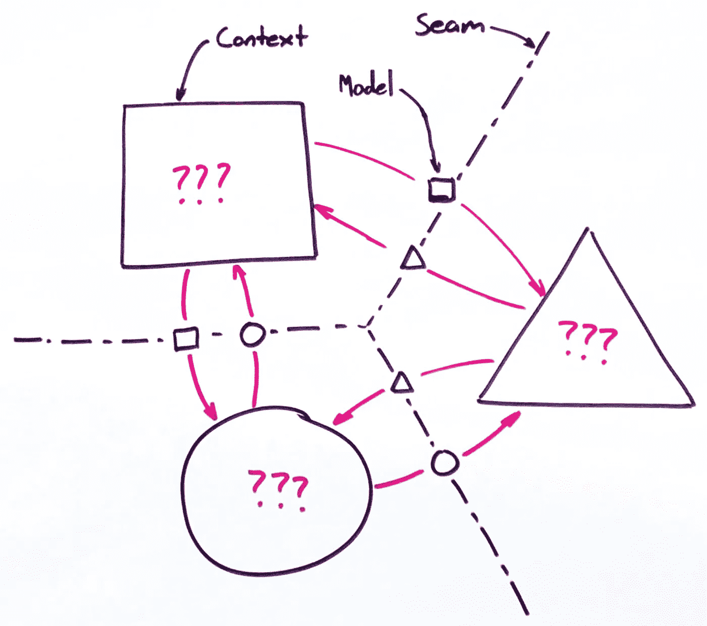

# 规范驱动的 API

> 原文：<https://medium.com/hackernoon/spec-driven-apis-2793632bb2cf>

## 在分布式系统中查找、定义和实施 Seams

# 找到接缝

软件很贵。但是不管你花多少钱来获得第一版，这个成本通常只占系统总拥有成本(TCO)的四分之一。预计项目成本的 75%来自于后的维护*,项目已经投入生产。*

随着大型整体式系统变得越来越大，而整体性却没有降低，成本会呈指数级增长。这是因为即使是一行代码的更改也会影响到代码库的其他部分，这些部分很难预测。不可避免地，改变需要更长的时间，因为缺陷变得更难预防。

Sam Newman 在他的书《构建微服务》中，通过寻找[有界环境](https://martinfowler.com/bliki/BoundedContext.html)之间的缝隙，为分解大型系统提供了一个案例。接缝是代码各部分之间的分割，可以单独处理，不影响代码库的其余部分。

> “其思想是，任何给定的域都由多个有界的上下文组成，每个上下文中都有不需要与外界交流的内容，以及与其他有界上下文共享的内容。”——山姆·纽曼

换句话说，有一组特定的逻辑体现了定义 web 服务的契约和行为。因为这个“接缝”的知识是在多个系统之间共享的，所以设计和任何后续的变更都需要外部团队的输入和签署。然而，实现细节被安全地隐藏在这条缝后面。这意味着，只要进入和退出有界上下文的数据遵循 seam 定义的规则，开发人员就完全有权对内部的实现逻辑进行任何更改。

budget developer art

随着项目进展越来越慢，变更的成本也越来越高。如果在发现或设计阶段对生产系统进行更改，成本会低几个数量级。

如果您在定义 seams 之前通过实现一个有界上下文的内部来进入一个项目，您会引入这些类型的不必要的昂贵的更改。这是因为当 seam 的设计最终确定下来时，它将不可避免地需要对现有的实现进行添加或更改。如果这些改变的成本太高，涉众将会留下一个笨拙的 API。

但是通过定义然后远离接缝，设计工作从影响最大的部分开始。一旦这个缝隙被锁定，开发团队就可以独立于任何其他团队自由地设计和实现他们各自的系统。这种隔离降低了复杂性，从而降低了构建和维护大型分布式系统的成本。

现在，让我们看看需要什么来定义这些接缝。

# 定义接缝

> "每个有界上下文都有一个明确的接口，它决定与其他有界上下文共享什么模型."——山姆·纽曼

我使用术语“规范”(或简称“规范”)来指代这个“显式接口”，我通常认为它不同于“文档”或“文档”在高层次上，规格说明规定了系统*应该*做什么，而文档描述了系统*实际上*做什么。从这个角度来看，应该在构建系统之前*创建一个规范，在*之后*编写(或生成)文档。*

有许多流行的工具被设计来规范 API，三大工具是 OpenAPI、API Blueprint 或 RAML。我可以在这里推荐一个，但是您的具体选择和实现无关紧要，只要它满足以下标准:

## 可被发现和访问

作为多方之间的契约，API 规范应该是各方都可以访问的。另外，应该不难找。所有的代码要么是为你自己写的，要么是你自己写的。如果另一个团队成员被叫醒去扑灭一场服务器火灾，他们应该能够毫不费力地发现你的系统*应该*在做什么，不管他们睡眠不足的程度如何。

## 在源代码管理中

此外，作为多方之间的合同，对规范的任何更改都会影响所有各方。这意味着所有的变更，不管多小，都应该提交到源代码控制中。在使用 SCM 的所有好处中，这些变化可以通过与其他团队代码中的破损进行比较来跟踪。

这一要求限制了可被视为“规范”的介质类型白板绘图是很好的对话辅助工具，但是请记住，干擦墨水是有意临时使用的。可以拍照，但是变化很难追踪。类似绘画的另一个问题是它不是…

## 完整和具体

作为多方之间的契约，规范应该包含足够的信息，以便各方都可以明确地实现它。因此，*所有的*路由、头、授权、验证规则以及 API 的其他细微差别都应该严格定义。

因为规格说明书应该在编码开始之前编写，所以从代码中生成规格说明书是这一过程的逆转。但是，即使不考虑这一点，完整性也是从现有代码生成规范时最难达到的要求之一。有几个关键的例子。首先，授权流，尤其是在使用 OAuth 时，对于机器来说可能无法从源代码中收集信息。后奇点时代，情况可能并非如此，但无论如何，我们都会失业。其次，路由处理程序中的 guard 子句是实施验证规则的普遍方法。同样，机器在生成规范时很难发现这些细微差别。

任何从规范中缺失但被理解为所需行为的一部分的需求最终都会导致服务或消费者的返工。最好的办法是手写您的规范，以确保完整性和特殊性，然后审查和更新它，直到各方都可以签署它。最终结果应该是一个明确定义整个服务接口的文档。

## 机器可读的

说明书的有用性取决于它的可读性。如果内容是人类可读的(如长篇文字、照片等)。)，那么将需要人工交互来确保您的 API 的每个新版本都符合规范。人类的依赖性是自动化的对立面。

但是如果规范是机器可读的，那么从代码生成、测试生成、验证等等，一整套自动化的可能性就出现了。描述一个 API 的完整功能需要大量的工作。确保生成的描述以机器可读的格式发布确实需要更多的努力，但是这种努力是很好的投资。

如果你从机器可读的内容 *(m)* 开始，那么存在一个确定性的函数来产生人类可读的内容 *(h)。*然而，相反的转换却是一个出奇困难的学术问题。不存在从主要是人类可读的内容*(h)*中产生机器可读内容 *(m)* 的确定性函数

> h = f(米)
> 
> m！= f(h)

如果必须在机器可读性和人类可读性之间做出权衡，那么总是选择机器可读性最终会两者兼顾。而且只需做一半的工作通常就能产生更具成本效益的最终产品。

# 加强接缝

一旦发现并定义了接缝，就需要对其进行强制。有几种方法可以做到这一点。首先，开发人员可以阅读规范，然后手写代码来遵循所有的规则。虽然这对于超小型项目来说很好，但是手写一个规范，然后手写整个实现的负担对于任何超过几条路线的项目来说可能都是成本过高的。

第二个选项是生成执行所有验证规则的代码。这保证了只要生成器在运行并且代码没有被更新，功能就会与规范相匹配。然而，生成的代码将在源代码控制中作为规范中定义的逻辑的副本。虽然本质上没有问题，但它可能会导致潜在的混淆，尤其是在存在差异的情况下。

第三个选项是在运行时评估规范以进行验证、路由注册，并实施规范定义的任何其他规则。这样做的好处是，消费者总是 100%地确信，规范所传达的行为和数据将由应用程序产生。下面，我列出了应该遵守的 4 条规则。各种框架有各种工具来提供这种功能，但是正如我以前说过的，具体的工具并不重要，只要它们能完成工作。

运行时评估的缺点是执行额外代码的开销。然而，这种开销通常在个位数毫秒范围内(或更低),完全值得它提供的质量保证。

以下是我认为最起码的规则。

## 运行时评估规则

应用程序应在运行时对规范进行评估，以保证以下几点:

1.  对规范中未定义的路由的请求应返回 HTTP 404 响应(即使代码定义了路由处理程序)。
2.  对规范中定义的路由的请求，但代码中实现的*不是*将返回 HTTP 501 响应。
3.  根据规范， ***接收到无效的*** 数据的路由处理器应返回一个 HTTP 400，其主体包括所有失败的验证规则。
4.  根据规范， ***返回无效*** 数据的路由处理程序应返回一个 HTTP 500，其主体表明无法返回有效响应。

## 结论

确定可以独立管理的系统各部分之间的逻辑边界，然后严格定义这些边界。当您这样做时，团队可以在这些界限内自由地设计和实现，而不会对其他人产生负面影响。

如果你好奇的话，我个人更喜欢 OpenAPI 和相关的工具生态系统。但是你的偏好是什么？你如何在你的项目中使用规范驱动的方法？请随时在下面发表评论。:)