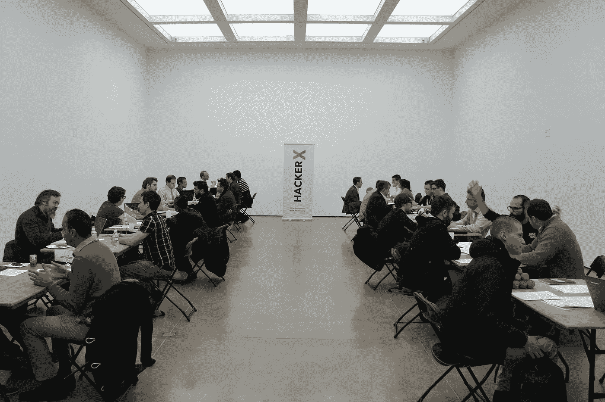
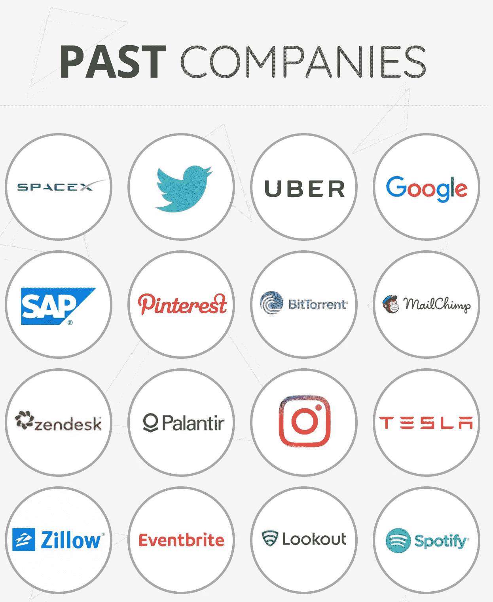
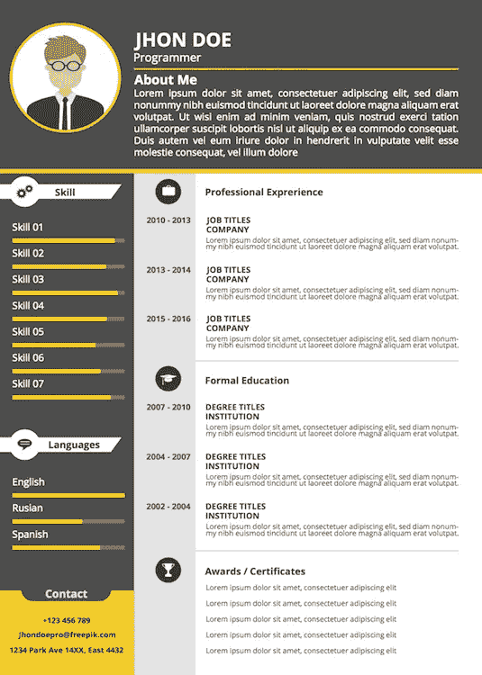

# 快速约会让你找到更好的技术工作

> 原文：<https://medium.com/hackernoon/speed-dating-developers-75806fa15875>

## HackerX 的面试官给你的建议

> "不要雇用我前面的那个人，他是个种族主义者！"

这是当晚许多有趣的引言之一。最近，我参加了 HackerX 的面试，这是一个面向开发人员的邀请制招聘活动。

[HackerX](http://www.hackerx.org/)

前提很简单。数百名开发人员涌入一个有 15-20 家公司和“快速约会”的房间。每家公司给你 4-5 分钟的时间，然后你继续前进。这是一个有趣的概念，有助于公司和开发者了解外面有什么。

对于开发人员来说，这是领先于顶级科技公司的最快、最简单的方法之一。HackerX 夸耀谷歌、推特和优步是过去的公司。实际上，这完全取决于位置。在我参加的活动中，我从未听说过任何品牌。

对于公司来说，每个开发人员都是由活动协调员亲自挑选的。通常也有一个特定的焦点。我们的活动面向拥有 5 年以上经验的全栈开发人员。

那天晚上，我与 30 多名开发人员进行了交谈。我联系了两个人。我现在和 zero 一起工作。这是一次失败。总而言之，HackerX 在组织这次活动上做得很好。有免费的食物和啤酒。快节奏的面试进行得非常顺利。开发者只是有点糟糕。

至少，他们是这样面试的。可以理解，因为这对房间里的每个人来说都是一种新的体验。作为面试官，我看到了很多开发者采取的策略。不需要学习就能知道哪些是成功的。如果我作为候选人参加，这些是我会关注的一些事情。

# 留下积极的第一印象

[研究](http://www.dailymail.co.uk/sciencetech/article-2661474/First-impressions-really-DO-count-Employers-make-decisions-job-applicants-seven-minutes.html)显示，你有 6 分 25 秒的时间在[的求职面试](http://42hire.com/tagged/job-interview)中留下深刻的第一印象。虽然第一印象很难改变，但至少在真正的面试中，你有这个机会。在这里，第一印象不只是重要，而是一切。让它有价值。不要把人叫做种族主义者(是的，发生过这种事)。

数量惊人的候选人花了太多时间抱怨他们的现状。为什么他们的公司冤枉了他们，他们比那要好多少。他们关注一切负面的东西。

在所有的客套话之后，你有大约 240 秒的时间来留下深刻印象。花一分钟抱怨，在我认识你的 25%的时间里，你一直充满消极。不好看。

Photo by [Alejandro Escamilla](https://unsplash.com/photos/BbQLHCpVUqA?utm_source=unsplash&utm_medium=referral&utm_content=creditCopyText) on [Unsplash](https://unsplash.com/?utm_source=unsplash&utm_medium=referral&utm_content=creditCopyText)

我无法想象一种情况，抱怨你的工作让你看起来很好。如果你觉得这很有意义，那就太好了。稍后在完整的采访中告诉我。但是不要花宝贵的时间让我相信你是受害者。

如果我是一名候选人，我会避免所有关于我现在的雇主的意见，不管是好是坏。现阶段无关紧要。如果我只有四分钟的时间来说服别人我是值得的，我会把注意力放在个性和技能上。就是这样。

# 感兴趣

当晚最令人惊讶的事情之一是，许多开发人员不想要工作。他们花了大部分时间解释他们为什么满意。他们想看看外面有什么。

不幸的是，大多数人选择在谈话的最后提到这一点。

对我来说，这是浪费我们的时间。这相当于参加了一场真正的速配活动，并以“我婚姻幸福，我只是来喝免费啤酒的”来结束对话。

> “你打算怎么处理我的信息？”

呃，也许我可以联系你，这样我就可以雇用你了？我离开的时候，很多对话都被弄得一塌糊涂。如果你是来玩的，没问题。但是要坦诚。

如果我是作为一名无意加入另一家公司的开发人员参加的话，我就不会参加了。但如果有必要的话，我肯定会用这个话题开始谈话。让面试官上钩。我们可以休息一下，聊聊天。但我不会误导面试官。

# 留下持久的…东西

HackerX 向面试官提供每位与会者的姓名和联系信息。这在理论上听起来不错。但是和几十个几十个候选人讲过之后，想脱颖而出也不容易。

活动的快节奏意味着没有时间思考。没有时间对每个候选人写超过一两个单词和一个快速的小排名。我给一些开发人员打了 9 分和 10 分，但是到了第二天，我不知道为什么。

就像在真正的快速约会中，你必须做一些事情来脱颖而出，令人难忘。少数候选人带了简历。我可以把这些简历和我的评分进行比较。我在面试中给了 dev 一个 7 分，但因为他的简历而主动联系了他。

Something Like This. Template by [Freepik](http://www.freepik.com/free-vector/programmer-resume-template_840427.htm)

如果我以开发者的身份参加，我一定会给面试官带些有纪念意义的东西。不过，这不是传统的简历。这是一个相当非正式的活动。事实上，这些简历似乎有点不合时宜。

我会带着一个小的个人资料图片，有趣的概述我的技能和经验。我会让它比我传统的简历更小，更简洁。我会加点颜色。这样他们就能记住我了。以我的经验来看，这会让候选人进入另一个层次。

# 尝试一下——如果你正在寻找

如果你正在找工作或者对换工作感兴趣，我仍然建议你试一试。看看你附近有没有[城市，请求邀请。最坏的情况下，这将是一次宝贵的新经历。最好的情况是你会遇到你梦想的工作。如果你已经幸福地结婚了，就不要出现了！](http://www.hackerx.org/)