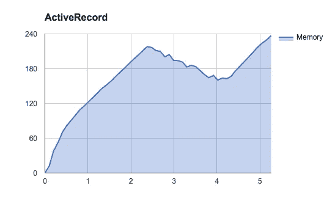
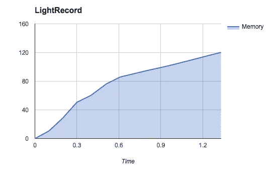
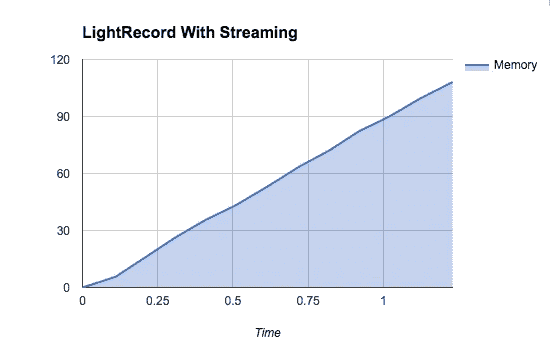

# 加速分配 ActiveRecord 对象

> 原文：<https://medium.com/hackernoon/speed-up-allocating-activerecord-objects-86c7ced839a5>

在工作中的一个项目中，我们需要生成一个大报告，ActiveRecord 太慢了，而且对内存的需求太大。在某些极端情况下，生成 100，000–200，000 行的报告需要一个多小时。内存超过 2GB，虚拟机开始交换，在该虚拟机上运行的所有实例变得缓慢。

首先，我尝试实现使用 limit()和 offset()的 find_in_batches，但是效果不太好。每个下一批变得更慢，因为 DB 需要找到前 N 批，只给我第 N 批，在下一批它会 N+1 批，等等。内存更好，速度更差。

接下来我开始思考为什么要花这么多时间？大部分时间花在创建 [ActiveRecord](https://hackernoon.com/tagged/activerecord) 对象和访问属性上。这也是最大的内存消耗。我想到了用更少的分配和更好的性能来制作 ActiveRecord 对象的轻量级版本。我称之为[光记录](https://github.com/Paxa/light_record)。

LightRecord 是 ActiveRecord 的扩展，可以用尽可能少的分配创建只读对象。它简单地使用来自[数据库](https://hackernoon.com/tagged/database)驱动程序(mysql2)的散列，并为字段定义访问器方法。没有类型转换，没有脏属性(ActiveModel::Dirty)，没有复制数据。

生成具有 36634 行和 18 列的 CSV 报告的基准。5.0.0.1 OS X 10 . 11 . 6，ruby 3.0.1，rails

*   ActiveRecord: 5.2 秒，270 MB，265 万个分配对象
*   LightRecord: 1.41 秒，120 MB，93 万个分配对象
*   LightRecord 流:1.3 秒，108 MB，93 万个分配的对象

如你所见，LightRecord 也支持流式传输。使用 mysql2 客户端的流特性，一条一条地加载记录，并可以迭代它们。图表上的内存是直线增长的，因为它没有在开始时加载所有的数据。

你可以在 [LightRecord github 页面](https://github.com/Paxa/light_record)上看到代码示例。我们在生产中的一个项目中使用了它，我对它获得的性能很满意

> [黑客中午](http://bit.ly/Hackernoon)是黑客如何开始他们的下午。我们是 [@AMI](http://bit.ly/atAMIatAMI) 家庭的一员。我们现在[接受投稿](http://bit.ly/hackernoonsubmission)并乐意[讨论广告&赞助](mailto:partners@amipublications.com)机会。
> 
> 如果你喜欢这个故事，我们推荐你阅读我们的[最新科技故事](http://bit.ly/hackernoonlatestt)和[趋势科技故事](https://hackernoon.com/trending)。直到下一次，不要把世界的现实想当然！

