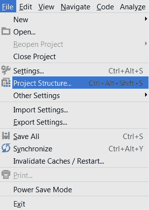
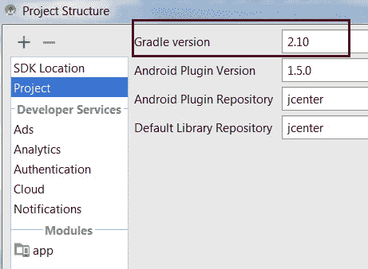
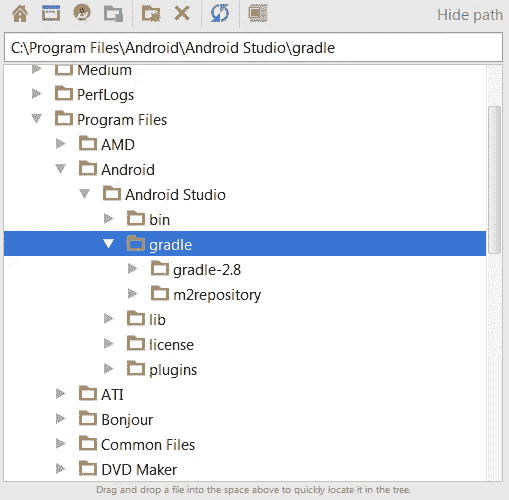
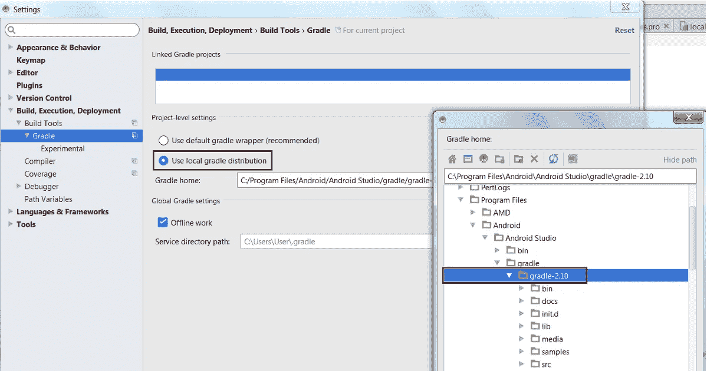
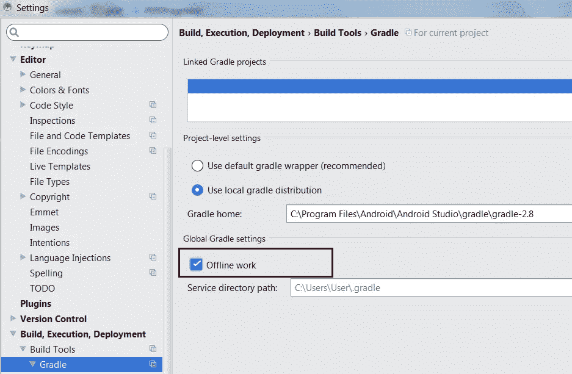
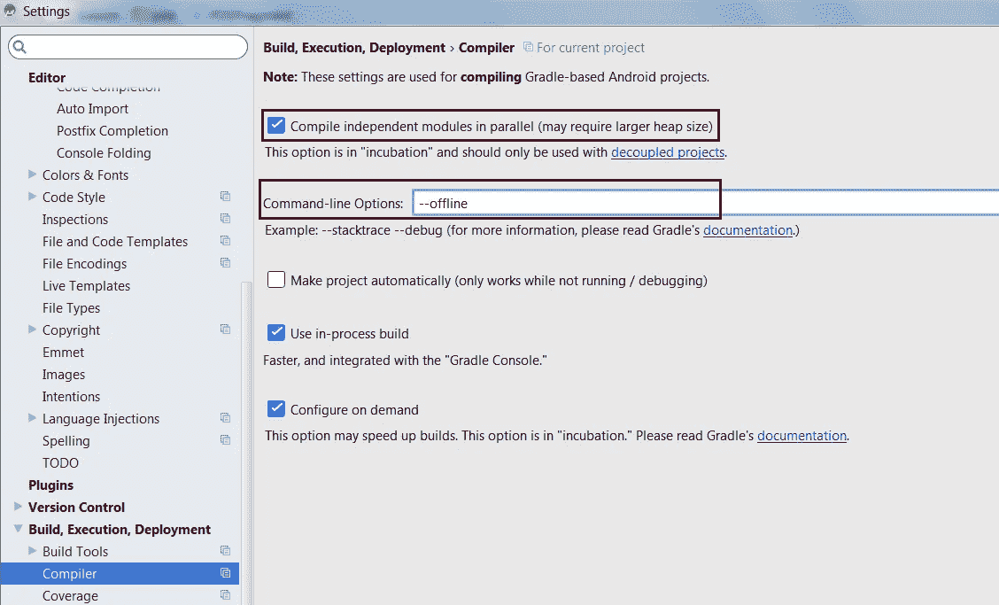
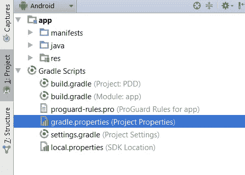
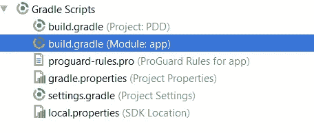

# 加速 Android Studio 中的 Gradle 构建

> 原文：<https://medium.com/hackernoon/speed-up-gradle-build-in-android-studio-80a5f74ac9ed>

有没有过这样的感觉:你在 Android Studio 中等待构建完成已经等了几分钟了？我也是。这是一个相当恼人的。

幸运的是，有一些方法可以改善这种情况。Android 使用 [Gradle](https://hackernoon.com/tagged/gradle) 进行构建。最新版本是 2.10，与之前的版本相比有巨大的性能提升(详见[发布说明](https://docs.gradle.org/current/release-notes))。


## 步骤 1:更新 Gradle 版本

更简单的方法是转到:**打开模块设置(您的项目)>项目结构**



在 **Gradle 版本**中输入 2.10



Changing the Gradle version in **Project Structure** dialog

从[https://services . Gradle . org/distributions/Gradle-2.10-all . zip](https://services.gradle.org/distributions/gradle-2.10-all.zip)下载 Gradle Release distributive

并将其复制到 Gradle 文件夹:



最后一步是在**设置>等级**中添加您的描述



不要忘记点击**应用**保存更改**。**

## 步骤 2:为项目启用离线模式、Gradle 守护进程和并行构建

离线模式告诉 Gradle 忽略更新到最新的检查。Gradle 每次都要求依赖关系，有了这个选项，它就可以使用机器上已经存在的依赖关系。

1.  从 android studio *设置*进入 *Gradle* ，点击*离线工作*框。



2.从 android studio *设置*进入*编译器*，在命令行框中添加“—离线”，点击*并行编译独立模块*。



Gradle options: Compiling in parallel and Offline mode

下一步是为您的项目启用 Gradle 守护进程和并行构建。并行构建将导致您的具有多个模块的项目(Gradle 中的多项目构建)并行构建，这应该会使大型或模块化项目构建得更快。



这些设置可以通过修改 Gradle scripts 目录(即 *~/)中名为 *gradle.properties 的文件来启用。gradle/gradle.properties* )。这些选项中的一些(例如并行编译模块)可以从 Android Studio 中获得，并且在默认情况下也是启用的，但是将它们放在 *gradle.properties* 文件中将在从终端构建时启用它们，并且**确保您的同事将使用相同的设置**。但是如果你在一个团队中工作，有时你不能承诺这些事情。*

```
# When configured, Gradle will run in incubating parallel mode.
# This option should only be used with decoupled projects. More details, visit
**org.gradle.parallel=true**# When set to true the Gradle daemon is used to run the build. For local developer builds this is our favorite property.
# The developer environment is optimized for speed and feedback so we nearly always run Gradle jobs with the daemon.
**org.gradle.daemon=true**
```

使用守护程序将使你的构建启动更快，因为它不必每次都启动整个 Gradle 应用程序。Gradle 守护进程在默认情况下是不启用的，但是建议总是为开发人员的机器启用它(但是为持续集成服务器禁用它)。关于这种模式的常见问题可以在这里找到[https://docs . gradle . org/current/user guide/gradle _ daemon . html](https://docs.gradle.org/current/userguide/gradle_daemon.html)。

对于某些项目,“并行生成”设置可能不安全。要求是你的所有模块必须是**解耦的**，否则你的构建可能会失败(详见[http://gradle . org/docs/current/user guide/multi _ project _ builds . html # sec:decoupled _ projects](http://gradle.org/docs/current/userguide/multi_project_builds.html#sec:decoupled_projects))。

## 步骤 3:启用增量设计并调整*内存设置*

您可以通过打开增量德兴来加快构件的速度。在模块的构建文件中:



将此选项添加到您的 *android* 模块:

```
dexOptions {
    incremental true
}
```

在 dexOptions 块中，您还可以指定 dex 进程堆大小，例如:

```
dexOptions {
    incremental true
    javaMaxHeapSize "12g"
}
```

其中“12g”是 12GB 的内存。关于这一点的更多信息可以在这里找到[google.github.io/android-gradle-dsl/current/](http://google.github.io/android-gradle-dsl/current/com.android.build.gradle.internal.dsl.DexOptions.html#com.android.build.gradle.internal.dsl.DexOptions:javaMaxHeapSize)

您还可以在设置文件中配置 Gradle 参数，例如，如果您有一个大型项目，可以增加最大堆大小:

```
*# Specifies the JVM arguments used for the daemon process.
# The setting is particularly useful for tweaking memory settings.
# Default value: -Xmx10248m -XX:MaxPermSize=256m* ***org.gradle.jvmargs=-Xmx2048m -XX:MaxPermSize=512m -XX:+HeapDumpOnOutOfMemoryError -Dfile.encoding=UTF-8***
```

所有参数列表见此:[https://docs . gradle . org/current/user guide/user guide _ single . html # sec:gradle _ configuration _ properties](https://docs.gradle.org/current/userguide/userguide_single.html#sec:gradle_configuration_properties)详情。

## 第 4 步:禁用防病毒

考虑从防病毒扫描中排除项目和缓存文件。这显然是与安全性的权衡。但是如果你经常在分支之间切换，那么在允许 gradle 进程使用它之前，antivirus 会重新扫描文件，这会减慢构建时间(特别是 Android Studio sync 项目与 gradle 文件和索引任务)。在启用和不启用防病毒的情况下测量构建时间和处理 CPU，以查看是否相关。

我希望这有所帮助。如果您有任何问题或其他提高构建性能的技巧，请留下您的评论。

谢谢大家！

[](http://bit.ly/HackernoonFB)[](https://goo.gl/k7XYbx)[](https://goo.gl/4ofytp)

> [黑客中午](http://bit.ly/Hackernoon)是黑客如何开始他们的下午。我们是 [@AMI](http://bit.ly/atAMIatAMI) 家庭的一员。我们现在[接受投稿](http://bit.ly/hackernoonsubmission)，并乐意[讨论广告&赞助](mailto:partners@amipublications.com)机会。
> 
> 如果你喜欢这个故事，我们推荐你阅读我们的[最新科技故事](http://bit.ly/hackernoonlatestt)和[趋势科技故事](https://hackernoon.com/trending)。直到下一次，不要把世界的现实想当然！

[](https://goo.gl/Ahtev1)