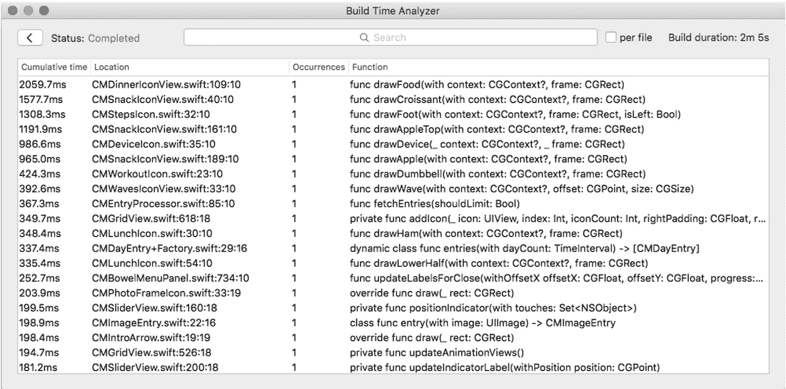
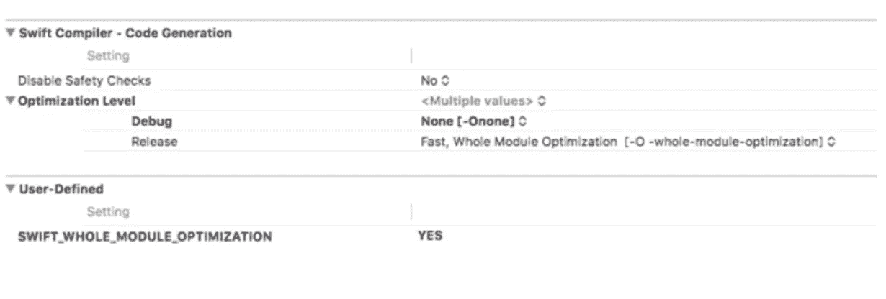
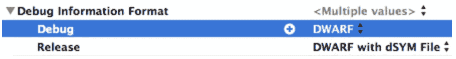
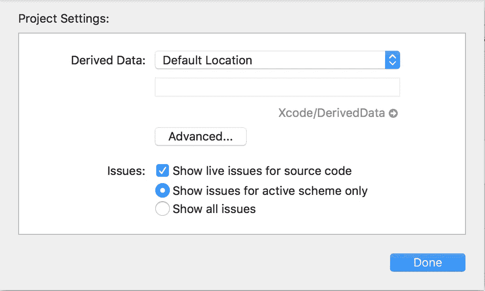

# 加快 Swift 编译时间

> 原文：<https://medium.com/hackernoon/speed-up-swift-compile-time-6f62d86f85e6>


## 没有什么是完美的

Swift 已经成为最伟大的现代[编程](https://hackernoon.com/tagged/programming)语言之一，但是和其他事物一样，它也有自己的问题。在从事大型项目时，您会注意到 Swift 编译时间增长的问题。这是一种真正的挫折和浪费时间。我目睹过长达 5-6 分钟的编译时间，但是有例子表明它可以增长得更多。在那些时刻， [Xcode](https://hackernoon.com/tagged/xocde) 让我想起了早期的 Android Studio。🐢🐢🐢🐢

在 Swift 编译时每天浪费一两个小时是大量的非生产性时间。这就是为什么我们必须**优化** Xcode 和我们编码的方式。我将展示一些显著减少 Swift 编译时间的东西，因此您可以尝试一下，并告诉我它们是否对您有所帮助。

# 优化时间到了！

## 一个很棒的工具

让我们从安装这个令人敬畏的开源工具开始，它叫做[**Xcode**](https://github.com/RobertGummesson/BuildTimeAnalyzer-for-Xcode)的编译时分析器。按照 GitHub 链接上提供的说明安装这个工具，然后运行您的项目。它会分析你的代码，并告诉你哪些部分的代码编译时间最长。用这个工具优化代码会容易很多，所以不要跳过这一步。



[Build Time Analyzer for Xcode](https://github.com/RobertGummesson/BuildTimeAnalyzer-for-Xcode) in action

## Xcode 改进

在进入代码之前，让我们检查一些可以在 IDE 上尝试的优化技巧。

*   **调整优化级别** —导航到构建设置- >优化级别，并确保调试设置为**无。**接下来，进入构建设置- >用户自定义，添加`SWIFT_WHOLE_MODULE_OPTIMIZATION = YES`。根据我的经验，这个标志总是占用编译时间的很大一部分。



Optimization Level in Build Settings

*   **从调试中移除 dSYM 文件—** dSYM(调试符号文件)是一个获取调试信息并将其存储在 dSYM 包中的文件。每次编译项目时都会生成此文件。然而，在 Debug 中你不需要这个，所以把这个值改为 DWARF，并且只在 Release 模式下激活它。您可以在“生成设置”下找到调试信息格式设置。



Remove dSYM file from Debug

*   **检查您的仅构建活动架构值** —对于所有非发布的构建，将仅构建活动架构设置为**是**。这将防止 Xcode 编译文件两次。您可以在“生成设置”下找到“仅生成活动体系结构”设置。


Check your Build Active Architecture Only values

*   清空您的派生数据 —如果您在构建项目时有任何问题，您应该从这里开始。转到文件- >项目设置，并单击派生数据路径旁边的箭头。箭头将定位文件夹，并点击删除它。不要担心，它会在您下次运行项目时重新创建。还有，删除数据后别忘了清理项目(CMD+Shift+K)。



Empty your Derived Data

这些是 Xcode 的改进，在减少 Swift 编译时间方面效果最好。现在，让我们看看为了获得更好的编译时间，您需要避免/改进的一些编码实践。

为您推荐: [**一个软件开发成功哲学的 6 个小技巧**](http://theappspace.com/software-development-success-philosophy/)

## 迅速的改进

*   **添加类型注释** —你应该总是给你的变量添加类型注释。这样一来，编译器就已经知道了变量的类型，从而节省了读取时间。例如，我将使用数组文字。

本:
`let array: [String] = ["a", "b", "c", "d", "e", "f", "g"]`

而不是:`let array = ["a", "b", "c", "d", "e", "f", "g"]`

*   **避免零合并操作符** —移除零合并操作符后，编译时间有了很大改善。例如，使用可选字符串。

```
if let name = string{ 
 /* string has value */
}else{
 /* string is nil*/
}
```

而不是:`let name = string ?? ""`

*   **避免三元条件运算符—** 三元条件运算符也增加了 Swift 的编译时间。我喜欢同时使用三元运算符和零合并运算符，因为它们使我的代码更短、更简洁。但是，我们必须尽可能避免使用它们，而是使用 if-else 条件句。

```
var letter = ""
if isFirst{ 
  letter = "a"
}else{
  letter = "b"
}
```

而不是:`let letter = isFirst ? "a" : "b"`

*   **不要使用+来连接字符串** — Swift 更喜欢字符串插值，而不是使用“+”符号。信不信由你，这在优化的时候节省了我很多编译时间。

本:`let url = "https://google.com/\("path")/\("anotherpath")"`

而不是:`let url = "https://google.com/" + "path/" + "anotherpath"`

*   **预计算—** 永远不要直接根据 if-else 条件进行计算。这需要很多时间来完成，而且它还不知道自己的类型。仅这一步就增加了 5 秒多的编译时间。你需要做的是，创建一个变量和我们上面提到的类型注释，并添加计算。之后，将值传递给 if-else 条件并进行比较。

```
let number: Double = 60 * 60if number == 3600{}
```

而不是:
`if number == 60 * 60 {}`

# 结论

Swift 的改进在您看来可能只是微小的改进，您可能不确定它是否有助于减少您的编译时间。但是，如果你可以计算你声明的变量的数量，而不用类型注释或者过度使用三元/零合并操作符，你将得到大量的变量，并且每个变量都有不同的延迟。当你把所有的延迟加起来，你就会明白你的编译时间是 xx 分钟。

我希望这些改进能给你带来更短的编译时间，让你把更多的时间放在有成效的任务上。如果你喜欢我的帖子，请不要忘记💚或者把这篇文章分享给你的朋友。还有，你可以订阅我下面的时事通讯，阅读更多有趣的 Swift 教程。

## 这就是本教程的内容，如果对你有帮助，请👏或者分享这个故事，让其他像你一样的人也能找到它。感谢您的关注！🚀

[](http://bit.ly/2KkkwGL)

## 查看我的最新项目:

[](https://apps.apple.com/app/football-score-prediction-bets/id1517623538) [## 足球比分预测赌注

### 我们提供专业的足球比分预测投注提示，胜率高。每个比赛模拟包含一个…

apps.apple.com](https://apps.apple.com/app/football-score-prediction-bets/id1517623538) [](https://play.google.com/store/apps/details?id=betting.tips.goals) [## 足球博彩技巧和比分——赌进球 Google Play 上的应用程序

### 我们提供高胜率的专业足球技巧。每个比赛模拟包含一个预测，代表…

play.google.com](https://play.google.com/store/apps/details?id=betting.tips.goals) [](https://apps.apple.com/app/zoom-profile-picture-stories/id1514925024) [## 缩放个人资料图片和故事

### ZoomPic for Instagram 是匿名查看大型高清个人照片和故事的最简单、最方便的方式…

apps.apple.com](https://apps.apple.com/app/zoom-profile-picture-stories/id1514925024) [](https://apps.apple.com/app/long-video-story-for-instagram/id1511499427) [## Instagram 的长视频故事

### Instagram 的 Long Story 是一个非常棒的工具，允许您录制或选择任意长度的视频并进行转换…

apps.apple.com](https://apps.apple.com/app/long-video-story-for-instagram/id1511499427) 

## 阅读更多我在媒体上的作品:

[](https://hackernoon.com/introducing-clean-swift-architecture-vip-770a639ad7bf) [## 引入干净的 Swift 架构(VIP)

### 忘了 MVC 吧，现在！

hackernoon.com](https://hackernoon.com/introducing-clean-swift-architecture-vip-770a639ad7bf) [](https://medium.freecodecamp.org/how-you-can-use-the-google-maps-sdk-with-ios-using-swift-4-a9bba26d9c4d) [## 使用 Swift 4 在 iOS 上使用 Google Maps SDK 的终极指南

### 许多 iOS 应用程序使用谷歌地图。这是一个非常普遍的特点，所以我决定准备一个终极指南…

medium.freecodecamp.org](https://medium.freecodecamp.org/how-you-can-use-the-google-maps-sdk-with-ios-using-swift-4-a9bba26d9c4d) [](/theappspace/swift-custom-uiview-with-xib-file-211bb8bbd6eb) [## SWIFT —带有 XIB 文件的自定义 UIView

### 用 XIB 文件定制 UIView 是 iOS 开发中非常常见的做法。自定义 UIView 类不包含 XIB 文件…

medium.com](/theappspace/swift-custom-uiview-with-xib-file-211bb8bbd6eb) [](https://hackernoon.com/how-to-add-spotlight-support-to-your-ios-app-4a89054aff89) [## 如何将 Spotlight 支持添加到您的 iOS 应用程序

### Swift 教程将使您的应用程序在 Spotlight search 中可用

hackernoon.com](https://hackernoon.com/how-to-add-spotlight-support-to-your-ios-app-4a89054aff89) [](https://hackernoon.com/core-data-relationships-d813ed66ba8c) [## 核心数据关系

### 理解一对一和一对多关系

hackernoon.com](https://hackernoon.com/core-data-relationships-d813ed66ba8c) [](https://hackernoon.com/understanding-auto-layout-in-xcode-9-2719710f0706) [## 了解 Xcode 9 中的自动布局

### 所有你需要知道的关于自动布局

hackernoon.com](https://hackernoon.com/understanding-auto-layout-in-xcode-9-2719710f0706) 

## 订阅我的时事通讯: