# 加速代码(2):用 Numpy 对循环进行矢量化

> 原文：<https://medium.com/hackernoon/speeding-up-your-code-2-vectorizing-the-loops-with-numpy-e380e939bed3>

来自本系列:

1.  [庞加莱球空间中均值漂移聚类的例子](/@vincenzo.lavorini/speeding-up-your-code-1-the-example-of-the-mean-shift-clustering-in-poincaré-ball-space-d46169bfdfc8)
2.  用 Numpy 矢量化循环(这篇文章)
3.  [批处理和多线程](/@vincenzo.lavorini/speeding-up-your-code-3-batches-and-multiprocess-52d2d34a4091)
4.  [用 Numba 实时编译](/@vincenzo.lavorini/speeding-up-your-code-4-in-time-compilation-with-numba-177d6849820e)

在上一篇文章中，我描述了庞加莱球空间中聚类点的工作环境和基本代码。这里我将改进将两个循环转换成矩阵运算的代码。

我以一个非常有希望的图结束了这篇文章，这个图是关于两个向量的元素乘积的速度改进。所以还是详细说说吧。

## 矢量化的逐元素乘积

假设我们有两个数组:

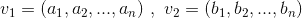

我们希望获得一个数组，其中的元素是它们的逐元素乘法:

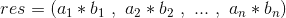

我们可以用两种方法来实现:在元素上循环，或者用矢量化运算。现在:在执行时间方面会发生什么？我用不同维度的数组进行了计算，范围从 100.000 到 10.000.000。

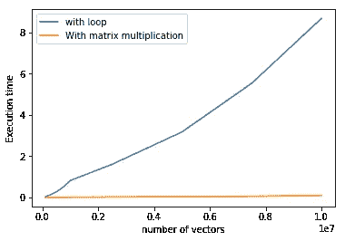

Execution time: relative on the left, absolute on the right.

在右图中，您可以看到两个操作的执行时间:矢量化版本比循环版本快得多。快了多少？您可以在左图中看到这一点:矢量化版本的执行时间不到 1.3%！

实际上，当我们使用 Numpy 的广播功能时，就像我们在上一篇文章中做的那样，所有的操作都是自动矢量化的。所以使用广播不仅加快了代码的编写速度，也加快了代码的执行速度！在这个例子的矢量化元素产品中，实际上我使用了 Numpy [np.dot](https://docs.scipy.org/doc/numpy/reference/generated/numpy.dot.html) 函数。

现在，如何应用这样的策略来摆脱循环呢？

## 向量化距离函数中的循环

让我们从距离函数中的循环开始。来自上一篇文章:

我们对集合中的每个向量执行这个函数:这是我们想要避免的循环之一。我们用所有的向量来填充这个函数，一次一个( *a* )连同整个集合( *A* ):这就是我们要向量化的另一个循环。

如果你改变视角，你可以看到向量的集合是一个矩阵，向量变成矩阵的行。在这种设想中，向量之间的运算变成了矩阵行之间的运算。例如，具有两个分量的 1000 个向量将构成(1000，2)矩阵:

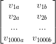

Example of 1000 vectors with two components

让我们回到最初的公式，分别关注它的每个部分:

Distance in Poincaré ball

其中双管字符(如||a||)表示欧几里德[范数](https://en.wikipedia.org/wiki/Norm_(mathematics))。

为了更好地可视化下面的操作，我将通过省略向量的分量来简化符号。所以当我写 *v1* 的时候，你必须记住，这个向量有他自己的分量。因此，包含向量的 2-d 矩阵将是 3-d 矩阵，向量的分量沿着第三个隐藏的维度。

## 分子

在分数的分子中，在计算平方范数之前，我们必须做向量间的减法。我们想把它矢量化，也就是说，在一个段落中做所有的减法。换句话说，我们想要获得这个矩阵:

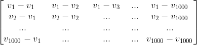

Matrix of the subtraction between all vector of the collection

这将是一个对称矩阵(元素(1，2)等于元素(2，1)，等等)，并且所有对角元素都等于零。这意味着我们实际上加倍了计算，但这是进行下一步操作的更好方式。

为了获得这样的矩阵，利用 Numpy 的广播能力是很方便的。作为例子，如果我们关注一下它的第一行，它由 v1 和集合 *S* 的所有向量之间的差组成，我们可以通过简单地调用减法 *v1-S* 来获得它。鉴于我们必须对所有向量进行相同的操作，我们必须执行以下操作:

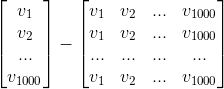

The subtraction operation. In the code, the first operand is called “trans”, and the second “tiled”. Note that broadcasting has been used.

此时，我们必须计算所获得元素的平方范数，也就是说，我们必须对矩阵中的所有元素进行平方，然后沿着向量的分量轴对这些平方求和，这是矩阵中省略的第三维，如前所述。

用 Python/Numpy 语言来说，这是获取分子的代码:

Code for obtaining the numerator of the formula

## 分母

现在是分母。括号中的两个操作数实际上可以看作是同一个矩阵中的一个操作，因为我们同时处理所有的向量。所以我们先计算所有向量的平方范数，然后从一个由 1 组成的向量中减去得到的向量。使用广播:

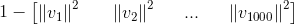

现在，为了获得具有所有分母项的矩阵，我们必须将这个向量乘以他自己的转置:

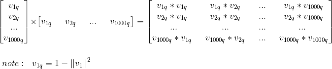

所有这些都是由下面的代码完成的:

## 整个距离公式，以及其余的均值漂移

现在我们有了分子和分母。获得距离的所有其他操作都是通过广播进行的基于元素的操作(谢谢 Numpy！):

我们构建的函数给出了庞加莱球中各点之间距离的矩阵结果:

The matrix of the distances between points.

现在，我们必须修改主函数，以使用这个矩阵来运行均值漂移算法，同时我们将摆脱另一个循环。

回想均值漂移算法，我们必须使用高斯核来计算权重。为了做到这一点，我们可以使用我们已经准备好的相同函数，因为由于广播，它也可以用于矩阵，并且我们将得到具有相同形状的矩阵。

然后我们要用这个矩阵来加权集合的所有向量。这是一种常见的矩阵产品:

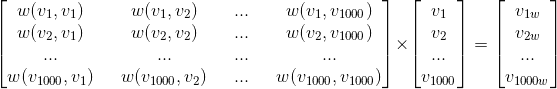

Matrix multiplication to get the weighted vectors. The first matrix is actually a 2-d matrix, but the 1-d arrays include the vectors’ components hidden dimension.

我们还必须用构建向量所需的权重之和来归一化每个向量。作为例子，为了得到归一化版本的 *v1w* ，我们必须将它除以总和 *w(v1，v1) + w(v1，v2) + …+ w(v1，v1000)。*

因此，我们必须沿行对权重矩阵求和，获得一个求和权重数组，我们将使用该数组按元素划分加权向量。

这里是所有这些操作所需的代码:

仅此而已！

现在让我们看看相对于循环版本快了多少。下面的图是用二维向量的集合运行两种算法得到的。

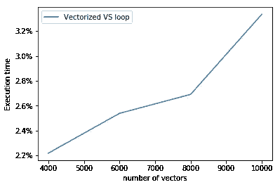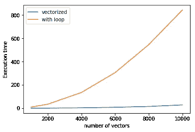

Execution time for the mean shift algorithm: relative on the left, absolute on the right.

正如所料，矢量化版本比循环版本快得多:对于 10.000 个二维向量，执行循环算法需要 844 秒，而矢量化版本只需要 28 秒。可以说，数据集越大，执行速度越慢。这是一个预期的行为，因为对于 N 个向量，我们处理 N 个张量元素。

现在:如果我们想让它更快呢？如果向量的数量太大，以至于无法存储，该怎么办？

在下一篇文章中，我将展示该算法的批处理版本，即一种一次处理一堆向量的算法。由于这一点，我们可以以多进程的方式执行它，其中每个 CPU 内核将处理每个批处理。

敬请期待！