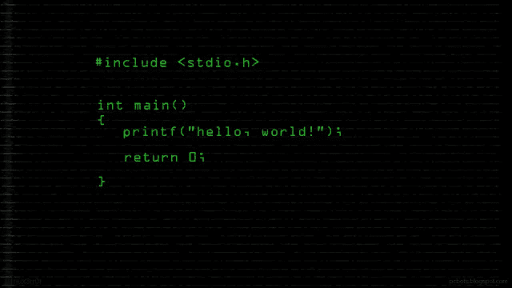

# Speedrunning 代码，这是我在用 C 重新编写基本 ls 代码时重新学到的 3 件事

> 原文：<https://medium.com/hackernoon/speedrunning-code-the-3-things-i-re-learnt-while-recoding-a-basic-ls-in-c-d559b0f1a92b>

朋友们好，

今天我想回顾一下我在学生时代做过的一个项目，当时我很纠结，觉得这个项目很无聊。

基本上，我必须使用-l -r -R 和-a 选项开发 ls，并且只使用 malloc、free、write、stat、ctime、time、getpwuid、getgrgid、readdir、opendir 和 closedir。

像往常一样，我想再次挑战自己重写一些 C。起初，我告诉自己，作为一个老 C 开发人员，这将是一个轻松的 2 小时项目，但神圣的***，它没有。我花了大约 5 个小时写了一个我并不引以为豪的代码，不允许使用 sprintf 节省了我的时间。它仍然需要大量测试、内存泄漏查找和重构(它总是需要:)。

 [## 波伦/c_ls

### 在 GitHub 上创建一个帐户，为 c_ls 开发做贡献。

github.com](https://github.com/Poilon/c_ls) 

但是，是的，这是一个伟大的基础工程。我建议任何想学习 C 开发，学习基本算法和内存处理的人来试试这个。

至少你会学到 3 样东西。

# 1.处理内存

用一种没有垃圾收集器的语言重写代码是一件痛苦的事情。很难跟踪所有分配的内存，以便在以后释放它。但是过了一段时间，这样做真的很愉快。你真的可以去喜欢性能，只分配最少的内存给你需要的最佳算法。

GDB 是一个很棒的工具，可以帮助任何人调试 C 代码，但是一般来说调试 C 很慢，所以让 C 程序正常工作的最好方法是在编码前认真思考。

# 2.数据结构

在 C 语言中，只给出了基本的函数，你没有很好的字符串/数组/散列/链表函数。很狂野。

我开始用简单的字符串解析来完成所有的数据结构化，然后排序是一件痛苦的事情，所以我致力于链表数据结构。非常简单，但是添加-删除-排序是基本的，但是对于开始算法来说非常好。例如，理解 Ruby 中排序背后的含义是很好的。您对什么是性能以及您可以使用的不同种类有了更好的了解。

你需要解析字符串，将字符串转换成整数，将整数转换成二进制字符串等等。大量的操作会导致大量的错误，这将随着重构时间的推移而减少。

在 C 开发中要有大局观，不要急于求成，因为除了“游戏结束，你的代码有 ***segfault*** ，再试一次”之外，你不会有任何结果

这一部分对于-R(递归)选项非常重要，就好像你只是看到什么就打印什么，不可能将算法应用到文件夹中的文件夹:)

# 3.什么是 ls，Unix 中的访问权限是什么

每个在生活中使用过 unix 终端人都知道 ls 是什么，以及它的用途。但是 ls 有很多选项来格式化数据并将其用于您的脚本。

例如，最常见的 ls -l 会给出一个类似于

> 总计 40 个
> -rw-r-r-1 个 poilon staff 41 22 July 13:55 Makefile
> -rwxr-xr-x 1 个 poilon staff 14248 22 July 13:58 c _ ls

在编写代码的时候，你会对它的工作原理有更好的理解。读写执行权限、链接数量、所有者:用户和组等。

对于那些刚刚参加开发训练营并且不每天使用基于 unix 的系统的人来说，这肯定是有用的。

当我有一个 ls -alRr 工作时，这个项目给了我真正的满足感。我把它作为一个游戏的速度运行，我让 ls -alRr 在 5 小时和 12 米内工作。现在我真的累了！

重做一些 C 语言真的很有趣，很愉快，我肯定这让我成为了一个更好的开发人员！

希望你喜欢这次阅读，告诉我你的想法，如果你想让我做这种挑战的流媒体/youtube 版本，或任何其他格式。

