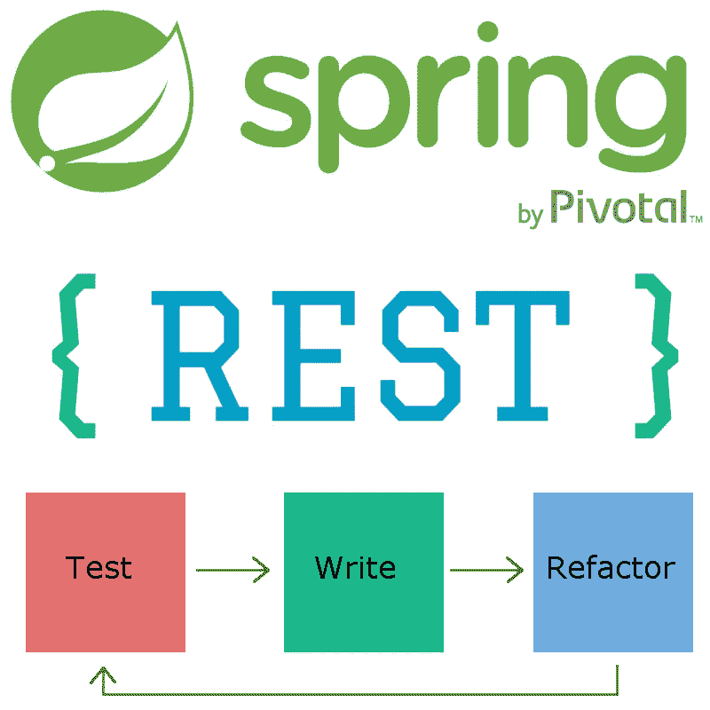

# Spring Boot:从零开始休息+ TDD

> 原文：<https://medium.com/hackernoon/spring-boot-rest-tdd-from-scratch-15f13ed799e0>

> 免责声明:因为有很多关于单元测试的东西，在这篇文章中，我将关注如何编写一个带有集成测试的 RESTful 应用程序，以及如何在构建过程中运行它们。

在离开 Java 开发整整一年后，我决定回去看看事情进展如何。我可以说，我喜欢它。Spring 总是吸引我的注意力，因为他们的目标(和成功)是让 Java 企业开发尽可能简单。我们将在本文中使用的 Spring [Boot](https://hackernoon.com/tagged/boot) ，是一个出色地做到这一点的项目。用它来开始我们项目的框架很容易，因为他们更喜欢约定而不是配置。

在 Spring Boot 上，我们可以使用 RESTful 服务来创建一个客户端无关的应用程序，并使它与 TDD 方法一起没有 bug。

## 建立 Spring Boot

重要的事情先来。尽管 TDD 声称我们首先编写失败的测试，为了让它们通过，我们首先需要制作一个可引导的软件。主要是因为在 Maven 的集成测试阶段，我们需要能够启动一个服务器来看到我们的第一次测试失败。

用 Spring Boot 启动一个应用程序真的很容易，我们只需要两个文件和一个命令。让我们从 pom.xml 文件开始。

这个文件应该放在我们应用程序的根目录中，它将我们的项目定义为*spring-boot-starter-parent*的子项目，并添加了 *spring-boot-start-web* 作为依赖项。这种组合使我们能够用一个非常小类来运行 web 应用程序。看看这个:

创建此类后，该类应放在。/src/main/Java/br/com/brunokrebs/directory，我们将能够在我们的根目录上发出以下命令来运行它:mvn spring-boot:run。

当然，这个应用程序现在做的不多。实际上，它只是启动并继续运行一个 web 服务器。但是没有 RESTful 端点，没有网页，什么都没有。因此，由于我们遵循 TDD 方法，让我们编写一个非常简单的集成测试，期望我们的 web 应用程序响应 GET 请求。

## 集成 Spring Boot 和 Maven

为了能够在 Maven 的集成测试阶段自动运行我们的测试，我们必须对之前创建的 pom.xml 进行一些更改。首先，让我们在 *spring-boot-starter-web* 之后添加以下三个依赖项:

然后我们添加 *maven-failsafe-plugin* 插件来执行我们将要创建的集成测试。

最后，我们向 *spring-boot-maven-plugin* 添加两个执行任务，部署我们的应用程序，以便能够响应测试。注意，我们之前已经在 pom.xml 文件中添加了这个插件。所以我们只需要添加两个任务:

现在，为了开始执行集成测试的构建过程，我们发出以下命令:mvn verify。这个命令将构建我们的项目，启动一个 Tomcat 容器，部署我们的项目，并针对它发布测试。嗯，它会发布测试，我们还没有写任何。

## 编写我们的第一个测试

最后添加的插件， *maven-failsafe-plugin* ，默认情况下，认为任何以它结尾的类都是必须运行的集成测试。所以让我们添加一个，看看我们的第一个测试失败。

我们必须遵循 Java 和 Maven 约定，在。/src/test/Java/br/com/brunokrebs/echoit . Java 文件。创建后，我们可以运行“mvn verify”命令来查看它是否失败。

很好，我们有了针对我们项目的第一个失败测试。所以，让我们解决它。为了简单起见，让我们对我们的主类 AbtbvApplication.java 做一些修改:

正如我们在上面看到的，我们对我们的类做了四个改变。首先，我们向它添加了一个新的@RestController 注释，将它标记为 REST 控制器。其次，我们创建了一个名为 Message 的内部类来保存被回显的消息。第三，我们添加了一个用@RequestMapping 注释的新方法，该方法将其配置为在“/echo/{message}”处响应 GET 请求。该方法将一个用@PathVariable 注释的字符串消息作为参数，这使它自动获取代替{message}传递的任何值。第四，我们让这个方法返回一个新的消息实例。这个新实例被序列化为 JSON，正如我们的测试所预期的那样。

搞定了。我们现在可以再次执行“mvn verify ”,并看到我们的第一次测试成功。

## 结论

正如我们在这篇文章中看到的，用 Spring Boot 创建一个面向 REST 的企业应用程序的框架非常容易。这个框架并没有做很多事情，但是，随着构建过程中运行的集成测试的出现，它为创建任何生产就绪、无错误的应用程序提供了一个非常好的基础。

我希望你们喜欢这篇文章，因为我期待着写更多的相关文章。下面的文章，我还没有决定如何构建，将会增加一些企业应用程序中所期望的好的特性。给出的例子:[数据源](/@krebs.bruno/spring-boot-persisting-data-with-rest-jpa-33a063e8b147)，图形用户界面(可能从基于 Angular 的 web 层开始)等等。

> 我叫布鲁诺·克雷布斯，你可以通过我的 [Twitter](https://twitter.com/brunoskrebs/) 、我的 [LinkedIn](https://www.linkedin.com/in/brunokrebs) 和我的 [Github](https://github.com/brunokrebs) 账户找到我。此外，请随意在这里或我的任何文章中添加任何评论。

> [黑客中午](http://bit.ly/Hackernoon)是黑客如何开始他们的下午。我们是 [@AMI](http://bit.ly/atAMIatAMI) 家庭的一员。我们现在[接受投稿](http://bit.ly/hackernoonsubmission)并乐意[讨论广告&赞助](mailto:partners@amipublications.com)机会。
> 
> 如果你喜欢这个故事，我们推荐你阅读我们的[最新科技故事](http://bit.ly/hackernoonlatestt)和[趋势科技故事](https://hackernoon.com/trending)。直到下一次，不要把世界的现实想当然！

