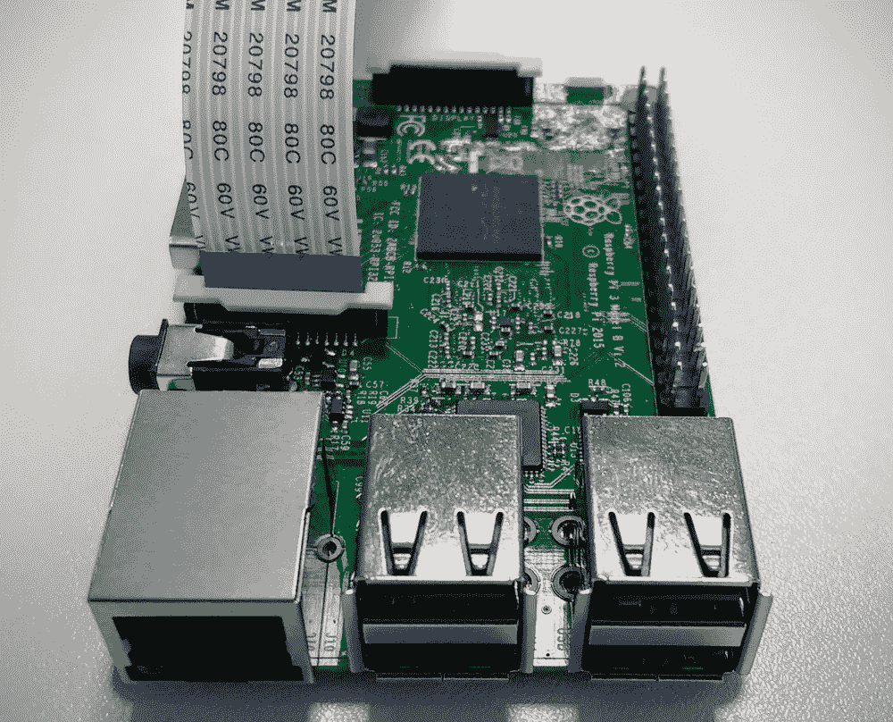
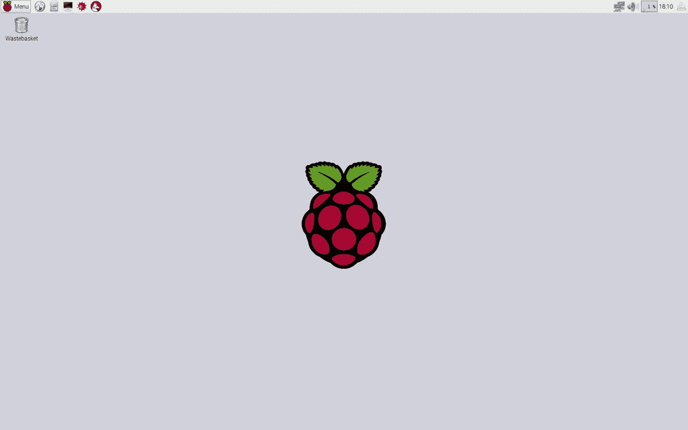
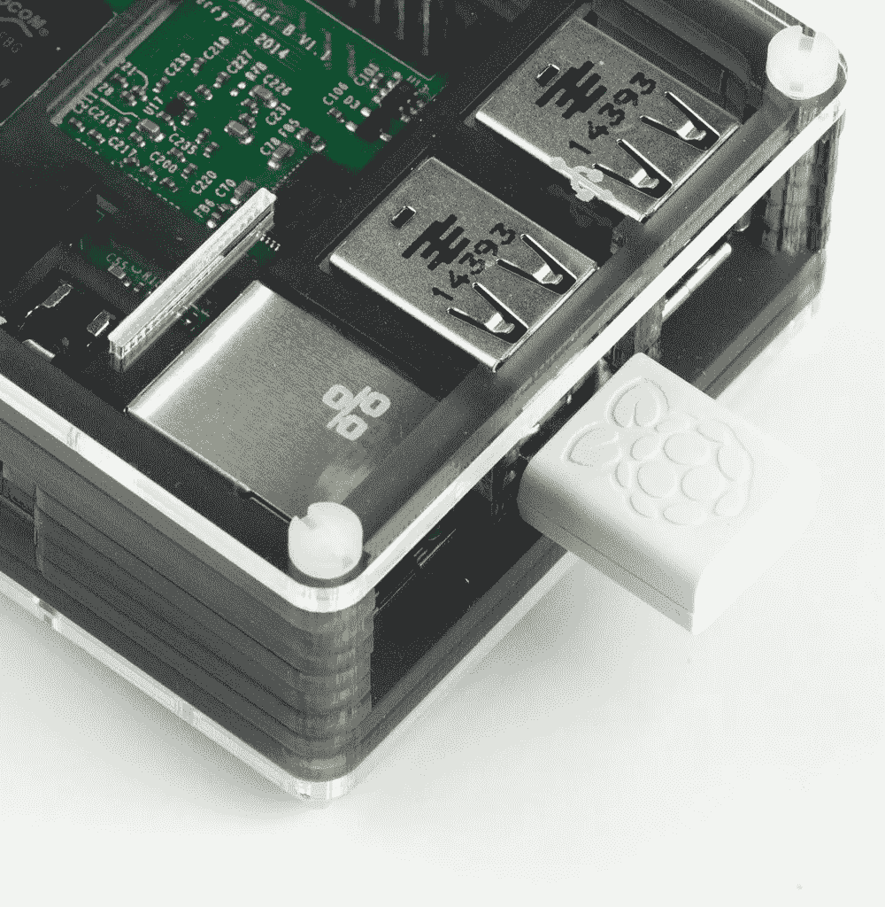
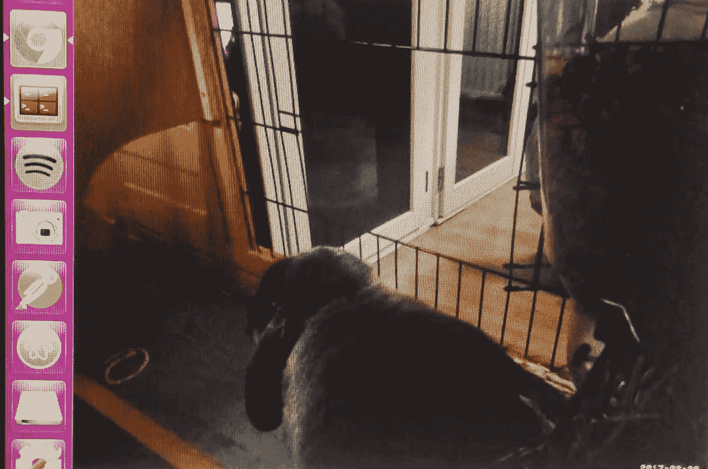

# 间谍您的宠物与树莓 Pi 相机服务器

> 原文：<https://medium.com/hackernoon/spy-your-pet-with-a-raspberry-pi-camera-server-e71bb74f79ea>


nom nom nom nom nom

本教程是我的“用树莓派窥探你的宠物”的第一部分。我有一只叫“莫奇”的小兔子，当我不在家的时候，我经常担心他。因此，我决定建造一个互动的笼子，以便在我工作或旅行时与 Mochi 联系。

构建一个交互式笼子涉及 3 个主要挑战:

*   安装一个监视连接的摄像机，
*   建造一个自动食物分发器，
*   从世界任何地方访问您的相机和食物分发器

我的第一个挑战是间谍相机系统，我将在本教程中描述。

# 所需设备

*   [树莓派](https://thepihut.com/collections/raspberry-pi)带 [Raspbian OS](https://www.raspbian.org/) (正常情况下应该是带 Raspbian OS 的 SD 卡发货)
*   带有 HDMI、usb 键盘、usb 鼠标和以太网线缆的屏幕，适合您的 raspberry PI
*   [Pi 摄像头](https://thepihut.com/products/raspberry-pi-camera-module?variant=758603005)或 [Pi 摄像头](https://thepihut.com/products/raspberry-pi-noir-camera-module)(红外线)
*   [Wifi 加密狗](https://thepihut.com/products/official-raspberry-pi-wifi-adapter?variant=3036568516)

# 在您的 PI 上安装摄像头



Raspberry Pi 3

首先，关掉你的树莓派，小心避免手上有任何静电。如上图所示，将相机蓝带插入树莓接口。要插上相机，你必须慢慢松开白色塑料部分，插上带子，然后再次夹住白色部分。

现在，将以太网电缆、键盘、鼠标和屏幕连接到您的 PI。别忘了插含有 Raspbian OS 的 SD 卡！最后，插上电源打开它。几秒钟后，您应该会看到:



Raspbian Operating System on your Raspberry Pi

# 在您的 PI 上启用摄像机配置

为了在 Pi 相机上使用兼容的库或软件，您首先需要在您的 Raspberry Pi 选项上启用其配置。在您的 **Pi 终端**(导航栏中的屏幕图标)上运行以下命令:

```
sudo raspi-config
```

选择**摄像头**，选择**启用对树莓派摄像头的支持**。出现提示时重新启动，就大功告成了！相机现在应该有几个可用的功能:

*   捕获图像的 raspistill(可通过 Raspbian 直接获得)

```
# Test your camera ! 
raspistill -o cam.jpg
```

*   raspivid 来捕捉视频，
*   [**运动**](https://github.com/Motion-Project/motion) 这就是我们要用的

# 安装动作

[Motion](https://github.com/Motion-Project/motion) 是一款摄像头信号监控软件，也具有有趣的运动检测功能。

首先，让我们确保您的 Pi 上的所有内容都是最新的。在 Pi 终端中运行以下命令:

```
sudo apt-get update
sudo apt-get upgrade
```

现在，让我们在我们的 Pi 上安装运动软件，并激活相机的官方驱动程序。

```
sudo apt-get install motion# Careful, on the v4l2 it's an 'L', not the number 1
sudo modprobe bcm2835-v4l2
```

为了完成这个过程，我们还必须告诉 Pi 在任何重新启动后激活驱动程序，这样我们的摄像机将始终可用。

```
sudo nano /etc/modules
# at the end of the file, add this line :
bcm2835-v4l2
```

因为我们希望我们的摄像机服务器持续运行，所以让我们将它设置为一个[守护进程](https://en.wikipedia.org/wiki/Daemon_(computing))(后台进程)并自动启动它。

```
sudo nano /etc/default/motion
# in this file, search for start_motion_daemon and activate it
# start_motion_daemon=yes
```

我们完成了 Motion 安装！让我们配置它，这样我们就可以有一个摄像头服务器！

# 配置运动

创建备份并打开运动配置文件

```
sudo cp /etc/motion/motion.conf /etc/motion/motion.conf.bak
sudo nano /etc/motion/motion.conf
```

找到下面的选项，并按如下方式编辑它们

```
# Allow motion to run the daemon we've set earlier
daemon on# Set the logfile (important to debug motion if you webservers crashes)
logfile /tmp/motion.log# we want to be able to access the stream outside off the Pi's localhost
stream_localhost off# disable pictures and movies saving
output_pictures off 
ffmpeg_output_movies off# set the framerate of the stream (100 for higher quality)
framerate 100# set the width and height of your video
width 640
height 480# control de port 8080 by default
webcontrol_port 8081# careful ! don't set the stream_port just like the webcontrol port
```

请注意，选择高分辨率需要更大的带宽，如果您的互联网连接较低，您的流将会滞后。你还必须为 Pi **选择一个**兼容的分辨率**(否则流不会启动)**。请检查[树莓 Pi 可用的视频模式](https://www.raspberrypi.org/documentation/hardware/camera/)。

## 可选:保存移动侦测图片

```
**## OPTIONAL - motion detection**
## define the number of images saved when a movement is detected
output_pictures on
pre_capture 1
post_capture 1## define the folder where captures are going **(don't forget the chmod rights if necessary)**
target_dir /<path_of_your_choice>
```

# 从本地计算机测试我们的摄像机服务器

首先，让我们启动我们的运动服务器！

```
sudo service motion start
```

现在，您应该能够直接在您的 Pi 上查看摄像机流。在 Raspbian 的 home 菜单中搜索默认的 web 浏览器，查看网址[**http://localhost:8081**](http://localhost:8081)。你应该看看你的相机服务器！但是现在，我们希望能够从任何连接到我们 Wifi 的设备上窥探我们的宠物，也可以从家里以外的任何地方窥探！

将 Wifi 加密狗插入您的 raspberry Pi，然后**在其上配置 Wifi 连接**。



The official Raspberry PI Wifi Dongle

在您的 Pi 终端中运行以下命令

```
# will open the network configuration file
sudo nano /etc/network/interfaces
```

在下面的文件中，输入您自己的 SSID 和 Wifi 密码。

```
auto lo
iface lo inet loopback
iface eth0 inet dhcp

allow-hotplug wlan0
auto wlan0

**iface wlan0 inet dhcp
   wpa-ssid "Your Network SSID"
   wpa-psk "Your Password"**
```

重启网络接口

```
sudo service networking reload
```

现在，让我们通过启动以下命令来获取您的 Pi 的本地 IP 地址:

```
ifconfig
```

在命令行响应中，找到**“inet addr”**，这将为您提供 Raspberry Pi IP

```
wlan0 Link encap:Ethernet HWaddr 80:1f:02:aa:12:58
      **inet addr:192.168.1.8** Bcast:192.168.1.255 Mask:255.255.255.0
      ...
```

我们准备在所有连接到我们家庭 Wifi 的设备中测试我们的摄像头服务器！拿起你的手机或笔记本电脑，进入→ **http:// <用你的 inet 地址>替换它:8081。**你应该看到相机流了！

# 结论和下一步措施

耶！现在我们有我们的本地间谍相机流！向 Mochi 问好！



Our little friend is now under surveillance

然而，我们希望能够从任何地方查看它！为此，我建议使用动态 DNS 服务。关于详细的解释，你可以查看我的下一篇教程 [**如何从任何地方访问你的树莓派。**](/@michelparreno/how-to-access-your-raspberry-pi-camera-from-anywhere-544ab9e5bacc)

给你的宠物造一个食物分配器怎么样？用 [**搞定一切用树莓 Pi**](/@michelparreno/build-a-connected-food-dispenser-with-raspberry-pi-19f5cdcc1541) **搭建一个联网的食物分配器。**