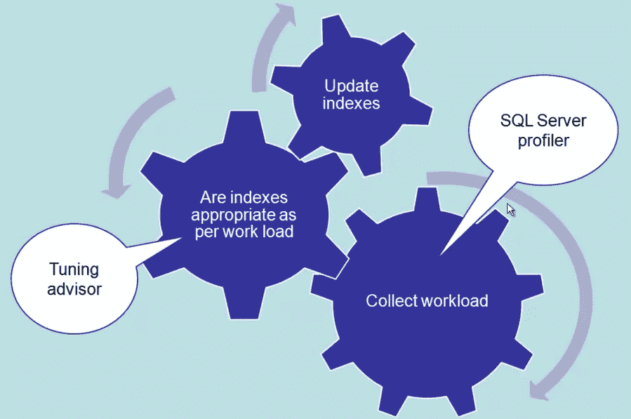
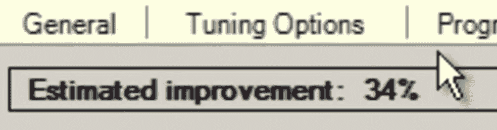
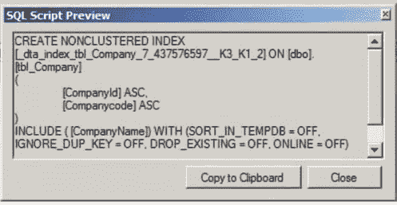
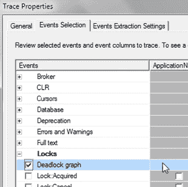
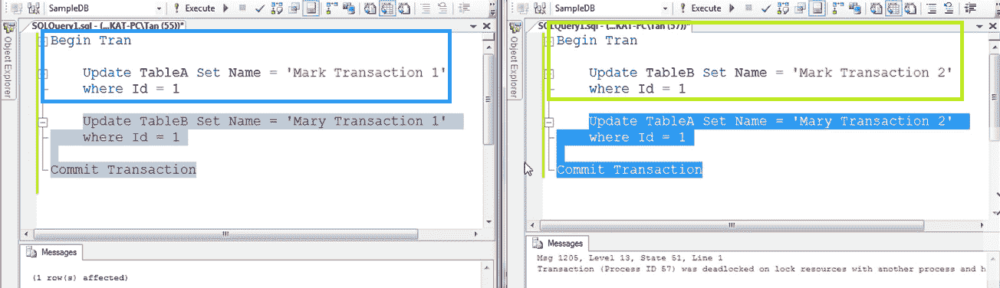
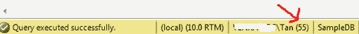
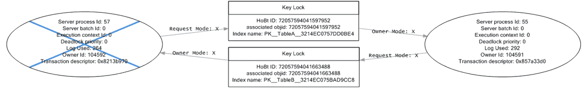

# SQL Server Profiler 最佳实践和优化建议

> 原文：<https://medium.com/hackernoon/sql-server-profiler-best-practices-and-tuning-advisory-d8c746f54809>

[SQL](https://hackernoon.com/tagged/sql) Profiler 是一个很棒的工具，可以让你看到 SQL Server 内部发生了什么。您可以找出性能最差的查询是什么，查询执行的频率等等。

要实现最佳可行索引，请执行 3 个步骤:

*   收集当前工作量[信息](https://hackernoon.com/tagged/information)
*   使用探查器根据工作负载确定索引是否合适
*   使用优化顾问更新索引



探查器自动收集工作负载数据，优化顾问获取探查器生成的工作负载数据，并提供适当的索引。要跟踪特定数据库，请使用**列过滤器**功能。使用优化模板启动跟踪，并将跟踪数据保存到跟踪文件中。

*   点击工具
*   单击数据库引擎优化顾问
*   提供跟踪文件
*   选择需要执行跟踪的数据库
*   在调整选项中，转到高级选项可以指定建议的最大空间
*   单击开始分析

结果表明，如果实施这些建议，可以实现多大的改进:



它还有一个定义列，显示了实现什么来提高数据库的速度，例如:



**SQL 事件探查器最佳实践:**

*   切勿在数据库服务器上运行 SQL 事件探查器
*   直接跟踪到文件，而不是跟踪到表
*   过滤结果，如“持续时间> 1000”
*   仅包含您感兴趣的事件，如`SP:Completed`和`SQL:BatchCompleted`
*   使用用户名、服务器名和应用程序名等过滤器
*   在远程系统上运行 SQL 事件探查器
*   将跟踪事件保存到预定义大小的翻转文件中
*   不要长时间捕获 showplan 事件，以避免文件过大
*   创建模板以便快速访问
*   出于优化目的，请使用推荐的优化模板

**如何使用 SQL Server 事件探查器捕获死锁:**

若要捕获死锁，请首先连接到 SQL Server 数据库。在 SQL Server Management Studio 中打开 SQL 事件探查器:

*   点击工具
*   单击 SQL Server 事件探查器
*   连接到我们需要执行分析的服务器
*   在“跟踪属性”窗口的“常规”选项卡下，选择空白模板
*   在事件选择选项卡上，选择锁叶下的死锁图形



让我们执行下面的查询:



按以下顺序:

1.  执行蓝色矩形中的查询
2.  执行绿色矩形中的查询
3.  执行以灰色突出显示的查询
4.  执行以蓝色突出显示的查询

请注意，进程 id 显示在 SQL Server 的信息栏上:



在执行第 4 步时将生成死锁:



为了以后的分析，可以从文件->导出->提取 SQL Server 事件->提取死锁事件…

分析死锁图形:

1.  带蓝叉的椭圆表示被 SQL Server 选为死锁牺牲品的事务/进程
2.  椭圆形代表流程，不带叉的代表成功完成的交易/流程
3.  死锁优先级设置为默认值，即 0
4.  我们还使用了日志，这表示使用了事务日志。如果事务进行了大量更新，日志大小会更大。因此，滚动一个已经进行了大量更新的事务将花费大量成本。在我们的例子中，死锁牺牲品是具有较少事务日志的一方，因为这样会花费较少的成本。矩形代表资源节点。
5.  矩形代表资源节点。
6.  通过使用以下查询，与资源节点相关联的 HoBtID(堆或二叉树 ID)用于从`sys.partitions`视图中找到死锁所涉及的数据库对象:

```
SELECT object_name([object_id]) from sys.partitions 
WHERE hobt_id = xxxxxx
```

1.  箭头表示我们在每个资源节点上拥有的锁的类型
2.  箭头上的符号 X 和 S 代表排他锁和共享锁

来源:

*   [SQL Server 事件探查器最佳实践](https://www.mssqltips.com/sqlservertutorial/3501/sql-server-profiler-best-practices/)
*   [使用探查器和优化顾问提高 SQL Server 性能](https://www.youtube.com/watch?v=AaPaIVI-yyI)
*   [照片](https://goo.gl/photos/VFrQy5CEX1emE39E9)

*最初发布于*[*xameeramir . github . io*](http://xameeramir.github.io/SQL-Server-Profiler-Best-Practices-and-Tuning-Advisor/)*。*