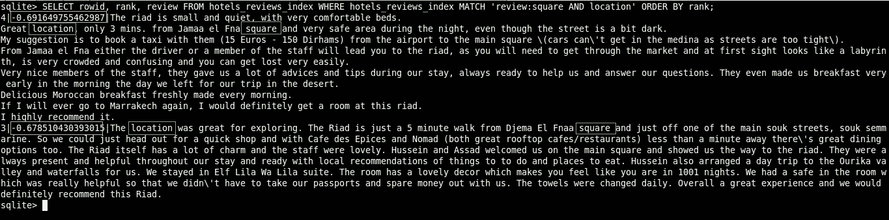

# 使用 SQLite 进行“全文搜索”

> 原文：<https://medium.com/hackernoon/sqlite-the-unknown-feature-edfa73a6f022>


SQLite Logo

最近，我在做一个 LinkedIn spy [工具](https://hackernoon.com/tagged/tool)，我使用了 [**SQLite**](https://www.sqlite.org/) 数据库来存储数据，这个工具需要支持全文搜索功能才能应用。

在网上搜索，我发现 [SQLite](https://hackernoon.com/tagged/sqlite) 已经支持原生的全文搜索。

这个是通过全文搜索扩展[**FTS 3**](https://www.sqlite.org/fts3.html)/[**FTS 4**/](https://www.sqlite.org/fts3.html)[**ft S5**](https://www.sqlite.org/fts5.html)的三次进化完成的。最初的 FTS3 代码是由谷歌的 [**斯科特·赫斯**](https://www.linkedin.com/in/hessscott/) 贡献给 SQLite 项目的。

> FTS1 和 FTS2 是 SQLite 的过时全文搜索模块。这些旧模块存在已知问题，应避免使用。

我们来玩一下这个扩展，我选择这个摩洛哥美女[Riad](https://en.wikipedia.org/wiki/Moroccan_riad)[**Riad Al mamo une**](https://goo.gl/rhrgts)**，想法是摘录一些评论，在上面搜索。**

****

**[Riad Al Mamoune](https://goo.gl/rhrgts) — TripAdvisor**

**为了操作 SQLite 数据库，我在 ubuntu 中使用 sqlite3 命令，但是我们需要更新它，因为它不支持 FTS5，所以，要更新它，请在终端上运行以下命令行:**

```
sudo add-apt-repository ppa:jonathonf/backports
sudo apt-get update && sudo apt-get install sqlite3
```

**更新后，转到您的工作区，通过运行以下命令创建 SQLite 数据库文件:**

```
sqlite3 hotels_reviews.db
```

**现在，复制并粘贴这个要点上的每个 SQL 部分，并在 sqlite3 提示符下运行它，请阅读注释以了解更多信息:**

**正确设置数据库后，现在我们可以尝试执行一些查询搜索:**

```
SELECT rowid, review FROM hotels_reviews_index WHERE hotels_reviews_index MATCH 'review:help';
```

****

**您也可以按相关性排序，即等级分数:**

```
SELECT rowid, rank, review FROM hotels_reviews_index WHERE hotels_reviews_index MATCH 'review:square AND location' ORDER BY rank;
```

****

**请点击以下链接查看官方文档，了解 FTS5 扩展支持的语法和操作符:[https://www.sqlite.org/fts5.html#full_text_query_syntax](https://www.sqlite.org/fts5.html#full_text_query_syntax)**

**你可以在这里阅读更多关于这个话题的内容:**

 **[## 通过 Python 使用 SQLite 全文搜索

### 在这篇文章中，我将展示如何在 Python 中使用 SQLite 全文搜索(以及 peewee ORM 的大量帮助)。我们会…

charlesleifer.com](http://charlesleifer.com/blog/using-sqlite-full-text-search-with-python/)**  **[## 使用 python 和 sqlite 进行全文搜索，适用于教程、初学者、sqlite3、fts、数据库、查询…

### 使用 python 和 sqlite 对教程、初学者、sqlite3、fts、数据库、查询和 fts4 代码进行全文搜索…

code.runnable.com](http://code.runnable.com/Ur8myPOxx4hmAARP/using-full-text-search-with-python-and-sqlite-for-tutorial-beginner-sqlite3-fts-database-query-and-fts4)** 

## **❤如果这篇文章有帮助，请点击绿色小心脏，使用下面的关注按钮来关注我！**