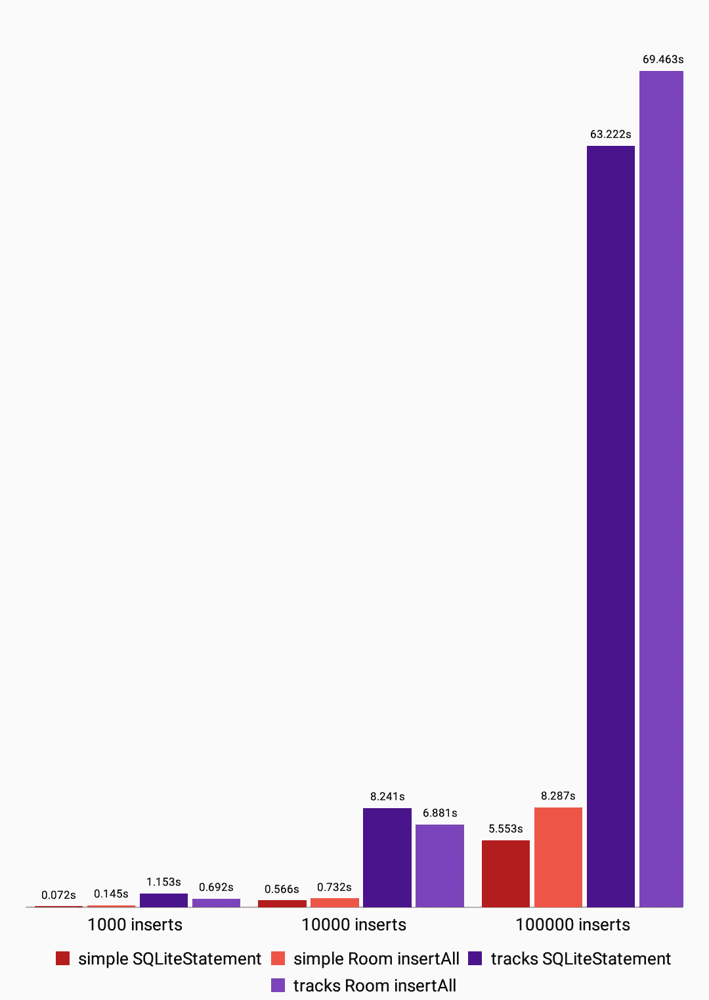
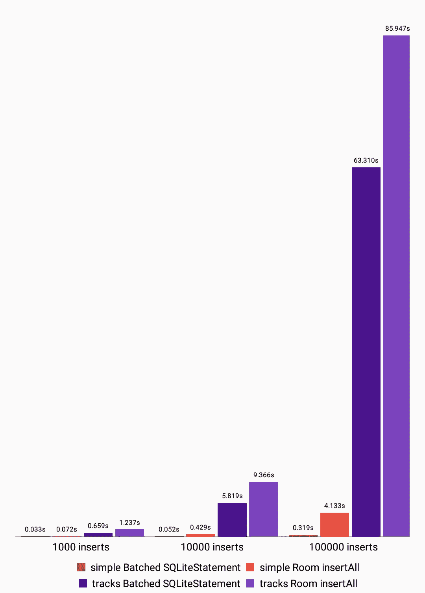

# SQLite 的挤压性能:插入(带空间)

> 原文：<https://medium.com/hackernoon/squeezing-performance-from-sqlite-insertions-with-room-d769512f8330>

在上周的 I/O 大会上，谷歌宣布推出一款名为 Room 的新工具，它使得使用 SQLite 数据库变得更加容易，但它回避了一个问题:它的性能有多好？


This Room looks nice. Let’s go in and explore a bit.

这是我的[早期插入实验结果](/@JasonWyatt/squeezing-performance-from-sqlite-insertions-971aff98eef2)的后续。首先，我们来看几个实验的结果，这些实验将 Room 的相对性能与前一篇文章中讨论的实践进行了比较。然后，我将向从事这项工作的谷歌员工提供一些我自己的建议。

# 方法学

与最初的帖子一样，每个实验都涉及到比较将 1000、10，000 和 100，000 条随机生成的记录插入到两种不同类型的表中的两种或多种方法:

*   一个非常简单的表(`simple`)，由一个整数列组成，并且
*   一个更真实的表格(`tracks`)，描述了一个音乐曲目集合，每个曲目包含一个 id、标题、持续时间、歌词等。`id`列是该表的`PRIMARY KEY`。

我还在我的 16GB Nexus 5X 上进行了所有测试，运行 API level 25(牛轧糖)。

结果是通过跟踪当前大小迭代的所有插入都在运行时所经过的时间来计算的。每次迭代之前连接到[数据库](https://hackernoon.com/tagged/database)和之后擦除表格所花费的时间从结果中排除。

我已经用新的测试场景使用 Room 更新了原始帖子中的 GitHub 项目。

# 重要注意事项

这些实验中使用的房间版本是`1.0.0-alpha1`。

Room 要求所有的`@Entity`类定义一个`@PrimaryKey`值，并且不允许您退回到 SQLite 的默认`rowid`主键。这意味着基于房间的`simple`表实际上有两列:自动生成的 id 和实际值。

## 警告:内存问题

Room 的文档建议使用`@Dao`模式批量插入以下方法:

```
@Dao
public interface MyDao {
    @Insert
    void insertAll(MyItem... items);
}
```

这是一个很好的技巧，可以使向数据库中插入一堆条目变得容易，但是它确实需要为将要插入的每个条目实例化对象。

当我试图创建我的`TrackInfo`实体类的 100，000 个实例时，我很快耗尽了内存。为了让我的性能测试至少运行*次*，我不得不通过使用更小的`TrackInfo`对象集合多次调用`insertAll`来进行一些清理，这样垃圾收集器就有机会在运行之间进行清理。

记住这一点，让我们来看看数字。

# 实验

在检查了由 Room 生成的代码之后，很明显，从事这项工作的 Googlers 人员知道通过在事务中包装多个插入/更新/删除可以获得巨大的性能提升，所以我们将省略 Room 与我在最初的帖子中讨论的简单情况的比较。

另外:在最初的帖子中，我们发现直接使用`SQLiteStatement`比使用`db.execSQL()`稍微快一点，因为 Room 生成的插入代码使用了`SQLiteStatement`，所以让我们比较一下苹果和苹果。

## SQLiteStatement 与 DAO insertAll



对于`simple`的情况，Room 似乎比手动使用 SQLiteStatement 要慢一些。然而，这可能是因为除了值之外，房间实验的简单表还需要有一个`@PrimaryKey`字段。

此外，看起来 Room 很聪明，在多次插入中重用了 SQLiteStatement 对象。我在`EntityInsertionAdapter.java`的源代码中找到了这段代码:

```
*/**
 * Inserts the given entities into the database.
 *
 ** ***@param*** *entities Entities to insert
 */* public final void insert(T[] entities) {
    final SupportSQLiteStatement stmt = acquire();
    try {
        for (T entity : entities) {
            bind(stmt, entity);
            stmt.executeInsert();
        }
    } finally {
        release(stmt);
    }
}
```

这一点点重用在插入过程中产生了很好的效果，而我最初的 SQLiteStatement 插入实现没有做到这一点。这使得 Room 插入`tracks`记录的速度更快。

最后，我认为上面关于需要多次调用`insertAll`的警告是对 100，000 个项目的大案例的损害。

## 批量 SQLiteStatement vs DAO insertAll

当您将批量插入的 SQLiteStatement 与 Room 的`insertAll`模式进行比较时会发生什么？



# 结论:改进的余地

双关语。#抱歉抱歉

我喜欢 Room，我认为它有潜力成为一个非常强大和有用的库。在 Android 应用程序中使用 [SQLite](https://hackernoon.com/tagged/sqlite) 将会去掉许多讨厌的样板文件，并大大加快开发速度。

也就是说，我认为如果谷歌想要为开发者需要使用 Room 将大量数据插入 SQLite 数据库的情况提供良好的支持，他们还有一些工作要做。以下是一些建议:

## 让@Insert DAO 方法接受一个生成器

用 varargs 方法批量插入`@Dao`很好，但是对于大量的对象来说还不够。我建议允许`@Insert`带注释的方法接受迭代器或 iterable，在每次插入之前调用它们来提供下一个对象。类似于以下内容:

```
@Dao
public interface MyDao {
    @Insert
    void insertAll(Iterator<MyItem> itemIterator);
}
```

如果您从服务器上的 JSON 端点插入项目，通过这种方法，您可以使用一个`Iterator`和您选择的流 JSON 解析器，而不必让 JVM 堆过载过多的对象。

## 实现批量插入

Google 还可以通过智能地实现批量插入来大大加快批量插入的速度，在批量插入中他们会创建一个`SQLiteStatement`。大概是这样的:

```
INSERT INTO my_items (...) VALUES (...), (...), ...;
```

这可能需要一点聪明的代码生成来确定如何避免遇到 SQLite 允许的最大变量数的情况，以及支持 SQLite 的早期版本，以便应用程序不会因为您不能一次插入超过 500 个值而崩溃。

我认为这是完全可行的。

## 允许对表使用 SQLite 的 ROWID

当没有为表定义显式主键时，SQLite 在内部使用`ROWID`。目前，Room 不允许您拥有没有显式主键的表。对于大多数情况来说，这可能是一件好事，但有时只使用`ROWID`也是有意义的。

如果`@Entity`注释有一个可以设置为不需要指定`@PrimaryKey`的标志就好了。

# 本系列的其他文章

*   [插入内容](/@JasonWyatt/squeezing-performance-from-sqlite-insertions-971aff98eef2)
*   [解释虚拟机](https://hackernoon.com/squeezing-performance-from-sqlite-explaining-the-virtual-machine-2550ef6c5db)

[](http://bit.ly/HackernoonFB)[](https://goo.gl/k7XYbx)[](https://goo.gl/4ofytp)

> [黑客中午](http://bit.ly/Hackernoon)是黑客如何开始他们的下午。我们是 AMI 家庭的一员。我们现在[接受投稿](http://bit.ly/hackernoonsubmission)并乐意[讨论广告&赞助](mailto:partners@amipublications.com)机会。
> 
> 如果你喜欢这个故事，我们推荐你阅读我们的[最新科技故事](http://bit.ly/hackernoonlatestt)和[趋势科技故事](https://hackernoon.com/trending)。直到下一次，不要把世界的现实想当然！

