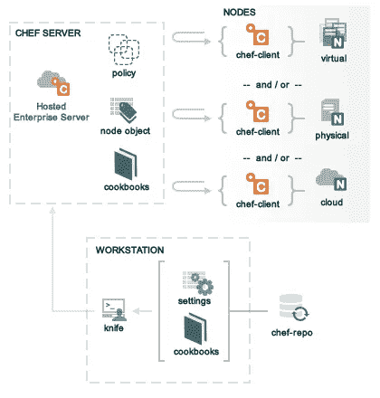

# 系列第 1 部分:配置管理

> 原文：<https://medium.com/hackernoon/sreies-part-1-configuration-management-9cfdb4e9e303>

SREies 是一个系列，主题与我作为现场可靠性工程师(SRE)的工作相关。大约一个月前，我写了一篇关于成为一名 SRE 意味着什么的文章，其中包括一个兼容性测试和资源列表，供那些对这个角色感兴趣的人参考。如果你对 SRE 不熟悉，我建议你先从那里开始，然后再继续前进。

在这个系列中，我将扩展我的描述，以包括我在 Dropbox 的前六个月中学到的概念的更具体的总结。在这个版本中，我将讨论配置管理。

# 我为什么写这个

正如我在上一篇文章中提到的，我来到 SRE 时，在软件开发或系统管理方面没有什么经验。在转行之前，我教了六年高中数学和西班牙语，我喜欢分解复杂的概念。当我觉得是时候寻求新的挑战时，我决定参加一个名为 [Hackbright Academy](https://hackbrightacademy.com/) 的软件工程训练营。Hackbright 为期 12 周，每个学生花 6 周时间学习软件开发的基础知识，4 周时间将这些技能应用于开发 capstone web 应用程序项目。您可以想象，虽然在您的个人机器上开发一个项目对于初学者来说是一个很好的体验，但是它有限的范围阻止了学习可伸缩性和大规模基础设施的机会。

在 Dropbox 这样的数据存储公司工作让我学到了很多关于大规模分布式系统的知识。这个系列是我将我对分解复杂概念的热爱与我作为 SRE 的新知识结合起来的方式。大规模分布式系统的一个关键概念是**配置管理的思想。**

# 什么是配置管理？

根据 Digital Ocean 的这篇很棒的[配置管理简介教程](https://www.digitalocean.com/community/tutorials/an-introduction-to-configuration-management)，配置管理是:

> …用于使服务器达到所需状态的机制，以前通过使用工具的特定语言和功能的资源调配脚本来定义

我知道你在想什么，*“那到底是什么意思？”让我试着用一个例子来分解它。*

## 克里希勒的鸮鹦鹉

One of my cakes

比方说，我决定开一家名为 Krishelle's Kakes 的面包店，这家店很快就火了(实际上，我以前的确烤过蛋糕！).想象一下，这家面包店供应糕点、蛋糕、纸杯蛋糕和巧克力，每天都有人在门外排队。生意变得如此受欢迎，以至于我立即决定在全州范围内扩展和开设其他分店。随着这次扩张，我真的想确保顾客的体验是一样的，无论他们在哪里。

> 你会如何解决这个问题？

我想到的一些事情包括:

1.  我需要确保业务伙伴和我是唯一做出影响业务决策的人，这包括商店设计、食谱更改和员工责任等等。
2.  我需要确保每个商店都设计相似，以确保一致的客户体验。
3.  我需要确保每个商店都有适当的设备来高效运转(烤箱、平底锅、糕点袋、收银机、柜台空间等)。
4.  我需要确保我所有的食谱都写下来，并与每个商店分享。我还需要确保每个地方都能按时收到相同的食材。

这些问题与系统设计者在构建大规模分布式系统时提出的问题类型非常相似。以下是配置管理(CM)提供的一些解决方案:

1.  **集中决策机构:**组织和定义所有系统决策的集中场所。
2.  **统一配置:** CM 确保每台机器按照集中定义进行适当配置。
3.  **自动化软件安装:** CM 确保每台机器都获得完成工作所需的东西，这意味着它拥有正常运行所需的所有软件包。
4.  **资源分配:**工程师确保机器需要执行的所有流程都以代码(脚本)的形式写下来。CM 确保所有的机器都得到完成其工作所需的正确脚本。

换句话说，配置管理工具提供了一个框架，通过这个框架，SRE 可以自动配置大型机器系统中的机器。配置一台机器意味着确保该机器的设置与其他类似的机器相匹配，并且它具有执行分配给它的所有过程所需的正确软件和脚本。这个过程叫做**一台机器的“配置”。**

# **为什么配置管理很重要？**

**我们已经讨论了 CM 是什么，它是一个允许自动化机器供应的框架。现在让我们更深入地了解一下为什么这很重要。**

> **机器供应的自动化有助于最小化由开发环境差异引起的问题。**

**以 Krishelle 的 Kakes 为例，想想如果一个地方安装了对流烤箱，而另一个地方安装了传统烤箱，会发生什么。即使你不知道两者的区别，只知道它们有非常不同的加热特性。**

**烤箱的不同意味着烘焙食品的环境不同，这可能会改变它们的制作方式。即使每个面包店收到相同的食谱，环境的变化(也就是说，不同的烤箱，而不是食谱所写的)会导致各地的不一致。它们甚至可能变坏！这里的主要观点是:烘焙食品的烹饪环境将对结果产生巨大的影响。软件也是如此。**

**环境(意味着代码正常工作所依赖的任何东西)需要一致。当一个工程师在开发它的时候，它应该和在运行它的机器上一样。当应用程序被部署到生产中，并在可能有不同机器设置的同事之间共享时，我们需要一个过程来使一切保持一致。配置管理提供了一个框架，用于创建依赖关系的集中定义，并执行使用完全相同的软件和配置复制环境的工作。**

# **配置管理工具的例子有哪些？**

**最流行的配置管理工具包括:**

*   **[厨师](https://github.com/chef/chef)**
*   **[傀儡](https://docs.puppet.com/?_ga=2.159681149.118683644.1494220050-1369685355.1494220044)**
*   **[Ansible](http://docs.ansible.com/)**

**我在 Dropbox 做的一个项目是和 Chef 一起做的。Chef 包含几个重要功能:**

****

**Chef Architecture**

*   ****Chef Server**—*API Server*，即存储菜谱、节点属性和元数据。**
*   ****Chef 工作站** —在这里你可以开发你的*食谱*(定义系统配置)并运行*刀*命令(CLI 与 Chef 服务器交互)。**
*   ****Chef-repo** —存储所有相关配置数据的 *git* 存储库。**
*   ****节点** —接收配置的机器。**

**食谱*包含了所有重要的配置数据(开发人员编写的)，这些数据提供了我上面描述的所有优秀特性。如果您有兴趣了解关于 Chef 或其他配置管理工具的更多信息，我在下面提供了一些资源。***

# **如何学习使用配置管理？**

## **初学者的配置管理**

**如前所述，DigitalOcean 有一套优秀的教程，可以帮助你从初级水平开始配置管理。**

**🌐[配置管理入门](https://www.digitalocean.com/community/tutorial_series/getting-started-with-configuration-management)**

**🌐[配置管理 101:编写可翻译的剧本](https://www.digitalocean.com/community/tutorials/configuration-management-101-writing-ansible-playbooks)**

**🌐[配置管理 101:编写木偶清单](https://www.digitalocean.com/community/tutorials/configuration-management-101-writing-puppet-manifests)**

**🌐[配置管理 101:编写厨师菜谱](https://www.digitalocean.com/community/tutorials/configuration-management-101-writing-chef-recipes)**

## **其他资源**

**这里有一些其他的教程/文章，你可能也会觉得有帮助。**

**📰[撰写你的第一本厨师食谱](/girl-geeks/writing-your-first-chef-cookbook-611bf665d205)**

**📰 [OpsCode 厨师 101](http://www.yet.org/2013/10/chef-101/)**

**🌐[学习厨师教程](https://learn.chef.io/tutorials/)**

**🌐[使用 Chef 教程开始管理您的基础设施](https://www.digitalocean.com/community/tutorial_series/getting-started-managing-your-infrastructure-using-chef)**

**🌐[做早餐:Airbnb 的厨师](/airbnb-engineering/making-breakfast-chef-at-airbnb-8e74efff4707)**

**🎥[Chef vs Puppet vs ansi ble vs salt stack |配置管理工具对比](https://youtu.be/OmRxKQHtDbY)**

**🎥 [Edureka DevOps 课程讲座](https://www.youtube.com/user/edurekaIN/playlists?sort=dd&shelf_id=15&view=50)**

## **觉得这个帖子有用吗？请点击下面的❤按钮，并与朋友分享！**

## **关于作者**

**Krishelle 是一名前高中数学和西班牙语教师，后来成为 Dropbox 的网站可靠性工程师。[阅读](http://www.huffingtonpost.com/entry/5824e18ce4b094483eef3690?timestamp=1478812083540)关于她从教育到科技的旅程，并在[推特](https://twitter.com/khardsonhurley)和 [LinkedIn](https://www.linkedin.com/in/khardsonhurley) 上与她联系。**

**想改变职业，但不知道从哪里开始？找工作，不知道如何有条理？看看 Krishelle 的这些文章:**

*   **[设计你的职业变化](https://hackbrightacademy.com/blog/3-key-elements-designing-career-change/)**
*   **[我是如何从教学转向工程的(网络研讨会](/@khardsonhurley/4-ways-i-celebrated-womens-history-month-this-year-dec06997d78f)**
*   **[组织求职的工具](https://hackernoon.com/8-tools-for-organizing-your-job-search-post-bootcamp-abe9b2d54c12#.7iz84p4n1)**

************

> **[黑客中午](http://bit.ly/Hackernoon)是黑客如何开始他们的下午。我们是阿妹家庭的一员。我们现在[接受投稿](http://bit.ly/hackernoonsubmission)并乐意[讨论广告&赞助](mailto:partners@amipublications.com)的机会。**
> 
> **如果你喜欢这个故事，我们推荐你阅读我们的[最新科技故事](http://bit.ly/hackernoonlatestt)和[趋势科技故事](https://hackernoon.com/trending)。直到下一次，不要把世界的现实想当然！**

****