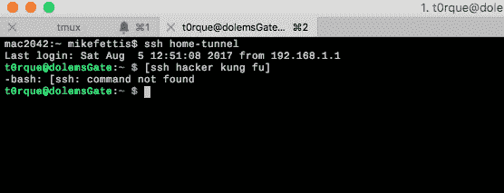

# 宋承宪隧道复用和堡垒哦，我的天！

> 原文：<https://medium.com/hackernoon/ssh-tunnels-multiplexing-and-bastions-oh-my-2e6c8dfc4491>

我整天都在用 ssh。但通常是相当标准的登录、共享密钥和进入我的 tmux 会话。其他时候，它使用保存的命令打开一个隧道，并做一些端口转发。今天和前几天，我已经开始填充一些零碎的东西来真正配置 ssh。我想更多地使用 ansible 来使我的生活更轻松，这当然会在很大程度上利用 ssh 来完成工作。

**SSH 配置—隧道！** 我把这个很长的命令字符串粘贴到一个 shell 中。这是一个麻烦，但我把它连接到阿尔弗雷德，所以这不是什么大不了的事。我有一种感觉，在不久的将来，我连接到 alfred 的许多命令也将成为可翻译的剧本或任务。然而，这是以后的话题。让我们在这里使用我的 ssh 隧道命令

> *ssh-L 9906:10 . 0 . 0 . 1:3306-L 9907:10 . 0 . 0 . 1:3307-L 9909:10 . 0 . 0 . 4:3309*[coolio@database.example.com](mailto:coolio@database.example.com)*-p 4444*

然后，通过配置，它被截短为 *ssh 隧道接口*，或者更进一步，只为带有-N 的端口连接它，并以-f *ssh -f -N 隧道接口*作为背景

> -N 不要执行远程命令。这对于转发端口非常有用。
> -f 请求 ssh 在命令执行之前进入后台。

那么 ssh 配置如下所示

> 主机隧道接口
> 主机名 database.example.com
> 端口 4444
> 标识文件~/。ssh/coolio . example . key
> local forward 9906 10 . 0 . 0 . 1:3306
> local forward 9907 10 . 0 . 0 . 1:3307
> local forward 9909 10 . 0 . 0 . 4:3309
> 用户库里奥

 [## 使用 SSH 配置文件简化您的生活

### 如果你和我一样，你可能会登录和退出半打远程服务器(或者这些天，本地虚拟…

nerderati.com](http://nerderati.com/2011/03/17/simplify-your-life-with-an-ssh-config-file/) 

**复用**
多一个不如多一个。接下来，我想加快我的 ssh 会话，因为越快越好。确保 ssh 复用不会存活太久。10 分钟和持续多路复用之间有很大区别。这个连接也将被用作堡垒主机，因此使用多路传输是一个很好的例子。这是通过 controlMaster 和 controlPersist 参数完成的。现在 ssh 配置看起来有点长了。

> 主机隧道接口
> 主机名 database.example.com
> 端口 4444
> 标识文件~/。ssh/coolio . example . key
> control master auto
> control persist 10m
> local forward 9906 10 . 0 . 0 . 1:3306
> local forward 9907 10 . 0 . 0 . 1:3307
> local forward 9909 10 . 0 . 0 . 4:3309
> 用户库里奥

 [## 使用 SSH 多路复用— Scott 的博客—专门从事虚拟化的 IT 专家的博客…

### 在这篇文章中，我将讨论如何配置和使用 SSH 多路复用。这是安全的另一个方面…

blog.scottlowe.org](http://blog.scottlowe.org/2015/12/11/using-ssh-multiplexing/) 

**堡垒**
名词:设防。壁垒或防御工事的突出部分。
我使用这台主机进行两种不同的访问。第一个是带有 tmux 和活动会话的 pivot box，这让我的生活变得有点懒散，因为我不需要每次登录时都启动所有的连接。然而，另一种不同的方法是像使用堡垒服务器一样使用它，在本地假脱机这些连接，然后通过主机建立隧道。不同任务的不同用例。无论哪种方式，它都允许所有 ssh 连接通过这个端口，因此我在防火墙上打开的端口较少。开放的端口越少越好。棘手的部分是在配置中重用 bastion 条目，然后将正确的键链接到正确的位置。很像面向对象编程，但是从配置的角度来看。
我的配置现在变成了这样。

> 主机堡垒
> 身份文件~/。ssh/id_rsa
> 
> 主机内部测试
> 标识文件~/。ssh/internal _ key
> proxy 命令 ssh User 1 @ bastion-p 3322-W 10 . 0 . 0 . 1:22
> 用户 user2

我可以通过 bastion 主机连接到内部主机，就像这样 *ssh 内部测试*
我们将重用 bastion 节中的 ssh 密钥，然后 bastion 节将使用内部密钥和 user2 连接到内部测试。我知道这可能看起来有点混乱，但只要仔细想想，它会有意义的，我保证。

**结束。** 就是这样！这是我周六早上通过一些 ssh 的旅程。感谢以前写过这方面文章的人们，我试着引用了我读过的所有关于这方面的文章

链接链接

 [## 使用 SSH 配置文件简化您的生活

### 如果你和我一样，你可能会登录和退出半打远程服务器(或者这些天，本地虚拟…

nerderati.com](http://nerderati.com/2011/03/17/simplify-your-life-with-an-ssh-config-file/)  [## 使用 SSH 多路复用— Scott 的博客—专门从事虚拟化的 IT 专家的博客…

### 在这篇文章中，我将讨论如何配置和使用 SSH 多路复用。这是安全的另一个方面…

blog.scottlowe.org](http://blog.scottlowe.org/2015/12/11/using-ssh-multiplexing/)  [## OpenSSH/Cookbook/Multiplexing—Wikibooks，开放世界的开放书籍

### SSH 多路复用的一个优点是消除了创建新 TCP 连接的开销。总的来说…

en.wikibooks.org](https://en.wikibooks.org/wiki/OpenSSH/Cookbook/Multiplexing) 

[http://blog.scottlowe.org/2015/11/21/using-ssh-bastion-host](http://blog.scottlowe.org/2015/11/21/using-ssh-bastion-host/)

 [## ssh(1) — OpenBSD 手册页

### 编辑描述

man.openbsd.org](https://man.openbsd.org/ssh)  [## ssh(1)

### SSH(1) FreeBSD 通用命令手册 SSH(1)名称 ssh — OpenSSH SSH 客户端(远程登录程序)简介 ssh …

www.freebsd.org](https://www.freebsd.org/cgi/man.cgi?query=ssh&sektion=1)