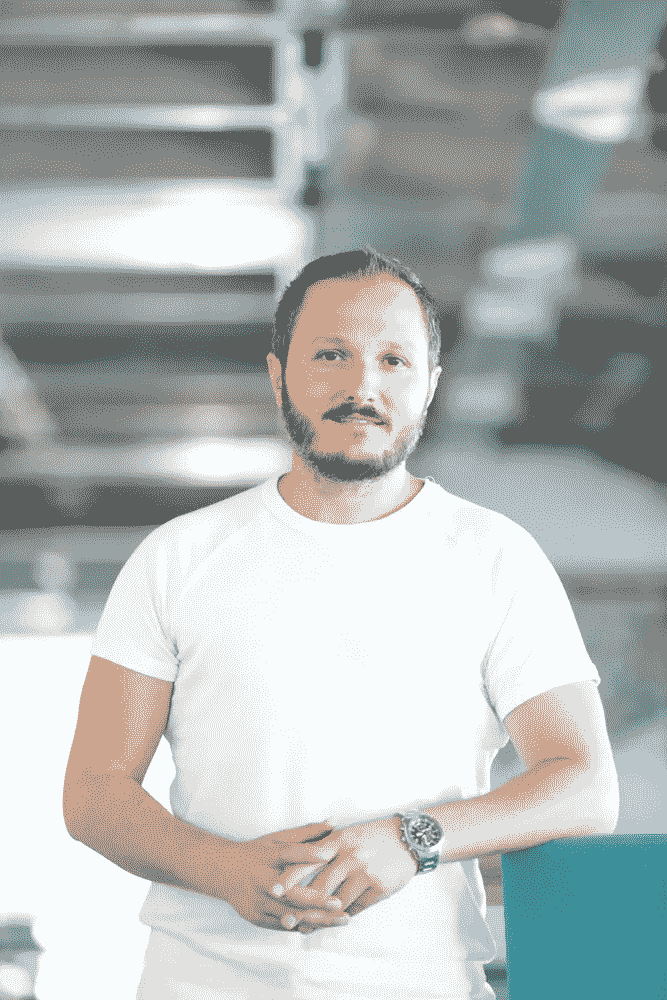

# 堆栈故事:首席技术官哈坎·埃尔多安

> 原文：<https://medium.com/hackernoon/stack-stories-hakan-erdo%C4%9Fan-cto-iyzico-d1e0d7b25a3d>

大家好！已经开始了一个新的文章系列，结合了来自世界各地软件行业先锋手工艺人的一些想法。如今，管理软件架构的重要性成为不可避免的需要，像 CTO、架构师和领导者这样的软件架构的实践者已经有了固定的位置。

我们的第一个“问答”环节是与来自 [iyzico](https://www.iyzico.com/international) 的[哈坎·埃尔多安](https://twitter.com/hakanerdogan)进行的，来自土耳其的 Easy Checkout services。希望你会喜欢这篇文章。

**问:**你在这个领域工作多久了，现在在哪里工作？

**答:** *我在 IT &技术部门工作超过 12 年，在 iyzico 担任 CTO 近 3 年，从 2008 年开始担任* [*管理*](https://hackernoon.com/tagged/management) *职位。*

**问:**你们是根据什么原则组建团队的？

**答:** *最重要的是团队本身，因此招聘很关键。招聘有 3 条红线:我们一直在寻找有动力、有纪律、有激情、喜欢敏捷方法和技术的团队成员。*

问:你如何对团队中开发人员的自主权进行分类？开发者一起决定关于他们的栈的问题吗？在选择团队成员时，你在寻找什么？

**答:** *我相信“你不用跑队”。好的策略是雇佣最聪明、有自我组织能力和热情的人，并授权给他们，这样他们就能创造出伟大的产品和软件。*

**问:**iyzico 内部使用 TDD(或其他)方法的团队是如何处理日常工作的？您是否参与了配置过程？开发过程中有哪些步骤？

**答:** *我们使用结对编程、代码评审工具和测试自动化(单元测试、功能测试、集成测试)作为基于 Git SCM 和 Atlassian 工具(jira、confluence、bamboo、crucible……)的持续交付。SDLC 必须设置在公司的早期阶段，这样公司才能快速扩展。*

目前，我们有 9 个成员人数相等的敏捷/scrum 团队，大部分是 4 个人，所以他们是成对的。团队是不可改变的，但是搭档是可以改变的。我们还有产品负责人和敏捷教练。敏捷实践，如 TDD，结对，…对我们来说是必须的，实际上每个团队成员都相信敏捷方法的效率和乐趣。因此，我不需要说服人们关于 TDD、敏捷实践等等。所有这些，包括所有配置和 SDLC/连续交付基础设施，都是在核心团队开始时设置的，当团队扩展时，新来者采用了这种文化

**问:**你对软件架构有什么选择？你以前用过什么，现在在用什么？

**答:**我的意思是，我们的团队中有资深的专家开发人员/工程师。他们喜欢跟踪新技术、最佳实践和成功案例。每个月，我们都会聚在一起讨论话题。我们喜欢基于 Java & JVM 的堆栈，但是如果我们需要，我们也使用它需要的东西，比如用于机器学习的 Python 库。作为一个团队，我们相信微服务和基于上下文的分组。我的意思是，当你看一个支付系统时，你会看到至少 14-15 个核心模块，如登机、收款、结算、发票等。例如，在托收上下文中，有付款、退款、取消服务。我们认为所有数据库、服务和配置都必须基于上下文，例如收集服务有自己的配置&发现服务和数据库。

问:你认为项目简单还是复杂？你认为是什么让一个项目变得复杂？你也评估每个项目本身的复杂性吗？

答: *不，我们把项目分为大石头和小石子。我们可以将大岩石定义为一个复杂的项目，它们具有相同的特征。一般来说，作为一个工程常识，它们会持续 2 个月以上，影响许多模块，或者需要基础设施/架构更改。*

**问:**在与几个不同的团队合作并努力使版本保持一致的同时，你如何稳定版本？如果你正在使用 git，你使用的工具是什么？与小型和大型(人太多)团队合作的难点和优势是什么？

答: *我们用的是 Git 和 git-flow。我们还有许多环境，如本地环境、开发环境、第一阶段环境、第二阶段环境、沙盒环境、灾难恢复环境和生产环境。有时 9 个不同的团队在开发不同的项目，这些项目相互影响。由于我们每周都在进行冲刺跑，并且每周都为所有团队(scrum of scrum)进行调整，所有的冲突都会很快得到解决。主要冲突是基于数据库变化，而不是软件。*

**问:**在您目前的工作场所，您遇到过微服务基础设施方面的困难吗？

**答:** *微服务是新的时髦词汇，但首先，你必须讨论你是否需要它，或者你将选择什么原则，否则，你将面临过度工程化。我们决定不按原样应用所有的方法，例如，基于上下文的微服务对我们来说很好。尽管如此，我们仍在用风险较低的项目进行测试。必须明智地考虑延迟、多级跳、缓存、性能和著名的工程问题——可重用性与耦合性。*

**问:**什么事情会占用你大部分时间？技术问题还是高层组织决策？

**答:** *当然是技术类的东西，但是需要一定的时间和投入，因此需要高层的管理支持。你必须把它卖给你的决策者。*

**问:**你觉得一个“todo app”可以做到多复杂？你能给它拍张照吗？

**答:** *刁钻问题:)一辆车多少钱？雷诺和宝马，新车还是 2005 款？当然，这取决于团队、技术和需求。这里是方法论。建立一个 5 人团队，4 名开发人员/工程师两人一组，一名产品负责人。定义所有的 PBI，玩扑克计划游戏并确定总工作，选择一个较小的 PBI 并详细分析它以了解 PBI 工作及其实际时间，绘制产品待办事项列表以遵循项目截止日期。每周或每两周跑一次 sprint。注:不要忘记添加 10%到 20%的缓冲或不可预见的项目。*

问:面向对象编程/架构对你来说意味着什么？

**答:** *文化、理念、敏捷性、工程和团队素质*

问:你认为函数式语言在未来会发生什么？比起基于面向对象的语言，你更喜欢这样的技术/平台/语言吗？

**答:** *很难说，但是他们的目标不同，针对不同的需求提供不同的解决方案。因此，我不能说所有的编程语言都是基于面向对象的。如果你正在使用低级或机器学习工具，你需要 OOP 吗？*

问:你对“无服务器”技术有什么看法？

我很快就会成为事实上的 T2。如果你不是在一个受监管的环境中工作，请至少尝试一下亚马逊 AWS 或类似的软件(谷歌云，微软 Azure 等)。).

**问:**你能说出一个软件架构师或工程师应该具备的五个主要特征吗？

A: *聪明，好奇，有上进心，有纪律性，有激情。*

问:在你的工作生活中，你应该有一些最喜欢的时刻，也有一些你希望忘记的时刻。你能和我们分享一下吗？

**答:** *从零开始构建 iyzico 的支付系统。组建一个团队，租一个办公室，创造一个产品，用我的* [*网络*](https://hackernoon.com/tagged/network) *销售。*

感谢您的诚实回答，并希望 iyzico 将继续提供高质量的服务，让生活更轻松。

希望你喜欢这篇文章！感谢阅读，下期再见。

**注:如果你喜欢这个帖子，请***❤****在 Twitter 上分享，或者做点什么！:)*****