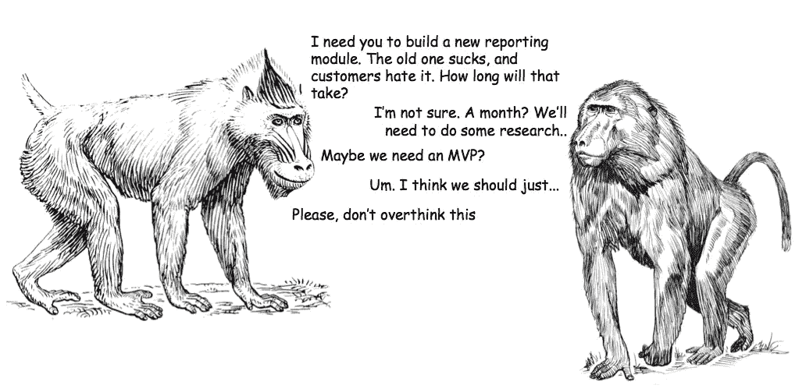
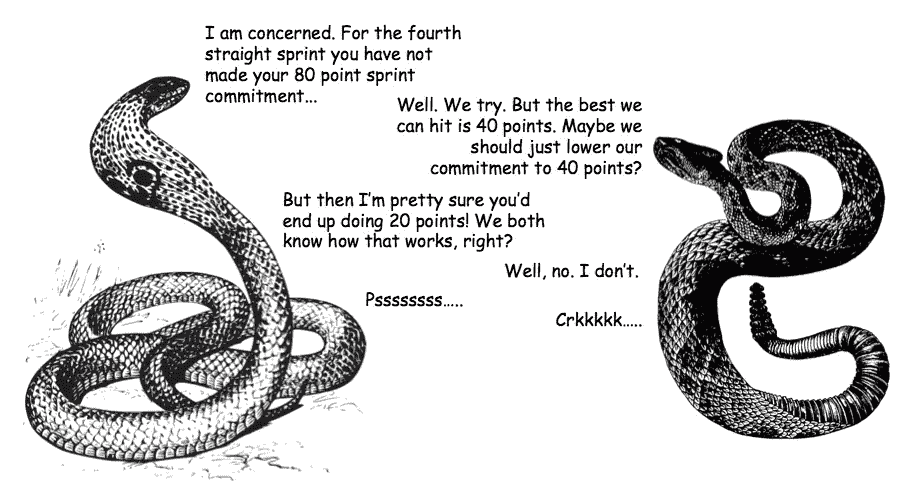
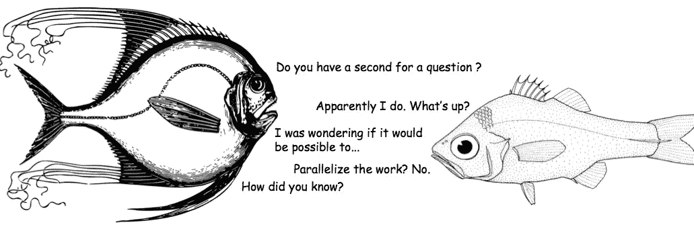
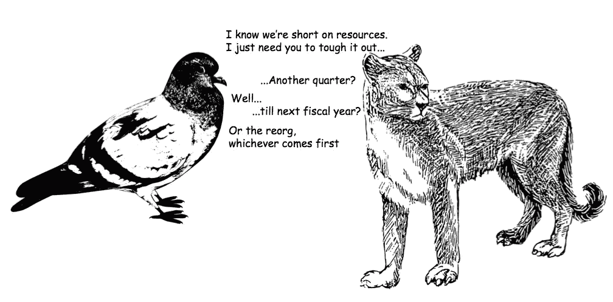
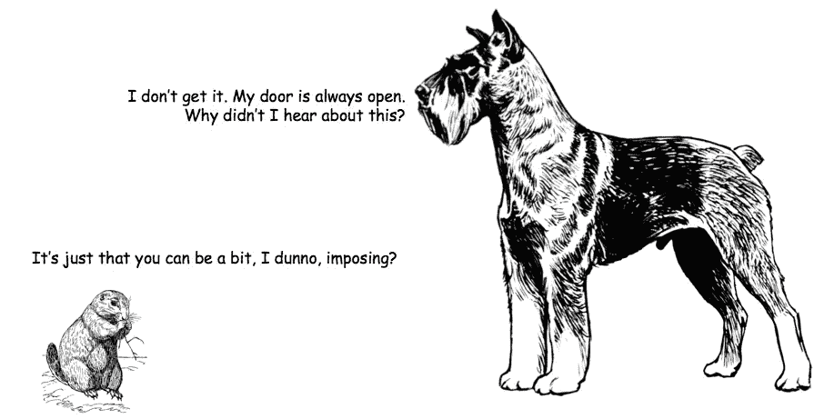
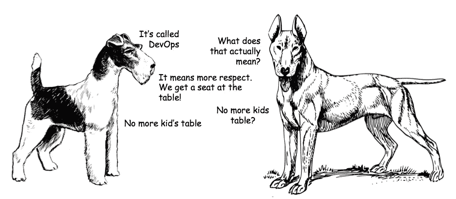
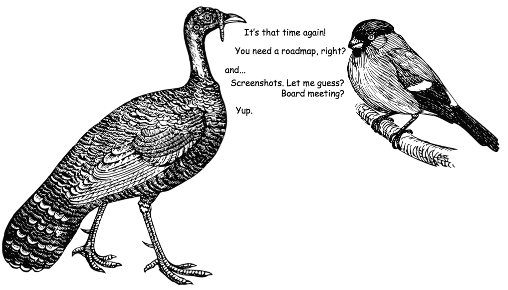

# 起立！

> 原文：<https://medium.com/hackernoon/standup-b30ab2f0d43d>

我制作关于软件产品开发的剪贴画漫画。以下是过去几个月的一些照片…

Phil chats with Dante regarding the new reporting module…

Scrum Master Charlize challenges Alex. Those pesky story points…

When in doubt, ask if you can parallelize the work. Marie-Claire is not amused

Pigeons herding cats

For Myra, being the top dog has its challenges

Stanley and Patricia imagine a new future. A DevOps future

CEO Pauline is off to the airport. She needs a roadmap

> [黑客中午](http://bit.ly/Hackernoon)是黑客如何开始他们的下午。我们是 [@AMI](http://bit.ly/atAMIatAMI) 家庭的一员。我们现在[接受投稿](http://bit.ly/hackernoonsubmission)并乐意[讨论广告&赞助](mailto:partners@amipublications.com)机会。
> 
> 如果你喜欢这个故事，我们推荐你阅读我们的[最新科技故事](http://bit.ly/hackernoonlatestt)和[趋势科技故事](https://hackernoon.com/trending)。直到下一次，不要把世界的现实想当然！

