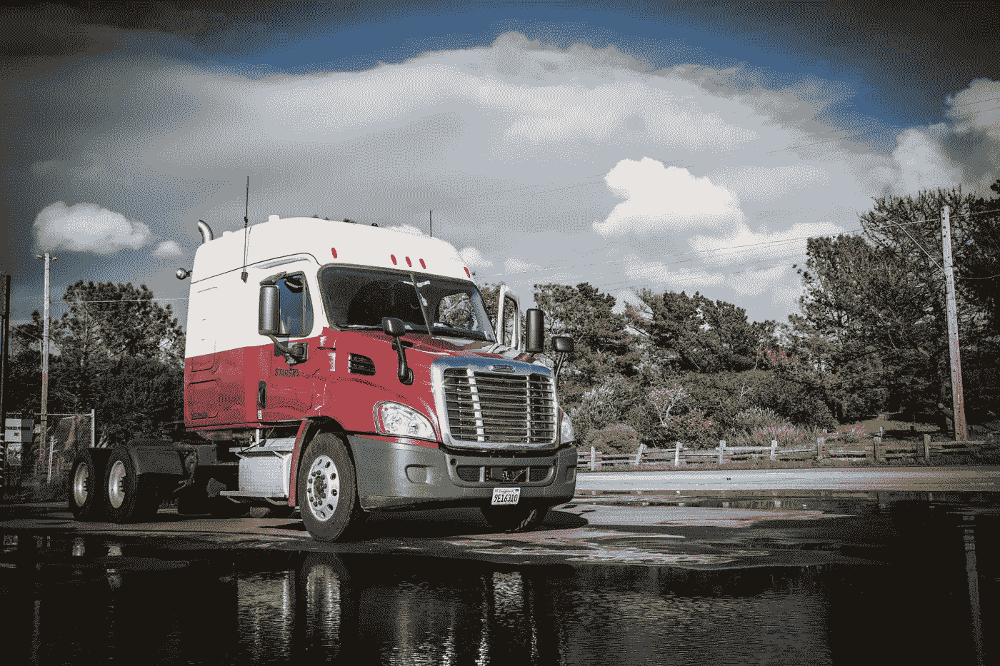
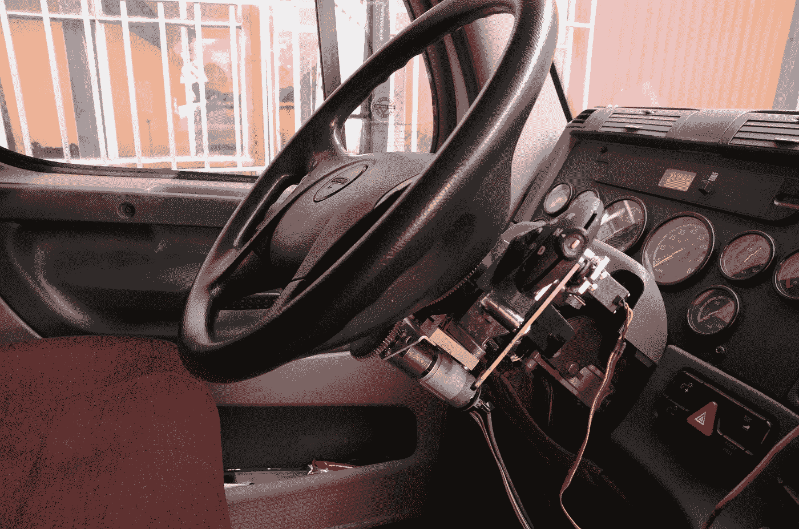
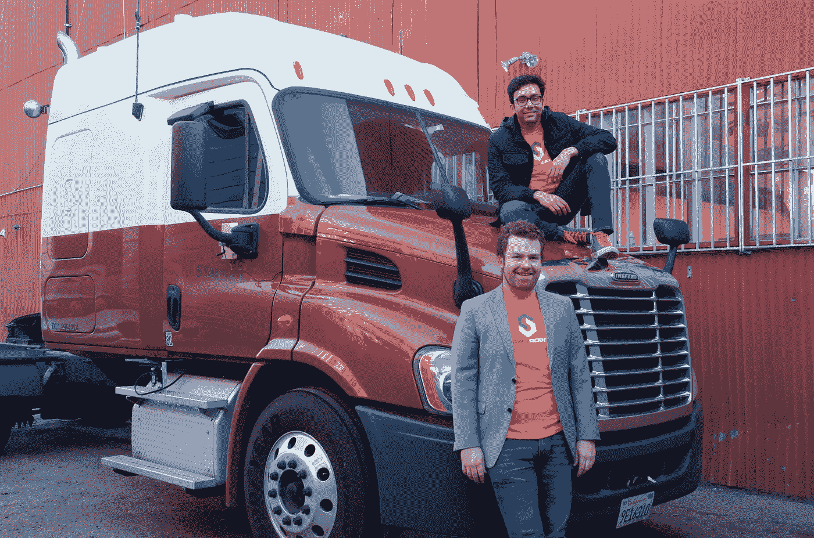

# Starsky Robotics:不会把司机甩在身后的无人驾驶卡车

> 原文：<https://medium.com/hackernoon/starskylaunch-b8669afb71c7>

今天，我第一次公开宣布，我非常兴奋地宣布，Starsky Robotics 自 2015 年 9 月以来一直致力于使无人驾驶卡车成为现实。

2017 年 2 月 3 日，我们的一辆卡车将 5000 磅的负载拖行了 140 英里，并自行行驶了其中的 120 英里。

2016 年 8 月，另一辆配备了我们系统的卡车在卡车场周围无人驾驶地移动拖车来赚钱。除了采矿车辆，我们认为这使我们成为第一家为赚钱而进行无人驾驶工作的公司。

> 这使我们成为第一家为赚钱而从事无人驾驶工作的公司。

我们能够这么快做到这一点，是因为我们不是技术纯粹主义者，而是与卡车司机合作，而不是反对他们。配备了我们的系统，卡车将在高速公路上完全自动驾驶，但可以远程控制。这使我们能够获得无人驾驶卡车的安全和效率优势，同时让司机在离家更近的地方进行有意义的工作。

> “卡车司机是美国最危险的工作”

安全对我们来说极其重要。[每年有 4000 人死于卡车事故](https://www.fmcsa.dot.gov/safety/data-and-statistics/large-truck-and-bus-crash-facts-2014)，因为司机经常被迫在安全驾驶和养家糊口之间做出选择，这导致[卡车驾驶成为全美最危险的工作](http://abcnews.go.com/Business/story?id=87825&page=1)。不需要这样:我们想给有经验的卡车司机提供本地司机的生活方式，并支付长途车队司机的工资。

司机不仅冒着生命危险；他们冒着与家人和社区失去联系的风险。出于经济需要，许多司机一个月只能见家人几天，这对他们的伴侣和孩子来说是一种压力。远程驾驶员工作效率更高，因为他们可以驾驶多辆卡车。这让我们可以慷慨地支付司机，同时允许他们每晚回家。许多司机很幸运可以和他们的孩子通电话，我们的司机可以指导他们的足球队。

> “现状的人力成本太高”

我们需要快速行动，因为现状的人力成本太高。如果我们等待遥远的技术成为现实，或者等待变化无常的战略合作伙伴关系成为现实，那么太多的人将在美国的道路上受到伤害——这就是为什么我们在不依赖任何不可扩展或商业可用的技术的情况下建立这项技术。我们不会侵入某辆卡车的数据端口，也不会依赖激光雷达等不发达的技术。

很明显，市场上唯一真正自主的公司没有使用激光雷达。虽然激光雷达的前景很好，但我们认为等待它的发展是一种道德风险。我们的高速公路自治依赖于计算机视觉、雷达和软件。这些技术已经被很好地理解，并允许我们迅速开始拯救道路上的生命。

从集成的角度来看，我们不会通过入侵卡车的现有系统来损害它们。相反，我们已经建立了一个改装套件来启动卡车的物理控制，但不妨碍我们的安全驾驶员的能力来控制。我们的系统实际上推动踏板，转动方向盘，并改变齿轮。我们对长途驾驶的关注使我们的系统具有与驾驶员几乎相同的功能，并且可用性更高。

这很重要，因为北美物流的核心问题相当简单。让一个人一次在卡车里呆上一个月真的非常非常难。这就是为什么卡车[司机的流动率超过 100%/年](https://www.trucks.com/2016/04/26/driver-turnover-at-large-truck-carriers-climbs-to-102-percent/)而[缺少 5 万名司机](http://www.truckinginfo.com/channel/drivers/news/story/2016/12/state-of-trucking-for-2017.aspx)。任何需要人类亲自进入卡车的技术都不能解决这个问题。

我们正在解决这个问题，本月在公路上运输货物是第一步。我们将在接下来的几个月内开始常规服务，我们计划在年底前取消某些车辆的安全驾驶。

> 我们正在做一件大事，并开始定期服务

我们认为我们正在做一件大事，将在未来几个月开始定期服务，并能够组建一支伟大的团队。我们已经从 Y-Combinator、Sam Altman、Trucks VC、Data Collective 和许多其他公司筹集了 375 万美元；有网络运输、监管、启动和技术专家为我们提供建议；现在我们团队有 11 个人。但是制造无人驾驶卡车并不简单，我们需要帮助。

我们将改变一个[、7000 亿美元的产业](http://www.logisticsmgmt.com/article/ata_reports_trucking_industry_revenue_tops_700_billion_in_2014)，这个产业[占所有成本](https://www.rita.dot.gov/bts/sites/rita.dot.gov.bts/files/FFF_complete.pdf)的 15%。查看我们的网站[了解我们特别需要帮助的领域，如果没有合适的，给我们发电子邮件。](http://starskyrobotics.com)

继续前进

-斯特凡&卡蒂克

> [黑客中午](http://bit.ly/Hackernoon)是黑客如何开始他们的下午。我们是 [@AMI](http://bit.ly/atAMIatAMI) 家庭的一员。我们现在[接受投稿](http://bit.ly/hackernoonsubmission)，并乐意[讨论广告&赞助](mailto:partners@amipublications.com)机会。
> 
> 如果你喜欢这个故事，我们推荐你阅读我们的[最新科技故事](http://bit.ly/hackernoonlatestt)和[趋势科技故事](https://hackernoon.com/trending)。直到下一次，不要把世界的现实想当然！

