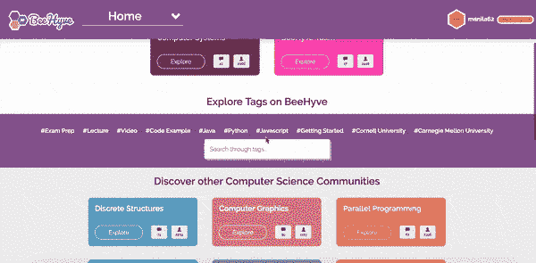
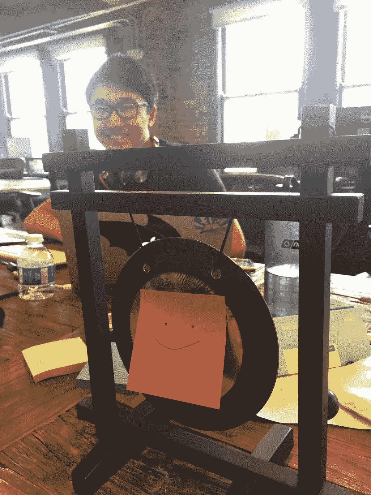
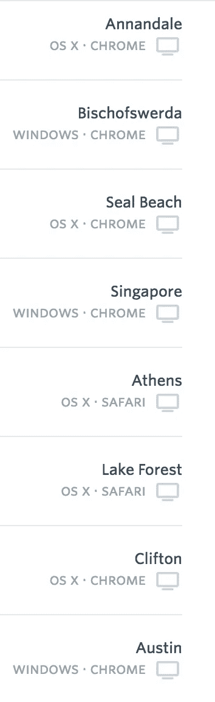

# 创业:我第一次实习为什么选择在 BeeHyve 工作，我从中获得了什么

> 原文：<https://medium.com/hackernoon/startin-up-at-a-startup-why-i-chose-to-work-for-beehyve-for-my-first-internship-and-what-i-ve-bfe318e3d913>

The summer ’17 BeeHyve team ft. lovely RGB birch paintings

那么，你正在考虑为一家初创公司工作，但不确定这是否适合你？

希望我的故事可以帮助提供一些见解！声明一下，我还远远不是 T2 初创公司行业的专家。然而，我在我们的四人[BeeHyve](https://hackernoon.com/tagged/beehyve)([BeeHyve . io](https://www.beehyve.io/))团队度过了一个美妙的夏天，我很乐意分享我是如何来到这里的/我从这里学到了什么！

作为一名实习生，在一家新成立的公司工作可能比在一家更成熟的公司工作有一些普遍的缺点；这些可能包括工资的轻微下降，以及从表面上看在简历中不那么突出的经历。然而，我知道我想学很多东西，需要从某个地方开始——我没有关注一个已知的名字，而是寻找充满热情、乐于助人的人，在我与维拉和瓦伦的面试过程中，我肯定发现了这些品质。诚然，当我决定在 BeeHyve 实习时，我并不知道在创业公司工作的好处是什么，但我很高兴地说，我现在肯定知道了！所以，事不宜迟…

## **在小型创业公司工作，你有望收获什么:**

*   难以置信的学习体验！
*   各种领域的快节奏工作
*   接近热情的人

## **学到很多东西**

如果你的创业经历和我一样，你就会被安排工作。感谢上帝！在一个四人团队中，不可能被落在后面或被忽视。你肯定会面临挑战，可能会被要求做一些你以前几乎没有经验的事情，但幸运的是，你的老板/导师/实习同事就在你身边。虽然一开始我觉得自己没有多少 web 开发背景(也就是说，我不知道 jQuery '$ '是什么……)，但我被强烈鼓励提问，很快我就发现自己可以更自信地接受新任务。

BeeHyve JQuery

我肯定还是会感到困惑，犯很多错误，但我知道他们让我从[到](https://still-tundra-19985.herokuapp.com)(我的面试网站；幽默= 10/10，sub-sub-par 理解如何呈现任何更新的信息)到[这里](https://www.beehyve.io/)的许多功能实现(个人资料、类别卡、内嵌评论等)。)，感谢我团队的支持。

Global tag search feature I worked on the first few days of this week. jQuery schmayShmery amirite?

## **快速的任务周转，而不仅仅是编码！**

虽然其他公司的实习生告诉我，他们知道他们的夏季项目根本不会被使用，但我每周都能够从挑选出我感兴趣的新功能、漏洞修复、范围界定练习或增长任务开始，每个任务都对网站有明显的影响，并在很短的时间内完成。虽然我主要是写代码，但我也能够从事设计工作，帮助计划和确定潜在的功能，参与学生面试，致力于发展等。，并且喜欢成为公司全局的一部分，而不是仅仅局限于一个任务领域。

Although not *all* of my design choices have been used, such as this lovely profile suggestion, it’s been fun to put some ideas out there :)

## **被驱动包围**

整个夏天，每周似乎都比上一周更令人兴奋。我们刚刚推出了新的功能，推出了新的类，增加了用户——我们可以清楚地看到上周我们在哪些方面有所改进，并有了下一步的计划。我喜欢和我的团队在一起，他们每个人似乎总是充满了新的想法，更令人印象深刻的是，他们有一个如何实现的行动计划。我不确定已经有几个星期了，凡荣没有说过类似“我对这个星期太**兴奋了**”的话。这将是巨大的！”，但我确定我一直都有这种感觉。

The friendly new office gong to help celebrate BeeHyve achievements (+ jmo!)

总的来说，我在第一次实习中度过了一段美好的时光，并从编码和在一个有效的、支持性的团队中工作中学到了宝贵的东西。我当然有很多良好的环境来让我有能力接受这份实习，包括一个开放的夏天来专注于学习，以及海湾地区的家人，他们极大地帮助了我向该地区的过渡。然而，如果你找到了一个适合你的机会，并且希望在一个快节奏和充满激情的环境中工作，我强烈建议你尝试一下小型的创业经历！祝你好运！:)

还在读书？？？发现了一个很酷的创业公司，你认为你可以为它工作，但需要更多的说服力？

如果你的创业公司是这个国家西部边缘的众多创业公司之一，进一步的额外津贴包括享受这个国家西部边缘的美丽景点和声音！

Couple a’ Michigan gals enjoying the California coast

此外，如果你的创业在网上公开，你可能会看到世界各地的人使用你帮助创造的东西。下面是最近在 BeeHyve 上的一些用户位置的截图。相当整洁！

好了，正式结束了——再次祝你好运！

结账 BeeHyve — [www.beehyve.io](http://www.beehyve.io) 。我很想听听你在 twitter 上@BeeHyveBuzz 的想法

作者:Emi Jackson，密歇根大学计算机科学专业的大三学生。这是我在 BeeHyve—[https://www.beehyve.io/s/manila62](https://www.beehyve.io/s/manila62)和 Linkedin—[https://www.linkedin.com/in/emi-jackson-a313b7139/](https://www.linkedin.com/in/emi-jackson-a313b7139/)