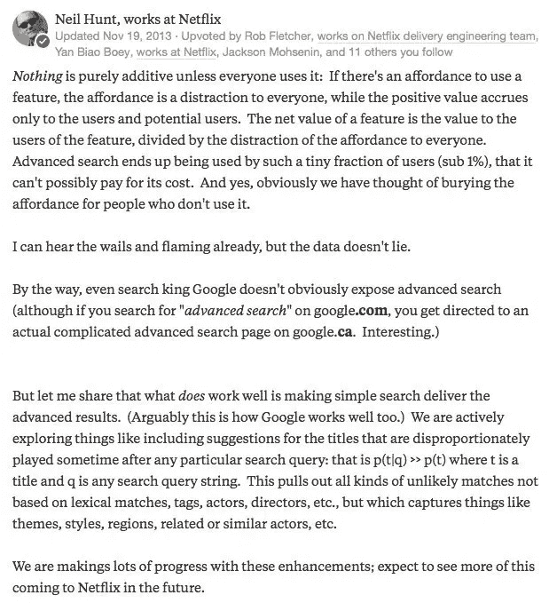
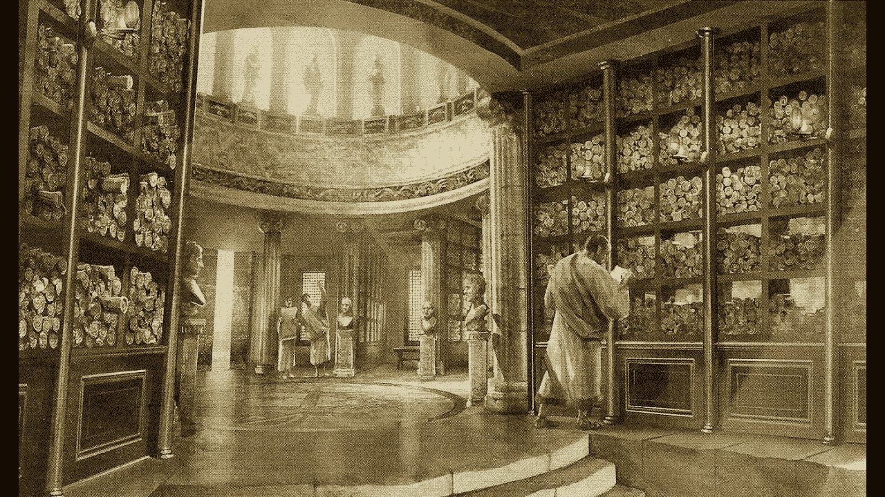

# 不熟悉产品工作？这里有一些推荐的读物

> 原文：<https://medium.com/hackernoon/starting-a-product-role-here-are-some-recommended-reads-7fd3cc67642f>

我最近整理了一份文章、视频和[书籍](https://hackernoon.com/tagged/books)的清单，我认为进入产品角色的人应该阅读这些文章，以便很好地掌握基础知识。

这些只是帮助新的产品经理/所有者/人类思考互联网时代解决问题的一个起点，并给他们心智模型。如果是你，你需要知道它们不是食谱，但是，假以时日，它们可以帮助你创造自己的食谱。最后，建立人们关心的东西是一项艰苦的工作，这都取决于你。祝你好运！

# 文章/散文

## **我们这里不卖马鞍**

[Slack 的首席执行官斯图尔特·巴特菲尔德](https://twitter.com/stewart)，在 Slack 发布前两周写下了这份精彩的备忘录。这是关于你所建造的东西的意义。这比罐头上的产品说明要重要得多:[https://medium . com/@ Stewart/we-don-sell-saddles-here-4c 59524d 650d # . ldajcg1 ds](/@stewart/we-dont-sell-saddles-here-4c59524d650d#.ldajcg1ds)

## **指数思维—10 倍而非 10%**

[现为谷歌风投合伙人的肯·诺顿](https://twitter.com/kennethn)解释了为什么产品经理应该永远是颠覆的最坚定支持者:[https://www.kennorton.com/essays/10x-not-10-percent.html](https://www.kennorton.com/essays/10x-not-10-percent.html)

## **是什么造就了一个伟大的产品经理**

[Skyscanner 产品管理副总裁、前 Skype 产品总监 Piero Sierra](https://twitter.com/pierosierra) 谈到了优秀项目经理的关键特质:[https://medium . com/@ Piero Sierra/builders-make-the-best-Product-people-22 fdb 8d 75 dfe # . jdjcefyf 0](/@pierosierra/builders-make-the-best-product-people-22fdb8d75dfe#.jdjcefyf0)

## 解决正确的问题

产品领域的主要思想家之一 Melissa Perri 让我们避开一个常见的陷阱，即公司认为他们通过让员工忙碌来取得进步。以下是如何专注于确保我们为人们解决真正的问题:[https://www . mind the product . com/2017/07/escaping-build-trap-Melissa-perri/](https://www.mindtheproduct.com/2017/07/escaping-build-trap-melissa-perri/)

## **迭代速度胜过迭代质量**

我花了一段时间才完全理解。起初我完全不同意它，但后来慢慢喜欢上了它。StackOverflow 的创造者杰夫·阿特伍德(Jeff Atwood)，基于约翰·伯伊德的飞机格斗教学，解释说快速学习，从小处着手，不断迭代是生存之道:【https://blog.codinghorror.com/boyds-law-of-iteration/】T2

## **做不成规模的事情**

过早的优化扼杀了伟大的想法。为了让产品适应市场，你需要牵引力。为了获得牵引力，你需要在耗尽你的稀缺资源(通常是钱)之前，做一些能让你比竞争对手更快了解你的客户的事情。这首由[保罗·格拉厄姆](https://twitter.com/paulg?lang=en)创作的经典之作:[http://paulgraham.com/ds.html](http://paulgraham.com/ds.html)

## **寻找产品市场契合度**

[A16Z 的马克·安德森](https://twitter.com/pmarca)接下来将发表另一篇经得起未来考验的文章，讲述在打造新产品时，找到产品的市场适应性是多么重要:[http://pmarchive.com/guide_to_startups_part4.html](http://pmarchive.com/guide_to_startups_part4.html)

## **如何开始启动**

由 Y Combinator 的山姆·奥特曼组织的整个“如何创业”系列充满了来自伟大演讲者的精彩演讲。像这样的好内容在 10 年前并不是免费的:[http://startupclass.samaltman.com/](http://startupclass.samaltman.com/)

## 你实际上是做什么的？

伟大的产品不是偶然出现的，脸书的产品设计总监乔恩·拉克斯对我影响很大。现在，当面对一个新的情况时，我会试着去想那些由我支配的工具。如果我没有一个有用的，我会试着去找一个或者创造一个。一个好的剧本对于产品经理来说是必不可少的:[https://medium . com/great-products-don ' t-happen-by-accident/great-products-don ' t-happen-by-accident-f 46323 D8 ad 94 # . pj 1236 nkd](/great-products-dont-happen-by-accident/great-products-dont-happen-by-accident-f46323d8ad94#.pj1236nkd)

## **向后工作**

如果你想创造伟大的产品，从最终目标开始。亚马逊的技术现在已经广为人知，如果你想让你的团队完全理解这个问题，即使在写一行代码之前，也值得一试:[https://medium . com/bluesoft-labs/try-an-internal-press-release-before-starting-new-products-867703682934 # # 734 z4kt4w](/bluesoft-labs/try-an-internal-press-release-before-starting-new-products-867703682934#.734z4kt4w)

## **你真的应该建造它吗？**

Slack 的产品经理 Sean Rose 曾经在推特上引用了 Neil Hunt(网飞的首席采购官)的话，它完美地总结了我把东西放在用户面前的感受。消除复杂性是打造优秀产品的关键。

## **你的产品在哪里？**

当人们谈论独特的价值主张或独特的卖点时，他们通常是指这一点。[瑞安·辛格](https://twitter.com/rjs)是一位才华横溢的思想家，他的《立场、立场、立场》一文就如何通过权衡清楚地确立自己做了一个很好的论证。如果你做 X，而不是同样可防御的 Y，你会立刻变得和其他人不一样。如果你在多个维度上这么做，你会找到你的位置。阅读:[https://m . signalvnoise . com/position-position-position-34b 510 a 28 DDC #、m6ggr5p3a](https://m.signalvnoise.com/position-position-position-34b510a28ddc#.m6ggr5p3a)

## **没有流程银弹**

肯特·贝克是敏捷宣言(非常值得阅读和理解)的 17 个原始签名人之一，并且是极限编程书籍的作者。这是 20 年后，我们通过他的 3X 框架来看待敏捷和软件开发过程的方式:[https://www.youtube.com/watch?v=YX2XR73LnRY](https://www.youtube.com/watch?v=YX2XR73LnRY)

## **网络经济 101**

本·汤普森是你需要追随的商业分析师。他的代表作是聚合理论，一个把握所有伟大互联网经济公司的统一参考:【https://stratechery.com/2015/aggregation-theory/

接下来是他关于[定义聚合者](https://stratechery.com/2017/defining-aggregators/)的新作，只需遵循[策略](https://stratechery.com/)。

## **互联网世界的富足**

阅读《社会资本》的亚历克斯·丹可的系列文章，在本·汤普森教导的基础上，真正开始理解互联网是如何改变一切的。你需要这个来了解你的客户是如何运作的。

## 文化的作用

网飞的《天才文化甲板》是一部理解公司如何扩大规模、如何吸引最优秀的人才并让他们保持参与的杰作。文化吃早餐的策略(彼得·德鲁克原创)，https://jobs.netflix.com/culture[网飞版](https://jobs.netflix.com/culture)

也看看 Spotify(现在每个人都是)的[组织设计](https://labs.spotify.com/2014/03/27/spotify-engineering-culture-part-1/)。

## 谷歌如何设定目标

[里克·克劳](https://www.twitter.com/rklau)谈论设定目标并告诉你关于 OKRs 的一切:[https://www.youtube.com/watch?v=mJB83EZtAjc](https://www.youtube.com/watch?v=mJB83EZtAjc)

配对(一语双关)里克的视频，关于配对指标以及单个指标的盲目会如何杀死你:[https://mattyford.com/blog/2014/6/11/paired-metrics](https://mattyford.com/blog/2014/6/11/paired-metrics)

# 书

## [精益启动(明显)](https://www.amazon.com/Lean-Startup-Entrepreneurs-Continuous-Innovation/dp/0307887898/ref=sr_1_1?ie=UTF8&qid=1511123309&sr=8-1&keywords=lean+startup)

让我们把它弄出来。阅读精益创业。它将帮助你了解产品开发的其他一切。

## [思考快与慢](https://www.amazon.com/Thinking-Fast-Slow-Daniel-Kahneman/dp/0374533555/ref=sr_1_1?s=books&ie=UTF8&qid=1511123350&sr=1-1&keywords=thinking+fast+and+slow)

如果你想了解用户是如何思考的，你需要介绍一下卡尼曼和特沃斯基的工作。太迷人了。

## [影响](https://www.amazon.com/Influence-Psychology-Persuasion-Robert-Cialdini/dp/006124189X/)

恰尔迪尼提出的六项说服原则将帮助你以完全不同的视角看待你最钟爱的产品。读一读，随处可见。

## [日常用品的设计](https://www.amazon.com/Design-Everyday-Things-Revised-Expanded-ebook/dp/B06XCCZJ4L/ref=sr_1_1?s=books&ie=UTF8&qid=1511123399&sr=1-1&keywords=design+of+everyday+things)

你需要和设计师谈谈。你需要大量关于人们如何与周围世界互动的参考资料。你需要对产品设计有深刻的感受力，并关注细节。唐·诺曼就是你要找的人。

## [零对一](https://www.amazon.com/Zero-One-Notes-Start-Future-ebook/dp/B00KHX0II4/ref=sr_1_1?s=books&ie=UTF8&qid=1511123423&sr=1-1&keywords=zero+to+one)

彼得·泰尔不像其他人那样看待创新。他不像其他人那样看待竞争。他认为从零或一开始。赢家通吃，实际上就是一切。一种新的心态。

## [创新者的困境](https://www.amazon.com/Innovators-Dilemma-Technologies-Management-Innovation-ebook/dp/B012BLTM6I/ref=sr_1_1?s=books&ie=UTF8&qid=1511123448&sr=1-1&keywords=innovators+dilemma)

这是另一个关于创新的本质以及每次做出合理的管理决策将最终杀死你的公司的经典案例。创新者的 Dillema 现在(2017)已经 20 岁了，但它是完美的永恒。

## [比拼运气](https://www.amazon.com/Competing-Against-Luck-Innovation-Customer/dp/0062435612/ref=sr_1_1?s=books&ie=UTF8&qid=1511123494&sr=1-1&keywords=competing+against+luck)

了解要做的工作，人们为什么购买产品，以及如何解决他们根深蒂固的动机和目标。Clay Christensen 主张，有一种更好的方式来构建产品，而不是尝试所有的东西，看看什么能坚持下来。

## [创意公司](https://www.amazon.com/Creativity-Inc-Overcoming-Unseen-Inspiration/dp/0812993012/ref=sr_1_1?s=books&ie=UTF8&qid=1511123521&sr=1-1&keywords=creativity+inc)

建立一种创新、坦诚和成长的文化，成为世界上最成功的动画工作室之一。艾德·卡姆尔的《皮克斯的故事》棒极了。

## 沃尔特·伊萨克森著

艾萨克森是一个出色的故事讲述者，他了解史蒂夫·乔布斯，好的和坏的。不要读这篇文章来成为史蒂夫·乔布斯，读这篇文章来理解有史以来最杰出的产品创造者之一是如何看待这个世界的。【巨人公司】中的[对乔布斯惊人的思维也有一些惊人的见解。](https://www.amazon.co.uk/Company-Giants-Conversations-Visionaries-Digital/dp/0070329656)

## [冲刺](https://www.amazon.com/Sprint-Solve-Problems-Test-Ideas-ebook/dp/B017S92JUY/ref=sr_1_1?s=books&ie=UTF8&qid=1511123568&sr=1-1&keywords=sprint)

Jake Knapp 在 5 天内从想法到可测试的原型。做一个，然后沉迷于测试想法和快速失败。

## [妈妈测试](https://www.amazon.com/Mom-Test-customers-business-everyone-ebook/dp/B01H4G2J1U/ref=sr_1_1?s=books&ie=UTF8&qid=1511123583&sr=1-1&keywords=the+mom+test)

在设计冲刺的最后，你需要问客户正确的问题。阅读妈妈测试，了解什么是永远不要问的。

## [被钩住的](https://www.amazon.com/Hooked-How-Build-Habit-Forming-Products/dp/1591847788/ref=sr_1_1?s=books&ie=UTF8&qid=1511123601&sr=1-1&keywords=hooked)

作为订婚戒指的介绍。

## [关于硬东西的硬东西](https://www.amazon.com/Hard-Thing-About-Things-Building/dp/0062273205/ref=sr_1_1?s=books&ie=UTF8&qid=1511123619&sr=1-1&keywords=hard+thing+about+hard+things+book)

因为制造产品并不容易，本·霍洛维茨比任何人都清楚这一点。这本书令人难以置信地描述了本作为公司创始人和产品制造者的历程。

## [返工](https://www.amazon.com/Rework-Jason-Fried/dp/0307463745/ref=sr_1_1?s=books&ie=UTF8&qid=1511123634&sr=1-1&keywords=rework)

Basecamp 的家伙们(杰森·弗里德、大卫·海涅梅尔·汉森)非常清楚，人们所说的关于建立一家公司的一切都是错误的。事实上，他们已经建立了一个伟大的公司来证明这一点。