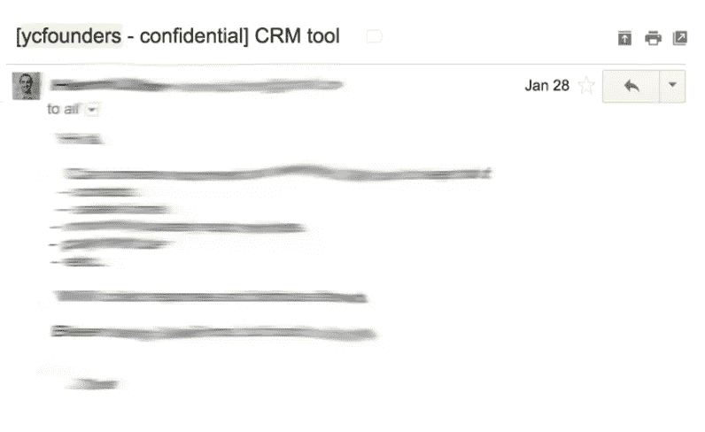
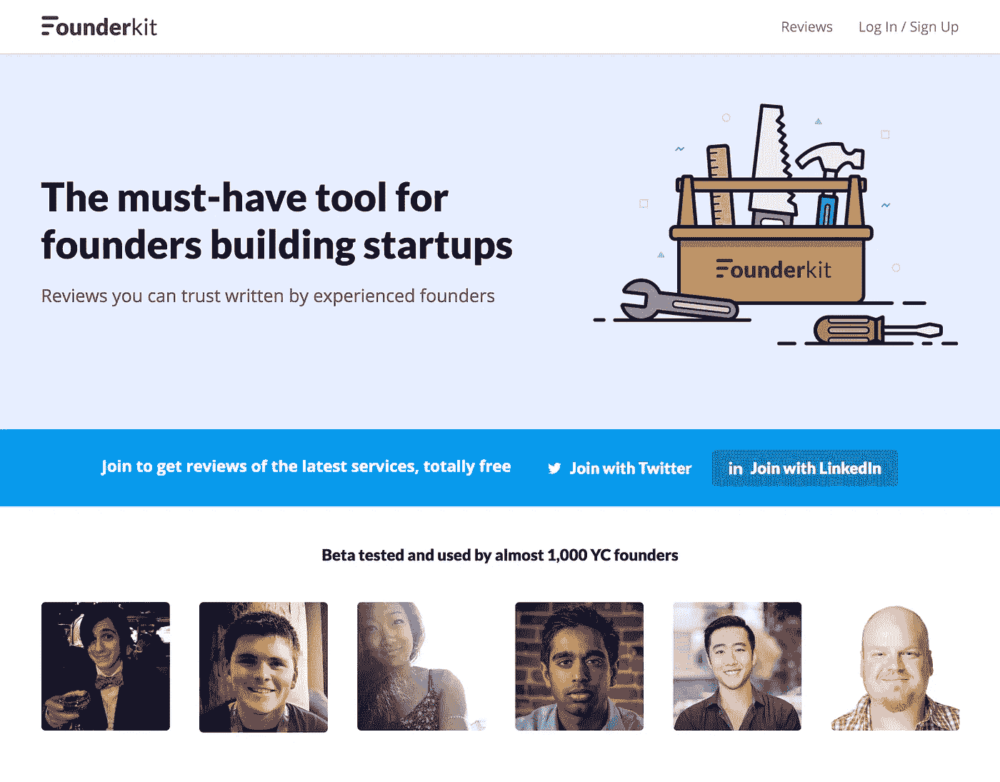

# 创业真他妈的难

> 原文：<https://medium.com/hackernoon/starting-a-startup-is-fucking-hard-6c1121b216a3>

## 《避免可避免的错误》,这是我为了找到最好的创业工具而做的一个新产品的故事，是由 YC 推荐的，他是风投支持的，也是领先的创业公司创始人

更新:我们推出了 [Founderkit](http://founderkit.com) ！一定要去看看，让我知道你的想法。

事实上，创办一家[初创公司](https://hackernoon.com/tagged/startup)是我一生中做过的最难的事情。

我记得进入 Y Combinator 就像昨天一样。当时，在热情洋溢、魅力非凡的创始人保罗·格拉厄姆的带领下，YC 迅速成为“创业哈佛”。我和我的联合创始人艾德(Ed)为面试做了准备，进行了 24 小时不间断的提问，我们互相快速提问，并通过 Skype 接受了 YC 校友朋友的提问，如罗德·易卜拉希米(Rod Schmidt)、纳乔·塞耶(Nacho Thayer)和约瑟夫·瓦拉(Joseph Walla)。

正如我后来对艾德描述的那样，那次采访中，所有 11 位 YC 合伙人都在杜比环绕声中，感觉就像我们被一列 100 节车厢的火车碾过，当它掠过我们时，直直地撞在我们的头上。我们无法停止在脑海中回放采访血战，所以我们分散了自己的注意力，直到那天晚上晚些时候我们喝了尽可能多的啤酒，没有让自己太尴尬，如果不可能的事情发生了，保罗·格拉厄姆那天晚上打电话给我们。当他这么做的时候，我只能说“PG？你想资助我们？真的吗？”

那天，艾德和我得到了一份不可思议的礼物，可以接触到一个企业家网络，无论事情有多困难，无论我们面临什么问题，他们都会支持我们。我们从不孤独。

你在第一次、第二次或第十次创业中犯的错误会让你大笑，想哭。你会浪费几个月，也许几年，甚至一生中可能再也见不到的钱。如果你现在不接受，你以后会接受的，相信我。

当[伊恩·亨特](https://medium.com/u/2d0da7095eca?source=post_page-----6c1121b216a3--------------------------------)和我决定一起工作时，我们想给创始人一个望远镜，看看地平线，避免错误，或者至少，给我们所有人一个做出明智决定的机会。

使用 Parse 构建 FOBO 可能是我们创业时做出的最后悔的决定。最让我们痛苦的是，它是由朋友运营的，他们在我们的批次中建立了服务。使用我们的银行给我们带来了一些痛苦，但只是每月一次。我们解雇了我们的第一个簿记员，因为他们让簿记变得像吞下一盒钉子一样愉快，但还不够快。伊恩现在承认，在 Zaarly 的时候，接受英镑薪酬是一个巨大的错误。他们应该使用另一个支付处理器，但他们让自己被说服了。每一个决定都有朋友、风投、聪明人的推荐，但是他们充满了偏见，很可能来自错误的人。

一般来说，我们创始人在做决策的时候都会征求建议。你问谁会有很大的不同。人们通常会毫不犹豫地推荐解决方案，即使他们实际上并不精通创业这样的专业领域。

所以在 YC，我们会通过邮件列表询问对方。但即使这样，同样的问题会不断地被重复询问，就像一个破碎的记录，如使用哪家商业银行，会计，时事通讯电子邮件服务，工资服务，服务器等。我向伊恩提到了这一点，我们俩都很兴奋能造出更智能的东西。向合适的人询问最少量的信息(因为最适合询问的人是最忙的)，并获得创始人实际上可以信任的数据。

One of hundreds of questions asked by YC founders for advice on tools to use

Founderkit 的第一个版本实际上是从电子表格开始的。在几个小时内，很明显，我们需要建立一个可扩展的方式来与其他创始人分享数据，即使只有 10 个贡献者。

然后是 [Founderkit](http://founderkit.com) 。首先，我们邀请了 YC 的创始人来尝试。由于我们从一个电子表格开始，并且已经有了*一些* [工具](https://hackernoon.com/tagged/tool)的推荐，加入的创始人立刻惊讶于它的实际用途。鸡和蛋的问题？仅仅是一个借口，用来证明那些实际上并不想建造什么东西的人的不作为。对于那些建立了多个市场的人来说，情况并非如此。没过多久，YC 就派出了所有新的创始人，每一批都有，基本上每个活跃的创始人都依靠 Founderkit 的推荐。

你可能会想“难道没有这样做的网站吗？”当然有。然而，每次我们向创始人展示我们的成果和建议时，他们都会发现一些新的服务，并基于我们提出的坦诚、高质量的建议来实现它。一目了然，我们可以为他们节省数小时或数千美元。现有的任何其他服务都无法做到这一点。

等等！这是一个关于 Founderkit 的故事，还是一个关于创业有多难的故事？都是。

在启动之前，Founderkit 已经发展到将近 1000 名 YC 创始人的贡献者。在过去的几周里，我们已经增加了[慢速风险投资](http://slowventures.com/)、[第一轮](http://firstround.com)、[社会资本](http://www.socialcapital.com/)、[上行合伙企业](http://www.upsidevc.com/)、[燃料资本](http://www.fuelcapital.com/)来创建创业基金，还有其他人在等待加入。收到这样一个经验丰富的创始人社区的支持和贡献是令人谦卑的，我们很高兴现在有机会与成千上万的新成员分享它。

祝你旅途好运。我们选择这段旅程不是因为它容易，我们选择它是因为它是唯一有意义的旅程。

最后，来加入 Founderkit 的社区吧。我们将一起更容易地做出决定，并在可避免的错误上节省彼此的时间和金钱，因为让我们面对它，我们不需要让自己创业变得更加困难。

感谢您的阅读和宝贵的反馈， [Ian](https://medium.com/u/2d0da7095eca?source=post_page-----6c1121b216a3--------------------------------) 和 [Shane](https://medium.com/u/dd01ab5cff35?source=post_page-----6c1121b216a3--------------------------------) ！

> [黑客中午](http://bit.ly/Hackernoon)是黑客如何开始他们的下午。我们是 AMI 家庭的一员。我们现在[接受投稿](http://bit.ly/hackernoonsubmission)并乐意[讨论广告&赞助](mailto:partners@amipublications.com)机会。
> 
> 如果你喜欢这个故事，我们推荐你阅读我们的[最新科技故事](http://bit.ly/hackernoonlatestt)和[趋势科技故事](https://hackernoon.com/trending)。直到下一次，不要把世界的现实想当然！

