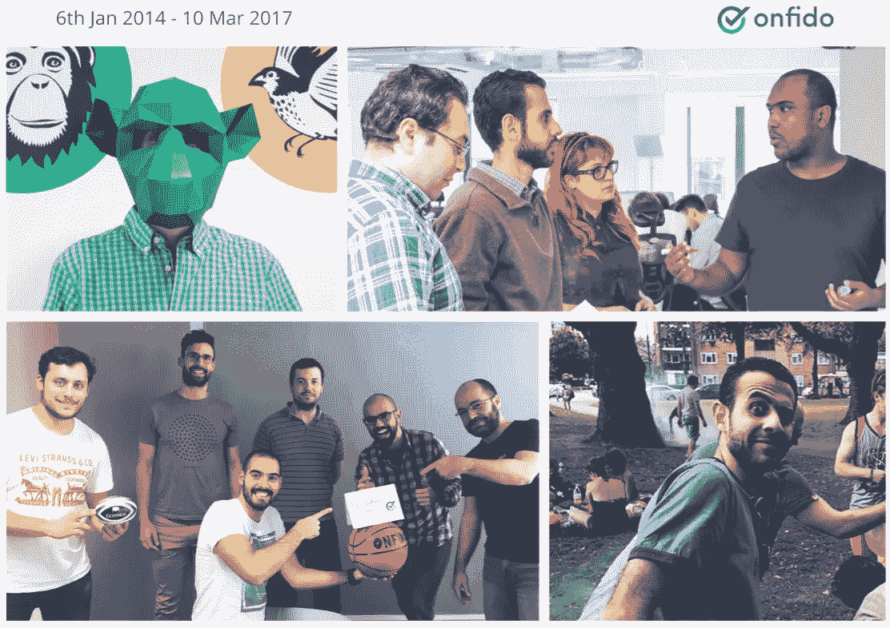

# 在向上扩展中启动创业

> 原文：<https://medium.com/hackernoon/starting-a-startup-within-a-scaleup-56d1ec8d1398>

Onfido 如何使其团队成为未来企业家的故事。

The Onfido Team early in 2016

# **早期**

2013 年 12 月，当我还在埃及准备申请英国签证时，我决定加入一家名为“Onfido”的公司。我对他们的愿景和驱动这三位牛津毕业的创始人的激情非常感兴趣。该产品仍处于 MVP 阶段，而[初创公司](https://hackernoon.com/tagged/startup)正处于早期种子阶段，所以作为第一名全职员工，我承担了很大的风险——但我一直相信风险和挑战。这就是推动我抓住这个机会的原因。

我们卷起袖子，直接开始工作！一个月又一个月，公司完成了更多的交易，产品继续改进，团队雇佣了一些美国和欧洲最聪明的人，并从世界顶级风险基金和天使投资者那里筹集了更多资金。

回想起来，真不敢相信时间过得这么快！我三年多前加入的那家初创公司现在在英国、美国和里斯本都有办公室，员工超过 150 人。我最喜欢 [Onfido](http://onfido.com) 的一点是，尽管有所增长，但这种文化仍然和我加入时一样强大。该公司设法在指数增长的同时扩大其文化规模，保持其核心的[价值观](http://onfido.ghost.io/values-for-high-performance-company-culture/)。

We worked hard and played hard. We are a family!

# **未来**

今天是我在 Onfido 的最后一天，离开所有这些亲密的朋友非常难过。我正在追逐我的梦想，建立自己的创业公司，并帮助创业公司的人们获得最佳质量的知识，减少垃圾邮件和低质量内容的噪音。我将加入伦敦的 [Entrepreneur First](https://www.joinef.com/) 公司，从事[知识官](http://knowledgeofficer.com)的工作:这是一个帮助初创公司在团队内部和团队之间获取和分享来之不易的知识的平台。Onfido 如何帮助我达到这个阶段令人鼓舞，我相信每个公司都应该遵循 Onfido 模式。我写这篇文章是因为我现在所取得的成就很大程度上归功于 Onfido 和我的朋友们..

# **Onfido 和“人”**

当我加入 Onfido 时，我正在开发一个非常早期的 Knowledge Officer 版本(尽管当时它的名称和范围略有不同)，令人惊讶的是，创始人们对我非常鼓励，不时询问我的最新更新和进展。你可能会惊讶地发现，我在伦敦的第一周，就参加了 TechCrunch Disrupt，并在那里提出了我的想法。这些活动不仅满足了我作为一名[企业家](https://hackernoon.com/tagged/entrepreneur)的激情，还帮助我扩展了我的经验，更好地为 Onfido 做贡献，先是一名软件工程师，然后是一名产品经理(一年前我过渡到了 PM 角色)。

从历史上看，公司认为鼓励人们为自己的想法工作是危险的，因为他们最终会离开，但这与 Onfido 的信念完全相反。侯赛因·卡萨伊(Onfido 的首席执行官)在今年早些时候的一次会议上明确提到，Onfido 有责任帮助人们更接近他们的目标，即使这意味着他们最终将离开并追求他们的梦想。这是公司的信念，对员工最好的就是对自己最好的，Onfido 是一个非常以人为本的地方。

我们的团队相信，如果你关心他人，把他们当作人而不是资源，你不仅会得到最好的结果，还会获得最高的保留率。我在 Onfido 工作了三年多，如果不是因为我的梦想和责任，我很乐意在未来的许多年里继续工作，继续完成这个使命[传递知识](https://hackernoon.com/the-startups-ecosystem-and-challenges-2bc99396d7d3#.kggsmsfq9)并为影响我们所有人的 clickbait 文化找到解决方案。如果你喜欢我们的愿景，请在[产品搜索](https://www.producthunt.com/posts/knowledge-officer)上给我们你的爱！

有鉴于此，**我也很自豪地宣布 Onfido 正式成为** [**知识官**](http://knowledgeofficer.com) **的第一个客户！Onfido 将是第一个使用我们的团队版 KO 的，这将很快发布。**

由于今天是我在 Onfido 的最后一天，我想陈述我在这里学到的一件事(其中有很多):

> “如果你想建立一个成功的企业，你需要确保公司的每个人都在追求自己的目标，并且公司的价值观和目标与他们的愿景和梦想百分之百一致。当你这样做的时候，奇迹就发生了！”

公司应该停止疑惑"*你为什么要离开？*“然后开始问”*我们能帮上什么忙？*“–这才是真正关心员工的公司。

*猜猜看！Onfido 是* [*招聘*](https://onfido.com/careers) *！我强烈建议任何人寻找一家以人为本的公司，有改变世界和推动全球人类互动的雄心。*

> [黑客中午](http://bit.ly/Hackernoon)是黑客如何开始他们的下午。我们是 AMI 家庭的一员。我们现在[接受投稿](http://bit.ly/hackernoonsubmission)并乐意[讨论广告&赞助](mailto:partners@amipublications.com)机会。
> 
> 如果你喜欢这个故事，我们推荐你阅读我们的[最新科技故事](http://bit.ly/hackernoonlatestt)和[趋势科技故事](https://hackernoon.com/trending)。直到下一次，不要把世界的现实想当然！

