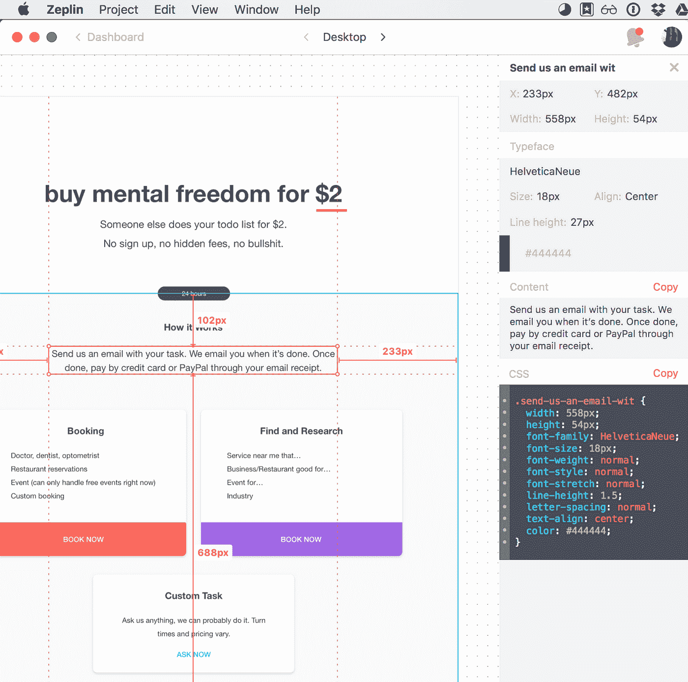
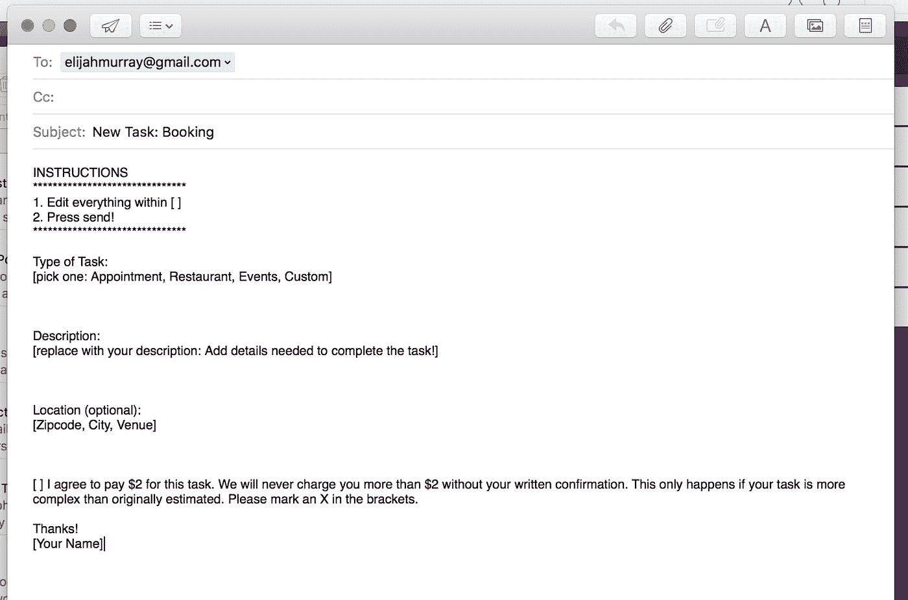

# 创业 1:第 2 周——我如何在一周内建立一家创业公司

> 原文：<https://medium.com/hackernoon/startup-1-week-2-how-i-built-a-startup-in-a-week-4e2b311fcca2>

*注:* [*4 周推出*](http://4weekstolaunch.com) *是一个正在进行的关于跨多个创业公司建立被动收入的系列——每 4 周一个新的* [*创业公司*](https://hackernoon.com/tagged/startup) *。阅读* [*第 4 周发布*](http://4weekstolaunch.com/4-weeks-to-launchlaunch/) *入门。获取* [*每周更新*](http://4weekstolaunch.com/newsletter/) *。*

从情感层面来说，第一周是地狱，但我也取得了重大进展；我在一周内建立了一家初创公司，预订了我的第一笔销售，并在途中搞砸了很多事情。这篇文章是关于什么可行，什么不可行。

# 如何在一周内建立一家创业公司

[第一周的重点](https://docs.google.com/spreadsheets/d/1jELsOFyACrxs2ci9w347d2OmlO0lDG-8P7l6P4gQKFU/edit#gid=995892820)是构建 [MVP](https://hackernoon.com/tagged/mvp) (最小可行产品)&概念验证。我成功了，但一路上遇到了许多困难。如果你错过了第一周的创意选择，[在这里阅读](http://4weekstolaunch.com/startup-1-week-1/)。

我的目标是让产品非常简单，这样我就可以专注于快速进展。因此，我也很少使用我的技术背景。这个实验应该是任何人都可以复制的，不管技术能力如何。不使用大量的技术技能也有助于项目快速进行。

为了开始，我头脑风暴了一下这个服务最简单的版本会是什么样子。问:“我可以只通过……销售我的产品/服务吗？”

1.  笔和纸？
2.  电子表格？
3.  一部手机？
4.  邮件？

几乎所有的企业都可以归结为这些方法之一。仅仅用一部手机经营一家企业肯定是不可扩展的，但是为了概念验证？绝对的。Y Combinator [的创始人保罗·格拉厄姆在这里写道](http://paulgraham.com/ds.html)。保持斗志。不要过度设计任何东西。快走。我选择电子邮件作为最好的工具，并开始建设！

## JFDI 忍者从出生开始！

我总是从设计开始，想弄清楚我在想什么。我用了一个叫做[草图](https://www.sketchapp.com/)的工具，类似于 Photoshop。如果你没有设计技能，你可以使用[谷歌网站](https://sites.google.com/)、 [Unbounce](http://unbounce.com) 或[weely](https://www.weebly.com/)，但最终关注速度而不是设计。

基于我的模型，我使用准系统 HTML 来构建我的单一登录页面。如果你需要一个好的 HTML 响应模板，我使用了框架 CSS。

Sketch 有很多插件，我使用了一个免费的插件 Zeplin 来导出网站所需的 CSS。不用手动编写任何 CSS，节省了大量时间！

再说一次，我非常注重让产品尽可能的简洁。骨骼。虚拟助理的基本框架是什么？电子邮件。我为订购任务的网站建立了 3 个电子邮件模板。点击网站上的链接进行订购。不可扩展，但绝对有效。

我已经有了一个 Hostgator 的托管帐户，所以我买了一个新的域名，并使用 FTP 客户端连接了一切。现场=现场。

考验市场的时候到了！我把链接发给几个朋友征求反馈，有一个人几乎立刻就订购了！我在 24 小时内完成了任务，并给我的朋友开了账单，交易成功。我们是一个创造财富的行业！这超过了 Snapchat 和脸书对他们第一年的评价，而且只花了一周时间。

**其他胜利**

1.  设置 4weekstolaunch.com 成为自己的博客/网站。我计划随着时间的推移建立更多的资源链接和内容。
2.  设置两个网站的谷歌分析，我可以得到一些有趣的指标
3.  一半人建立了邮件列表。一些人一直在问他们是否可以在收件箱中获得更新

# 如何保持超快的速度——避免这些！

在第一周，我觉得自己在挣扎。一个人做这个至少很吓人！我努力争取时间达到 4WTL，但更重要的是如何有效利用我的时间。以下是我纠结的问题:

**完美。我们希望事情尽善尽美。继续改进比完成你知道你需要做的任务更容易。我确实在无关紧要的事情上花了太多时间，试图让它们变得完美。要想有效，要习惯于接受“足够好”。你可以随时回来。**

**名字。**名字里有什么？我花了几个小时浏览不同的可用网址。我浏览的时间越长，就越感到沮丧。受够了，我选择了 JFDI.ninja 并继续前进。这不是我在这里给第一个孩子取名…那么什么是*什么是* JFDI？

创业文化采用了耐克的“只管做”口号，并将其更名为“只管他妈的做”。例子:与其花几个小时寻找完美的域名，不如直接去做——买一个网址，然后继续前进。我的两个朋友在前臂上纹了 JFDI，真的。([这里的图片](https://twitter.com/martinobranding/status/504375992874332160)的 [@alexhillman](https://twitter.com/alexhillman) 和 [@martinobranding](https://twitter.com/martinobranding) )

**朋友的反馈。**获得反馈很好，但要在正确的时间和地点。把头低下，把它完成。一旦你开始工作，并且确实需要反馈，就去获取反馈。抛开获得他人认可的欲望，让你的朋友等待。

**分心。**曾经的问题，没有简单的答案。保持专注的一个技巧是计划你的工作，然后执行你的计划。周日我会花 30 分钟来计划我的一周，日复一日。这有助于我不感到不知所措，也有助于我在周四醒来时知道自己在做什么。

**工作/生活平衡。对于企业家来说，什么是工作与生活的平衡？继续前进…**

**收件箱炼狱**

*   花了太多时间给人发邮件
*   开始用项目符号回复邮件。
*   我喜欢。

# 指标和目标

1.  参见[jfdi . ninja 的指标](https://docs.google.com/spreadsheets/d/17FkveYguYnoPUA5pfPttPnVfwYTx14TLCa_ln6iqXsI/edit#gid=0)
2.  参见[发布 4 周的指标](https://docs.google.com/spreadsheets/d/17FkveYguYnoPUA5pfPttPnVfwYTx14TLCa_ln6iqXsI/edit#gid=552417787)

## 本周的计划/目标

**关注:**提炼产品([周目标链接](https://docs.google.com/spreadsheets/d/1jELsOFyACrxs2ci9w347d2OmlO0lDG-8P7l6P4gQKFU/edit#gid=995892820))

**收入目标:**1 天内 4 个订单

本周我需要获得反馈和用户。我会努力在全网推广 JFDI.ninja。如果你有建议，反馈给我！如果你想消灭你的待办事项列表，请访问 [JFDI.ninja](http://jfdi.ninja) 并点击*立即预订*。

有人吗？

1.  看我直播会很有趣吗？如果是，我应该传输什么？
2.  [如果你想在收件箱里看到这些每周更新，注册邮件列表](http://4weekstolaunch.com/newsletter/)。没有垃圾邮件。
3.  查看 4weekstolaunch.com 官方网站。

请在评论中告诉我你的想法！

特别感谢 AJ(又名末日博士)和[古德温](/@SchoolGodwin)的所有支持！

> [黑客中午](http://bit.ly/Hackernoon)是黑客如何开始他们的下午。我们是 [@AMI](http://bit.ly/atAMIatAMI) 家庭的一员。我们现在[接受投稿](http://bit.ly/hackernoonsubmission)并乐意[讨论广告&赞助](mailto:partners@amipublications.com)机会。
> 
> 如果你喜欢这个故事，我们推荐你阅读我们的[最新科技故事](http://bit.ly/hackernoonlatestt)和[趋势科技故事](https://hackernoon.com/trending)。直到下一次，不要把世界的现实想当然！

