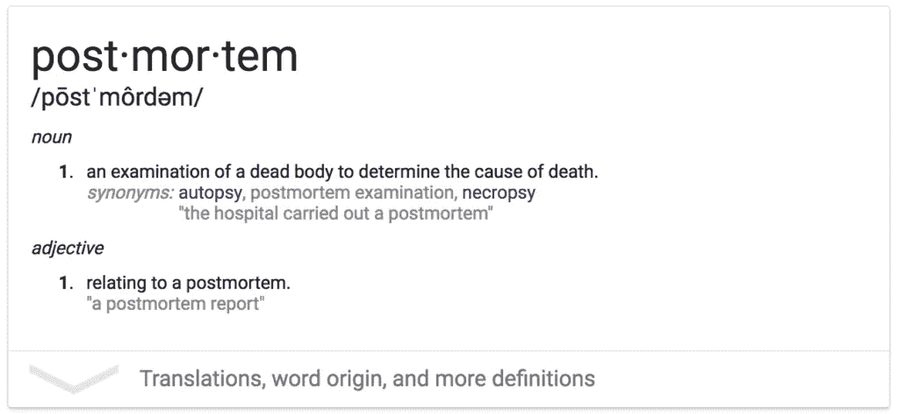

# 启动 1:第 4 周–30 天启动学习

> 原文：<https://medium.com/hackernoon/startup-1-week-4-30-day-startup-learnings-ed72da7958d4>

*注:距离* [*发布还有 4 周*](https://hackernoon.com/tagged/launch) *是一个正在进行的关于在多个创业公司之间建立被动收入的系列——每 4 周就有一个新的* [*创业公司*](https://hackernoon.com/tagged/startup) *。阅读* [*第 4 周发布*](http://4weekstolaunch.com/4-weeks-to-launchlaunch/) *入门。*

这是我刚创业 4 周的第四周， [JFDI。忍者](http://jfdi.ninja/)。我在起床和跑步时遇到了很多困难，包括 JFDI。忍者还有 4 周就要发射了。我学到了很多，包括下次该做什么和不该做什么。感谢所有支持我的人，让我在发布前 4 周坚持下去！

# JFDI。忍者万岁！

JFDI。Ninja 已经启动并顺利运行，几乎不需要维护。我估计一个月会有 1000 个不同的访问者，尽管这个数字可能会更低，这取决于反向链接和搜索引擎优化。

只安装了谷歌分析的一部分，推出后。

上周，我雇佣了一名虚拟助理。所有的新任务都会转发给他，由我来做审核。我们会看到它如何发展，但最终我建立了为我解决问题的企业。如果 JFDI。忍者获得更多的流量，我将设置谷歌的形式直接去懈怠。通过让多个虚拟助手在空闲时间处理任务，我可以快速扩展。

# 上周回顾:斗志昂扬的营销

做你喜欢做的事。一直在努力打败自己去做营销，收效甚微。不要这样！想办法不做你不想做的事。雇人，授权，自动化或解决它。我知道这一点，但有时你必须经历一些痛苦的事情来消化它。

我不喜欢杂乱无章的营销。那我下次该怎么做？找一些更容易和更适合我的工作。这意味着关注可推荐性，或低付费购买成本。可推荐性与产品相关(我喜欢)，付费获取与漏斗优化相关(我也喜欢)。评论、冷消息和 reddit-ing 都是我不喜欢的事情，所以我不会去做。最好的授权只是一种有效的懒惰。

我的一个朋友给我发了一封电子邮件，提出了一些营销建议，我觉得我应该分享一下，因为我发现这些建议很有用:

> *【不要】做 adwords/fb 广告，至少在你了解客户的 LTV 之前，因为你的价格很低。*
> 
> 在企业家 fb 群组上做广告。给主持人发信息，让他们知道这项服务，有时他们会给小组发一条信息。
> 
> reddit 广告可能是一个不错的选择，因为广告非常便宜。
> 
> *-T 狗 McAwesome ←那是真的姓*

# JFDI。忍者死后

*什么是验尸？死后是创业公司流行的一个术语。完成一个项目后，团队讨论哪里出错了(希望不是因为一具尸体)。*

企业正在解决一个“一般性问题”。

*   企业应该为人们解决特定的问题
*   分离出一个特定的痛点(节省手机超期费用)，并以此为目标进行品牌/广告宣传

**没有“投放策略”**

*   为初始用户制定产品“上市”计划。具体到链接，受众规模。可以委托

**无共享性**

*   到处添加“共享”按钮

**添加第 1 天的证明**

*   推荐给产品带来直接的可信度
*   让朋友给你推荐信，这样你在第一天就能拿到，或者伪造直到你拿到真的为止

**24 小时累死人；移动到 48 小时**

*   不要做一个生产压力大的产品。如果是的话，雇个人替你减压。

**从第一天开始使用谷歌表单**

*   电子表格>电子邮件。
*   从第一天开始确定如何开具发票
*   通过贝宝支付账单成了另一件苦差事。确保你知道如何开发票/收款，并让它变得不那么痛苦

# 指标和目标

1.  参见[jfdi . ninja 的指标](https://docs.google.com/spreadsheets/d/17FkveYguYnoPUA5pfPttPnVfwYTx14TLCa_ln6iqXsI/edit#gid=0)
2.  参见[发布 4 周的指标](https://docs.google.com/spreadsheets/d/17FkveYguYnoPUA5pfPttPnVfwYTx14TLCa_ln6iqXsI/edit#gid=552417787)
3.  第 2 周收入:600 万美元

# 与 JFDI 的比赛开始前 4 周。忍者

如果我对自己诚实，JFDI。忍者并不是第一个月的重点——它是在 4 周后发布的。我正在努力为创业建立一个可持续的系统。企业是我的目标，也是我的产品，还有 JFDI。忍者就是这样。我为我在一个月内所做的感到自豪，但我也知道还有很多工作要做。我很高兴能在第一个月学到的基础上，进一步推动创业#2。我对此有很大的计划，并将与两个人合作(其中一个做市场营销！)为之。

# 该问

*   读《4 周发射》希望学到什么？
*   如果你想在你的收件箱里看到这些每周更新，注册邮件列表。承诺，没有垃圾邮件，只有帖子。

> [黑客中午](http://bit.ly/Hackernoon)是黑客如何开始他们的下午。我们是 [@AMI](http://bit.ly/atAMIatAMI) 家庭的一员。我们现在[接受投稿](http://bit.ly/hackernoonsubmission)，并乐意[讨论广告&赞助](mailto:partners@amipublications.com)机会。
> 
> 如果你喜欢这个故事，我们推荐你阅读我们的[最新科技故事](http://bit.ly/hackernoonlatestt)和[趋势科技故事](https://hackernoon.com/trending)。直到下一次，不要把世界的现实想当然！

