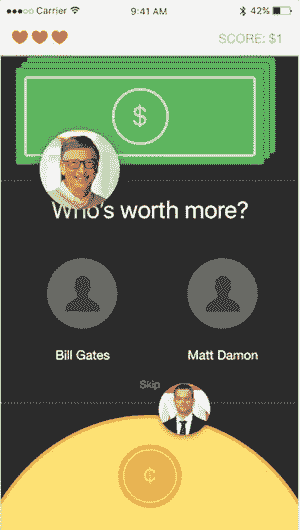

# 创业 2:第 2 周——垃圾想法等于支点

> 原文：<https://medium.com/hackernoon/startup-2-week-2-crap-idea-equals-pivot-699330e9bfde>

*4 周至* [*发布*](https://hackernoon.com/tagged/launch) *是一个正在进行的关于跨多个创业公司建立被动收入的系列——每 4 周一个新的* [*创业公司*](https://hackernoon.com/tagged/startup) *。阅读* [*第 4 周发布*](http://4weekstolaunch.com/4-weeks-to-launchlaunch/) *入门，或* [*订阅每周更新*](http://4weekstolaunch.com/newsletter/) *。*

上周，我很兴奋地开始开发冲动储蓄应用程序。这周我要放弃它。这就是我如何快速测试我的想法，并意识到我需要转向。

什么是支点？旋转是一个术语，用于戏剧性地改变一个想法——180 度。精益创业方法告诉我们，你需要在持续反馈的基础上重新调整你的想法。我得到的反馈说冲动储蓄需要大刀阔斧的改变，所以我改了。

# 审查你的想法

在开始之前，我会和朋友一起审查我的想法。几个星期以来，我一直在收到关于冲动储蓄的反馈，虽然这很有趣，但并不令人兴奋。没有人希望他们的生活中有一个储蓄应用程序，对吗？直到我和安迪([营销大师/天才/忍者](http://andrewtider.com/))通了电话，我才真正意识到我们正面临着一场艰苦的战斗。最大的问题，“为什么会有人下载这个应用？”

*如果没人用，即使你有最好、最酷、最性感的产品也没用*。

不幸的是，人们不会花时间去寻找节省的应用程序。这不是一件事。这个月的目标是建立一个鼓励储蓄的工具。就是这样。因为我们有明确的目标，所以我们能够轻松自如地进行调整。人们常常过于依赖自己的想法。要想成为一家成功的企业，你需要倾听反馈，适应力强。

利用现有信息做出最佳决策，让你更接近目标。不要被沿途的里程标分心。

Early mockup for the app. [Full prototype here](https://xd.adobe.com/view/fdf498b9-01ee-4472-b5c9-d1632c802380/)

# 支点

人们喜欢游戏。人们喜欢名人。我们将两者结合在一起，同时帮助人们做正确的事情，也就是省钱。

游戏是这样的:给你两张名人照片，你选择你认为谁的净资产更高。如果你是正确的，你可以节省 0.25 美元。随着你的进步，游戏变得越来越难，三击不中，你已经筋疲力尽了！

我们改编了 2007 年最热门的社会正义游戏网站[免费大米](http://freerice.com/#/english-vocabulary/1391)的游戏结构。

概念很简单；正确回答一个词汇问题，10 粒大米将捐赠给慈善机构。随着你的进步，问题变得越来越难。做好事让*你感觉很好，*而且这个游戏仍然利用了我们的竞争本性(我从来没有超过我 42 级的高分，但是该死的，如果我尝试的话！).

# 没有用户=失败者

为什么这个想法比支点前好？什么使一个想法变得好？安迪帮助我首先解决了营销问题，这突出了冲动储蓄的弱点。

你的产品没有用户是不行的。句号。如果你花了 15 年时间打造有史以来最好的产品，却没有用户，那么你的产品很烂。如果你有 100，000 个用户，但你的应用看起来像狗屎——猜猜会发生什么？-你太棒了，我想见你。NBC 的鲨鱼队也会同意我的观点。销售和用户征服一切。

我们的应用程序运行的最重要的一步是让尽可能多的人使用它。为此，它需要有趣。人们想要的东西。冲动储蓄应用程序本身并不存在。

通过回答这个假设的情况来测试你的想法:如果你在网上偶然发现了你的想法，你会足够兴奋吗？如果不是，那么你的想法可能需要一个新的旋转。

# 思考上限时间

我们头脑风暴了一个多小时。是什么让一个财经 app 变得有趣？一些想法是引入禁忌话题，偷窥，免费/中奖，FOMO，社交网络。这些比喻可以让产品更吸引消费者。有没有通过向你的储蓄账户转账来支付应用内购买的费用？储蓄彩票怎么样？用自己的积蓄和别人对赌合法吗？如果你能偷偷看看你的朋友挣多少钱会怎么样？

现在事情变得有趣了。每个想法都有一个钩子——前卫，或者至少是独特的。这种优势正是我们一直在寻找的。然后，我们努力快速地将它结合在一起——同样，4 周的时间不会给复杂性留下空间！

猜测名人的净资产很有趣。给自己高分是古怪的。结束了。

## 后续步骤

我从组装模型开始。你可以在这里看到进展中的 [(WIP)原型](https://xd.adobe.com/view/fdf498b9-01ee-4472-b5c9-d1632c802380/)。当我更新设计时，链接会自动更新。接下来是最终确定游戏规则，然后构建后端代码。依然看好 3 周后上线！

# 问题

*   你想让我写什么？在 elijah@4weekstolaunch.com[发表评论或给我发邮件](mailto:elijah@4weekstolaunch.com)
*   如果你想在收件箱里看到这些每周更新，注册邮件列表。承诺，没有垃圾邮件，只有帖子。

> [黑客中午](http://bit.ly/Hackernoon)是黑客如何开始他们的下午。我们是 [@AMI](http://bit.ly/atAMIatAMI) 家庭的一员。我们现在[接受投稿](http://bit.ly/hackernoonsubmission)并乐意[讨论广告&赞助](mailto:partners@amipublications.com)机会。
> 
> 如果你喜欢这个故事，我们推荐你阅读我们的[最新科技故事](http://bit.ly/hackernoonlatestt)和[趋势科技故事](https://hackernoon.com/trending)。直到下一次，不要把世界的现实想当然！

