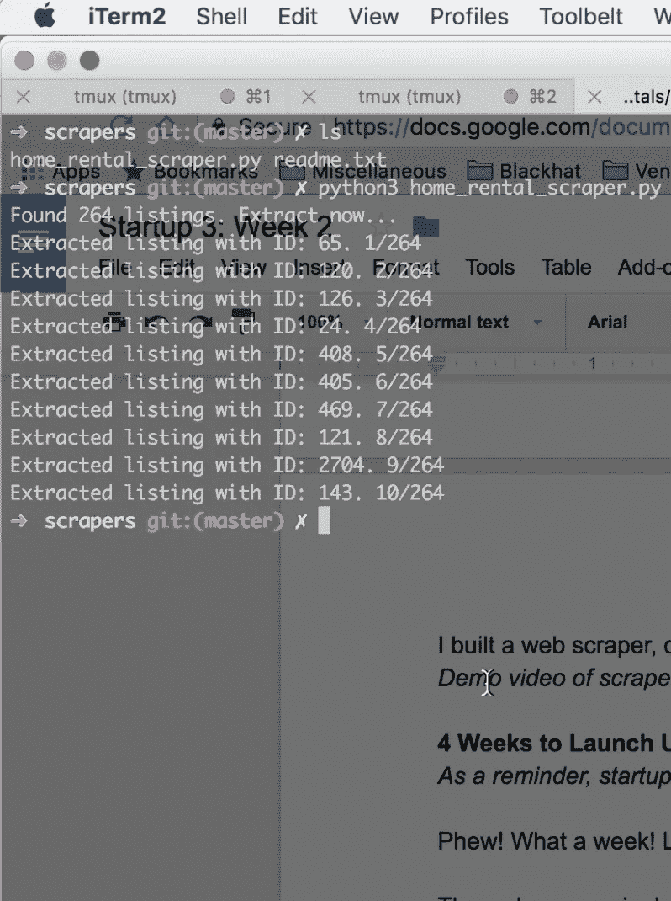
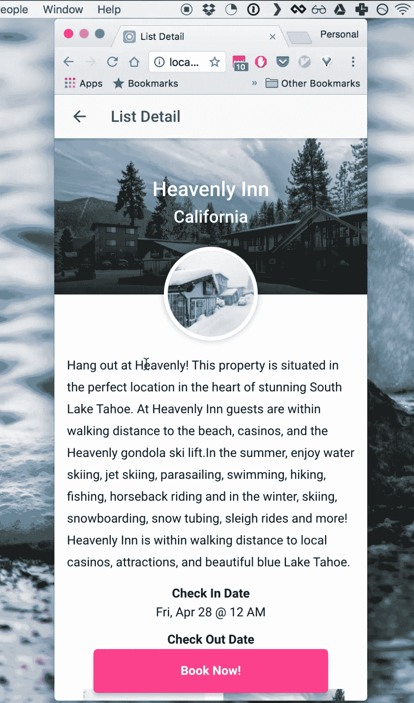

# 启动 3:第 3 周–闪电战编程

> 原文：<https://medium.com/hackernoon/startup-3-week-3-blitzkrieg-programming-99be42f80fc1>

## 我上周做了一个 web scraper，数据库，半个手机 app。以下是方法。

*4 周启动是一个正在进行的关于在多个创业公司中建立被动收入的系列——每 4 周就有一个新的* [*创业公司*](https://hackernoon.com/tagged/startup) *。阅读* [*第 4 周发布*](http://4weekstolaunch.com/4-weeks-to-launchlaunch/) *入门，或* [*订阅每周更新*](http://4weekstolaunch.com/newsletter/) *。创业#3 是酒店今晚为为期一周的假期出租。*

唷！多好的一周啊！很多更新。

刮网器完成了。我学会了如何使用一个刮擦工具(和新的[编程](https://hackernoon.com/tagged/programming)语言)来完成它，但是我对结果很满意。它抓取网站，提取所有列表位置、名称、描述和图像，并以可读格式保存它们。

我学的做这个的语言是 python。我用 python 是因为根据谷歌，它是抓取网站的最佳语言。去想想。BeautifulSoup 也是最好的刮痧库，所以也学会了。

我跟随 [dataquest.io](http://dataquest.io) 的[这个神奇的教程](https://www.dataquest.io/blog/web-scraping-tutorial-python/)。即使你没有编程经验，你也可以这样做，尽管你仍然需要先安装 python。首先，我为每个列表的所有 URL 抓取了 1 个页面。然后，scraper 遍历每个列表，并提取我需要的信息。这个草图花了我大约 3 个小时来完成，但是之后我需要把我的内容格式化成 JSON 格式，去掉多余的空格，空白图片等等。我花了两个小时清理数据。这是成品。

> [*注册邮件列表*](http://4weekstolaunch.com/newsletter/) *如果你想把这些每周更新收进你的收件箱。承诺，没有垃圾邮件，只有帖子。*

现在是时候构建我的第一个移动应用程序了。我以前接触过 Objective-C，但是构建一个本地应用程序通常非常耗时，而且不是我的强项。幸运的是，有一些框架允许你进行网络开发，并将其编译到原生 Android 和 iOS 应用程序中。节省大量时间！

Ionic 是最流行的框架之一。你建立网页(HTML，CSS 和 JS)，然后点击一个按钮，把它变成一个移动应用程序。如果你有基本的 web 开发技能，你可能会知道如何构建一个应用程序。

也就是说，我花了很多时间来使用这个框架。要学的东西很多。我花了几个小时阅读和观看由 [Traversy Media](https://www.youtube.com/user/TechGuyWeb) ( [60 分钟角度介绍](https://www.youtube.com/watch?v=-zW1zHqsdyc)， [60 分钟离子介绍](https://www.youtube.com/watch?v=ilM8YorL_jI))制作的令人惊叹的 YouTubes，并完成了其中的 2.5 页。大概 5 个小时的学习，10 个小时的构建，3 个小时把我的 JSON 数据连接到我的应用程序。

如果你正在学习一个新工具，不要太关注如何正确使用这个工具。我浪费时间试图学习如何用“离子方式”做事，而不是仅仅写 Javascript 和 CSS 来做我需要的任何事情。应用程序的其余部分应该进行得更快，而不是专注于学习，而是专注于做。

我总是先从最难的事情开始，所以剩下的工作应该不会像我到目前为止所做的那样糟糕。首先，我将启动功能非常少的应用程序。它将显示度假屋，并允许您请求预订。理想情况下，我们有内置付款，但我现在跳过这一点。我可以随时在贝宝上给人们开账单，以后再建。

我预计还需要 15 个小时来构建页面，并使一切都很漂亮。那么是时候出货了！Nick 一直致力于后端基础设施，但是见鬼，我们可能只是使用 Dropbox 作为我们的主机，每天手动运行脚本来更新数据。MVP 吧？；)

## **关键要点:**

*   利用你所知道的“正确的做事方式”
*   如果你能跳过这些步骤，那就跳过。在人们喜欢你的作品之前，什么都不重要。您可以随时返回并添加更多功能。
*   如果你不是技术人员，那就不要试图成为技术人员。
*   如果你想要一款手机应用，那就用 Ionic 或 RubyMotion。它更便宜，更快，你可以同时获得 iOS 和 Android。
*   如果不需要，就不要浪费时间建设基础设施。你可以手动更新你的数据库，并免费存储在 Dropbox 上。变得好斗。

感谢阅读，

以利亚

**PS。向所有支持我的妈妈大声呼喊。我写完文章后，她每周都会发邮件给我，告诉我她的想法。**

**PPS。**说真的，[报名邮件列表](http://4weekstolaunch.com/newsletter/)。

[铲运机演示视频](https://www.youtube.com/watch?v=9gDdfZbGj0I)

[手机 app 进行中](https://www.youtube.com/watch?v=ut9KqzhDkBU)(如下图)

> [黑客中午](http://bit.ly/Hackernoon)是黑客如何开始他们的下午。我们是 [@AMI](http://bit.ly/atAMIatAMI) 家庭的一员。我们现在[接受投稿](http://bit.ly/hackernoonsubmission)并乐意[讨论广告&赞助](mailto:partners@amipublications.com)机会。
> 
> 如果你喜欢这个故事，我们推荐你阅读我们的[最新科技故事](http://bit.ly/hackernoonlatestt)和[趋势科技故事](https://hackernoon.com/trending)。直到下一次，不要把世界的现实想当然！

