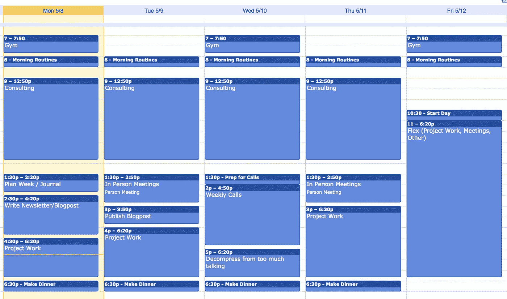

# 创业三:第四周——App 黑客攻击；生活黑客

> 原文：<https://medium.com/hackernoon/startup-3-week-4-app-hacking-life-hacking-9169427ba84a>

## 作为千禧一代，我如何变得富有成效。

*4 周至* [*发布*](https://hackernoon.com/tagged/launch) *是一个正在进行的关于跨多个创业公司建立被动收入的系列——每 4 周一个新的* [*创业公司*](https://hackernoon.com/tagged/startup) *。阅读* [*第 4 周发布*](http://4weekstolaunch.com/4-weeks-to-launchlaunch/) *入门，或* [*订阅每周更新*](http://4weekstolaunch.com/newsletter/) *。创业#3 是酒店今晚为为期一周的假期出租。*

# TL；速度三角形定位法(dead reckoning)

**关键更新**

*   购买域名，命名为应用程序，写副本
*   在 Azure 上构建启动#3 数据库/认证
*   更新了[博客设计](http://4weekstolaunch.com/) & [帖子模板](https://docs.google.com/document/d/1xYT6pmmAX_0Km0CFoFRZk-3T1wIpwb3J8V1gmrat9s8/edit#heading=h.l4tgd3gpwv73)

**主要学习内容**

*   提高效率:计划好你每周最重要的 5 件事，每天做 1 件。(阅读下文)
*   提高专注度:划分你一周的时间，在正确的时间专注于正确的事情。(阅读下文)
*   在你的“待办事项”中要具体。应该能在 25 分钟内完成。

# 上礼拜

不幸的是，我上周没有完成这个应用程序。幸运的是，我制定了规则，并开始打破它们。我将进入第五周来完成第三次创业。以下是上周成绩的概要:

1.  挑选一个名字(极端假期交易)
2.  购买了一个域名(extremevacationdeals.com)
3.  [为 app](https://docs.google.com/document/d/19ACLqnNxpi1md1gBu9167mLD60W9KCSdl5LQkxG-Y-w/edit#) 写了文案
4.  为应用程序构建基本页面
5.  设置数据库和登录验证
6.  更新[博客设计](http://4weekstolaunch.com/) & [帖子模板](https://docs.google.com/document/d/1xYT6pmmAX_0Km0CFoFRZk-3T1wIpwb3J8V1gmrat9s8/edit#heading=h.l4tgd3gpwv73)

本周我们将连接后端(存储/数据库)和前端(设计/界面)。我们将为 Play Store 和 App Store 准备提交流程，希望在本周晚些时候提交。

我还带了一个朋友来帮忙营销。我们正在为 4WTL 和每个月的项目制定营销策略。现在我们仍在计划阶段，但更新即将到来！以下是完成 3 号创业所需的其他核心要素。

## 极限假期交易清单:

1.  将前端连接到数据库
2.  在应用程序中建立“确认预订”视图
3.  将副本添加到应用程序
4.  将应用提交到应用商店
5.  设置域
6.  设置域的帮助电子邮件地址

> 如果你想在收件箱里看到这些每周更新，注册邮件列表。承诺，没有垃圾邮件，只有帖子。

# 周计划和时间段

每周我都努力比前一周更有效率。尽管如此，我有时还是不知道什么时候该做什么。总是有无数的事情要做，但是知道*从哪里开始*会觉得不可能。我做了两件简单的事情来帮助麻痹:

**计划你的一周。我从一月份开始养成这个习惯，它帮助我变得非常有效。每周一写下你需要做的每件事。选择 5 个真正重要的待办事项。*只挑 5 个。我关注与长期目标相关的、对我个人来说很重要的或给我带来很多压力的待办事项。区分任务 1 到 5 的优先级。现在，每个任务需要在相应的一天完成:#1 星期一，#2 星期二，等等。确保每个任务都是一口大小的！这应该可以在 [25 分钟](https://en.wikipedia.org/wiki/Pomodoro_Technique)或更短时间内完成。***

**给你的日历划分时间段。规划好你的一周，这样你就知道在任何给定的时间该做什么。你可以用谷歌文档、电子表格、日历、纸张来做这件事。我们的目标是规划出何时做什么，并集中精力。你的一周蓝图有助于让我头脑中不停的列清单安静下来，并迫使我把事情做完！你可以在这里看到我的[时间锁定日历](https://calendar.google.com/calendar/embed?src=mi4vv4fv6oq6bkrhjaj849vd1g%40group.calendar.google.com&ctz=America/New_York&mode=week)。如果你喜欢这种东西，我需要测试用户！看我的 PS 笔记。**

My timeblocked calendar

> 什么会使这些更新更有趣？通过[邮件](mailto:elijah@4weekstolaunch.com)，回复/评论，或者[电话](https://calendly.com/elijahmurray-1)让我知道。

**PS。**说真的，[报名邮件列表](http://4weekstolaunch.com/newsletter/)。