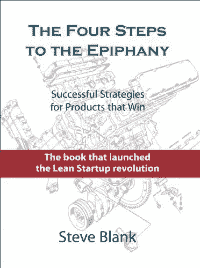
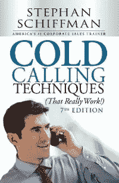
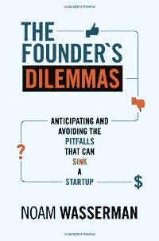
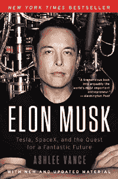
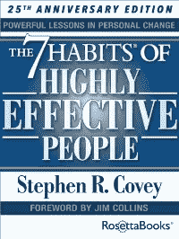
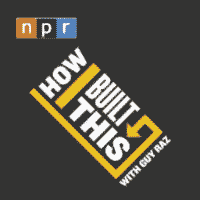

# 创业书籍和播客:充分利用更长的通勤时间

> 原文：<https://medium.com/hackernoon/startup-books-and-podcasts-making-the-most-of-a-longer-commute-4321fdd96c0f>

*(image by* [*Viktor Forgacs*](https://unsplash.com/photos/PNv0pESh9Uk?utm_source=unsplash&utm_medium=referral&utm_content=creditCopyText) *via* [*Unsplash*](http://unsplash.com/?utm_campaign=photographer-credit)*)*

当我搬到纽约时，我 15 分钟的自行车通勤变成了 30 分钟的地铁车程。虽然这种改变起初似乎是消极的，但我意识到这是一个将时间投入阅读和学习的机会，否则我不会花时间去做这些。以下是在纽约地铁里让我开心的书籍和播客。我喜欢创业和个人发展，所以这就是这些书和播客的内容。

# 书

最让我感兴趣的书是那些让我反思自己生活的书。我很幸运，因为今年我读过的所有书籍都提供了关于如何改善我或我的创业公司的有用见解。

旁注:我在 Kindle 上阅读我所有的书，我很高兴把以下任何一本书借给你。只要给我发电子邮件或者发推特就行了！

# [顿悟的四个步骤](https://www.amazon.com/gp/product/0989200507/ref=as_li_tl?ie=UTF8&tag=golmansax-20&camp=1789&creative=9325&linkCode=as2&creativeASIN=0989200507&linkId=0f09f8a1e3af80ffffdb6382b3c6d599)

这本书是我之前工作的一家初创公司的创始人推荐给我的。这本书的重点是客户开发过程，因为如果你不了解你的客户，就很难知道你是否在正确的商业道路上。我认为这本书很好地提醒了快速迭代和客户反馈的价值。

# [冷通话技巧(真的管用！)](https://www.amazon.com/gp/product/1440572178/ref=as_li_tl?ie=UTF8&tag=golmansax-20&camp=1789&creative=9325&linkCode=as2&creativeASIN=1440572178&linkId=2e26236756b4786173e942301eb118d6)

这本书对我来说很棒，因为当我开始为我的[创业](https://www.boostmyschool.com/)打电话给学校时，我实际上没有打电话的经验。由于阅读了这本书，我建立了一些方法来帮助我衡量我的召唤是否有效。我开始跟踪我打的每一个电话，这有助于我看到在销售漏斗中我正在失去潜在客户。我对自己的职业信心大增，我的大部分销售都来自于电话推销！

# [创始人的困境:预测和避免可能让初创公司陷入困境的陷阱](https://www.amazon.com/gp/product/0691158304/ref=as_li_tl?ie=UTF8&tag=golmansax-20&camp=1789&creative=9325&linkCode=as2&creativeASIN=0691158304&linkId=7057ba45288a53477b2598ef7b8309ef)

一位创始人朋友向我推荐了这本书，当时我告诉他，我正在艰难地决定是否要成为一名单独的创始人，还是将我的注意力转向寻找一名联合创始人。这本书在利用真实案例研究解释初创公司的旅程中可能出现的困境(是否要创办公司，如何分割股权，是否要筹集资金等)方面做得非常好。).

# [埃隆·马斯克:特斯拉、SpaceX 和对美好未来的追求](https://www.amazon.com/gp/product/006230125X/ref=as_li_tl?ie=UTF8&tag=golmansax-20&camp=1789&creative=9325&linkCode=as2&creativeASIN=006230125X&linkId=137179dc0f1d746aa05d5a8dcd959eba)

我喜欢阅读那些对社会产生巨大影响的人。了解这些人如何看待这个世界以及他们如何改变这个世界是很有趣的。这与埃隆马斯克的案例尤其相关，因为他通过特斯拉和 SpaceX 帮助变革了多个行业。我从这本书最大的收获是，弄清楚你认为世界应该如何改变是多么重要。一旦你明白了这一点，就去改变它吧！

# [高效人士的 7 个习惯:个人改变的有力课程](https://www.amazon.com/gp/product/B00GOZV3TM/ref=as_li_tl?ie=UTF8&tag=golmansax-20&camp=1789&creative=9325&linkCode=as2&creativeASIN=B00GOZV3TM&linkId=c273a8024af8f6d762ee46833d350359)

这本书已经在我的雷达上有一段时间了，因为它是一本强烈推荐的自助书籍。我同意这本书的主要原则(例如，弄清楚什么是重要的，区分优先次序，思考双赢),作者阐述了如何使用这些原则来改善你的个人和职业生活，这很好。

# 播客

播客对我来说是一种很好的方式，可以让我放松心情，沉浸在故事中。这些播客是关于创业公司的；听到创始人分享他们是如何克服困难获得成功的，这很鼓舞人心，当我对自己的创业感到沮丧时，这让我继续前进。

# [我如何建造这个](https://www.npr.org/podcasts/510313/how-i-built-this)

我喜欢这个播客，因为它的格式非常适合我的地铁通勤。每一集都是独立的，而且刚好在我的通勤时间内(30-40 分钟)。每集都有不同的创始人，讲述他或她如何在早期奋斗中坚持下来，建立一个成功的公司。

如果你正在寻找一个地方开始，我最喜欢的剧集是[斯潘克斯(萨拉·布雷克里)](https://one.npr.org/?sharedMediaId=493169696:493311384)， [Airbnb(乔·格比亚)](https://one.npr.org/?sharedMediaId=497820565:497945288)，和[尊巴(贝托·佩雷兹&阿尔伯托·帕尔曼)](https://one.npr.org/?sharedMediaId=506456213:506573292)。

# [启动](https://gimletmedia.com/startup/)

我已经看过了《创业》第 1-4 季，我强烈推荐第 1 季给任何有抱负的创始人。第一季从创始人亚历克斯·布隆伯格的角度详细描述了 Gimlet Media 的形成。这些剧集不仅提供了对风险投资、招聘和寻找联合创始人的深入了解，还提供了经营初创公司的压力如何影响你个人生活的第一手资料。

感谢你阅读我如何让我的通勤变得更有效率。比如我收藏的书和播客？通过[电子邮件](https://golmansax.com/cdn-cgi/l/email-protection#e38b8c8f8e828da3848c8f8e828d90829bcd808c8e)或[推特](https://twitter.com/golmansax)让我知道，或者随意分享你的最爱！

*原载于 2017 年 11 月 29 日*[*golmansax.com*](https://golmansax.com/blog/posts/2017/11/29/startup-books-and-podcasts-making-the-most-of-a-longer-commute/)*。*