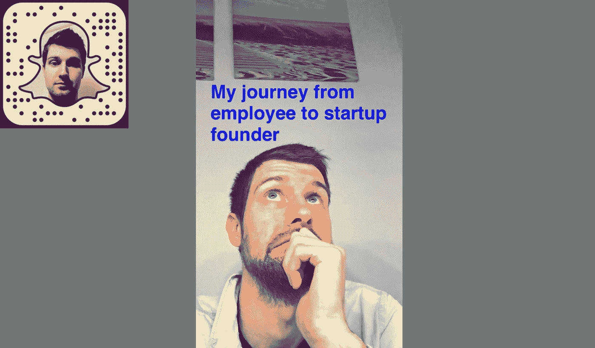

# 仅用 4500 美元成立一年的初创公司

> 原文：<https://medium.com/hackernoon/startup-born-after-a-year-on-just-4-500-56aef532c967>

## 我从全职员工到创业创始人的旅程

*从哪里开始..*

> 请帮助我指出我们一路走来所犯的错误😅
> 
> 只要你从事物中学习对吗？..

让我们倒回去——现在是 2015 年【2015 月*10 月*，夏天就要过去了，我的项目 Webfolio 做得很好，它进入了产品搜索，用户数量也在增加，一切都很好，但它是一个免费的产品。

随着它继续“成长”，在和我的联合创始人(和[未婚妻](https://twitter.com/creeshla))穿过爱丁堡的一场雷雨，同时被[疯狂的司机](https://startupsventurecapital.com/the-product-hunt-effect-one-week-on-356da2a0ef2d#.c9syhug1x)溅了一身水之后，我们决定全职投入到这个*创业*的事情中。

当时，我们为坎昆计划了一个美好的假期，但我们不得不无情地放弃这个假期，以便一起废弃尽可能多的“跑道”🤔尽可能——加上返还的固定存款和最后的工资，我们只有大约 4500 美元可以维持生活。

*(10 月—12 月)*因此，我们最初的计划是继续扩大网络投资组合，并寻求通过付费账户和招聘板块来实现盈利——这两种方式都不太奏效，原因有几个:

**1-保持力**

现在回想起来似乎很简单。我们过于关注用户注册，但没有详细检查在网站上花费的时间以及最终制作了多少网页组合。

我们本来可以做很多事情来改善这一点，但如果我们再做一次，我会剥离这些功能，甚至只是作为 chrome 扩展的第一次发布，提供更容易的共享选项，以建立在现有的用户习惯上。

**2 —招聘机构**

我们的第二个痛点来自 [Webfolio Connect](https://connect.webfol.io) 我们的服务是将开发者(通过 Github 的 API 找到)与招聘人员联系起来，数据集太小，无法与招聘人员合作。如果我们再做一次，我会专注于成为一个公司可以直接用来搜索和雇佣开发者的服务。

***好的*** *让我们换个语气*，在与用户(开发人员)和潜在客户(招聘人员)交流时，这都是一个很好的学习曲线。Webfolio Connect 的核心是一个电子邮件发送系统，我认为它仍然有潜力撼动电子邮件。*改天再更！*

让我们快进到 2016 年*开始的时候*现在&我强烈地记得开始使用 [Snapchat](https://hackernoon.com/tagged/snapchat) 并且主要在故事中使用它。大约在这个时候，许多频道开始慢慢出现，如[创业电视](https://www.producthunt.com/posts/startup-tv)以及像[增长](https://medium.com/u/946f534320f7#443b370765e7)和成为 Snapchat 上的[内容创作者](/@russellbarnard/swift-development-tips-on-snapchat-weekly-9f3ecd66b619#.1n8ubboqr)之后，我们知道完全专注于 Snappd 是正确的选择！我们照做了。

快进到现在和 TADA🎉我们刚刚开始测试(在 iOS 上📱)—如果你想作为创作者或观众参与其中[在这里添加你的电子邮件地址](https://snappd.tech)，我会与你联系！

为了完成这个故事，答案是**是的**资金现在已经完全用完了，但是通过 Snappd，我们设法筹集到了……..*(未完待续！)*

**你是讲故事的！我正在开始一个播客，探索是什么造就了一个引人入胜的故事。你想参与进来吗？联系(Twitter @russellbarnard 或 Russell @ snapdd . tech)——[点击此处了解更多信息](/@russellbarnard/what-makes-an-engaging-story-27f8d7b4907a#.6tool9lyh)**

## 我是 Snappd 的联合创始人，我们正在创建即将进入 iOS 的垂直视频之家

> [黑客中午](http://bit.ly/Hackernoon)是黑客如何开始他们的下午。我们是 T21 家庭的一员。我们现在[接受投稿](http://bit.ly/hackernoonsubmission)并乐意[讨论广告&赞助](mailto:partners@amipublications.com)机会。
> 
> 如果你喜欢这个故事，我们推荐你阅读我们的[最新科技故事](http://bit.ly/hackernoonlatestt)和[趋势科技故事](https://hackernoon.com/trending)。直到下一次，不要把世界的现实想当然！

