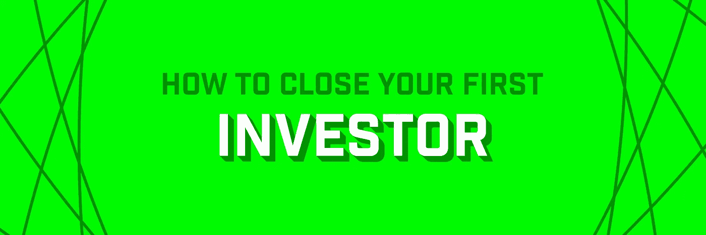
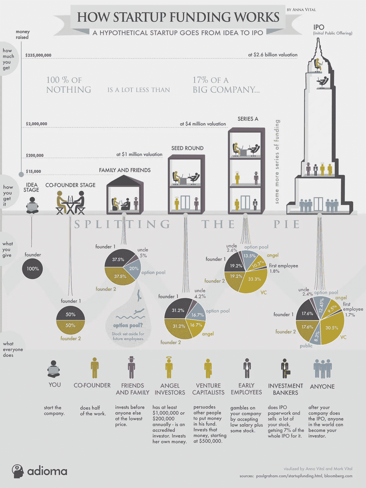

# 创业备忘单:如何关闭你的第一个投资者

> 原文：<https://medium.com/hackernoon/startup-cheat-sheet-how-to-close-your-first-investor-a95f936e8b85>

## 所以，你需要钱。

面对现实吧，创业世界迷恋融资。投球已经成为一种娱乐形式。科技媒体大肆宣传融资公告。

> 但是，尽管有这么多的议论，你还是应该认真思考一下，筹集资金是否是正确的举措。对于很多公司来说，并不是。

融资会占用你大量的时间，让你陷入一个循环，在这个循环中，你必须继续筹集越来越多的资金才能生存，并稀释你作为创始人的所有权和控制权。**如果你能以任何其他方式建立一个有利可图的企业，那就去做吧。**

但如果你真的打算建立一家高增长的初创公司，应对一个数十亿美元的市场，那么与正确的投资者合作是关键。伟大的投资者不仅仅提供资本，他们还贡献了专业知识、信誉和人脉。

在完成第一笔投资之前，你需要了解投资者在每一轮融资中所期望的里程碑。你需要了解各种投资工具的利弊以及何时使用它们。你需要一个你将要谈判的术语的工作词汇表。

这是你的小抄。

# 投资回合

应该筹集多少资金，何时筹集？虽然定义是可变的，但早期投资通常分为三个阶段:种子前期、种子期和首轮融资。以下是每个阶段的粗略估计:

*   **预播种。**您已经创建了一个原型，现在正在构建您的最小可行产品(MVP ),但希望以较低的估值(100 万美元到 250 万美元)筹集 5 万美元到 50 万美元，以便让您有长达 12 个月的时间推出您的 MVP，并测试产品与市场的匹配度。
*   **种子。**你的产品上市了，你每月创造超过 5 万美元的收入，你想为 18-24 个月的 runway 筹集 75 万到 300 万美元(估值为 300 万到 1000 万美元),以增加一些关键员工，真正适应产品市场，并找出如何实现持续的两位数月环比增长。
*   **A 系列**。你每月创造 10 万到 20 万美元的收入，并以每月 10%到 30%的速度增长。恭喜你，你现在在 A 系列领域。在这个阶段，你可能已经准备好融资 400 万到 1500 万美元(估值在 1500 万到 5000 万美元之间)。

这些仅仅是粗略的经验法则，而且它们每年都有显著的变化。根据 Jason Calacanis 的观点，定义没有每一轮的标题目标重要，标题目标可以概括为最低可行产品(第一轮)、产品市场适合度(第二轮)和可持续增长(第三轮)。

由于这篇文章是关于关闭你的第一个投资者，值得强调的是天使(更不用说风投)不再投资商业计划(除非你是埃隆·马斯克)。在你花费时间和精力试图筹集种子前期资金之前，你至少需要一个原型，最好是一个最基本的可行产品和一些初始客户。

[Visualization by Anna Vital](https://blog.adioma.com/how-funding-works-splitting-equity-infographic/).

# 投资工具

记住这些融资里程碑，让我们调查一下您可以使用的投资工具，并考虑何时使用每种工具。(不用说，我不是律师，这也不是法律建议——这只是我作为创始人之一的笔记。)

## 股权回合

股权融资或“定价融资”是指你和投资者就公司估值达成一致，并向投资者发行新股。这通常涉及谈判附加条款，如清算优先权、反稀释权、董事会席位等。这是三种方法中最复杂的(因此也是最耗时和最昂贵的)，因此通常只用于首轮融资，而且肯定会涉及律师。

以下是一些非常基本的术语，尽管还有许多其他术语:

*   **圆形大小。**你在一轮游戏中筹集的资金总额。例如，如果你试图筹集 100 万美元的种子资金，那么这一轮的规模就是 100 万美元。
*   **估价。**贵公司在某一时刻的约定价值。这是创始人和投资者谈判最多的数字，因为它决定了投资者的所有权和创始人的稀释。
*   **稀释。当额外的股票发行给新股东时，现有股东最终拥有的公司股份会比以前少。这叫做稀释。例如，如果你以 500 万美元的估值融资 100 万美元(从而给新投资者价值 100 万美元的股票)，那么新投资者将拥有该公司 16.7%的股份(100 万美元/600 万美元)，将现有所有者稀释 16.7%。**

简而言之，股权融资通常是为首轮融资准备的。

但是它们变得越来越容易，越来越便宜。这里有一篇 Yokum 的博文[比较了几套标准化的股权种子轮文档](http://www.startupcompanylawyer.com/2010/03/14/how-do-the-sample-series-seed-financing-documents-differ-from-typical-series-a-financing-documents/)。

## 兑现券

可转换债券规避了股权融资的大部分复杂性，尽管它也引入了一些自身的复杂性。可转换票据是一种债务工具，通常在随后的股权融资中转换为股权。这使得它成为种子前和种子投资的良好候选，这些投资旨在在首轮融资中转化为股权。

可转换票据通常不设定明确的估值，而是同时设定估值上限和贴现率(尽管它可能只有一个或另一个),这决定了当票据转换为股权时，投资者可以获得多少股份。

然而，由于可转换票据本质上是一种贷款，它还包括到期日(必须偿还的时间)和利率。这就是可转换债券的第 22 个难题:如果到期日在转换事件发生之前，这可能会导致创始人/投资者的冲突，因为创业公司当时有义务偿还投资者。

以下是您需要了解的术语:

*   **到期日。**可转换票据到期且公司必须偿还贷款的日期。两年很常见。
*   **利率。作为一种债务工具，可转换票据通常会产生利息。5%到 7%是常见的。**
*   **帽子。**投资者资本转换为股权的最大估值。这是谈判最多的条款。
*   **打折。**如果后续股权轮次的估值低于规定的上限，则适用贴现率。请参见下面的示例。

虽然股权融资曾经是投资的唯一方式，但可转换债券的相对便利性导致它在大约 10 年前被广泛用于早期创业投资。但是你必须小心到期日不会回来咬你。

关于股权与可转换票据之争的进一步讨论，请参见 [Jason Lemkin](https://www.saastr.com/an-insiders-guide-to-convertible-debt-vs-equity/) 和 [Mark Suster](https://bothsidesofthetable.com/is-convertible-debt-preferable-to-equity-1103ab32d091) 的文章。

## 安全的

如果有一种投资工具可以提供可转换票据的简单性，而没有到期日风险和贷款不是贷款的尴尬，那不是很好吗？

有:它被称为一个安全的，或未来股权的简单协议。它像可转换票据一样有上限和折扣，但它不是贷款，也没有到期日或利率。与投资者谈判的条件只有两个:

*   **Cap。**投资者资本转换为股权的最大估值。(它的工作原理和可兑换纸币上的瓶盖一模一样。)
*   **折扣。**如果后续股权轮次的估值低于规定的上限，则适用贴现率。通常在 20%左右。(还是那句话，就像可兑换纸币一样。)

自 2013 年由 YCombinator 创立以来，SAFE 迅速成为硅谷早期融资的首选工具，在美国也越来越流行(尽管它在美国以外仍是一个新事物)。我建议你使用它，除非你有充分的理由不要这么做。

关于保险箱的更多信息，请参见:[https://www.ycombinator.com/documents/](https://www.ycombinator.com/documents/)

# 了解上限和折扣

在上面谈到可兑换纸币和外管局时，我们简要地定义了上限和折扣，但它们可能需要一些努力才能让你的大脑明白。这里有一个例子可以更好地理解上限和折扣之间的相互作用。

假设有人向你的初创公司投资了 100 万美元，购买了一张上限为 500 万美元、折价 20%的可转换债券。这是它在上下两种情况下的表现。

*   **上调:**如果你后来以 1000 万美元的估值(远高于上限)进行股权融资，票据持有人的 100 万美元投资将转换为 500 万美元的估值，因为票据的上限是 500 万美元。
*   **下轮:**另一方面，如果你只是以 400 万美元的估值(即低于上限)进行股权融资，那么 20%的贴现率就会生效，导致票据持有人的 100 万美元投资转换为 320 万美元的估值(例如 400 万美元* 0.8)。

# 离别提示

无论你选择哪种投资工具来关闭你的第一个投资者，重要的是遵守规则，提交正确的表格，并保持你的事务有序。这里有三件重要的事情要记住。

1.  你只能从合格的投资者那里募集资金。虽然偶尔会有合法的变通办法，但初创公司通常只能接受合格投资者的投资——个人净资产(不包括主要住所)超过 100 万美元，或年收入超过 20 万美元(或与配偶合计超过 30 万美元)。这是为了保护那些在财务上不老练的人不进行风险投资。查看库利的这篇文章了解更多信息。
2.  你必须在筹集资金时向美国证券交易委员会提交一份 [**表格 D**](http://www.startuplawblog.com/2013/12/20/beware-forms-d-are-public/) **。**这不仅适用于股权融资，也适用于任何形式的投资，包括上述可转换票据和外管局工具。向证券交易委员会提交表格的截止日期是首次投资后的 15 天。这是一份你或你的律师使用 SEC 的“EDGAR”系统在线提交的 PDF 表格，你必须首先注册获得用户名和密码(他们分别称之为 CIK 号码和访问代码)。有关更多信息，请参见美国证券交易委员会的 D 表格归档指南。如有疑问，请寻求法律建议。
3.  **有意识地管理你的工资表。**是“资本总额表”的简称，你的[资本总额表](https://www.cooleygo.com/what-is-a-cap-table/)是你公司里谁拥有什么的概述。当你发行创始人股票、接受投资、向员工授予期权时，拥有单一的信息来源对于你做出明智的业务决策至关重要。这可以是一个电子表格(这里有一个来自 Venture Hacks 的[模板](http://venturehacks.wpengine.com/wp-content/uploads/2009/10/Venture-Hacks-Cap-Table.xls)和[关于如何使用它的说明](http://venturehacks.com/articles/cap-table))，或者你可以使用一个限额表管理系统。我用 [eShares](https://esharesinc.com) 推荐； [Capshare](https://www.capshare.com) 、 [Captable.io](https://captable.io) 和 [Gust](https://equity.gust.com) 也提供 Captable 解决方案。保持条理，但不要把事情搞得过于复杂。

# 去抓住他们

既然你已经知道了投资者在 pre-seed、seed 和 A 轮投资阶段的期望，并且熟悉了常见的投资工具及其关键术语，你就能够在完成第一笔投资时把握住自己的投资。根据我的经验，我的早期支持者是我有幸共事过的人中最支持我的。我希望你也能这么说。

祝你好运！

## 其他创业备忘单

这是我的[创业备忘单](/startup-grind/the-startup-cheat-sheet-ca7fca624da5)系列的第二篇文章。以下是其他内容:

1.  [如何组建你的公司](/@tylertate/startup-cheat-sheet-how-to-incorporate-your-company-c85384e8f7a0)
2.  [如何关闭你的第一个投资人](https://hackernoon.com/startup-cheat-sheet-how-to-close-your-first-investor-a95f936e8b85)
3.  [如何创建成功的推介资料](https://hackernoon.com/startup-cheat-sheet-how-to-create-a-winning-pitch-deck-c8037bcacc23)
4.  如何雇佣员工和顾问
5.  如何进入加速器
6.  如何开展众筹活动
7.  如何跟踪正确的指标
8.  如何进行队列分析
9.  如何做集客营销
10.  如何做外向营销