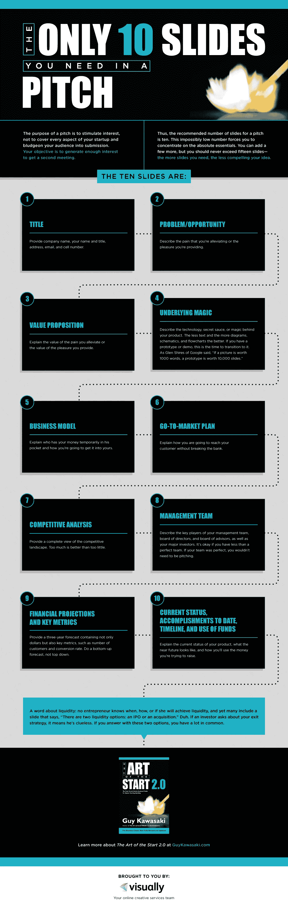

# 创业备忘单:如何创建成功的推介材料

> 原文：<https://medium.com/hackernoon/startup-cheat-sheet-how-to-create-a-winning-pitch-deck-c8037bcacc23>

## 所以，你想用一个惊人的推销让投资者惊叹。

您可能很想直接跳到 Keynote 或 Powerpoint 中开始。不要这样做！以下是成功推销的秘诀:

> 这与幻灯片无关；是关于故事的。

那么，你如何向投资者讲述一个关于你公司的令人信服的故事呢？

首先，弄清楚你应该讲哪种类型的故事，并把它做成一个三明治，在开头和结尾都强调关键点。接下来，使用您的问题和解决方案陈述从情感上和智力上吸引您的听众，并确保充分阐述所有预期领域。记住所有这些，你就可以按照三个简单的步骤来制作你的获胜牌了。

# 选择合适的故事来讲述

决定你的推销的第一件也是最重要的事情是你应该讲述哪个故事。小说可能有[七种情节原型](http://www.nytimes.com/2005/04/15/books/the-plot-thins-or-are-no-stories-new.html?mcubz=1)，但是**倾向于归入四种叙事中的一种，**按强度顺序列出如下:

*   **牵引。**这就是你想要讲述的故事。也许你的收入或用户群增长非常快(>月环比增长 20%)，或者你已经与一个主要客户或合作伙伴达成交易。如果你有能打动投资者的吸引力，那就讲一个有吸引力的故事。
*   **团队。**也许你还没有令人惊叹的吸引力，但你和你的联合创始人都是成功的二次创业者，或者拥有令人印象深刻的管理团队。在这种情况下，讲一个人的故事。
*   **技术。或者你没有强大的牵引力，但在一个重要领域创造了技术突破。然后你可以讲一个科技故事。**
*   **视觉。**这是最后一招的故事。如果你没有令人印象深刻的牵引力，一个备受推崇的团队，或一项技术突破，那么你必须依靠一个你想如何改变世界的愿景故事。

在你的自我分析中，现实一点，什么是“令人印象深刻的”每个创始人都认为自己有一个牛逼的团队和技术；问题是，投资者会怎么想？如果你不确定你应该讲述哪个故事，那么从投资者或其他创始人那里获得一些反馈。(Andrea Barrica，前 500 Startups 推介教练，写了一篇[博客文章](https://500.co/pitch-lessons-founders-andrea-500-must-read/)讨论这四种说法和其他推介技巧。)

A pitch that didn’t go according to plan from HBO’s *Silicon Valley*.

# 做三明治

为了吸引投资者的注意力并帮助他们记住你，以你公司迄今为止最令人印象深刻的一项成就作为开场白，然后在最后再次强调这项成就。这就是戴夫·麦克卢尔喜欢称之为“牵引三明治”(尽管它也可能是团队三明治或技术三明治)。

> 以贵公司的最高成就开始推介。

如果你在讲述一个有吸引力的故事，那么在最初的 30 秒内，让人们注意到你的吸引力。如果这是一个人的故事，那么以突出你令人敬畏的团队开始。你想在一开始就抓住观众的兴趣，让他们坐起来集中注意力，然后让他们在最后记住一件事。

# 邀请投资者参与阴谋

一旦你决定了是否讲述一个牵引、团队、技术或愿景故事，并对开头和结尾有了好的想法，下一步就是开发一个强有力的问题和解决方案叙述。这是一个关键的机会，让你的听众从智力和情感上参与到你正在解决的问题中。我的一位顾问乔·马尔康曾经在一封电子邮件中告诉我:

> 我最近听到有人说，一个伟大的推销是你创造一个阴谋，然后邀请潜在投资者参与解决方案。在你告诉他们你打算如何解决问题之前，用他们正在争论的方式提出问题。有道理。当聪明人面临真正的问题时，他们会很快进入解决模式。这就是你在分享自己的愿景之前希望投资者去的地方。

这当然说起来容易做起来难，但是如果你能做到的话，它有可能让你的推销变得格外吸引人。

# 回答正确的问题

我们已经讨论了开头和结尾，以及问题和解决方案陈述。一个好的球场还需要什么？[盖伊·川崎的 10 张幻灯片清单](https://guykawasaki.com/the-only-10-slides-you-need-in-your-pitch/)是一个坚实的开端。我又增加了几个，使名单增加到 12 个:

1.  **称号。**您的公司名称和单行描述。
2.  **问题。**你在解决什么痛点？
3.  **解决方案。你是如何解决这个问题的？**
4.  **秘制酱。**您的解决方案的潜在魅力是什么？
5.  **商业模式。**你如何或将如何赚钱？
6.  **牵引。**收入多少？有多少顾客？
7.  **市场机遇。你所面对的市场有多大？**
8.  **竞争。**这个领域的其他参与者是谁？
9.  **团队。**谁在管理团队里？
10.  **路线图。**你对未来有什么打算？
11.  **询问。你想筹集多少资金？**
12.  **总结。**公司名称和关键指标摘要。

其中一些比另一些更重要。例如，问题和解决方案几乎总是出现在开头，而路线图和提问可能会被忽略，直到您参加合作伙伴会议。此外，幻灯片的数量和顺序并不重要；重要的是你讲了一个有说服力的故事。故事第一，幻灯片第二。

An infographic of [Guy Kawasaki’s 10 slides](https://guykawasaki.com/the-only-10-slides-you-need-in-your-pitch/).

# 遵循以下三个简单的步骤

现在，您已经选择了一个要讲述的故事，完善了您的产品和解决方案叙述，并且知道了您的演示文稿需要回答的问题，那么您如何从这些抽象的概念过渡到一个真实、生动的演示文稿呢？以下是我从我的 500 家创业公司导师埃里克·巴恩那里学到的一个简单的三步法:

1.  将你的故事写成一系列一句话的要点。让每个项目符号针对上面列出的 12 个主题中的一个。尽量让要点连贯起来，形成一个有凝聚力的段落。
2.  **将每个要点变成幻灯片**，使用要点句子作为标题。
3.  **在每个载玻片上添加一块支撑材料。**它可以是图表或照片等视觉材料，也可以是强调或说明要点的关键指标。

如果你遵循这些步骤，你将有一个清晰、简洁的推介平台，投资者可以快速浏览标题，并准确理解你的公司和推介。

这里有一个例子——我在《500 家初创公司》中为 Crema.co 制作的一个推介平台。请注意标题是如何像一个段落一样排列在一起的，以及每张幻灯片是如何聚焦在一个想法上的。

# 做几个不同的版本

您可能需要创建一些甲板变体来满足不同的目的:

1.  **电子邮件平台**。这是你在互动开始时通过电子邮件发送给潜在投资者的资料。目的不是为了拿支票；目标是激起他们足够的兴趣来进行会面。保留你最令人印象深刻的幻灯片，去掉那些引入的问题多于回答的问题的幻灯片，但是把它减少到 10 张以下。我建议使用 [DocSend](https://docsend.com/invite/uarqark) 来共享这个平台，这样你就可以跟踪谁真正查看了它。
2.  **投资者套牌。**这是你在投资者会议上展示的全尺寸资料，然后在会后发邮件跟进。应该是三者中最详细的。
3.  **演示日甲板。**虽然前两副幻灯片设计为单独使用，但演示日幻灯片旨在伴随您的精彩口头推介。在这种情况下，您需要避免给人留下您只是在阅读幻灯片的印象。我的建议是拿起你的普通幻灯片，删除所有的标题，只留下每张幻灯片上的辅助视觉效果。这创造了一种健康的动态，观众可以把注意力集中在你身上而不是屏幕上。这里有一段我的演示日视频，可以和上面的演示进行对比。

安迪·斯帕克创建了一个[公共球场平台列表](/startup-grind/all-the-public-startup-pitch-decks-in-one-place-7d3ddff33bdc)以获取更多灵感。

# 获得大量反馈并不断迭代

不管世界上有多少建议，创造一个伟大的球场甲板是一项艰巨的工作。为了使这个过程尽可能高效，尽早并经常获得反馈——包括在要点阶段。然后，开始在别人面前练习你的推销，并不断重复。大多数套牌永远不会“完成”，而是不断进化。

通过弄清楚该讲哪种类型的故事，将你的问题和解决方案设计成一个你邀请投资者参与的阴谋，并使用这三个步骤来创建一个连贯的、有重点的叙述，你将拥有一个成功的推销。记住:这是关于故事，而不是幻灯片。

## 其他创业备忘单

这是我的[创业备忘单](/startup-grind/the-startup-cheat-sheet-ca7fca624da5)系列的第三篇文章。以下是其他内容:

1.  [如何组建公司](/@tylertate/startup-cheat-sheet-how-to-incorporate-your-company-c85384e8f7a0)
2.  [如何关闭你的第一个投资人](https://hackernoon.com/startup-cheat-sheet-how-to-close-your-first-investor-a95f936e8b85)
3.  [如何创建成功的推介资料](https://hackernoon.com/startup-cheat-sheet-how-to-create-a-winning-pitch-deck-c8037bcacc23)
4.  如何雇佣员工和顾问
5.  如何进入加速器
6.  如何开展众筹活动
7.  如何跟踪正确的指标
8.  如何进行队列分析
9.  如何做集客营销
10.  如何做外向营销