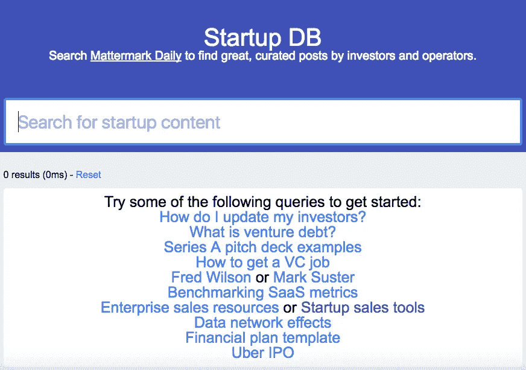

# Startup DB:搜索由企业家和投资者策划的相关帖子

> 原文：<https://medium.com/hackernoon/startup-db-search-for-relevant-curated-posts-by-entrepreneurs-investors-307f947aa50>

[**Mattermark Daily**](https://mattermark.com/newsletters/) 是一份优秀的每日时事通讯，收集关于创业、投资、销售、招聘等方面的第一手观点，每天都会出现。作为一个周末黑客，我们对过去几年《每日邮报》上的每篇文章进行了深度索引，并建立了 [**StartupDB**](http://startupdb.requestsforstartups.com/) :一个简单的搜索界面，这样你就可以在需要的时候从《每日邮报》上找到最好、最相关的创业内容。我们一直在内部使用它来回答读者的问题，并汇集一些最好的创业资源——例如，这篇文章 [**这里**](/the-mission/10-essential-guides-to-enterprise-sales-b768aa69a7a4) 介绍了 10 种优秀的企业销售资源。

## 在这里 给 **StartupDB** 一个尝试 [**。**](http://startupdb.requestsforstartups.com/)

我们希望通过电子邮件听到您的反馈和想法[。特别感谢马特马克日报编辑尼克·弗罗斯特的支持。](mailto:hello@requestsforstartups.com)

**订阅我们的邮件简讯** [**这里**](http://www.requestsforstartups.com/) **。** [创业请求](http://www.requestsforstartups.com)是一份由投资者、经营者和影响者提供的创业想法&观点的时事通讯。

***请点击或点击“︎***【❤】*帮助向他人推广此作品。*

> [黑客中午](http://bit.ly/Hackernoon)是黑客如何开始他们的下午。我们是 [@AMI](http://bit.ly/atAMIatAMI) 家庭的一员。我们现在[接受投稿](http://bit.ly/hackernoonsubmission)并乐意[讨论广告&赞助](mailto:partners@amipublications.com)机会。
> 
> 如果你喜欢这个故事，我们推荐你阅读我们的[最新科技故事](http://bit.ly/hackernoonlatestt)和[趋势科技故事](https://hackernoon.com/trending)。直到下一次，不要把世界的现实想当然！

