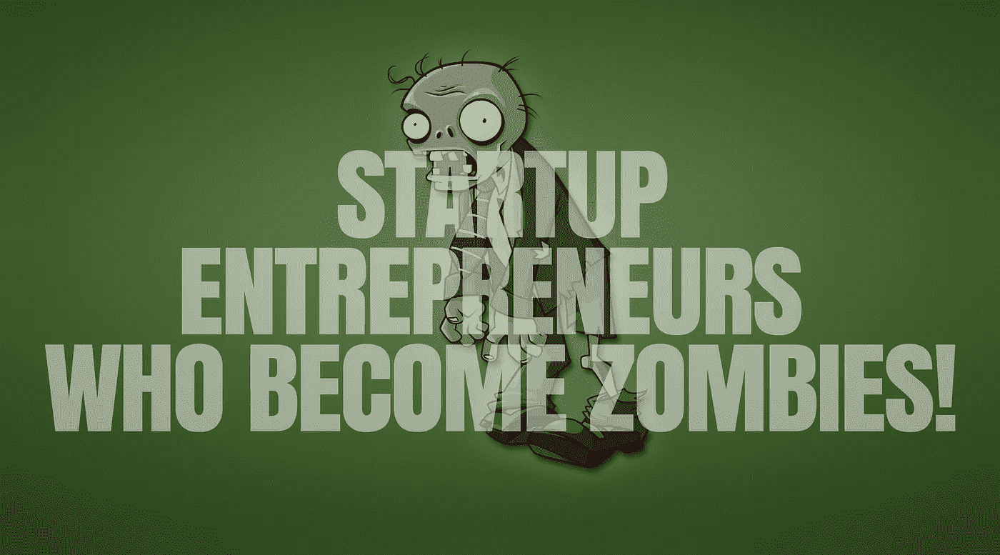
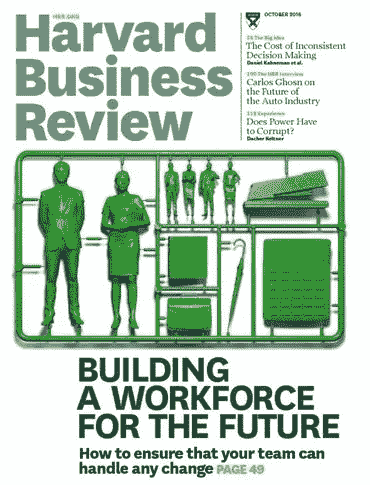
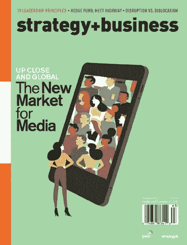
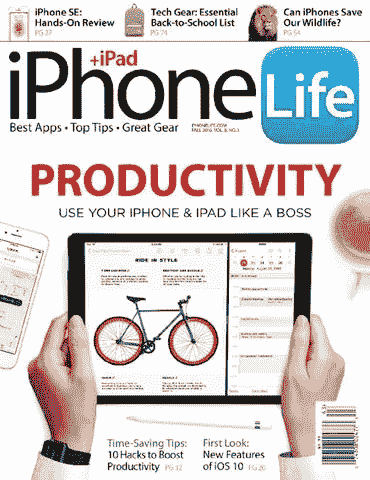
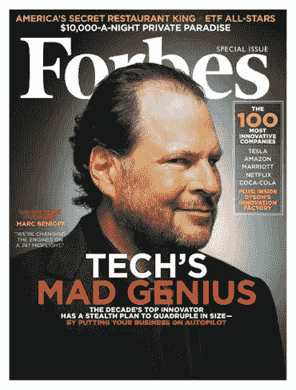
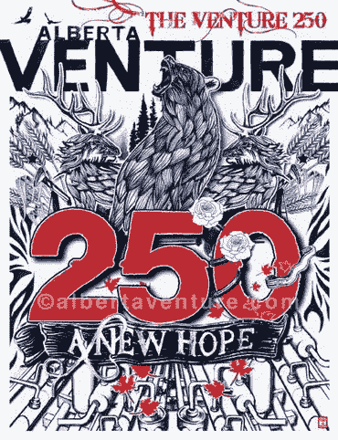
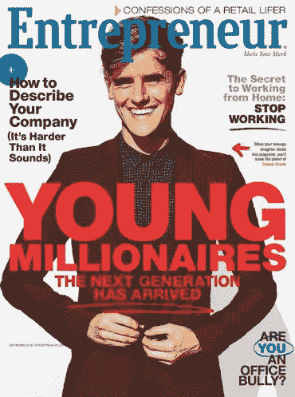
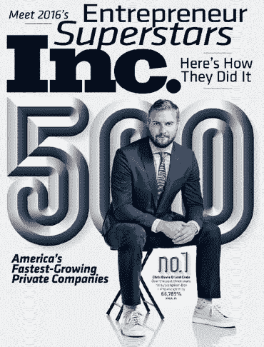
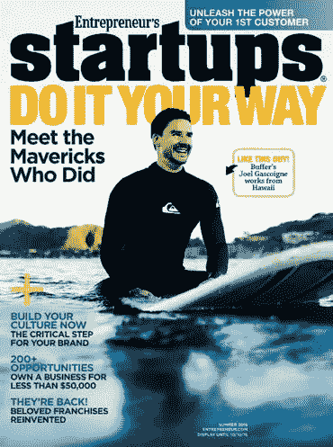
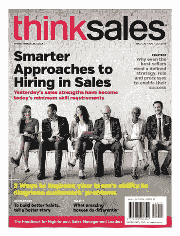

# 创业企业家会工作到死，直到他们变成僵尸！

> 原文：<https://medium.com/hackernoon/startup-entrepreneurs-who-would-work-themselves-to-death-until-they-become-zombies-ed15117a09dd>

**The Alive and Kicking can check out** [**www.thugstart.com**](http://www.thugstart.com)

这是一个不幸的现实，世界各地的创业企业家会花很长时间在办公室，工作到死，直到他们成为僵尸。

由于长时间的工作和单调乏味的任务，员工会感到疲劳和筋疲力尽，所以培养一套健康和创造性的习惯，让你的身体恢复活力，刺激你的大脑，这对职场成功至关重要。

开始养成一个非常简单的阅读习惯，不管你的工作压力有多大，你都会生活在一个充满力量和满足感的未来。

相信我，你不必担心创业的忧郁！以下是我的建议。

# [哈佛商业评论](http://www.anrdoezrs.net/bf106ar-xrzENGKJNLGEGFKIOOLMEGILHMMMHLJFFF?url=http%3A%2F%2Fwww.zinio.com%2Fwww%2Fbrowse%2Fproduct.jsp%3FproductId%3D1629324%26affId%3Dcj%26rf%3Dcjaffcatalog&cjsku=2110677)

《哈佛商业评论》是面向决策者的杂志，也是商业领袖寻求想法和灵感的地方。《哈佛商业评论》拥有来自行业专家的前沿文章，是领导力和管理工具及技术的无与伦比的来源，这些工具和技术对当今全球商业舞台上的成功和生存至关重要。

# [战略+商业](http://www.tkqlhce.com/click-8154861-10539967-1362777264000?url=http%3A%2F%2Fwww.zinio.com%2Fwww%2Fbrowse%2Fproduct.jsp%3FproductId%3D500693763%26affId%3Dcj%26rf%3Dcjaffcatalog&cjsku=500448837)

体验提升管理水平的想法和故事，清晰地撰写和阐述这些想法和故事，为深思熟虑的行动提供基础。通过深入的专题报道、思想领袖访谈和战略评论，每期《战略+商业》都为世界各地组织的决策者提供了一个知情的全球视角。

# [体验生活](http://www.anrdoezrs.net/7n65shqnhp4D6A9DB6465A8EEBC468B7CCC7B9555?url=http%3A%2F%2Fwww.zinio.com%2Fwww%2Fbrowse%2Fproduct.jsp%3FproductId%3D500611854%26affId%3Dcj%26rf%3Dcjaffcatalog&cjsku=500553037)

《体验生活》是一本全人杂志，提供对你至关重要的健康、健身和生活质量主题的深入而清晰的报道。立即订阅体验生活数字杂志。

# [iPhone 生活杂志](http://www.anrdoezrs.net/14100nmvsmu9IBFEIGB9BAFDJJGH9BDGCHHHCGEAAA?url=http%3A%2F%2Fwww.zinio.com%2Fwww%2Fbrowse%2Fproduct.jsp%3FproductId%3D291116739%26affId%3Dcj%26rf%3Dcjaffcatalog&cjsku=500171225)

唯一一本专门面向 iPhone、iPad 和 iPod touch 用户的杂志。每一期都充斥着对应用程序、配件和苹果手持设备的评论。它还包含提示和操作方法、用户资料、商业解决方案等等。要在你的 iPhone、iPad 或 iPod touch 上阅读它，请从 iTunes 应用商店下载免费的“Zinio Newsstand & Reader 应用程序”

# [福布斯](http://www.jdoqocy.com/tp112shqnhp4D6A9DB6465A8EEBC468B7CCC7B9555?url=http%3A%2F%2Fwww.zinio.com%2Fwww%2Fbrowse%2Fproduct.jsp%3FproductId%3D500658734%26affId%3Dcj%26rf%3Dcjaffcatalog&cjsku=500421875)

无论是报道“下一个脸书”还是审查新税法,《福布斯》都以不可思议的洞察力和简洁性报道了一些故事，这让忙碌的商人很欣赏。立即订阅福布斯数字杂志，获取严谨、中肯的商业分析。

# [阿尔伯塔风险投资](http://www.jdoqocy.com/click-8154861-10539967-1362777264000?url=http%3A%2F%2Fca.zinio.com%2Fwww%2Fbrowse%2Fproduct.jsp%3FproductId%3D500240174%26affId%3Dcj%26rf%3Dcjaffcatalog&cjsku=500101121)

关于阿尔伯塔省商业的相关，智能和有见地的信息的可靠来源。Alberta Venture 以顶级商业故事、营销理念和成功故事为特色，帮助您经营业务、管理员工、获得行业洞察力并了解趋势。体验阿尔伯塔风险投资对你的业务的影响。

# [快捷公司](http://www.anrdoezrs.net/bt65js0ys-FOHLKOMHFHGLJPPMNFHJMINNNIMKGGG?url=http%3A%2F%2Fwww.zinio.com%2Fwww%2Fbrowse%2Fproduct.jsp%3FproductId%3D500667220%26affId%3Dcj%26rf%3Dcjaffcatalog&cjsku=500437530)

《快速公司》带你进入最进步的商业领袖的思维。认识我们这个时代真正的创新者，了解最新的设计、可持续发展、营销和社会责任。

# [有线](http://www.anrdoezrs.net/8s75uoxuowBKDHGKIDBDCHFLLIJBDFIEJJJEIGCCC?url=http%3A%2F%2Fwww.zinio.com%2Fwww%2Fbrowse%2Fproduct.jsp%3FproductId%3D500671272%26affId%3Dcj%26rf%3Dcjaffcatalog&cjsku=500553591)

《连线》的使命是以一种前所未见的方式告诉世界一些他们从未听说过的事情。而是把新想法变成日常现实。这是关于在我们有影响力的群体中播种将塑造和改变我们共同未来的想法。《连线》杂志的读者想知道技术是如何改变世界的，他们对重大的相关想法感兴趣，即使这些想法挑战了他们的假设。

# [企业家](http://www.jdoqocy.com/kc77qgpmgo3C598CA535497DDAB357A6BBB6A8444?url=http%3A%2F%2Fwww.zinio.com%2Fwww%2Fbrowse%2Fproduct.jsp%3FproductId%3D501023263%26affId%3Dcj%26rf%3Dcjaffcatalog&cjsku=500553033)

《企业家》杂志是发展你的企业的可靠来源，并提供成功的可靠策略。无论你是正在考虑创业，已经迈出了第一步，还是已经拥有了自己的公司,《企业家》为你提供了经营自己公司的最佳建议

# [公司](http://www.anrdoezrs.net/65102ox52x4KTMQPTRMKMLQOUURSKMORNSSSNRPLLL?url=http%3A%2F%2Fwww.zinio.com%2Fwww%2Fbrowse%2Fproduct.jsp%3FproductId%3D500667328%26affId%3Dcj%26rf%3Dcjaffcatalog&cjsku=500437616)

Inc .杂志是唯一一本为从初创公司到完全管理公司的旅程而写的主要商业杂志。Inc .的每一期都为当今创新的公司创造者提供了真正的解决方案。

# [创业——用自己的方式去做！](http://www.kqzyfj.com/33106shqnhp4D6A9DB6465A8EEBC468B7CCC7B9555?url=http%3A%2F%2Fwww.zinio.com%2Fwww%2Fbrowse%2Fproduct.jsp%3FproductId%3D501023245%26affId%3Dcj%26rf%3Dcjaffcatalog&cjsku=500500411)

企业家的创业是为任何梦想创业的人准备的。《企业家的创业》是关于如何让你的企业迅速起步和运行的实践见解和信息的必备资源。每年出版三期，每期你都会发现无数的商业创意，看看别人是如何起步的，你也可以

# [ThinkSales](http://www.tkqlhce.com/click-8154861-10539967-1362777264000?url=http%3A%2F%2Fza.zinio.com%2Fwww%2Fbrowse%2Fproduct.jsp%3FproductId%3D500636890%26affId%3Dcj%26rf%3Dcjaffcatalog&cjsku=500390311)

ThinkSales 杂志专门迎合销售管理领导者的需求。《ThinkSales》杂志的编辑目标是通过战略知识、战术技能、管理洞察力以及接触国际销售和管理思想——领导能力和最佳实践来授权、激励和鼓舞销售领导，以带领销售组织实现更高和可持续的销售业绩。

# 无论你想在哪里阅读，都可以阅读所有你喜欢的杂志。

# 如果你喜欢这个并且想要更多:

帮我一个坚实的❤心吧，💬评论它，和/或关注我😀

此外，如果你想通过我的定期帖子阅读更多关于创业、[营销、](https://hackernoon.com/tagged/marketing)、社交媒体、领导力、[技术、](https://hackernoon.com/tagged/technology)、创新和风险投资等话题的精彩内容，请点击“关注”，并随时通过 [SlideShare](http://www.slideshare.net/abhishekshah) 、 [Twitter](https://twitter.com/abhishekshah) 、[脸书](https://www.facebook.com/Maillands)和 [LinkedIn](https://www.linkedin.com/in/findingnewlands) 联系。

请继续吧，这是我最棒的博客！请不要错过这个！

附:这是我其他关于媒体的文章。

> 黑客中午是黑客如何开始他们的下午。我们是这个家庭的一员。我们现在[接受投稿](http://bit.ly/hackernoonsubmission)并乐意[讨论广告&赞助](mailto:partners@amipublications.com)机会。
> 
> 如果你喜欢这个故事，我们推荐你阅读我们的[最新科技故事](http://bit.ly/hackernoonlatestt)和[趋势科技故事](https://hackernoon.com/trending)。直到下一次，不要把世界的现实想当然！

