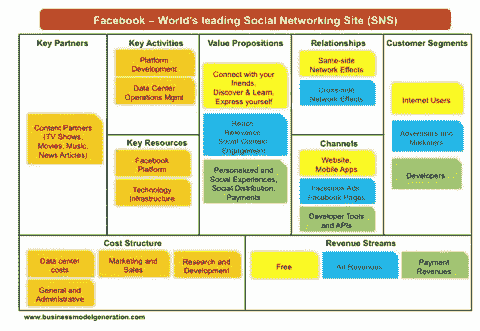

# 假人创业

> 原文：<https://medium.com/hackernoon/startup-for-dummies-3f75b5372c0a>

> ***“创业公司是为了寻找可重复、可扩展的商业模式而组建的组织****——*[*史蒂夫布兰克*](https://hackernoon.com/@sgblank) *。*

*发表于法文*[*https://www.thenextfrench.com/*](https://www.thenextfrench.com/startup-pour-les-nuls/)

定义创业公司的两个关键概念是“**可重复**”和“**可扩展**”。可重复意味着解决方案适用于不同类型的部门和客户。[可扩展](https://hackernoon.com/tagged/scalable)因素意味着它可以适应更大的规模。

例如，脸书是大学校园的社交网络。然后，它蔓延到了所有的美国大学。这种模式可以从一所大学复制到另一所大学。马克·扎克伯格让网络一步步成长，因为这种模式是可扩展的。这个网络，也就是现在的脸书，已经超越了学生的范畴，在几乎每个国家都有发展。

# 业务模型定义了以下九个要素:

1.  主要合作伙伴
2.  关键活动
3.  关键资源
4.  价值主张
5.  关系
6.  频道
7.  客户细分
8.  费用结构
9.  收入来源

因此，初创公司是一个组织起来快速成长的公司。这是一个暂时状态，在此期间，公司建立其*商业模式*。

# 创业的生命周期是什么？

*   想法
*   思考
*   联想
*   市场调查
*   最有价值球员
*   失败
*   MVP 2
*   爱钱
*   用户获取
*   员工
*   种子
*   牵引力
*   一切都很好
*   一切都是错的
*   在枢轴上转动
*   高牵引力
*   融资回合
*   增长
*   缩放比例
*   出口
*   …新想法！

> [黑客中午](http://bit.ly/Hackernoon)是黑客如何开始他们的下午。我们是 [@AMI](http://bit.ly/atAMIatAMI) 家庭的一员。我们现在[接受投稿](http://bit.ly/hackernoonsubmission)并乐意[讨论广告&赞助](mailto:partners@amipublications.com)机会。
> 
> 如果您喜欢这个故事，我们建议您阅读我们的最新科技故事和[趋势科技故事](https://hackernoon.com/trending)。直到下一次，不要把世界的现实视为理所当然！

