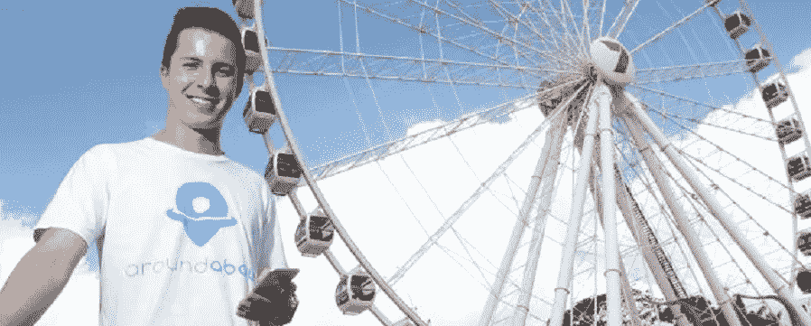
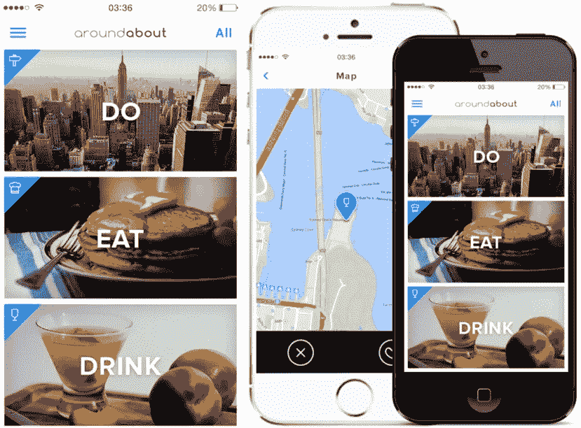
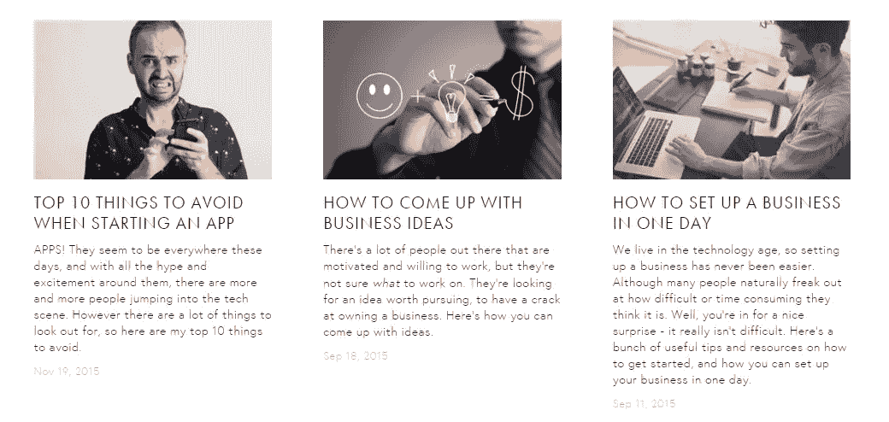

# 创业创始人系列:例外网络 AroundAbout App 的创始人米奇·希尔斯(Mitch Hills)

> 原文：<https://medium.com/hackernoon/startup-founder-series-mitch-hills-founder-of-aroundabout-app-the-exceptions-network-baf5bfd21797>

在这个创始人访谈系列中，我们收集了一些澳大利亚最成功的企业家，他们将自己的创业公司发展成为全国甚至全球的成功故事，并就他们最大的成就、挑战和创业技巧向他们讨教。

米奇是 [AroundAbout 应用](https://itunes.apple.com/au/app/aroundabout-live/id953414261?mt=8)的创始人兼首席执行官，这是一款为游客提供的随机活动生成器应用，也是企业家社区中心[例外网络](https://www.google.com.au/url?sa=t&rct=j&q=&esrc=s&source=web&cd=1&cad=rja&uact=8&ved=0ahUKEwi7neGNyKrKAhXGX5QKHU6zCZYQFggbMAA&url=http%3A%2F%2Fwww.theexceptionsnetwork.com%2F&usg=AFQjCNGpte14mPgvTpM4cilkvuMkJWbFLA&sig2=WjxH0Gl6kWLf7TavN9b-2A&bvm=bv.112064104,d.dGo)的创始人。

# 你第一次创业的时候多大？

我的第一个合法生意是在我 17 岁上高中的时候。

人们让我做他们家庭聚会的 DJ，所以我找到了另一个有音箱和灯光的家伙，我们一起做家庭聚会。

我会从他身上租下他的装备，我会做 DJ，然后 POGO 娱乐公司就诞生了。

最终，如此多的人需要这项服务(每个人都年满 18 岁)，以至于我不得不雇佣更多的员工。

所以几个月来，我们每个周末都要做 2-3 次私人活动，然后我也在布里斯班周围的俱乐部做 DJ，所以一切都很顺利！

在去年卖掉之前，我经营了两年。

# 你将你的应用程序描述为“旅游业的火种”。是什么给了你这个想法，你是如何验证它的？

[大约](https://itunes.apple.com/au/app/aroundabout-live/id953414261?mt=8)实际上是一个[早期支点的衍生。](http://www.buzinga.com.au/buzz/successful-app-pivots/)

我有另一个旅游应用的想法，但失败了，结果我们最终开发出了刷卡应用。

老实说，当我们在计划应用程序时，Tinder 甚至从未出现过。

它只是发生了，然后快递邮件和 MTV 说，所以我们去了。它爆了。《寻找食物的火种》也是如此。实际上，我们将要添加一些非常酷的东西…你会看到的！(是史诗)。

在验证方面，我实际上并没有在产品上做太多。新手错误——我建议[尽可能地验证你的想法](http://www.buzinga.com.au/buzz/validating-an-app-idea/)。我只是很幸运人们喜欢它，但下次会有更多的验证！

我*做了很多[旅游行业的市场调查](http://www.buzinga.com.au/buzz/startups-guide-to-estimating-market-size-for-an-app-idea/)，从调查中得到了一些非常有用的统计数据。*

*我们调查了 100 名有旅行经验的人，86.5%的人说他们浪费时间旅行不知道做什么，65%的人说这是一个令人讨厌的问题。这非常有用。*

# *在应用程序开发过程中，有什么事情是你本可以做得不同的吗？*

*我写了一整篇文章，名为“[开始一个应用](http://www.theexceptionsnetwork.com/blog/top-10-things-to-avoid-when-starting-an-app)时要避免的 10 件事”，如果你正在考虑走上应用之路，这是非常值得一读的。*

*几个要点:*

*   *在与开发人员交谈之前，尽可能做好准备。*
*   *与有经验的人交谈，先获得反馈和建议。*
*   *与开发者和服务提供商一起做研究。别被骗了！*
*   *做老大！如果你不这样做，人们会把你踩在脚下。*
*   *确保你计划好其余的业务([营销](http://info.buzinga.com.au/the-advanced-guide-to-app-marketing)、[法律](http://www.buzinga.com.au/buzz/australian-startup-business-structures/)、[会计](http://www.buzinga.com.au/buzz/financial-planning-template-for-startups/)等)*

# *你从最大的失败中学到了什么？*

*我想花钱太多是我后悔的一件大事。*

*当你刚入行时，可能很难知道该听谁的，因为每个人都在告诉你，你需要这个，需要那个。只是要小心…每个人都想要你的钱。*

*我也一直喜欢营销，但我学到了很多关于如何让你的钱得到最大的回报，并在各种情况下努力工作。*

*营销绝对是我的强项。*

# *你的生产力秘诀是什么？*

*啊，我从哪里开始！我只关心生产力，这也是我的许多视频的主题。*

*三个好的窍门是:*

*1)当你在工作的时候，关掉所有的通知，把你的手机打开“请勿打扰”。*

*2)将你需要做的事情分类，然后写下完成它们的顺序。然后一次做一件事。*

*3)使用倒计时器，让你感觉时间不多了，这有助于你工作得更快。还有，给自己创造点小奖励。例如，如果你想休息一下，或者你需要吃点午饭，那就完成当前的任务，然后把它作为奖励，而不是停下来。*

# *你上过大学吗？你从哪个班学到的最多？*

*我在大学学了一个学期，很快就辍学了。*

*我非常不喜欢它哈哈。我不会对大学咆哮，人们似乎对此非常抵触……但我要说的是，目前的教育体系是如此落后。*

*我认为创新和我们所生活的新经济将会动摇它。它已经开始了，我很有兴趣看看 5 到 10 年后的大学会是什么样子。*

**相关:* [科技将如何颠覆我们破碎的教育系统的四大预言](http://www.buzinga.com.au/buzz/4-big-predictions-for-how-technology-will-disrupt-our-broken-education-industry/)。*

# *你写了很多。在写作和发布内容以发展业务方面，你能给初创公司什么建议？*

**

*我确实写了很多！我也开始制作常规视频。*

*首先，每个人都应该有一个博客[(这是我写的另一篇文章](http://www.theexceptionsnetwork.com/blog/5-reasons-why-you-should-start-a-blog-today))，因为它是免费的，这是一种针对你的受众增加价值的强大方式，每个人都有东西可写。*

*当涉及到为你的[初创公司](https://hackernoon.com/tagged/startup)创作和分发内容时，只要想想你如何能给你的观众带来价值。*

*你为谁写作？他们看重什么？他们想看什么？对受众进行逆向工程，这样你就可以相应地编写内容。*

**奖励:* [应用程序的内容营销策略:快速而肮脏的指南](http://www.buzinga.com.au/buzz/content-marketing-for-apps/)*

*我还想提到的一件事是**建立一个社区**。*

*与你的读者/用户/顾客接触，并多走一步与他们交谈。你需要创造对话。*

*Twitter 是最好的地方。如果你还没有读过加里·维纳查克的《感谢经济》，我建议你读一读。*

*它将改变你对营销的看法，最棒的是，大部分概念都是免费的。它只需要你的努力。*

# *你需要任何外部资金来启动你的业务吗？*

*我在 20 岁之前存了 10 万美元，所以我用这笔钱开发了这个应用程序。*

*然后我筹集了更多的资金来加速这个项目，并在 Android 上进行开发。*

*有几个投资者对我感兴趣，尽管我还没有着手任何交易。我认为我现在可以在没有投资的情况下完成它，让它达到我们可以获得更好估值的程度。*

**奖金:* [获得澳洲风险投资的秘诀](http://www.buzinga.com.au/buzz/venture-capital-australia/)*

# *对创业公司有什么最后的建议吗？*

*总而言之，如果我能给你任何建议的话，那就是**开始吧。***

*我喜欢理查德·布兰森的名言*‘做不完美的事总比什么都不完美好*’。*

*你会一路学习，但要小心！这实际上是蓝色药丸或红色药丸的情况。一旦你尝到了[创业](https://hackernoon.com/tagged/entrepreneurship) …你就再也回不去了！这并不容易，但努力去做吧。*

**“如果你失败了……但是如果你飞了呢？”**

*在 app store 上大约下载 Mitch 的应用[。](https://itunes.apple.com/au/app/aroundabout-live/id953414261?mt=8)*

# *接下来去哪里*

*[1 页 20 分钟的应用创业商业计划](http://info.buzinga.com.au/business-plan-for-startups-0)*

*[创业创始人系列:eWay 首席执行官马特·布洛克](http://www.buzinga.com.au/buzz/founder-series-matt-bullock-ceo-of-eway/)*

*[创业创始人系列:莎拉·里格尔胡斯，财富增强者，非凡女性联盟的联合创始人](http://www.buzinga.com.au/buzz/founder-series-sarah-riegelhuth/)*

******

> *黑客中午是黑客如何开始他们的下午。我们是这个家庭的一员。我们现在[接受投稿](http://bit.ly/hackernoonsubmission)并乐意[讨论广告&赞助](mailto:partners@amipublications.com)机会。*
> 
> *如果你喜欢这个故事，我们推荐你阅读我们的[最新科技故事](http://bit.ly/hackernoonlatestt)和[趋势科技故事](https://hackernoon.com/trending)。直到下一次，不要把世界的现实想当然！*

**