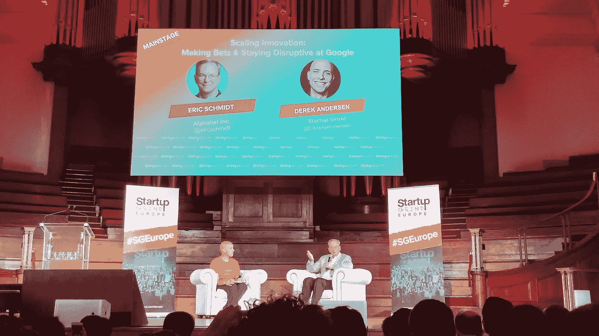

# 创业研磨，埃里克·施密特&下一个 1000 亿美元的创业公司

> 原文：<https://medium.com/hackernoon/startup-grind-eric-schmidt-the-next-100bn-startups-bd2ce89e6e18>

上周，我在伦敦参加了 Startup Grind Europe 会议，同行的还有我在巴塞罗那分会的朋友，以及来自令人敬畏的 Startup Grind 全球社区的许多企业家。

主要事件是初创公司 Grind 首席执行官德里克·安德森(Derek Andersen)和 Alphabet(原名谷歌)执行董事长埃里克·施密特(Eric Schmidt)之间的一次采访。

采访中最有趣的部分出现在下半场，埃里克·施密特(Eric Schmidt)做出了一个非常有趣的预测，关于五年后伟大的公司会是什么样子。

据预测，除了移动平台和云计算，下一个 1000 亿美元的公司将找到一种方法，让数百万用户教他们，使用机器学习从这些信息中学习，然后出售一种比用户的个人知识更好的服务。

从工程和商业的角度来看，这一预测非常有意义，因为它利用当前的技术以最低的成本收集和处理廉价的信息，由于移动平台提供了与客户的直接接触，这些信息可以很容易地在以后出售。

但是，在我看来，这种方法忽略了两个关键点:

*   **质量**。旧的质量与数量的困境。更多的信息并不总是与更好的知识直接相关。过滤掉不良信息，确保你出售的知识是高质量的，并且是最新的，这不仅很复杂，而且它的成本很容易吃掉企业的利润。
*   **隐私**。为了验证信息，你不得不牺牲用户的匿名性和隐私，因为评估信息质量的唯一方法是了解来源。根据信息的类型，尤其是其使用方式，这可能会产生许多道德和法律问题。

更重要的是，它错过了一个更大的商机:

*   **知识鸿沟**。人们所知道的只是我们能从他们身上学到的很小一部分。如果我们只专注于让用户教我们他们知道的东西，我们就完全错过了他们不知道的东西，但实际上他们也可以教我们。

说明这一点的最佳图像是冰山。我们知道的是冰山一角(我们能看到的)，我们不知道的是冰山隐藏在水面以下的其余部分。

跟踪数据和聚合信息以积累知识，以及构建人工智能来完成目前由人类执行的工作并不是革命性的，这只是一种预期的市场演变。

在接下来的 5 年里将会产生巨大业务的公司将需要走在前面，创造新的方法来解决将会彻底改变市场和行业的问题，并做一些预计在 20 年或更长时间后才会发生的事情。

谁认为有可能在几个月内建立一个人工智能，它不仅理解人类关系，可以准确预测你将与谁联系并发展有意义的关系，而且还能够预测你在接下来的几年里将如何进化，知道你未来的大部分需求是什么？

这些特征将定义下一代科技巨头:

*   **效率**。这很简单，未来没有数以千计(或数百万计)效率低下的公司，尤其是大公司的立足之地。
*   **信任**。建立一种商业模式，将公司利益与客户利益完美结合，不断改进产品/服务，提供一流的客户服务。
*   **隐私&安全**。收集合理的数据，即使黑客窃取了这些数据，用户/客户也将是安全的，因为这些数据只能由公司的算法和创建它们的少数人来解释。
*   **知识生成**。只有那些不断产生大量重要新知识的公司才能发展，适应变化并保持活力。
*   **多样性**。这一点现在并没有被认真对待，但我毫不怀疑，第一批能够在各个层面培养出多元化团队的公司，将很快形成决定性的竞争优势，占领他们的市场。

未来几年，我们将看到至少 3 家价值 5000 亿美元的全新公司诞生，可能有 5 家。如果你想知道，这些公司的增长不仅仅是扩大市场的结果，也将是清除现有公司的结果。

感谢阅读和分享。

阿德里亚·埃尔南德斯

方正物理

> [黑客中午](http://bit.ly/Hackernoon)是黑客如何开始他们的下午。我们是阿妹家庭的一员。我们现在[接受投稿](http://bit.ly/hackernoonsubmission)并乐意[讨论广告&赞助](mailto:partners@amipublications.com)机会。
> 
> 如果你喜欢这个故事，我们推荐你阅读我们的[最新科技故事](http://bit.ly/hackernoonlatestt)和[趋势科技故事](https://hackernoon.com/trending)。直到下一次，不要把世界的现实想当然！

