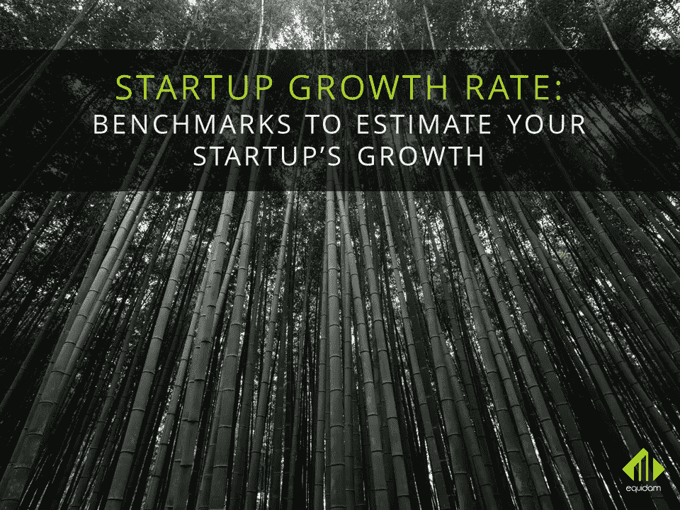
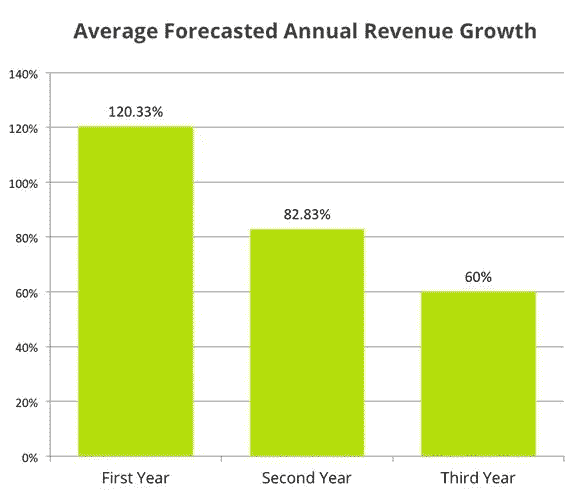
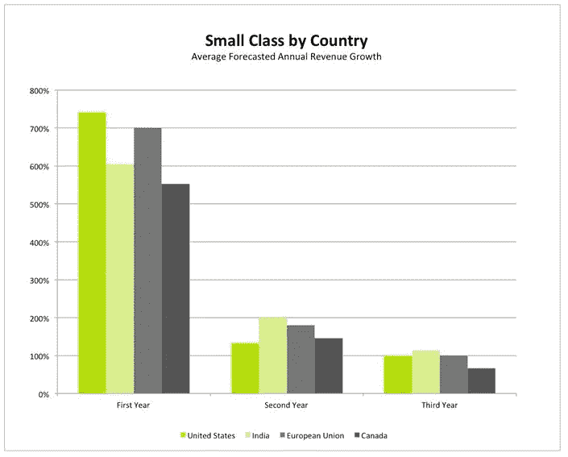
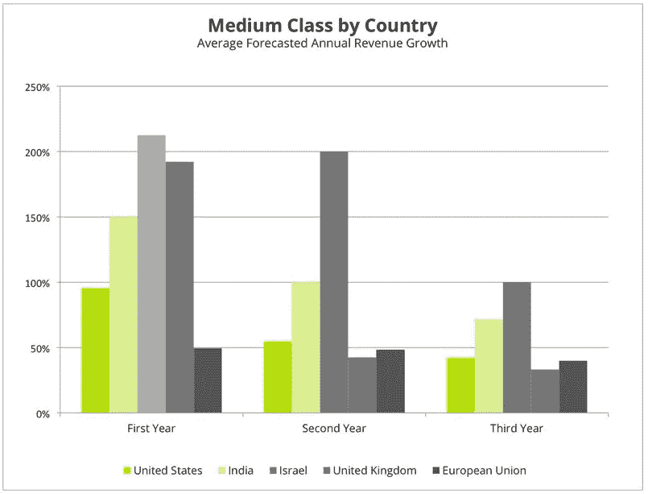
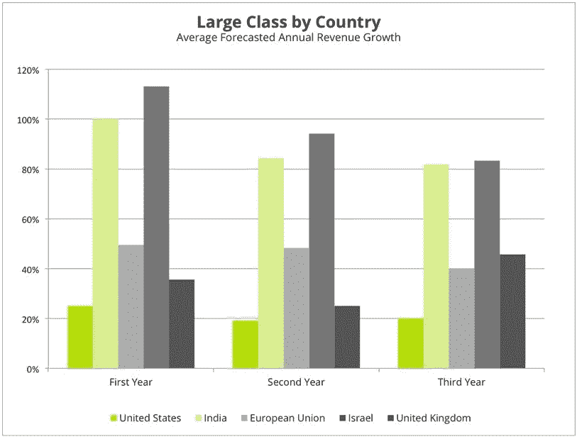
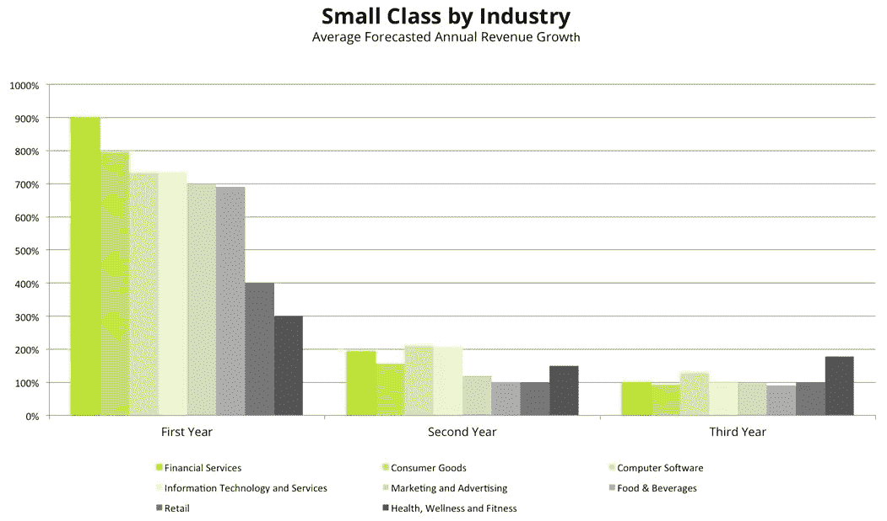
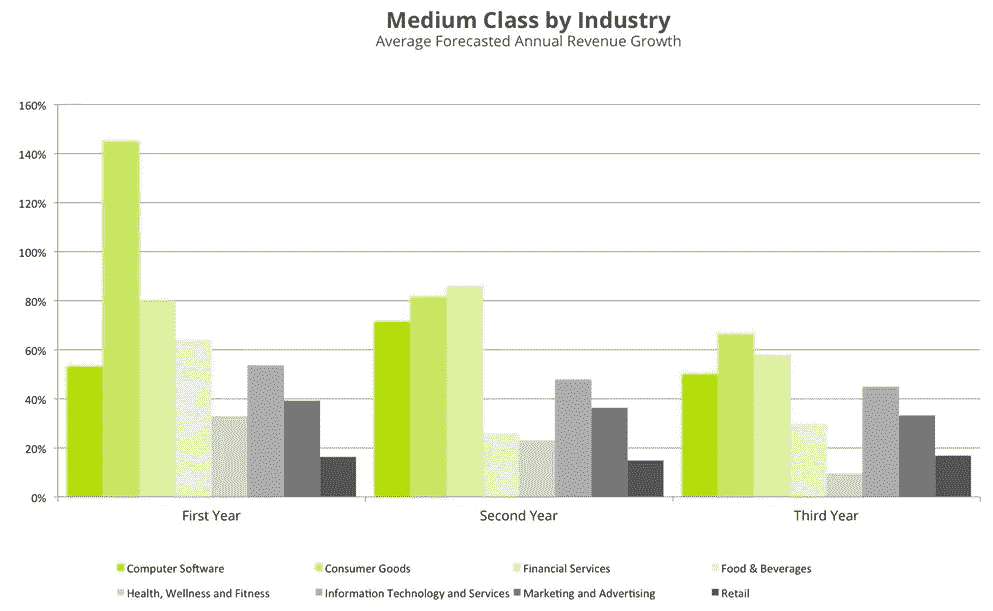
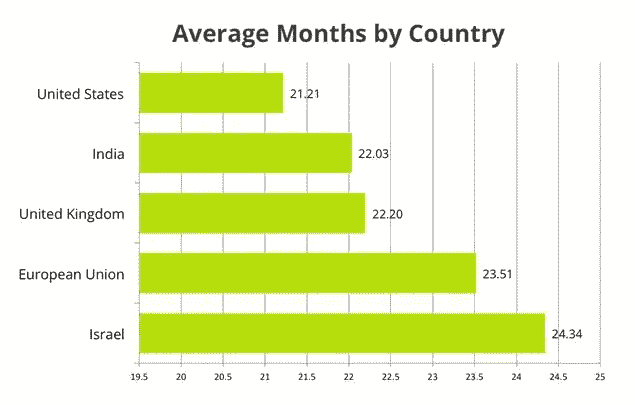
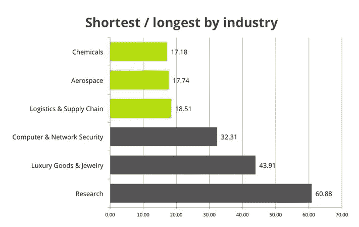

# 启动增长率

> 原文：<https://medium.com/hackernoon/startup-growth-rate-5f0afe7d242d>

## 评估初创企业成长的基准

*本文原载于* [*Equidam*](https://www.equidam.com/)

将一家初创公司发展成可持续的企业需要多年的努力。但是创始人如何看待这个路线图呢？我们预计公司什么时候会产生收入？众所周知的曲棍球棒应该有多陡？

创建并向投资者展示收入预测总是很棘手。太高他们不会相信，太保守他们会降低对方的兴趣。

缺乏创始人如何看待未来的知识源于有关初创公司财务预测的数据很少。Equidam 通过其估值平台，考虑了全球超过 15000 家早期风险企业样本的财务预测。提供预测的公司有一个内在的动机，那就是尽可能准确，得到公平的估值。

## **评估初创企业增长率的基准**

预测收入实际上可以归结为增长率。无论公司是否从零开始，最终的结局都是增长率和使其可实现的论证。

在我们的分析中，我们着眼于最近一年的财务状况(YTD)以及未来三年的预测收入。根据这些数据，我们可以研究未来 3 年的年收入增长系数。

> 一般公司预测第一年的收入增长率为 120%，第二年为 83%，第三年为 60%。

这意味着一家年初至今收入为 500，000 美元的公司预计明年收入为 1，100，000 美元，明年为 2，013，000 美元，第三年为 3，220，800 美元。

然而，初创企业的增长率因行业、国家和企业发展阶段的不同而有很大差异。白手起家的公司当然会发现更容易以更高的百分比增长收入。其原因是较小的数字比较大的数字更容易增长。

最重要的是，不同的行业有不同的建立时间、采用速度、销售周期和市场机会。最后，各国有不同的国内市场规模、获得资金和人才的渠道等。

> Equidam 依靠一个包含 1000 万个市场交易数据点的数据库，找到类似的公司，并提供准确的财务参数和估值！[免费试用](https://secure.equidam.com/signup.php)！

为了根据规模因素对这些公司进行基准测试，我们将它们划分为 3 类 YTD 收入:10000 至 50000 美元的初始年收入构成“小”组，50000 至 250000 美元的为“中”组，250000 美元以上的为“大”组。

> 毫不奇怪，美国“小”公司是最雄心勃勃的，预计第一年增长 740%。

然而，在接下来的几年里，他们确实与其他国家保持一致。他们越大越保守。

中大型集团讲述了一个不同的故事。一旦公司稍微建立起来，雄心主要来自印度和以色列，超过他们的美国同行。

## **增长预期最高的行业是…**

那么不同的部门呢？

预计增长率最高的行业是金融服务业，第一年的平均增长率为 308%，第二年为 143%，第三年为 86%。

> 在小型公司中，金融服务业预计第一年将增长 900%。

第二年是互联网公司，第三年是健康和健身。创建一个健身房比创建一个互联网公司需要更多的时间吗？创始人在白手起家的时候似乎也是这么想的。

随着公司规模的扩大，我们看到消费品行业的增长率最高，而健康和健身行业则排在最后。这似乎表明了更高的潜力和市场规模，从这两个部门的整体理解可以理解。消费品有更大的潜力，更大的总市场，如果它们表现出强大的竞争优势，平均来说，就有机会获得更大的回报。

就预测的机会规模而言，大班显示了类似的行为。它以 It 服务为先导，以零售为结尾。

自然，小类公司的增长百分比最大。然而，令人惊讶的是，他们预测的最终绝对数字比中等和大类要大。我们经常观察到这种行为。证明他们的假设很少的公司对他们的未来过于乐观。然后，随着他们的测试、迭代和增长，他们学会了如何更好地预测他们的增长，并且通常以较低的预期收入结束。

## **年收入从 0 美元到 100 万美元需要 24 个月**

预收公司和过度乐观的例子很有趣。当公司甚至没有产品时，预测财务业绩是复杂的。那么高估只是其复杂性的反映吗？

为了消除这种现象，我们研究了从零收入到年收入达到 100 万美元的预测时间。

有了这个，我们真的很想调查早期的日子，那些创始人为现金而奋斗的日子，是白手起家的日子，但他们仍然梦想着未来。结果令人惊讶。

我们首先研究了每个国家达到 100 万美元收入的预计时间。有趣的是，在 5 个最大的创业生态系统中——美国、印度、以色列、英国和欧盟——创始人的雄心和达到 100 万美元收入的时间在 23 个月的平均值左右非常稳定。然而，还是有差异的。美国初创公司表现出更高的雄心，预计时间框架平均为 21，21 个月。以色列是被研究国家中最保守的，为 24.34 个月。

按行业细分这些价值让我们对常见的时间框架有了更多的了解。更多以企业为中心的行业，如航空航天、化工或航空公司，预计时间较短，约为 18 个月。奢侈品等竞争行业中面向消费者的公司预计将在 43 个月内达到 100 万美元的目标，研究领先整个集团 60 个月。

总的来说，公司希望等待一年半到五年的时间来达到他们的目标，时间框架大约为 2 年。

## **关于数据**

本文中使用的数据来自 Equidam 数据库。Equidam 是初创公司和私营公司在线自动估值的先驱。作为其活动的一部分，Equidam 从用户那里收集财务预测数据，这些数据除非进行汇总，否则永远不会共享，并使用这些数据来完成其提高估价客观性和可访问性的使命。

该数据集调查了 78 个国家的 15000 多家公司，从非常早期和未获得收入的初创公司到风投支持或更传统的公司。

## **结论**

如今，创业公司比以往任何时候都发展得更快。这种更快的增长是从收入和估值两方面来衡量的。然而，每个人的观点总是偏向最好的。只有最优秀的创业公司才值得并得到媒体的关注，这给人一种创业很容易的感觉。

当查看包含成功和不成功公司的适当统计数据时，我们看到，即使是实现第一个里程碑，如 100 万美元的收入，也是一项漫长而乏味的任务。

一旦实现了第一笔收入，创始人就会更加意识到发展公司的困难，并做出更加合理的财务预测。

**尽管国家和行业存在差异，但有一件事将全球的企业家团结在一起:乐观。**

下面是我们数据的完整分析，如果你想了解更多，请查看我们的[启动资源](https://www.equidam.com/startup-resources/)页面！

> [黑客中午](http://bit.ly/Hackernoon)是黑客如何开始他们的下午。我们是 [@AMI](http://bit.ly/atAMIatAMI) 家庭的一员。我们现在[接受投稿](http://bit.ly/hackernoonsubmission)，并乐意[讨论广告&赞助](mailto:partners@amipublications.com)机会。
> 
> 如果你喜欢这个故事，我们推荐你阅读我们的[最新科技故事](http://bit.ly/hackernoonlatestt)和[趋势科技故事](https://hackernoon.com/trending)。直到下一次，不要把世界的现实想当然！

