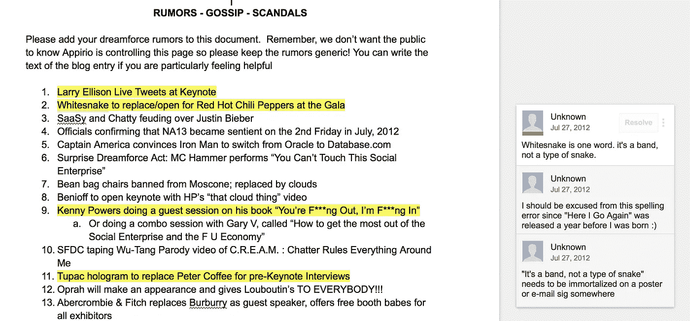

# 创业经验:从《孙子兵法》和《歌舞青春》中学习

> 原文：<https://medium.com/hackernoon/startup-lessons-learn-from-sun-tzu-and-high-school-musical-1b4ad45695b7>

## 第三课来自阿皮里奥的不为人知的故事

本文是系列文章的第四部分。 [*原帖设置上下文，提供免责声明，并给出所有课程的预览*](/@narinder/appirio-lessons-from-the-untold-stories-ef8482280f48#.okzt25dpn) *。*

几乎每个企业高管的书架上都有《孙子兵法》,并能引用一两条策略。许多 B2B 创业公司应该考虑用高中不那么高尚的课程来扩展他工作的课程。渴望和酷孩子在一起，害怕错过(FOMO)，需要抨击不公正或权威，这些都有助于创业。

Marc appreciated our irreverence (I think :) — after all it was straight [out of his playbook](https://www.amazon.com/Behind-Cloud-Salesforce-com-Billion-Dollar-Company/dp/0470521163).

在 Appirio， [Dreamforce](https://hackernoon.com/tagged/dreamforce) 是我们今年最重要的销售线索挖掘活动之一。我们永远不会有和主要竞争对手一样的预算水平，但我们需要引起轰动。所以我们利用了我们的优势。大型 B2B 公司很少被认为很酷或时髦。我们利用这一点，最初将 Dreamforce 的工作重点放在两件事上——确保我们的客户尽可能多地参加会议，并举办最好的派对。事实上，在我们筹到钱之前，我们就开始举办我们的梦想力量派对了。在我们的第一年，我们的活动取得了意想不到的成功，大约午夜时分，我们的策划者告诉我们，我们继续让它运行，每 30 分钟就要花费我们大约 2000 万英镑。最终，我们的梦想力量派对每年都会有几千人在等待名单上。我们的竞争对手离开了他们自己的活动，吵着要参加我们的活动(尤其是一个 GSI 合作伙伴……)。让这个活动有效的心理学就像回忆高中生活一样简单。像我们的与会者一样，我们中的许多人在高中时没有举办聚会，甚至没有被邀请，这是我们成年后与“时髦”人群在一起的机会。

In retrospect, the Google Glass was too far, but Appirio parties were epic.

我们的聚会甚至有自己的网址，http://dreamforceparty.com——这导致了与我们的合作伙伴和 Dreamforce 主持人 Salesforce.com 的意外冲突。在 Appirio 几年后，我们即将完成一轮融资，需要股东的同意(Salesforce 是我们种子期的主要投资者)。在最后一刻，随着这轮谈判接近完成，我们需要资金进行某些即时投资，Salesforce 的一些官员要求作为他们同意的一部分，我们给他们 dreamforceparty.com。我们从未发现是谁提出了这个小小的要求；我们可能已经升级并推迟了它，但我们肯定会延迟我们的资金和错过投资新闻报道。我们选择了实用主义而不是骄傲，并给了他们网址。

派对背后的团队和我们在 Dreamforce 的创造力感到愤怒和困惑。他们觉得我们被欺负了。同时，这不是我们的竞争对手，而是我们最大的合作伙伴的一些官僚作风。我们的反应不能是直接对抗。我们召集了团队，有人建议我们注册 [dreamforce@$#@#。com](mailto:dreamforce@$#@) 。每个人都笑了，然后我们说如果我们做了呢？我们接着注册了一百多个与 Dreamforce 和 salesforce 相关的网址——[、DreamforceRumors](http://dreamforcerumors.com) 、DreamforceHookups、DreamforceRocks、DreamforceSucks、DreamforceDiamondSponsor、DreamforceSocial 等。我们知道我们永远不会使用它们中的大部分，但这是一个版本，我们知道我们可以，我们确实在几年后使用了一些。我们甚至让一位主要的[分析师在我们的 dreamforcerumors.com 网站](http://www.zdnet.com/article/dreamforce-rumors-revealed/)上写了一篇报道。

excerpt from Appirio marketing “rumors” brainstorm

战胜困难或纠正不公的理念是许多有效的创业文化的一部分。对我们来说，无论是减少客户在浪费的预置软件上的支出，还是确保小家伙有发挥创造力的空间，这些行动都让我们记住，在我们周围有一个更大的世界，我们仍然可以有所作为。这是一种天真，随着我们长大成人，我们经常会失去这种天真，但如果我们想在创业世界中取得成功，我们必须重新发现这种天真——在创业世界中，我们最初很少拥有任何战略优势。

> [黑客中午](http://bit.ly/Hackernoon)是黑客如何开始他们的下午。我们是 [@AMI](http://bit.ly/atAMIatAMI) 家庭的一员。我们现在[接受投稿](http://bit.ly/hackernoonsubmission)并乐意[讨论广告&赞助](mailto:partners@amipublications.com)机会。
> 
> 如果你喜欢这个故事，我们推荐你阅读我们的[最新科技故事](http://bit.ly/hackernoonlatestt)和[趋势科技故事](https://hackernoon.com/trending)。直到下一次，不要把世界的现实想当然！

