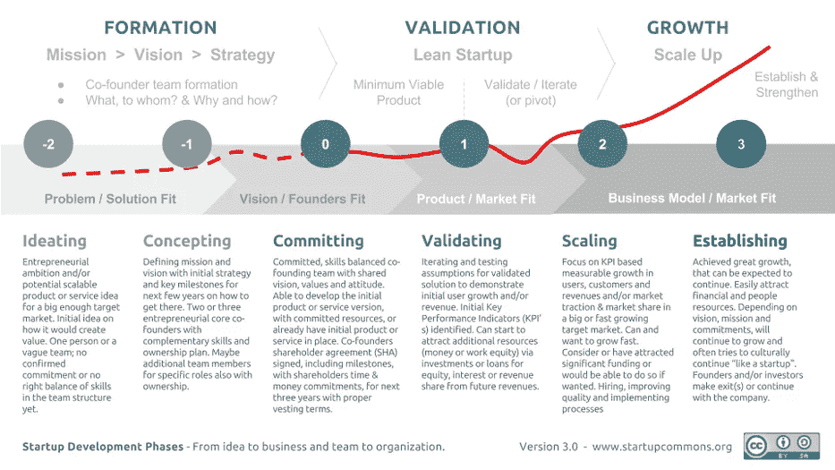

# 创业生命周期:4 个关键步骤

> 原文：<https://medium.com/hackernoon/startup-lifecycle-4-key-steps-c43f2bec0410>

## 创业公司生命周期中的关键步骤是什么？*最初发表于法文:*[*【https://thenextfrench.com/】*](https://www.thenextfrench.com/cycle-de-vie-startup/)

# 创世纪

创业公司的冒险不仅仅是一个想法。经常被高估，有一个伟大的想法本身并不是目标。最伟大的企业家会告诉你，最重要的不是想法，而是执行。

要开始构建项目，您需要资源。最初，需要人力资源(联合创始人、工程师……)和财务资源。

# 实现产品的市场适应性

MVP(最小可行产品)是产品或服务的最简单的可能解决方案。这是第一个可以测试和使用的可行产品。根据定义，MVP 并不满足所有预期的功能，但提供了产品或服务的旗舰功能。

市场对 MVP 的反应使得理解解决方案的优点和缺点成为可能。然后，创业公司必须修改其报价，以建立 MVP n 2。因此，为了限制成本和满足需求，报价是逐步建立的。

产品市场契合度是报价与需求相匹配的时刻。当产品进入市场后，以前集中在产品上的努力转向分销和增长。

> ***“只要达不到产品的市场契合度，支点！”***

# 成长

当在产品和市场之间创造了一种炼金术，增长曲线就开始了。这个解决方案必须扩大规模。此时，[商业](https://hackernoon.com/tagged/business)模式的要素以可持续的方式构建。

在创业公司中，新的明星形象是增长黑客。作为一名成长专家，他利用自己的专业技能发展业务。他利用现有的工具和方法来满足增长的需要。

极其成功的成长让成功的创业公司成为半人马，这意味着估值超过 1 亿美元的公司。世界上最大的成功达到了一个更高的阶段，独角兽，价值超过 10 亿美元。

创业公司是如何估值的？估价可以在三年营业额的基础上大致确定，再用特定于活动部门的系数加权。因此，一家公司 Y 在三年内创造了 300 万的营业额，其活动是开发一个 Saas(系数 10)，其价值约为 3000 万美元。

*例如:Y = 300 万美元(营业额)x 10 (Saas 系数)或 Y = 3000 万美元。*

# 出口

退出标志着“启动”期的结束。潜在流出有两种:收购或 IPO。当一家公司进入公开市场时，它不再被认为是一家创业公司。

脸书或谷歌还是创业公司吗？尽管年龄、规模或行业都不是关键因素，但脸书和谷歌已经不再是初创公司了。事实上，它们现在已经在证券交易所上市。IPO，或收购一家初创公司，意味着其“寻找商业模式”的结束，这将它排除在“初创公司”的命名之外。

# 创业公司的生命周期

**关于作者:**

 [## 昆汀·吉纳德| LinkedIn

### MBA 电子商务|寻找新机会|巴黎、伦敦、旧金山

www.linkedin.com](https://www.linkedin.com/in/quentinguignard/en) 

> [黑客中午](http://bit.ly/Hackernoon)是黑客如何开始他们的下午。我们是 [@AMI](http://bit.ly/atAMIatAMI) 家庭的一员。我们现在[接受投稿](http://bit.ly/hackernoonsubmission)并乐意[讨论广告&赞助](mailto:partners@amipublications.com)机会。
> 
> 如果你喜欢这个故事，我们推荐你阅读我们的[最新科技故事](http://bit.ly/hackernoonlatestt)和[趋势科技故事](https://hackernoon.com/trending)。直到下一次，不要把世界的现实想当然！

