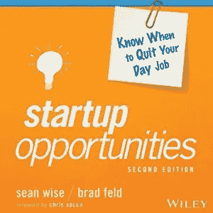

# Audible 上提供的启动机会

> 原文：<https://medium.com/hackernoon/startup-opportunities-available-on-audible-b01d15bd8333>

[创业机会](http://amzn.to/2yAbJM1)的[有声读物](https://hackernoon.com/tagged/audiobook) [版](https://hackernoon.com/tagged/version)现已在 [Audible](https://www.audible.com/pd/Business/Startup-Opportunities-Audiobook/B074WFXGNY?source_code=AUDORWS0822179LBI&asin=B074WFXGNY) 上架。

与《风险投资协议》的有声版本不同，这个版本是由斯蒂芬·侯烨朗读的。

如果你喜欢有声读物，[拿一本](http://amzn.to/2yAbJM1)，听一听，告诉我你的想法。

*最初发表于* [*费尔德思*](https://www.feld.com/archives/2017/11/startup-opportunities-available-audible.html) *。*