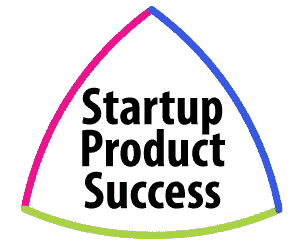
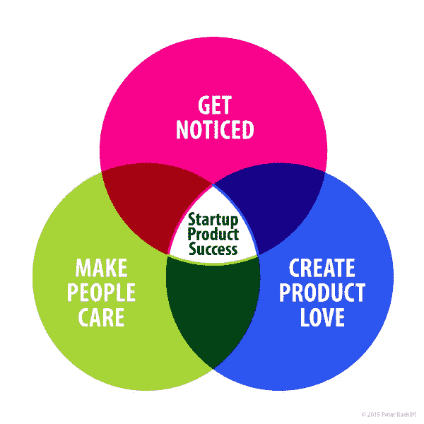
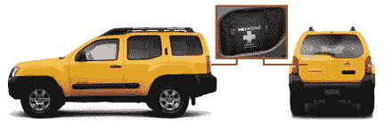

# 创业产品成功:企业家框架

> 原文：<https://medium.com/hackernoon/startup-product-success-a-framework-for-entrepreneurs-7c7de5214538>

*“创业产品成功”是我在超过 30 年的职业生涯中为创业者开发的一个框架，旨在帮助降低风险，加快消费科技产品的采用。——Peter rads liff，发布于 2016 年 1 月 16 日*

**创业产品成功** 开发新产品的计划对于一家[创业公司](https://hackernoon.com/tagged/startup)和一家老牌公司来说是完全不同的。我知道这一点，因为除了两家中型公司和一家财富 100 强公司，我还在五家初创公司担任过营销和产品主管。几乎所有公司都在销售消费技术硬件产品，其中一些通过互联网连接，还有一些加入了持续订阅。总的来说，我的团队已经推出了成千上万的新产品，从这个有利的角度来看，我已经看到了成功的初创公司产品与成熟公司产品的区别。

对于现有的企业，他们的品牌和产品类别通常已经建立。对于绝大多数初创公司来说，他们的首次产品发布将是他们第一次向目标市场提出自己的品牌、愿景、定位、类别和价值主张。可以说，很多事情都取决于初创公司的首次产品发布。

我看到的一个常见问题是，许多初创公司的创始人在他们公司的第一次产品发布会上非常强调某个特定的方面，通常会损害其他领域。科技企业家在制定产品开发计划时回归自己的核心专长并不罕见。程序员出身的创始人专注于代码。身为营销人员的创始人痴迷于故事。设计师出身的创始人会因为 ID/UI/UX 而失眠。就像为受伤的膝盖求医问药:理疗师开 PT，骨科医生要切；对锤子来说，所有东西看起来都像钉子。

但对于一家可能只有一次机会的初创公司来说，基于个人偏见的规划可能会引发额外的风险，并限制潜在的成功。然而，即使科技公司的首席执行官们可能知道这一点，他们可能仍然会觉得向自己专业领域之外的领域投入过多的投资是一种不自然的行为。尽管初创公司的首席执行官可能理解产品设计、技术开发和营销的多学科方法背后的理论，但他们的预算和组织决策往往掩盖了一种根深蒂固的偏见。本文的目标是提出一个框架来帮助组织和预算决策，以减少风险，并为创业产品的成功提供最佳结果。

**目标** 在我解释创业产品成功框架之前，重要的是要理解它的设计目的:引起注意，引起人们的关注，创造对产品的热爱。

这些目标看起来很明显，但是实现起来却非常困难。创业公司在试图实现这些目标时遇到的一些问题是因为:1)他们不明白完成每个目标需要付出什么努力，2)他们没有投资建立自己的组织来拥有完成每个目标所需的技能，和/或 3)他们雇佣的人不知道如何或没有动力一起工作来完成这三个目标。为了实现每个目标，这里有一个框架，其中包含实现这些目标所需的任务。

**创业产品成功框架**

很简单，创业产品的成功源于拥有一个具备三大执行要素的产品:****引人注目的故事******史诗般的用户体验*** 。黑仔的设计是工业或用户界面设计，做得非常好，它穿过市场和竞争产品的噪音，加上它支持用户的长期兴趣。一个“引人注目”的故事是一个吸引人们并使他们想要自己传播消息的故事。“史诗般”的体验推动了客户满意度、出色的评论和售后口碑营销。*设计*、*故事*和*体验*的结合定义了一家初创公司的品牌本质，可以显著加快市场采用，同时降低公关、广告和客户支持的成本。*

*当这三个创业产品成功因素中的每一个都得到很好的执行时，它们的价值就超过了它们的总和。当只有两个因素强，一个因素缺乏时，创业公司可能会发现特定的缺陷，如上面每个维恩气泡对之间的空间所示。例如，具有引人注目的故事，但缺乏相称的史诗用户体验的杀手级设计，可能会产生良好的初始吸收，随后是平庸的用户评论和发布后的采用停滞。同样，缺乏杀手级设计的史诗般的体验和引人入胜的故事可能会导致平淡无奇的产品发布，因为媒体和博客圈可能甚至不会注意到看起来像一个平庸的产品。如果没有一个令人信服的故事，你最好准备好投资大量的公关和广告，因为即使有杀手级的设计和史诗般的体验，你也会把你的新产品新闻推向一个不太在乎谈论它的世界。*

*设计、故事和体验之间的相互作用&体验
尽管执行良好的设计、故事和体验努力可以产生比单个努力更高的价值，但只有三者之间的相互作用才能产生真正的产品完形。例如，有“杀手级设计”并不会有所帮助，它不会给一个引人注目的故事带来物理形式或以某种方式体现一种史诗般的体验。*

*我最喜欢的例子是 2000 年日产 Xterra，这是一款专注于年轻人的小型 4×4 SUV，具有针对其目标人群的非常具体的功能，如干燥潜水服的车顶支架、内部山地车支架、后排座椅和我最喜欢的一体式急救包。*

**

*急救包值得一提的是，它是一个完美的例子，展示了*杀手设计*支持*引人入胜的故事*，提供了*史诗般的体验*。请注意后舱盖上有一个凸起。在这个凸起内是 Xterra 急救箱(见插图)。还要注意凸起是如何推上后窗玻璃的，以使它非常明显地出现在那里。我向你保证:a)没有必要为了在车内放置急救箱而设置向外保险杠，b)与更普通的直行设计相比，由于保险杠向上侵入而必须设置的奇怪形状的玻璃会导致成本显著增加。那么，为什么 Xterra 的设计者会花费如此大的成本和精力将这种颠簸表现在汽车的外部呢？*

*答案是因为他们出售 Xterra 的对象，正如他们最初的电视广告所证明的:皮划艇运动员、山地自行车手、潜水者和其他寻找户外冒险的一代人(因此“Xterra”中有“X”)。对于那些观众来说*当然*你会显著地展示一个急救箱，因为那些人生活在“边缘”,所以他们大概需要一个。难道这些目标客户不会更倾向于购买一辆如此了解他们的生活方式和需求的汽车吗？他们会的，[而且他们做了](https://www.behance.net/gallery/337922/Nissan-Xterra-Case-Study)。设计、故事、体验，所有这些都被包装在一起，以一种可信的、强大的、推动新产品病毒式传播的方式，将产品的概念传达给目标受众。如果做得好，就像 Xterra 一样，这就是设计、故事和体验相加产生比每个元素本身更大价值的方式。*

*虽然日产设计团队没有反映每个初创公司可用的典型资源，但他们对设计、故事和体验的力量的信念使 Xterra 成为一款产品完形。这可以在产品开发投资的每个阶段进行。*

***为创业产品的成功而组织** 有许多方法可以建立一个组织来实现创业产品的成功，但也有许多方法可以制造障碍来阻止创业公司实现它。相信工业设计的力量是一回事，但如何实现产品的“杀手级”设计呢？你雇佣设计顾问吗？你会投入内部人员来担任你的设计总监吗？或者，你会保留一个联合创始人的席位和股权，与一位领先的设计师合作，并利用他或她的资源吗？回答你将如何完成“杀手级设计”这个问题很能说明你*有多*相信设计将会改变你的商业游戏规则。同样的问题也适用于创建引人注目的故事和史诗般的用户体验。这些东西不是自己发生的，也不会是不同学科有天赋的人创造出来的。
_ _ _ _ _ _ _ _ _ _ _ _ _ _ _ _ _ _ _ _ _ _ _ _ _ _ _ _ _ _ _ _ _ _ _ _ _ _ _ _ _ _ _ _ _ _ _ _ _ _ _ _ _ _*

*侧栏:精益创业怎么样？
Eric Ries 的开创性著作 [*《精益创业*](http://www.amazon.com/Lean-Startup-Entrepreneurs-Continuous-Innovation-ebook/dp/B004J4XGN6/ref=sr_1_1?s=books&ie=UTF8&qid=1450735274&sr=1-1&keywords=the+lean+startup) 》依赖于一种“有效学习”的方法论，即快速科学实验，以及大量旨在缩短产品开发周期的实践。精益创业方法衡量实际进展，以了解客户真正想要什么，并允许创业公司迅速改变方向。在*启动产品成功*框架中，没有任何东西必然与精益启动方法相矛盾。它只是挑战企业家开发他们的最低可行的产品，将设计、故事和用户体验作为需要验证的关键因素。尽管如此，一些公司并不依靠有效的学习来衡量发展方向。苹果公司的史蒂夫·乔布斯有句名言:*“消费者的工作不是知道他们想要什么。对消费者来说，很难告诉你他们想要什么，因为他们从来没有见过任何类似的东西。"*无论一家初创公司是选择"*给他们想要的东西"*还是"*建立它，他们就会来*"方法论，忽视设计、故事或经验可能是一个致命的错误，可能导致初创公司崩溃&烧毁。* 

***创业产品成功的决策** 假设你已经购买了创业产品成功框架，并聘请了一家外部公司来生产你的产品的工业设计和与连接的移动应用程序相关的用户界面屏幕。当设计公司提出三个不同版本的设计方案时，谁来选择最终的设计方向？是首席执行官、产品经理、委员会还是外部设计公司自己？当决定一个设计是否是“杀手”，或者一个体验是否足够“史诗”时，决策过程是什么？确定*如何做出*决策的时间是在流程的开始，不应该取决于设计提案是什么。关键是要确保每个人都知道哪个人或哪个小组负责做最后的决定，否则你会在项目最关键的时候遇到严重的问题。许多伟大的设计因为缺乏管理勇气或者因为一个团队不知道如何对照公司的目标来评估一个设计提案而被放弃。这是一个如此重要的话题，我将在以后的文章中专门讨论决策。*

***创业产品成功框架在行动** 我很幸运曾在多家公司担任高管，这些公司成功地将设计、故事和经验结合在一起，创造出真正突破性的产品。这些公司能够将资金投入到产品开发中，并减少发布后的营销成本，因为故事如此引人注目，设计如此具有煽动性，体验如此令人惊讶和愉快。我打算在以后的帖子中介绍其中的一些产品，并重点介绍如何解决每个关键因素。但现在，我鼓励创业者让我知道你对这个创业产品成功框架的想法，方法是在下面的表格中给我发一条私人评论，或者在本页底部的公众评论部分发帖。 **::***

*我收到了一些关于这个框架的评论，我想补充一下。我把“黑仔设计”描述为一个创业产品“引起注意”的必要任务这意味着设计是关于美学的，可能会导致一些人认为设计过程与创造史诗般的用户体验是分开的。这与事实相去甚远。工业设计过程的本质是仔细理解用户的问题，并定义一个通过用户体验表现出来的解决方案。在这个过程中，设计师也关注他们作品的美学，这可以帮助一个公司让他们的产品脱颖而出。但是设计过程本身可以极大地促进引人注目的故事和史诗般的用户体验的发展。事实上，一个执行良好的产品开发过程在应用中是整体的，倾向于业务需求的所有方面。但由于我遇到的许多企业家没有整体设计流程的经验，我发现将支持创业产品成功的关键因素分成三个独立的努力是有帮助的:设计、故事和体验。*

*2016 Peter Radsliff 保留所有权利-所有第三方商标或版权作品均为其各自所有者的财产，此处提及并不意味着任何认可，除非特别声明。*

******

> *[黑客中午](http://bit.ly/Hackernoon)是黑客如何开始他们的下午。我们是 [@AMI](http://bit.ly/atAMIatAMI) 家庭的一员。我们现在[接受投稿](http://bit.ly/hackernoonsubmission)并乐意[讨论广告&赞助](mailto:partners@amipublications.com)机会。*
> 
> *如果你喜欢这个故事，我们推荐你阅读我们的[最新科技故事](http://bit.ly/hackernoonlatestt)和[趋势科技故事](https://hackernoon.com/trending)。直到下一次，不要把世界的现实想当然！*

**