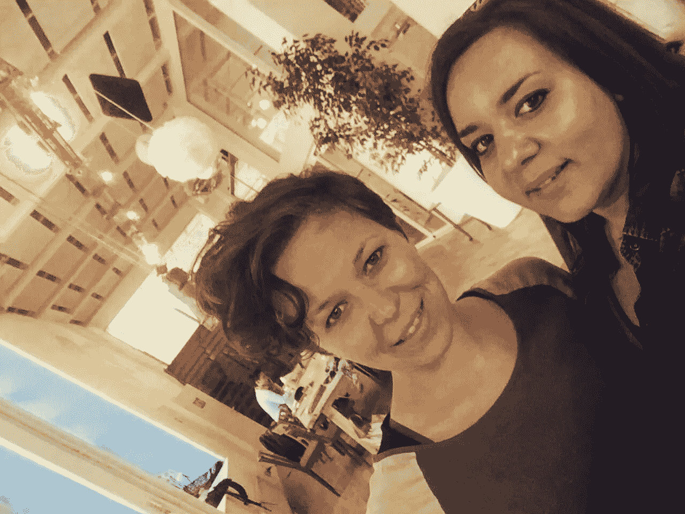

# #StartUpSelfie #30 关于社会影响

> 原文：<https://medium.com/hackernoon/startupselfie-30-about-social-impact-fe1bc743652a>

“影响不可能孤立发生，让我们开始吧！”

Christine (left) Program Director at Impact Hub Vienna

在我看来，2016 年社会创业正在蓬勃发展。从直到 1-2 年前，我的朋友和熟人圈子里没有人知道什么是社会企业，到 2016 年福布斯 30 名 30 岁以下社会企业家名单。如果你是有兴趣参与或开始一项解决社会问题的事业的人，那么这是开始的好时机！

什么是社会企业家精神？为什么不同于“常规”创业？你可以在哪里发展你的社会商业理念？创业公司可以做社会企业吗？嗯，所有这些问题你都可以在谷歌上找到答案，我敢肯定:)

在维也纳这样的“皇家之美”中，有一个帮助人们产生影响的中心。尤其是社会影响。在我与[娜塔莉就#MakesYouPioneer](https://startupselfie.wordpress.com/2016/05/17/startupselfie-29/) 会面后不久，我就经由 Mariahilfer Straß前往 [Impact Hub Vienna](http://vienna.impacthub.net/) 与项目总监 [Christine Spernbauer](https://vienna.impacthub.net/about-us/team/#modal-christine-spernbauer) 会面。

[影响力中心](http://www.impacthub.net/)是一个全球网络，拥有超过 11000 名会员，遍布五大洲，共同致力于创造真正的影响力。成员从全球近 70 个影响力中心分享的指导、资源和机会中受益。在维也纳，他们有 1200 平方米的共同工作空间和活动场所、企业孵化器、影响力驱动的社区，正如他们所说的，“影响力不可能孤立地发生，让我们开始吧！”

我和克里斯汀是通过一个共同的朋友介绍认识的(谢谢 [Ljupka](https://mk.linkedin.com/in/ljupka-mitrinovska-5b621848) ),在带我参观了他们超级酷的办公场所后，我们拿起我们的咖啡，开始讨论更多关于克里斯汀的故事是如何从维也纳影响力中心开始的，以及她对社会企业家的热情。

> “当我回头看它时，我可以说事情对我来说已经到位了。当我从中国回来时，我知道我想在国际组织工作。2009 年，我是 [StartEurope](http://www.starteurope.at/) 团队(也就是现在的[先锋](https://pioneers.io/))的一员。我们一起通过暑期学校和 [startuplive](http://www.startuplive.org/) 活动来促进创业生态系统。与此同时，我被介绍参加了[社会影响力奖](http://socialimpactaward.net/)，他们向我寻求支持，所以通过他们我认识了 Impact HUB 团队。对我来说，这一切都是新的，我们是一小群爱好者，在 2010 年 9 月建造了整个结构。一开始，我是维也纳影响中心的主持人，在那里我学到了很多关于社会企业家和社会影响的知识。不久，我开始与维也纳的阿育王一起工作，总而言之，一切都与社会企业家精神有某种联系。我很自豪，当我开始工作时，我是和有许多不同想法的人在一起，但只有一个目标，那就是培养社会影响力。五年前，社会企业家方面什么都没有发生。现在，人们正在接近我们，他们想加入这个中心并做一些事情。我们欢迎每一个相信能有所作为的人，在维也纳影响力中心，我们有合适的环境来这样做。”——克里斯汀说。

多年来，Impact Hub Vienna 团队已经建立了一个由年轻企业家、导师、投资者组成的庞大网络，他们还正在实施几个项目，例如:[加速项目](http://vienna.impacthub.net/program/accelerate-program/)、[绿色启动](http://www.greenstart.at/)、[投资就绪项目](http://investment-ready.org/)、 [Re:Wien](http://vienna.impacthub.net/program/re-wien/) 、[社会影响奖](http://socialimpactaward.net/)、[社会影响启动](http://vienna.impacthub.net/program/social-impact-start/)、[启动:E](http://www.start-emobility.at/) ，从去年 5 月开始，他们启动了[扩展项目我有兴趣了解更多关于他们最新的计划和她在整个过程中的角色。](http://vienna.impacthub.net/program/scaling-program/)

> “这些年来，我改变了我的角色，但通常我都在从事这些‘白标项目’。我们与团队一起集思广益，当我们有了计划的结构，我们就去把它推销给潜在的合作伙伴。例如，投资就绪计划是在 Impact Hub 内部与一个姐妹组织一起开发的，然后在 2013 年我们将它们合并了。通过我们的最新计划，我们在欧洲有 8 个影响力中心共同合作，为社会企业家推出了一个新的[扩展计划](http://vienna.impacthub.net/program/scaling-program/)。在整整一年的时间里，多达 100 名创新者将得到顶级导师的知识、技能和建议的支持。我们有[团队(读作:scalers)](http://scaling.impacthub.net/scalers/?_sft_from-country=austria) 已经被这个项目接受，在这里我们可以帮助他们得到一些问题的答案，比如:一件东西旅行到另一个城市需要什么？我有一个适用于我所在城市的收入模型，但它也可以在不同的城市实施吗？此外……Impact Hub Scaling 是一个为准备在本地进行国际扩展的社会企业而设计的计划。如果你在经营一家社交企业，并且希望扩大你在整个欧洲的影响力，你绝对应该[将](http://scaling.impacthub.net/apply/)应用到我们的项目中。”—克里斯汀补充道。

所以说，再也没有借口了！对于那些保守自己想法的人，记住它不会自己实现。现在，你已经有了启动你的(社交)创业的坚实基础，也有了在你的旅程中支持你的人和项目。

> “Impact Hub 是一个人们可以真正联系的地方。你处在一个鼓励合作的环境中，你能够和对相同话题感兴趣的人联系。这是一个挑战，但你能失去什么？保持好奇，保持开放的心态，做你的直觉告诉你的事情！”——克里斯汀说。

社会企业家和任何对解决社会问题感兴趣的人，你们有如此多的机会，对你们和我们所有人来说幸运的是，我们有[影响中心](https://www.impacthub.net/)来支持影响形成过程。感谢 Christine 分享你的故事和你在[会展中心](http://vienna.impacthub.net/)所做的一切。请继续努力，并祝您在项目实施过程中取得巨大成功。

对于任何访问维也纳的人，我强烈建议你去看看他们的场所，并会见所有来自 hub 团队及其成员的了不起的人！

直到我们下次重聚，

干杯

故事最初发表于[https://startupselfie . WordPress . com/2016/06/09/startupselfie-30/](https://startupselfie.wordpress.com/2016/06/09/startupselfie-30/)

> [黑客中午](http://bit.ly/Hackernoon)是黑客如何开始他们的下午。我们是 [@AMI](http://bit.ly/atAMIatAMI) 家庭的一员。我们现在[接受投稿](http://bit.ly/hackernoonsubmission)并乐意[讨论广告&赞助](mailto:partners@amipublications.com)机会。
> 
> 如果你喜欢这个故事，我们推荐你阅读我们的[最新科技故事](http://bit.ly/hackernoonlatestt)和[趋势科技故事](https://hackernoon.com/trending)。直到下一次，不要把世界的现实想当然！

