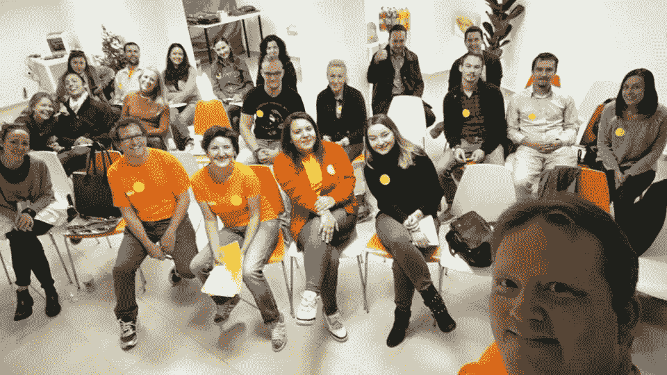
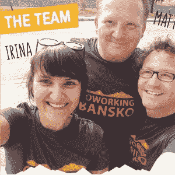
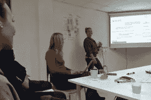
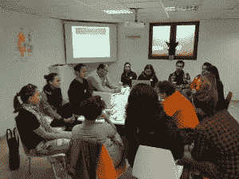
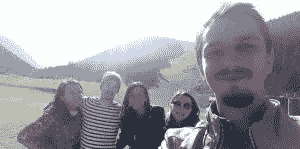

# #StartUpSelfie 关于合作和数字游牧者

> 原文：<https://medium.com/hackernoon/startupselfie-about-co-working-and-digital-nomads-22f60496c1d3>

不要过度计划，我经历的一些最美好的时光都是在其他事情不顺利的时候出现的。

Coworking Bansko unconference team

有时候一首歌可以带来一千种回忆。无论是节拍，还是歌词，你最喜欢的副歌，都能带你穿越时空。有时候一种特殊的气味也能对你产生同样的效果。大约一个月前，它发生在我身上。五人小组，乘坐一辆车前往[班斯科](https://en.wikipedia.org/wiki/Bansko)。我小时候学滑雪的地方，但不知何故已经超过 15 年没去过了…

我们在半夜到达那里，当我一走出汽车，这是一个闪回！有一种特殊的气味带来了很多美好的回忆。我敢肯定，任何去过那里的人都会知道，那些愿意参观班斯科的人也会注意到。尽管不是在滑雪季节，我还是很兴奋能回来，目的是参加[合作班斯科](http://www.coworkingbansko.com/)组织的周末工作。

Bansko 的共同工作空间背后的理念是什么？在这里，我向联合创始人之一 Matthias Zeitler 提出了第一个问题。

> “我喜欢合作。这是一个很好的工作环境，可以让我和志同道合的人建立联系。我在去年的一次合作航行中遇到了另一位联合创始人，我们正在考虑在某个地方创建一个共同生活的空间。经过一些研究，我们意识到班斯科可能会成为像我们这样的独立创业者的一个巨大热点，我们决定在那里与[*Irina*](https://bg.linkedin.com/in/irinapandeva)*一起创建一个共同工作空间。初来保加利亚，我们希望了解巴尔干半岛的其他合作空间，并向他们展示我们在 Bansko 的计划。我们过去参加过各种合作会议，但我们找不到一个能让该地区的人们聚在一起的活动。所以我们决定组织我们自己的“无大会”。起初，我们不知道是否有人会接受我们的邀请，但很快意识到，很多人都很高兴我们为他们提供了这个交流想法和了解周围同事的机会。”——马提亚斯说。*

星期六是一个忙碌的工作日。我们大约有 20 人，分成两组，研究不同的主题，如:联合工作空间的营销、吸引数字游牧者、增长黑客工具和技术、迷你加速计划等。在喝咖啡休息时间，我们能够更好地了解彼此。其中一位是来自美国的超级酷的数字营销流浪者 Lulu Anderson，我想了解更多关于她的故事:

> *“去年 10 月，我辞掉了工作和生活，去印尼度过了一个为期三周的假期，没有任何后备计划。我在泰国买了一台笔记本电脑，然后在旅馆和潜水店工作了两个月后，我决定开始从事一些自由职业。在越南，我找到了一个令人惊叹的合作空间，并获得了一些美国客户。到目前为止，我所了解到的是，数字游牧可以是一个非常宽泛的术语——我对它的理解是为贸易工作、带着狗做志愿者以及每周 10 小时的自由职业者。*
> 
> *我学到了很多关于平衡我的小时工资和我希望用我的工作来换取的生活时间的知识，这给了我一个非常不同的视角，让我知道未来我想要什么样的工作和生活平衡。从 8 月到 10 月，我在黑山帮助管理游戏工作，这是一个共同工作的空间。Bansko 的机会出现了，我们认为这将是一次与巴尔干半岛其他地区联网的伟大经历。我租了一辆车，在 1 天内穿越了 5 个国家，完全值得！*
> 
> *到目前为止，我学到了很多，如果我能分享一些建议，那就是这三件事:*
> 
> *——存上几千美元，以应对旅行中不可预见的不幸、臭虫、航班取消、轮胎漏气以及旅途中出现的酷体验！不要过度计划，我经历的一些最美好的时光都是在其他事情不顺利的时候发生的。给你的旅程增加一些目的，否则仅仅是旅行可能不足以成为继续艰难日子的理由。我在葡萄牙买了一辆山地车，在各地的狗收容所做志愿者，让我的指南针指向正确的方向。”—露露说。*

一些数字游牧民在去 XY 国家旅行或停留时需要考虑签证安排。我来自一个非欧盟国家，渴望了解更多关于 Marija Aleksovska 的经历。数字营销流浪者，来自斯科普里，有一个想法是在特内里费开辟一个共同工作的空间。

> “我已经为一家加拿大网络营销公司外包了三年的优秀人才。作为一名网络营销策略师，我的角色和使命是帮助中小型加拿大企业在万维网上推销自己。在舒适的家中工作，同时仍然全身心地投入到工作和公司中，我需要找到一种解决缺乏社交互动的方法。我从参观当地的创业和合作社区开始，长话短说，在去 Bansko 的路上，我和 4 个我从未见过的牛逼的人坐在一辆车里。
> 
> *我的第一次旅行是在我的赚钱机器(我的笔记本电脑)的陪同下来到巴塞罗纳。我租了一个月的房间。以前不习惯经常旅行，头三天我呆在房间里，不停地问自己“我做了什么？”，“为什么我订了一整个月的房间？”，“我想我现在要回家了”。*
> 
> *但是事情变好了，从那以后就没有停止过旅行。我最喜欢的地方是加那利群岛，因为我在这里度过了 2016 年的一半时间，期待在海滩上庆祝新年前夜。在过去的几个月里，我学到了两件至关重要的事情，这两件事都非常重要。你的生活需要人，尽可能多交朋友，你只能拍这么久的古迹和自然。我们都是这个世界荒野中的旅行者，在旅途中我们能找到的最好的朋友是一个诚实的朋友。
> 2。无论如何，找一个好的网络连接和符合人体工程学的椅子和桌子…和一张床…吃得健康”Marija 说，脸上带着灿烂的笑容。*

周日下午，在大家离开之前，我们聚集在皮林山脚下喝咖啡，反思周末的工作。

> “我最大的收获是，基于我们个人的喜好和目标，我们都有自己对共同工作空间的想法。然而，许多挑战是非常相似的，我们可以从彼此身上学到很多东西。我也很高兴我们结交了许多新朋友，一些人已经计划再次来到 Bansko，或者单独或者与他们的一些成员一起工作。”——马提亚斯说。
> 
> *“我当然会推荐合作空间 Bansko。我们有幸瞥了一眼他们正在建造的新办公室，它有一种“星巴克式”的氛围，有一个咖啡厅和一个壁炉。伟大和敬业的团队，迫不及待地回到那里，希望学习如何滑雪。也有很多游客，所以你会得到多样性的因素。”Marija 说，她已经计划 2017 年 2 月在 Bansko 待一个月。*

我所有的“位置独立”的伙伴们，[合作班斯科](https://www.facebook.com/coworkingbansko/)将在 10 天后开业。查看您的日程安排，预订您的航班，在这个神奇的滑雪场享受美丽的大自然。

在那里见！

干杯

这个故事最初发表于:[http://startupselfie.co/](http://startupselfie.co/)

如果你设法来到这里，除此之外，你喜欢这个故事，点击❤按钮来表达你的爱；)

分享就是关爱！

> [黑客中午](http://bit.ly/Hackernoon)是黑客如何开始他们的下午。我们是 [@AMI](http://bit.ly/atAMIatAMI) 家庭的一员。我们现在[接受投稿](http://bit.ly/hackernoonsubmission)并乐意[讨论广告&赞助](mailto:partners@amipublications.com)机会。
> 
> 如果你喜欢这个故事，我们推荐你阅读我们的[最新科技故事](http://bit.ly/hackernoonlatestt)和[趋势科技故事](https://hackernoon.com/trending)。直到下一次，不要把世界的现实想当然！

