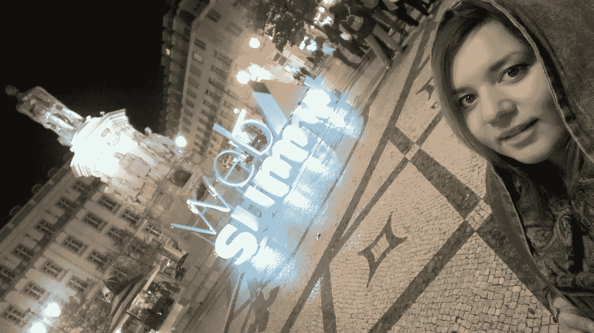
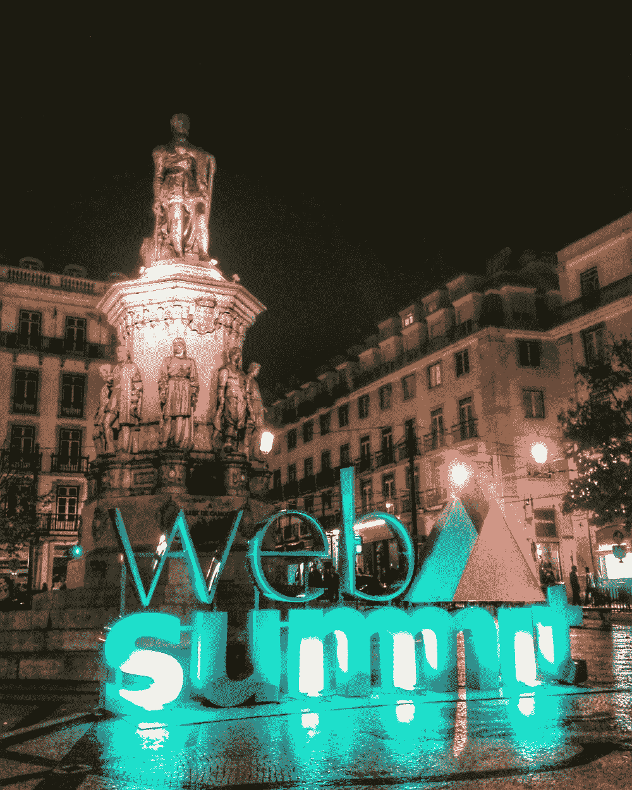
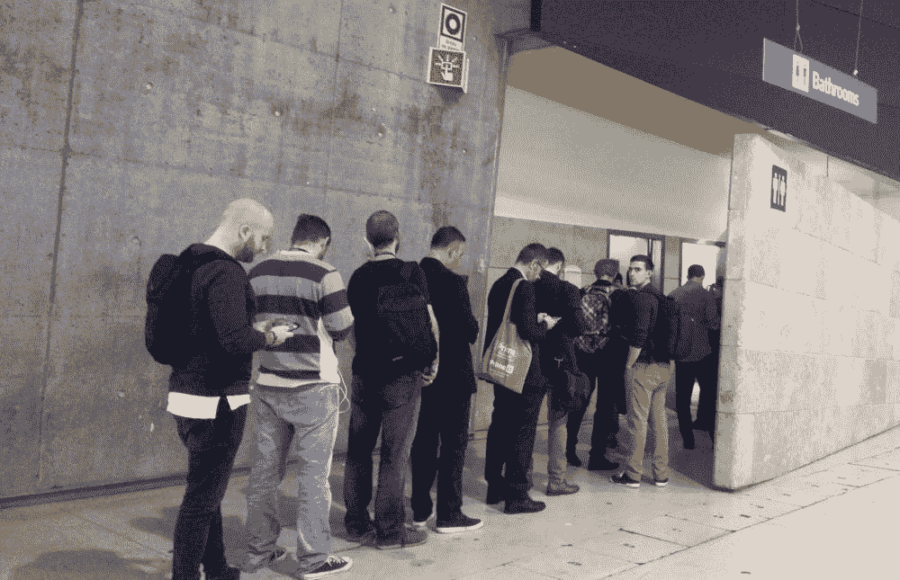
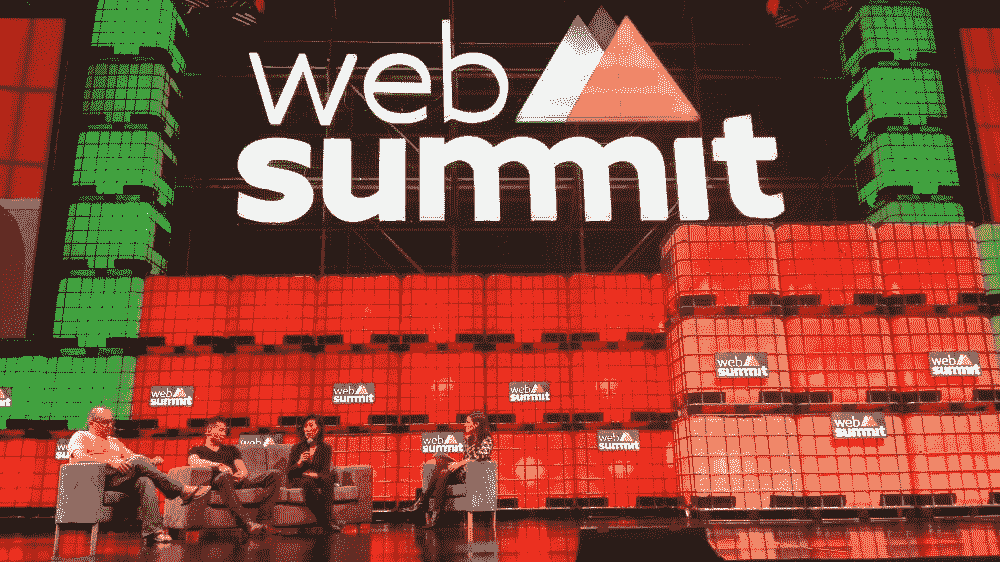
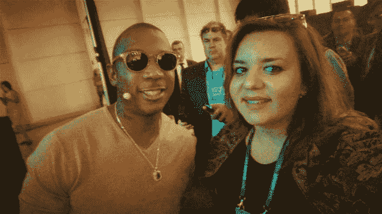
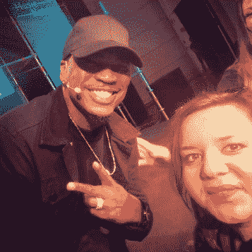
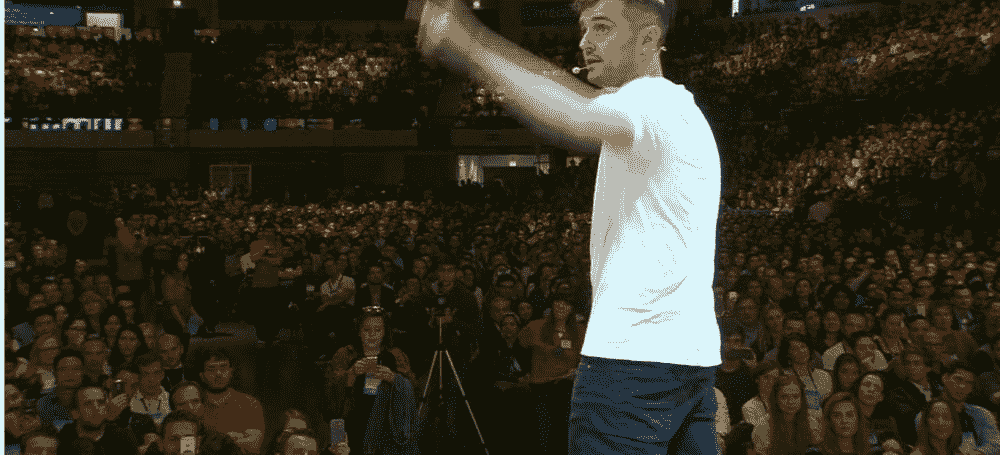
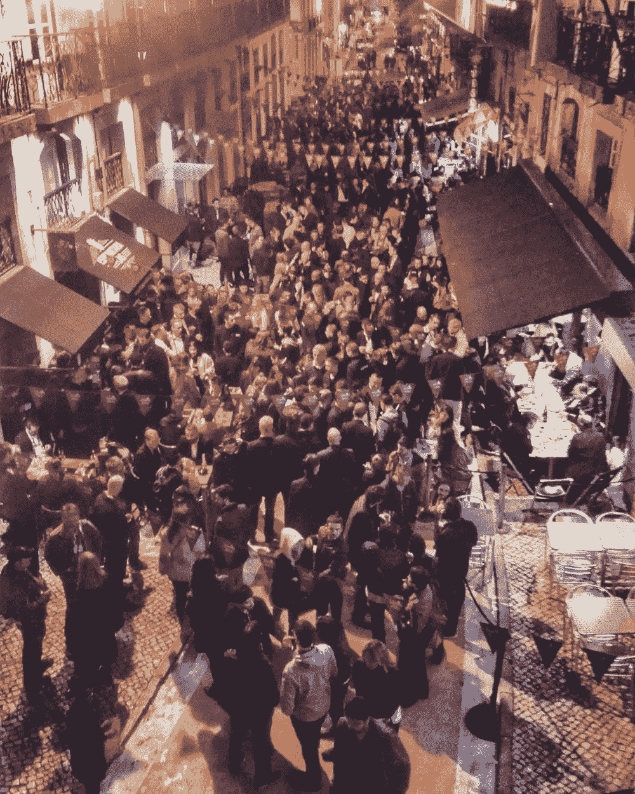
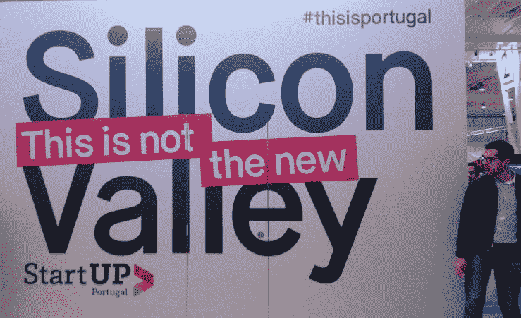
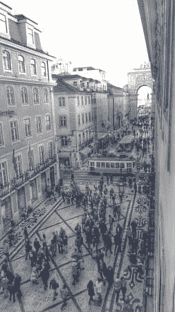

# #StartUpSelfie 在#WebSummit

> 原文：<https://medium.com/hackernoon/startupselfie-at-websummit-6d76cca2eead>

对于渴望参加大型会议的人来说，有些事情需要考虑:太忙了！

几个月前，当我查看我的电子邮件时，我注意到了一个主题——**科技女性免费参加** [网络峰会](https://websummit.net/) **。**作为马其顿科技女孩[的一名初创合伙人，我反复核对了这些信息，尽管已经提前了好几个月，我还是拿到了机票，开始计划去里斯本的旅程。](http://macedonia.girlsintech.org/)

[网络峰会](https://www.facebook.com/WebSummitHQ/)(原都柏林网络峰会)是自 2009 年以来每年举办一次的技术会议。正如 250 年前的第一次工业革命给经历过这场革命的人们的生活留下了不可磨灭的印记一样，技术正在颠覆我们对工作、社交、政治和生活本身的所有看法。不再有所谓的“技术”行业——只是受技术影响的行业——正如他们网站上所说的那样。

所以这是他们第一次在里斯本组织，也是他们第一次试图解决与会者之间的性别差距。主要是在过去的一年里，我参加了欧洲不同国家的创业活动和会议，对我来说，迄今为止最大的一次是在维也纳举行的有 5000 人参加的[先锋节](https://startupselfie.wordpress.com/2016/05/17/startupselfie-29/)，那里也有一个女性参与科技的活动。是的，事实是当你看到整个画面时，你会看到大部分是男人。所以，网络峰会提供了这个机会，值得称赞，因为在科技领域有很多女性。

为期三天的活动，有超过 50，0 00 人参加，在几个不同的舞台上有令人惊叹的主题演讲人，日程相当紧张。我不确定会发生什么，所以我决定顺其自然，在他们的移动应用程序(运行流畅)的帮助下组织我的时间。

周日下午，抵达机场，你已经可以看到里斯本将有多少生活和呼吸网络峰会精神这一整周。到处都是品牌标志，机场地铁入口处的登记帐篷，一切都井井有条，只有当地人对来自世界各地的超负荷人群感到惊讶。

# 第一天

2016 年网络峰会于周一晚上正式开幕，竞技场爆满，许多人留在外面观看直播。幸运的是，我们看了他们的 FB 现场视频，没有去竞技场，因为周一是观光和了解里斯本的日子(是的，这是我的第一次，我爱上了这座城市)，而晚上我们正在为第一天——周二——充电。

一大早我们就到达了会场，迎接我们的是排队等候入场的长龙。尽管我们已经注册了，但是一整天都有人排队等候入场、上厕所、吃东西……这是最忙碌的一天，因为我们试图弄清楚所有的舞台都放在哪里，所有关于后勤和“我的时间表”的事情都是一团糟！这一天，网络峰会获得了“等待峰会”的绰号

对我来说，第一天的亮点是[探索创业目录](https://www.facebook.com/WebSummitHQ/videos/1201316329934409/)并了解更多关于大多数创业公司目前正在做的事情。虽然他们都很兴奋能参加网络峰会，展示他们的工作，但他们最失望的一件事(甚至在我去和他们交谈的第三天)是，很少有投资者、商业天使或风险投资人来检查他们的创业角落。提示:也许下次你去“山”的时候

点击查看[的关键音符。](https://www.facebook.com/WebSummitHQ/videos/1201073603292015/)

# 第二天

从后勤的角度来看，我们准备得更好，但哦，天哪，我们一整天都没有准备好迎接美国大选的余波。当我走进 MEO 竞技场，走向前排抢占座位时，我完全震惊地目睹了《500 家创业公司》的麻烦制造者(戴夫·麦克卢尔饰)在舞台上彻底崩溃。

就这一点而言，第二天是美国新总统成为热门话题的一天。对我来说，这一天的一个亮点是“创业大学”，与 YCombinator 的贾斯汀和合撒儿进行问答环节小组讨论[如果欧洲的科技场景是第二好的](https://www.facebook.com/WebSummitHQ/videos/1202405096492199/)？事实上，千禧一代是爱情最“不成功”的一代——在[的主舞台上，Tinder](https://www.facebook.com/WebSummitHQ/videos/1203217899744252/) 的首席执行官解释了他们改善爱情的使命。

# 第三天

除了讲故事和创业，我真正热爱的另外两件事是音乐和营销。是的，这绝对是 2016 年网络峰会中我最喜欢的一天。首先，了解到音乐人(制作人[赖安·莱斯利](https://www.facebook.com/ryanleslie/)，说唱歌手[杰·鲁](https://www.facebook.com/Ruleyorkcity/)和 RnB 歌手[内约](https://www.facebook.com/NEYO/)，说唱歌手[蒂尼·坦帕](https://www.facebook.com/tinietempahofficial/)和许多其他人)对科技感兴趣，杰·鲁甚至推广他的初创公司[fyre reph](http://fyreapp.com/)对我来说是最大的亮点。因为技术可以为音乐产业带来太多的机会，改善消费者和艺术家的体验。

另一个亮点是[加里·维](https://www.facebook.com/gary/)在舞台上的现场表演——你真的需要一心一意才能成功？加里给我们带回家的信息如下:**讲故事的未来是记录旅程！**

对于任何渴望参加大型会议的人来说，需要考虑的一些事情是:太忙了！如果你没有做好功课(你要见谁，你要做什么)，你会很容易迷路。利用这个机会建立关系网，[关键笔记可以随时在网上找到](https://www.facebook.com/pg/WebSummitHQ/videos/?ref=page_internal)。结识人的好机会是在 Bairro Alto 和 Cais do Sodré(粉红街)举行的夜间峰会，在那里你可以非正式地认识人并建立联系。

创业——从你的团队中派出“骗子”去寻找你想要的东西。投资者和演讲者有他们自己的私人晚宴和派对，但是的，他们也参加夜间峰会，如果你有一个认识“家伙”的朋友，你就更容易结识了。别忘了享受！在五万名与会者的疯狂中，是的，你需要记得享受和展示你最好的自己。

尽管我更喜欢“小型”的科技活动(最多 2000 人),但我还是强烈推荐任何人去体验网络峰会，至少一次！
里斯本太棒了，是个完美的主办城市。
[2017 网络峰会](https://websummit.net/2for1)谁去？

故事原贴 [**此处**](https://startupselfie.wordpress.com/2016/11/20/startupselfie-at-websummit/)

点击心型按钮来表达你的爱，❤分享是关怀，记住这一点！

干杯

> [黑客中午](http://bit.ly/Hackernoon)是黑客如何开始他们的下午。我们是阿妹家庭的一员。我们现在[接受投稿](http://bit.ly/hackernoonsubmission)并乐意[讨论广告&赞助](mailto:partners@amipublications.com)机会。
> 
> 如果你喜欢这个故事，我们推荐你阅读我们的[最新科技故事](http://bit.ly/hackernoonlatestt)和[趋势科技故事](https://hackernoon.com/trending)。直到下一次，不要把世界的现实想当然！

