# 人工智能的现状:我们是如何来到这里的，我们接下来要去哪里？

> 原文：<https://medium.com/hackernoon/state-of-ai-how-did-we-get-here-and-where-are-we-going-next-2e2196049547>

*这是我在 2017 年 3 月的一次演讲的文字。*

世界已经意识到了人工智能。

这里有一个指数趋势的例子:在过去几年中，提到“人工智能”的公司发布的新闻稿数量激增。

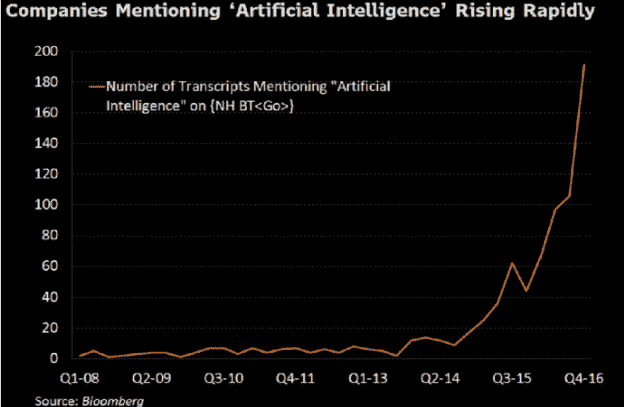

我自己进行了一项研究，并问[我的推特网](http://twitter.com/azeem):当人工智能被如此频繁地以如此多的不同方式使用时，它在区分事物方面有任何有效的效用吗？

**他们被分裂了。**

大约 58%的人说，它不再真的有那么多描述的用途了。这让我想起了约翰·麦卡锡说过的这种想法:“一旦它起作用了，就没有人再称它为人工智能了。”。

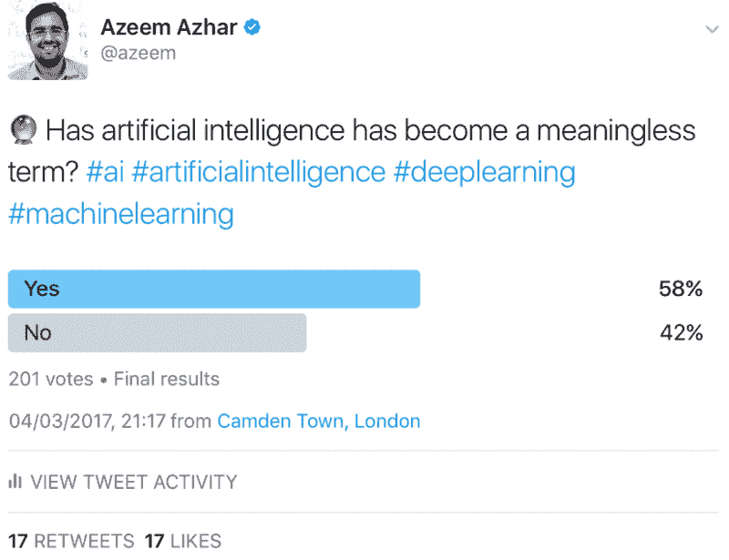

这是一个 60 年的旅程。61 年前，第一次人工智能会议在达特茅斯大学召开，汇集了麦卡锡和赫布·西蒙、诺伯特·维纳和马丁·明斯基等人。

当时他们认为他们将解决人工智能的问题，我们现在称之为人工通用智能:在几年内建造一台可以复制人类智能的机器——他们通常会说在十年内。

More, McCarthy, Minsky, Selfridge and Solomonoff

## 他们怎么会这么乐观？

这有几个原因，重要的是把它们放在历史背景中:

聚集在一起的美国科学家是被称为最伟大的一代的一部分。他们经历了大萧条，目睹了美国赢得二战。他们已经成为世界上的主要出口国，他们已经将他们的资源用于曼哈顿计划来制造原子弹。

1956 年，他们还没有在太空竞赛中输给苏联。

但是，有几个问题:

1.  他们并不真正知道人脑是如何工作的。当你对你试图模仿的东西的机制只有模糊的理解时，你很难做出什么东西来。
2.  他们的数学或逻辑工作的方式在很大程度上基于符号逻辑或决策树，正如我们最近在统计或概率模型中看到的突破，这不一定是传递看起来模糊智能的东西的理想方式。
3.  当时他们没有集成电路。

这群伟大的头脑面临着一些严峻的挑战。他们真的不知道他们在建造什么，他们真的没有那种数学来建造它，他们真的没有运行数学的处理能力。

# 创新周期——我们在哪里？

六十年前就这么多了。但今天，人工智能似乎不仅仅存在，而且正处于爆发成为重要事物的尖端。问题是:我们如何从那个时刻到我们似乎在建造小东西的时刻，然后突然有一个时刻，似乎有一种发展的冲动，一种优越感？卡洛塔·佩雷斯开发了一个强大的框架:她以周期的方式思考技术浪潮。

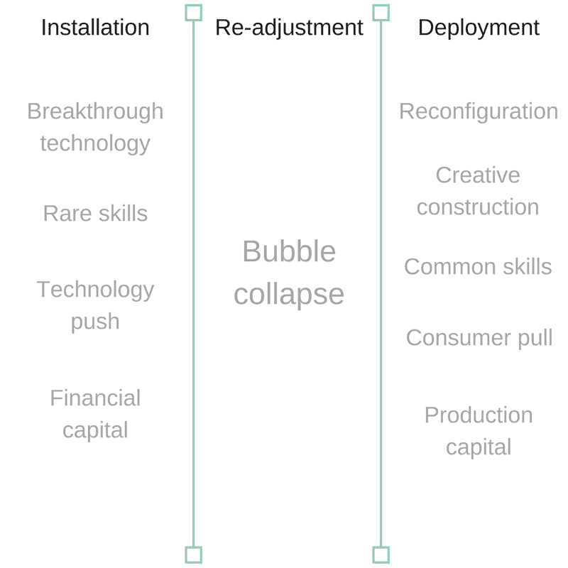

**在她对五次革命过程的描述中，技术革命是一个社会在四十到五十年的时间里通过安装、调整和部署来重新配置自己的过程。**

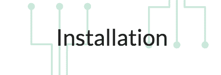

这就是有某种突破性技术的地方，将突破性技术与真正罕见的技能结合起来创造了一系列机会。

这项技术并没有那么有用，所以需要使用技术推动将其部署到市场中。这就是我们许多人会记得的那些没有真正工作的小玩意。

在这一阶段，金融投机者，金融资本意识到一个新的市场即将形成，因为他们可以很快地重新配置自己，金融投机资本很早就开始涌入这个市场。它赶在技术被广泛部署之前涌入。

再调整或“转折点”是不稳定的过渡时期，最终是经济崩溃。

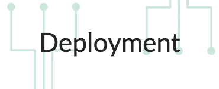

最后一个阶段是重新配置阶段。

这是一个创造性建设的时代；这是一个利用这一突破性技术所需的技能被广泛传播的时代。

这是一个消费者积极寻找依赖于该技术的解决方案的时代。这也是生产资本而不是纯粹的投机资本被用于建设新基础设施的时候。

## 这个模型可以帮助我们思考我们在循环中的位置，以及世界将会是什么样子。

Find a Ford: *The Model T was introduced in 1908; it was incredibly popular within five or six years. This photos from 1926 in New York City, 18 years after the introduction of Model T.*

这是 1926 年的纽约。福特 T 型车问世 18 年后。那时，技术革命仍处于其*部署阶段*。

1908 年，亨利·福特引入了福特主义和生产线的概念。这是一个全新的概念。福特汽车的销售增长非常快，在当时是指数增长。

有一个调整阶段:华尔街在 1929 年崩溃，接着是大萧条，然后是第二次世界大战。在那个部署阶段之后，美国历史上出现了一个令人难以置信的乐观时期:他们修建了高速公路，开始了空中旅行，假日成为一种新常态，郊区繁荣起来，郊区购物中心也繁荣起来。许多经济、技术和商业创新部署在一个安装平台上。

## 考虑到卡洛塔的理论，我们需要问:我们在信息和通信技术方面进展如何？(AI 真的是那一波的一部分？)

我们已经看到，英特尔 4004 处理器的安装阶段始于 1971 年。我们看到了对稀有技能的需求。只有少数人涉足科技行业，有些公司获得了巨大的市场力量:*英特尔、微软、甲骨文*。与此同时，我们看到了风险投资行业从 60 年代末开始的增长。

我们有过重新适应的时刻。我们经历了网络泡沫。看看 WebVan.com 和 Kozmo.com。他们在 2000 年遇到了典型的电子商务问题。互联网上没有足够的用户，技术基础设施不成熟，软件很廉价。简而言之，远不是我们今天看到的黄金时段。

我也可以从个人经历来说。我在法国投资了一个在线房地产门户网站。今天看来是个好主意。今天大多数人使用在线搜索他们的家。**不是 1999 年**。在法国，没有一个房地产经纪人有电脑，他们买房的顾客也没有电脑。我们有巨大的客户获取成本，我们不得不向他们购买技术:个人电脑、调制解调器、第二根电话线。

# 摩尔定律、数据海洋和业务再造

佩雷斯的模型适合我们今天的情况吗？如果有，对我们 AI 领域意味着什么？我们似乎已经发展到了一个阶段，在这个阶段已经有了很多关键的基础设施。我会调查三个。

## 摩尔定律的极限及其超越

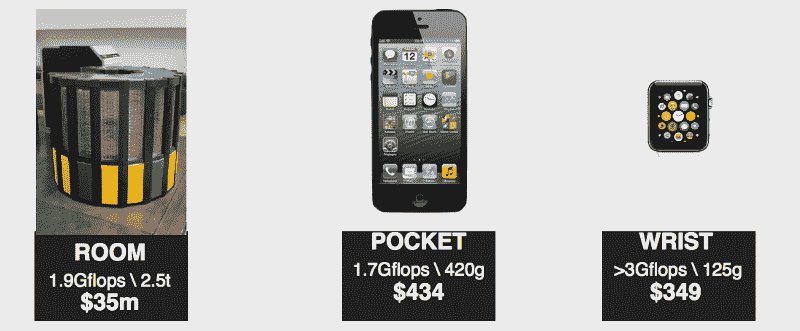

当我 13 岁的时候，我渴望得到克雷-2。它重 2.5 吨，造价 3500 万美元，可以进行 1.9 千兆次的浮点运算。我家里的电脑速度大约是 10，000。有趣的是，早在 1971 年，也就是我出生的前一年，4004 处理器每秒可以将两个 8 位数字相加 11000 次。试着运行你的神经网络。

随着摩尔定律的继续应用，我们到了 iPhone 4 和 Cray-2 一样强大的地步，它的价格是 400 美元，它就放在我们厨房的抽屉里。Apple Watch 重 100 克，售价 300 美元，原始处理能力是 Cray-2 的两倍。

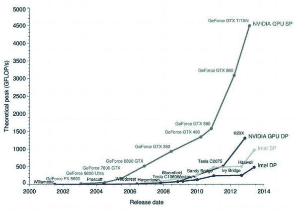

我发现有趣的是，即使我们达到了摩尔定律的物理极限，这个行业也没有停滞不前。蓝色曲线显示我们开始发现架构增强和更专业的架构以及 GPU 的视频范围，您可以看到它们在处理方面的增长曲线。

## 数据的可用性

数据是推动我们进行数学运算的火箭燃料。2013 年，世界上大约有 40 亿字节的数据，其中 90%是在过去两年中产生的。

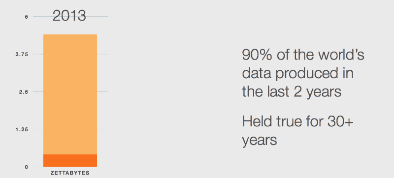

基本上，在不远的 2025 年，我们将在一周内产生的数据量将与人类作为一个物种直到 2013 年产生的数据总量相同。那是相当大的变化。

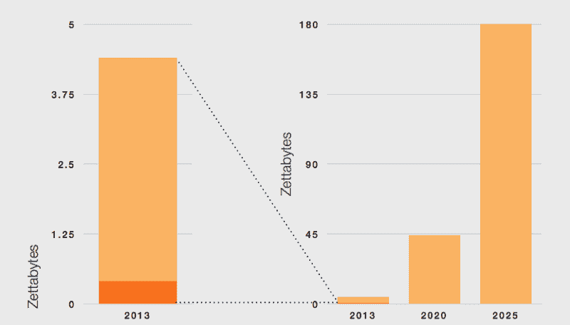

Source: IDC

在我们都拥有智能手机之前，我们并没有真正创造出那么多数据；现在有了智能手机，不用真正思考，我们正在创造*大量数据*:我们正在创造推文、照片、视频、互动和信息。此外，不仅仅是人的数据，还有机器的数据。

他们产生的数据将会非常非常有趣。

如果我们看看 CMOS 传感器的增长，我们会发现增长平缓，直到 2011 年 iPhone 销量开始上升。从那以后，CMOS 传感器的出货量达到了 20 亿。我们预测未来八年内将达到 60 亿或 3 倍的增长。

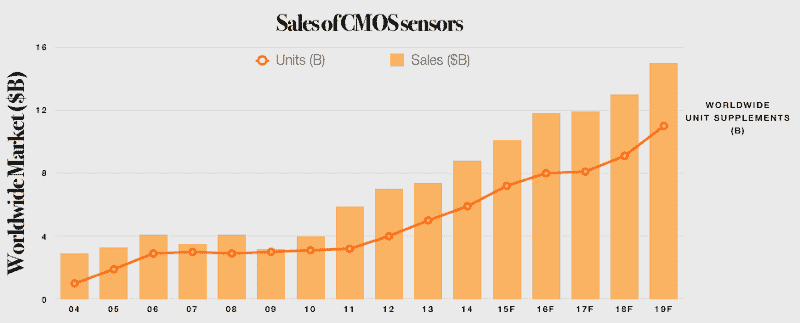

Source: IC Insights

我们也看到了来自其他地方的数据源。这些都发生在顶部，与消费者家中使用物联网的情况无关。仅从地球观测数据来看，向军方和私人出售地球观测数据的需求有了巨大的增长。发射去观察地球的卫星数量也在增长。

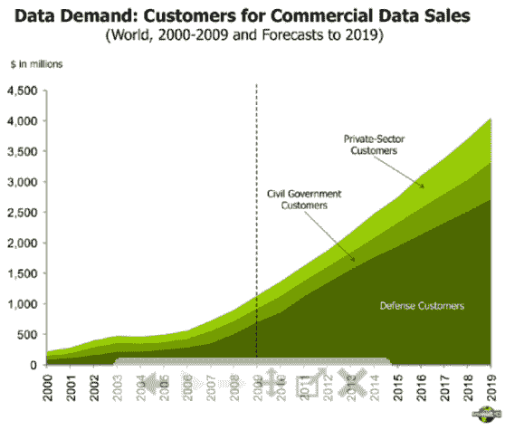

Orbital Insights 和 SpaceKnow 等公司正在从地球观测卫星上拍摄照片，并通过机器[学习](https://hackernoon.com/tagged/learning)和机器视觉来预测人类公司的表现。

如果 JC Penney 购物中心在二月的某个星期二的汽车数量少于二月的前几个星期二[，这可能会告诉你他们的销售情况有多好](https://thenextweb.com/insider/2017/03/08/palo-alto-startup-predicts-retail-failure-via-satellite-images/#.tnw_SFmMDYc0)。当然，你可以把它应用到停靠在孟买码头的油轮或在新加坡卸货的货物上。

## 这个世界已经变成了软件驱动的世界

三件事正在发生。

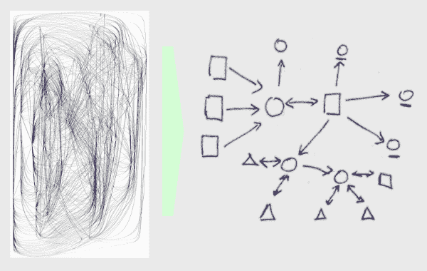

1.从架构上来说，软件看起来不像是一大堆没有很好记录的意大利面条式的代码。

它看起来像这个完美的架构图，有非常简洁的功能和 API，以及它们之间定义良好的契约。

2.企业已经对自身进行了再造。BPR，即业务流程再造，是从 80 年代末到网络泡沫时期，所有咨询公司都向大中型公司推销的东西。

业务流程工程本质上是通过使公司的内部运作可分离来模拟和契约化，允许我们找到核心能力，实现外包。

3. **AI 锁定循环**效果出现。它是这样工作的:

一旦你把一个人工智能放入你的物流公司的产品中某种预测或某种优化、安全或路线算法，你的服务和产品就会变得更好。

随着你的产品变得更好，你会产生更多的数据，同时，如果你有一个像样的商业模式，一个更好的产品应该意味着更多的利润。更多的利润意味着再投资改善人工智能。已经无路可退了。

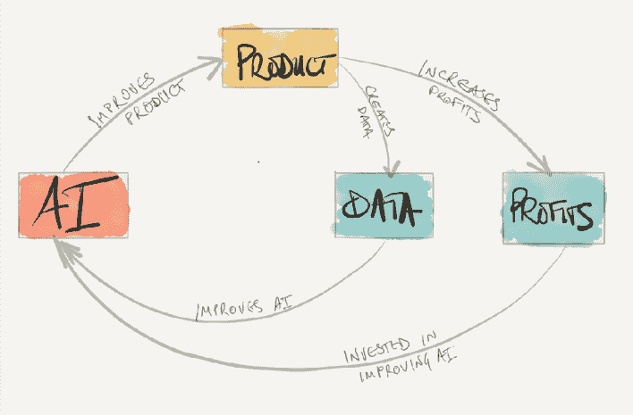

我们所看到的是，一旦你成功地将人工智能应用到一个行业和一个部门，没有它就不可能竞争。

想想网络搜索——网络搜索必须包含机器学习和人工智能，几乎无法想象有人会推出不使用某种机器学习或数据科学的网络搜索引擎。你不会启动一个仅仅把 *Tf-idf* 作为排名的网络搜索引擎。

我们看到的另一件事是，人工智能**打败人类是非常非常正常的。几乎每周都有另一个窄领域人工智能超越人类的例子。**

如今，语音识别的错误率为 5.9%，远远好于人类，甚至更进一步。

回到 2013 年或 2012 年，这些事情都不会用机器学习来做得更好——**一件也没有，**而且这只是几年前的事情。

**我们的行业似乎存在一个问题，这个问题以前在石油行业也曾出现过。**

像标准石油和福特这样的大公司控制了石油工业的关键部分。

就我们而言，与我们任何人相比，谷歌和脸书拥有无限的计算能力和技术。问题是它给了他们什么样的长期结构优势？我们是不是把资本主义桌子上掉下来的面包屑弄到这把椅子上来了？我们真的有能力在这些领域中竞争吗？

这些公司真的渴望在全球范围内建立自己的人才基础，如果你是一名企业家，这就造成了一种紧张，因为在你创业的早期，你可以从谷歌或苹果那里获得*去你的钱*。

我仍然认为一个完整的员工队伍很重要。优步不是一家机器学习公司，但价值是迄今为止最大的人工智能公司的 100 倍，他们对自动化做出了相当重大的承诺*。*他们收购了 Otto，收购了 CMU 机器人团队，并在业务中的许多地方使用了 ML，不仅仅是在路由中，甚至在我们一些人可能仍在使用的消费者应用程序中。

# 这是一个惊人的创新时期。和责任。

今天，您可以构建的产品控制着我们的界面，并访问我们需要的所有服务。

你必须在某种程度上扮演公民领袖的角色。

你决定了我们的注意力如何被消耗，你决定了我们如何理解我们的新闻。你在某种程度上决定了我们的公民社会是如何运作的。我认为，作为产品企业家，承担起这些责任真的很重要，尤其是当你基本上要在我和现实世界之间建立起一座桥梁的时候。

> 你可以在我的每周时事通讯中读到更多关于最紧迫的技术问题。[在这里注册指数视图](http://bit.ly/exponentialview)。

> [黑客中午](http://bit.ly/Hackernoon)是黑客如何开始他们的下午。我们是 [@AMI](http://bit.ly/atAMIatAMI) 家庭的一员。我们现在[接受投稿](http://bit.ly/hackernoonsubmission)并乐意[讨论广告&赞助](mailto:partners@amipublications.com)机会。
> 
> 如果你喜欢这个故事，我们推荐你阅读我们的[最新科技故事](http://bit.ly/hackernoonlatestt)和[趋势科技故事](https://hackernoon.com/trending)。直到下一次，不要把世界的现实想当然！

