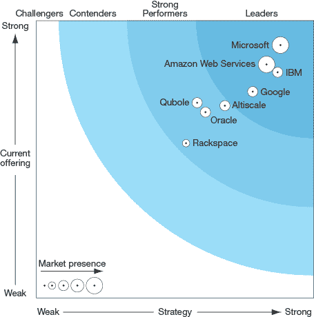
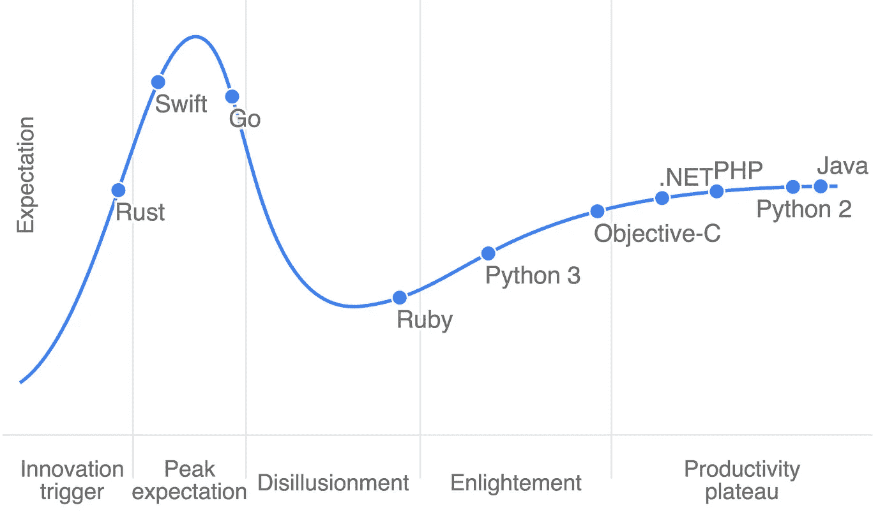
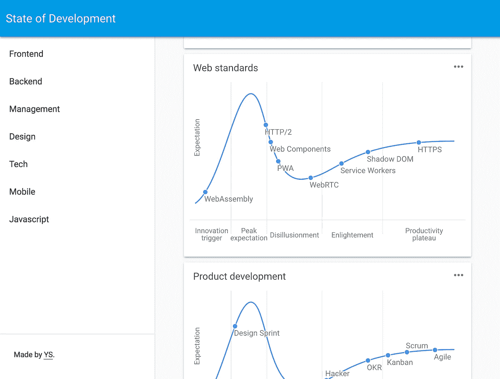

# 发展状况

> 原文：<https://medium.com/hackernoon/state-of-dev-c609cc12084b>

今天我发布了 [State.of.dev](https://stateofdev.com/) ，这是一个可视化当前开发状态的项目，按照关键主题进行划分。太棒了，太棒了，你会喜欢的…

我喜欢数据的可视化。乍看之下，它提供了一个快速概览，但放大后，它也提供了关系之间更深层次的含义。我最喜欢的一个形象化的例子是 Gartner 炒作周期:

IT 咨询公司 Gartner 几十年来一直在创造这种模式。他们试图捕捉新兴技术的状态，将炒作与生产力分开。

它将来自 VR、AR、机器学习、物联网和量子计算的主题放在一个视觉表示中。一张图表。横轴表示技术阶段，纵轴表示预期。

这种可视化之所以如此吸引人，是因为它为你提供了一个了解和探索某个市场及其关键技术的起点。

这些信息可以帮助你决定是将你的时间和金钱投入到一项新兴的[技术](https://hackernoon.com/tagged/technology)，还是等待炒作过去。

另一个例子是另一家咨询公司 [Forrester](https://www.google.nl/url?sa=t&rct=j&q=&esrc=s&source=web&cd=1&cad=rja&uact=8&ved=0ahUKEwjPpdvJyaPSAhUF7hoKHXK2CrAQFgggMAA&url=https%3A%2F%2Fgo.forrester.com%2F&usg=AFQjCNHpeD3fILWswrh5qkhUnthD-NDZbg&sig2=cALfER0VM1jN4Ymdx1-5QQ) ，他制作了以下图表来捕捉大数据 Hadoop 云玩家的状态:

Cloud players and their big data offering.

就个人而言，它包含了太多的信息(战略质量、产品提供深度和市场存在)，但提供了对市场中参与者定位的有趣概述。

在此基础上，stateofdev.com 背后的理念得以发展。它提供了广泛的专家主题、特定的市场图表类型，并通过定位相关(新兴)技术所处的阶段来识别它们。

Programming languages ‘17

State.of.dev 有交互式图表，代表主题中的当前开发状态:[技术](http://stateofdev.com/t/technology)、 [javascript 框架](http://stateofdev.com/t/javascript-frameworks)、 [web 标准](http://stateofdev.com/t/web-standards)、[设计趋势](http://stateofdev.com/t/design)、 [SEO](http://stateofdev.com/t/seo) 以及超过 15 个主题，按特定的专家分组，如[前端](http://stateofdev.com/c/frontend)、[初创公司](https://stateofdev.com/c/startups)或[移动设备](http://stateofdev.com/c/mobile)。

# 它解决了什么

*   对市场内正在发生的事情(创新、采用、趋势)的直升机式概述，而不必从新闻网站、时事通讯、论坛等中单独提取。
*   了解最新的新兴技术、范例、趋势和[工具](https://hackernoon.com/tagged/tools)。
*   对关键趋势的成熟度和采用生命周期做出可行决策的基础。

# 它应该发展成什么样子

*   最新技术创新资源。
*   可视化一个(专家)主题的状态，识别当前的相关趋势及其状态。
*   更深入研究的起点。
*   专家和/或社区对每个版本的意见。
*   技术发展趋势的时间表。
*   广泛的操作主题(超越网络开发)。

# 现在是什么

*   一个非常早期的测试版本，有第一个版本的图表和背景信息。
*   web 开发的状态，基于我自己的专业知识(还没有外部的贡献)。

[检查一下](https://stateofdev.com/)。

The live homepage, as a screenshot

PS:如果你想投稿就平我 [Yvo Schaap](https://medium.com/u/b1e1e99cd175?source=post_page-----c609cc12084b--------------------------------) 。

> [黑客中午](http://bit.ly/Hackernoon)是黑客如何开始他们的下午。我们是 [@AMI](http://bit.ly/atAMIatAMI) 家庭的一员。我们现在[接受投稿](http://bit.ly/hackernoonsubmission)，并乐意[讨论广告&赞助](mailto:partners@amipublications.com)机会。
> 
> 如果你喜欢这个故事，我们推荐你阅读我们的[最新科技故事](http://bit.ly/hackernoonlatestt)和[趋势科技故事](https://hackernoon.com/trending)。直到下一次，不要把世界的现实想当然！

