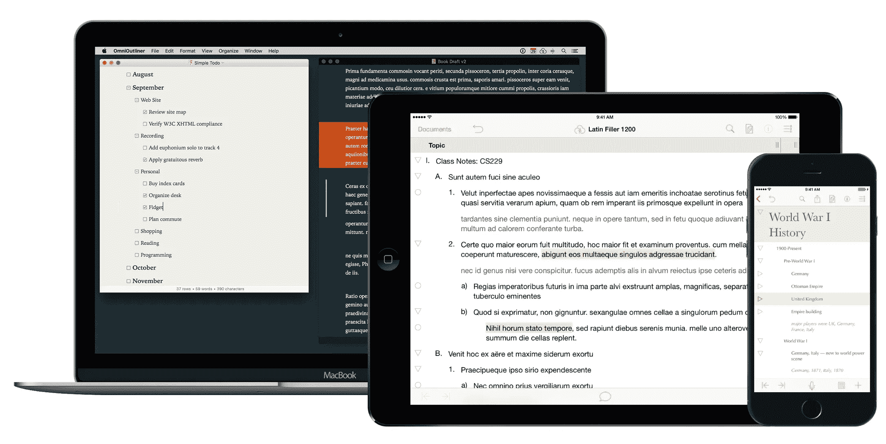
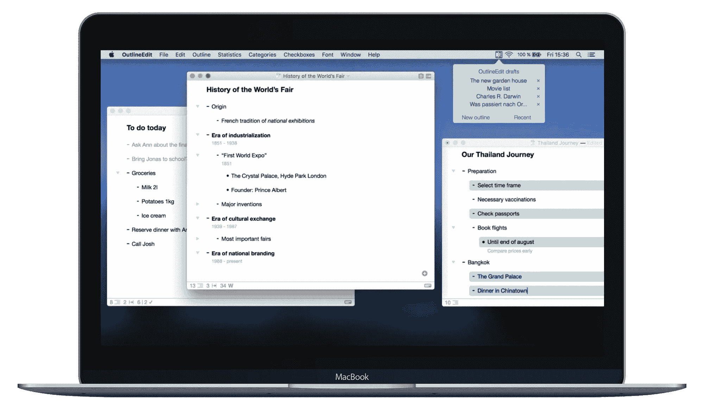
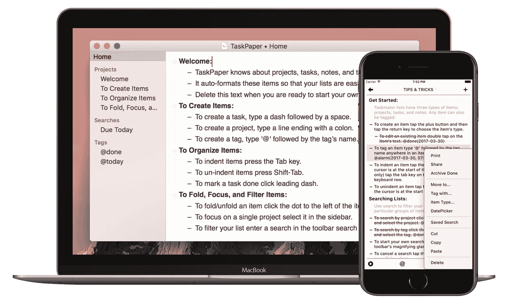
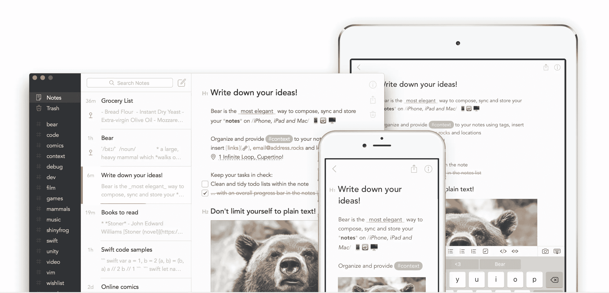
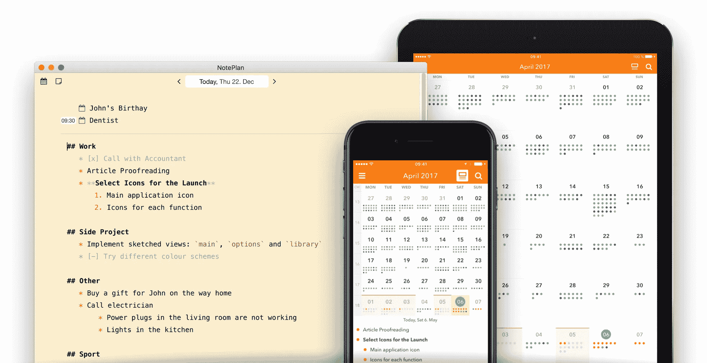

# iOS 和 macOS 上 Outliner 应用程序的状态

> 原文：<https://medium.com/hackernoon/state-of-outliner-app-for-ios-and-macos-71bb759e08c2>

Graphics are designed by [Ervin Bolat,](https://thenounproject.com/ervin.bolat/) [Sriramteja SRT,](https://thenounproject.com/srthdyt/) and [Mikicon](https://thenounproject.com/mikicon/) with minor modification by the author.

我已经有一段时间使用 [Workflowy Journal](/@amirmasoudabdol/workflowy-journal-d33405065d64) 作为我的主要生产力方法，因此 [Workflowy](http://workflowy.com/) 作为我的主要生产力应用/服务。我从来没有想过我会持续使用它这么长时间。这可能是因为我是根据自己的需要设计的，而且它足够灵活，可以随着时间的推移进行调整。我也对 Medium 上的阅读量和推荐量感到惊讶。似乎它也为有其他需求的人工作。那确实非常好！

随着时间的推移，*概述*被证明是收集、组织和追求我的想法的有效方法。虽然我对大纲很满意，但我对工作流即服务不是很满意。接近零的开发速度和发布一些非常老的*要求的特性*的几次延迟已经开始变得令人沮丧。工作流在目前的状态下并不意味着不再有用；然而，你开始看到特定特性的可用性是如何改进你的“工作流”的，但不幸的是，它们永远不会在 Workflowy 的情况下得到开发。直到最近，该团队才开始雇佣一名工程师来“可能”重新开始开发。

举几个 Workflowy 的缺点，我可以从强调 iOS 和/或 macOS 上缺乏原生的应用开始。虽然 Workflowy 在 App Store 上有一个 iOS 应用程序，但 UX 并不合适。这是因为该应用程序本质上是网站的包装器，所以非默认的文本编辑体验和整体迟缓的 web 包装器 UI 对 UX 没有帮助。过了一段时间，我发现自己不再使用 iOS 应用程序，只是很少用于阅读或复习。在缺失的功能列表中，Workflowy 根本不处理日期，它不提供集成选项，不提供 API，我希望这些年后它能支持 Markdown，至少在 notes 中是这样，但是没有。他们最近又以 web-wrapper 的形式发布了他们的 macOS/Linux/Window [应用程序](https://hackernoon.com/tagged/apps)，基于电子的应用程序[我不太喜欢。](https://josephg.com/blog/electron-is-flash-for-the-desktop/)

所以，我几乎放弃了 Workflowy。我仍然经常使用它，因为我有很多数据存储在那里，但我开始寻找替代品。有几种替代方案可供选择，每种都有其优缺点，从非常复杂的 [OmniOutliner](https://www.omnigroup.com/omnioutliner) 到基于文本的[taskpad](https://www.taskpaper.com)和基于网络的 [Dynalist](https://dynalist.io) 。在这里，我将试着浏览一个我测试过的或感兴趣的应用程序列表，这些应用程序也可以支持无痛的工作流/子弹日志集成。最后我会提两个 app，技术上不是“outliners”，但是可以用来高效实现 Workflowy/Bullet Journal。

## 【macOS 版 omni outliner 和 iOS 版[omni outliner](https://itunes.apple.com/us/app/omnioutliner-2/id704610906?mt=8&at=1000l3&ct=medium)

OmniOutliner 老了。因此它是健壮的！它提供了广泛的功能列表。事实上，Pro 版本的功能如此丰富，以至于他们最近决定为更多的临时用户发布一个简化版本，OmniOutliner Essential。🤷🏻‍♂️

基本版本是一个简单的大纲视图，功能非常有限。它提供了一些主题，过滤(搜索)和无干扰模式。我发现它非常有局限性，也因为它不支持聚焦在一个项目上。另一方面，Pro 版本则配备了诸如*保存的过滤器*、*打字机模式*、*聚焦*、*可定制样式*和*多列文档*等功能。Essential 或 Pro 都不支持标记(#tags 或@ tags)；然而，Pro 的高级过滤可以取代标签的缺乏，前提是你愿意为每个标签制作一个过滤器，或者每次都快速搜索你的标签，而这并不是最优的。我假设 Pro 版本中强大的主题引擎可以用来根据 come 标准突出显示单词，例如以 `*#*`开头的*；然而，这也需要额外的定制。这也使得 OmniOutlier 成为一个不太吸引人的快速概述和回顾应用。总的来说，我猜 OmniOutliner 的重点是造型。你可以制作一个非常专业的列表或表格。然而，与 app 的重复参与并不像 Workflowy 那样顺畅。*

iOS 版的 [OmniOutliner 是一款“更简单”的应用，感觉没有 macOS Pro 版复杂。然而，在 29.99 美元，我宁愿先满意 macOS 版本，它本身的价格为 9.99 美元的](https://itunes.apple.com/us/app/omnioutliner-2/id704610906?mt=8&at=1000l3&ct=medium)[基本版](https://geo.itunes.apple.com/us/app/omnioutliner-5/id1142578772?mt=12&at=1000l3&ct=medium)和 59.99 美元的[专业版](https://geo.itunes.apple.com/us/app/omnioutliner-5/id1142578772?mt=12&at=1000l3&ct=medium)。值得一提的是，Omni Group 提供云服务，你不能通过 iCloud 或 Dropbox 进行同步。

## [用于 macOS 的 OutlineEdit】](https://geo.itunes.apple.com/us/app/outlineedit-beautiful-outliner/id878995413?mt=12&at=1000l3&ct=medium)

OutlineEdit 是一款鲜为人知但很棒的应用，它只做一件事，而且做得很好。与 OmniOutliner 相比，OutlineEdit 是一个 Outliner，仅此而已。因此，没有太多可用的样式特性，没有字体选项，也没有主题。但是，也包含了许多概述的具体特性，例如*项的注释*、*类别*和*颜色标注*、*复选框*、*折叠*、*统计*等。

OutlineEdit 独特地提供了两个功能，用于“即时”或从网页上收集笔记。*快速访问*是一个菜单栏弹出窗口，可以被`Cmd+Option+O`调用，显示已经保存的大纲草稿，并允许你从菜单栏创建一个新的大纲。Safari 的*Marker*是一个 Safari 扩展，可以标记网页中的文本，然后保存到大纲中。

我觉得 OutlineEdit 对于它的价格来说是一个可靠直观的 outliner， [*免费*](https://geo.itunes.apple.com/us/app/outlineedit-beautiful-outliner/id878995413?mt=12&at=1000l3)*)*；然而，行内标签的缺乏是显而易见的。事实上，有类别可以分配给每个项目，这意味着一个项目不能有一个以上的类别。

## [MAC OS 的 TaskPaper](https://geo.itunes.apple.com/us/app/taskpaper-plain-text-to-do-lists/id1090940630?mt=12&at=1000l3&ct=medium)和 iOS 的[task mator](https://itunes.apple.com/us/app/taskmator-taskpaper-client-plain-text-todo-list/id806250172?mt=8&at=1000l3&ct=medium)

TaskPaper 是一个特殊的应用程序，它本身不是一个 outliner，但在某种意义上，它几乎比 outliner 做得更多！TaskPaper 基本上是一个解析器，用于解析`taskpaper`文件格式，这是一个纯文本文件，只有很少的规则，用来表示任务列表，也称为*任务文件*！在一个`taskpaper`文件中，有三种类型的条目/行、项目、任务和注释。项目在其名称`Project A:`后用冒号(`:`)来区分，任务是以破折号(`-`)开头的行，最后一行没有破折号或不以冒号结尾的是注释。

除了项目、任务和注释之外，TaskPaper 还拥有 outliner 应用程序中最强大的内嵌标签支持。每个以`@`开头的单词都是内嵌标签；然而，标签不仅仅是彩色的或可点击的单词。TaskPaper 中的标签可以有不同的属性；例如，可以通过`@start(2017-06-17)`指定任务的开始时间，或者通过`@at(Home)`为任务添加位置环境。由于标签具有属性，TaskPaper 应用程序提供了高级过滤和保存的搜索功能，以获取大多数标签。过滤功能可以搜索和运行标签属性查询；例如，可以过滤下周`@due`或上周`@completed`的项目。这是非常强大的。

TaskPaper 多年来一直在积极开发中，并且拥有一个庞大的用户社区，他们正在编写脚本，提供解决方案，并为进一步的开发带来新的想法。我只在较小的项目中使用 TaskPaper。其中一个原因是与工作流程相比，折叠和展开的体验非常不同和繁琐。这可能是因为 TaskPaper 总是试图将纯文本文件组织成大纲(层次)格式。这在某种程度上损害了流畅的大纲体验，因为在某种程度上，您需要自己处理空间和制表符。对于大型项目，不使用 TaskPaper 的另一个原因是*存档*机制，这是通过将已完成的(`@done`)项移动到文件末尾来实现的；不过，我还是更喜欢 Workflowy 方法，*显示/隐藏已完成的项目*。

在 iOS 端，taskppaper 没有官方 app，但是 iOS 版的[task mator](https://itunes.apple.com/us/app/taskmator-taskpaper-client-plain-text-todo-list/id806250172?mt=8&at=1000l3&ct=medium)(不隶属于 taskppaper)完全支持`taskpaper`文件。它类似于 macOS 版本的许多功能，如标记、过滤等。我个人并不喜欢它的设计。我更喜欢更扁平、更现代的设计，但如果你同意的话，这可能是 iOS 上最好的“任务纸”应用。另一个选项是 iOS 的[编辑器，它是 Markdown 编辑器，也可以编辑`taskpaper`文件。](https://itunes.apple.com/us/app/editorial/id673907758?mt=8&at=1000l3&ct=medium)

在我转到下一个应用之前，我应该提一下来自同一个开发者的 macOS 的 [FoldingText。FoldingText 与 TaskPaper 非常相似，它支持`taskpaper`文件的几乎所有功能，还增加了 Markdown 支持。所以感觉更像是一个写作环境，也可以认为是一个 outliner，因为它可以处理图层和折叠。该应用程序旨在将笔记转换为`taskpaper`文件格式。因为 Markdown 支持，我实际上更喜欢 FoldingText。](https://geo.itunes.apple.com/us/app/foldingtext/id540003654?mt=12&at=1000l3&ct=medium)

## [超出 macOS 的范围](https://geo.itunes.apple.com/us/app/outlinely-think-write-organize/id843692954?mt=12&at=1000l3&ct=medium)和[超出 iOS 的范围](https://itunes.apple.com/us/app/outlinely-outliner-beautiful-outline-notes/id1170878793?mt=8&at=1000l3&ct=medium)

Outlinely 是另一个不太知名的应用。然而，它可能是实现子弹日记的装备最好的应用程序。macOS 和 iOS 的应用程序都设计得很漂亮，而且它们与系统很好地结合在一起。此外，两者都带来了不同类别应用程序的大量功能，例如降价编辑器、笔记和待办事项应用程序。仅举几例:*标签*、*待办事项*、*复选框*、*库管理*、*聚焦模式*、*打字机滚动*、*文本高亮*、 *Markdown 高亮*、*自定义主题图库*、*笔记链接*等。

大纲涵盖了工作流的许多缺点，并借鉴了 TaskPaper 的一些高级功能。Outlinely 是一个 outliner，它使用一些与 OPML 相关的格式作为文件结构，这使得 UX 非常类似于 Workflowy。Outlinely 还通过实现内置的库管理器解决了 TaskPaper 的一个缺点。你所有的大纲文件都在一个地方，应用程序正在为你管理它们。因此，您可以在所有这些文件中进行搜索和筛选，而不必每次都麻烦地查找和打开项目文件。最重要的是，Outlinely 通过 iCloud 在 iOS 和 macOS 设备之间同步您的所有库。

总的来说，Outlinely 有完整的包。开发人员已经做了研究，并设法让事情尽可能简单，但仍然提供了许多先进的和要求的功能。[面向 macOS 的 Outlinely](https://geo.itunes.apple.com/us/app/outlinely-think-write-organize/id843692954?mt=12&at=1000l3&ct=medium)是 39.99 美元的一次性购买，面向 iOS 的[Outlinely](https://itunes.apple.com/us/app/outlinely-outliner-beautiful-outline-notes/id1170878793?mt=8&at=1000l3&ct=medium)免费提供基本功能，而添加 Pro 功能和 iCloud 同步到应用程序的费用为每年 14.99 美元。因此，设置一切将花费您大约 55 美元，之后，它会下降到 14.99 美元的年度订阅。这是一项相当昂贵的投资，但相比之下，Workflowy Pro 每月将花费 4.99 美元。🤷🏻‍♂️

## 其他应用程序

在 outliners 的领域之外，我想提到两个笔记应用程序，只有通过添加内嵌标记功能，才能高效地实现 Workflowy Journal 方法。由于它们基本上是笔记应用程序，它们可能对更多文本工作流的用户更有用。

## [熊用于 macOS](https://geo.itunes.apple.com/us/app/bear/id1091189122?mt=12&at=1000l3&ct=medium) 和[熊用于 iOS](https://itunes.apple.com/us/app/bear/id1016366447?mt=8&at=1000l3&ct=medium)

我想现在每个人都应该知道贝尔了。他们赢得了 2017 年 WWDC 苹果设计奖。app 设计的很好，当然干净！这是一个伟大的笔记应用程序与 Markdown 支持一些强大的功能。最引人注目的是内嵌标签、注释链接和文档库。它们遵循与 Outlinely 相同的商业模式，提供免费下载、有限的功能和本地存储。添加 iCloud 同步和激活所有功能的费用为每月 1.49 美元或每年 14.99 美元。我认为对于一个设计良好的笔记应用程序来说，14.99 美元/年是一个非常合理的价格，尤其是像 Evernote 这样的应用程序已经花费了 59.99 美元/年！

## [注意 macOS 的计划](https://geo.itunes.apple.com/us/app/noteplan-markdown-todo-list-notes-and-calendar/id1137020764?mt=12&at=1000l3&ct=medium)和[注意 iOS 的计划](https://itunes.apple.com/nl/app/noteplan-markdown-todo-list-notes-and-calendar/id1180443101?mt=8&uo=4&at=1000l3&ct=medium)

NotePlan 是一个相对较新的应用，但有一个有趣的想法。设计师希望将笔记、日历和提醒功能放在一个地方，甚至从名字就可以看出这一点。该应用程序会打开一个日历视图，您可以在其中查看您的日程安排。点击任何日期都会打开一个减价编辑器，你可以在里面写你的笔记。除了简单的降价语法，你还可以通过列表或使用`- [ ]`语法来创建待办事项。此外，您可以为每个项目添加日期，使项目在日历视图中可见。该应用程序与 iOS 和 macOS 中的日历和提醒应用程序同步，因此，它也可以使用它们的通知功能。与 Bear 不同，NotePlan 将所有内容保存到纯文本文件中。你所有的笔记都可以通过 Finder 或其他文本编辑器访问、阅读和编辑，非常简洁！

macOS 的[note plan](https://geo.itunes.apple.com/us/app/noteplan-markdown-todo-list-notes-and-calendar/id1137020764?mt=12&at=1000l3&ct=medium)售价 19.99 美元，iOS 的[note plan](https://itunes.apple.com/nl/app/noteplan-markdown-todo-list-notes-and-calendar/id1180443101?mt=8&uo=4&at=1000l3&ct=medium)售价 14.99 美元。这里没有订阅模式，但仍然提供 iCloud 同步。再次，非常整洁！

## [动画师](https://dynalist.io/invite/0yMXVQ)

我只是想在这里提一下 Dynalist，尽管它可能与文章的标题不一致。如果你没有听说过 Dynalist，那么 Dynalist 就是工作流，如果这些年来一直在开发的话。我认为这也是开发者最初的想法，至少在开始的时候是这样。此时，他们已经实现了许多 Workflowy 用户想要的特性。然而，随着他们社区的成长，他们开始超越尘封的工作流所要求的特性列表，并开始实施一些新的想法，更重要的是倾听他们的用户。不幸的是，他们也没有本地应用程序！

综上所述，我认为 Outlinely 是列表中最强大、设计最精良的 outliner。然而，我不喜欢他们的定价方案。我相信如果他们遵循 NotePlan 的道路会更好，两个固定价格的原生应用，然后 iCloud 作为免费的云存储。甚至是熊定价法，两个免费 app 然后合理的 Pro 订阅。

我也喜欢 NotePlan 的想法，但是我对它的实现有一种复杂的感觉。尽管我喜欢纯文本文件格式以及日历和提醒的集成，但我认为随着时间的推移，notes 管理会变得不太愉快。也许一个*笔记库*会解决这个问题，类似于 Outliner 或者 Bear 的东西。

有趣的是，没有一个本地 outliner 应用程序支持图像或文档。Dynalist 支持图像，但我仍然不赞成 web 应用程序的想法。如果 Outliner 像《T2》的编剧或《T4》的尤利西斯那样支持图像，通过放置图像占位符而不是图像，然后在预览模式下渲染图像，那就太好了。

*如果你喜欢这篇文章，请给它几个掌声或者* [***给我买一两杯咖啡***](https://www.paypal.me/amirmasoudabdol) *！*

> [黑客中午](http://bit.ly/Hackernoon)是黑客如何开始他们的下午。我们是 AMI 家庭的一员。我们现在[接受投稿](http://bit.ly/hackernoonsubmission)并乐意[讨论广告&赞助](mailto:partners@amipublications.com)机会。
> 
> 如果你喜欢这个故事，我们推荐你阅读我们的[最新科技故事](http://bit.ly/hackernoonlatestt)和[趋势科技故事](https://hackernoon.com/trending)。直到下一次，不要把世界的现实想当然！