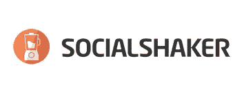
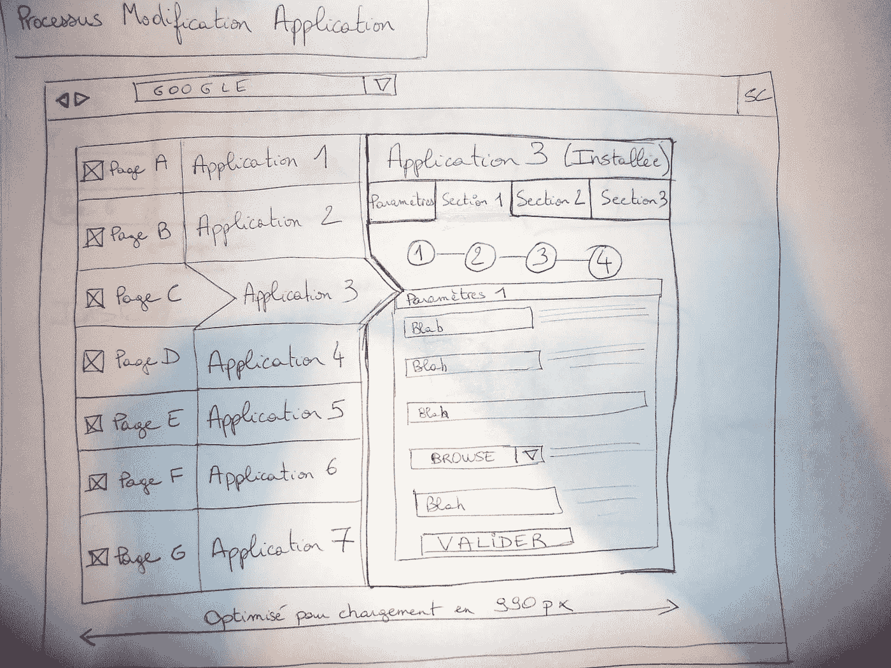

# 对自己保持真实:为什么我要启动 Socialshaker

> 原文：<https://medium.com/hackernoon/stay-true-to-yourself-why-i-bootstrapped-socialshaker-2b8410bdca6e>

8 年前，我创办了一家公司，后来成为了[**Socialshaker**](http://www.socialshaker.com)**，一家 [Saas](https://en.wikipedia.org/wiki/Software_as_a_service) 公司，每年的经常性收入超过 100 万欧元，而且每年都在盈利。**

****

**自成立以来，这家公司一直是白手起家的。我**在 2015 年把它**卖掉了，我们现在是一个更大的叫做**整容**的团体的一部分，分享着**共同的 DNA** 。从那以后，我和 Socialshaker 一起管理法国办公室，目标是欧洲各地的中小企业。**

**是的，我知道:**我没有筹集资金**你可以问自己为什么，因为这些天你在媒体上听到的都是创业公司筹集了 xx 百万。
我要在这里补充一点，科技行业的绝大多数头条新闻只关注**轮**融资、**收购**或**IPO**。**

****我的故事有点不同**:我们已经**转向**，在专注于**纯 Saas**和经历 **100%的年同比增长**之前，做了大量定制开发。我很高兴公司每年都能够在发展壮大并获得几十个客户的同时，给团队中的每个人发工资。**

**事实是:在推出 social shaker([2011 年 3 月](http://www.mycommunitymanager.fr/socialshaker-une-gamme-dapplications-pour-vos-pages-facebook-2/))后，我很快想到，我们必须**与另一家欧洲公司**联手，才能在未来成为一个强大的玩家。**

**为什么我没有筹钱呢？
**1。**当我获得最初的支持时，我很快就考虑过筹集资金，但后来被一位顶级筹资顾问拒绝了。
他告诉我，我不可能通过销售 99 个€/月的许可证达到 100 万欧元的收入。我这时候才想到:挑战接受！
**2。**你需要一个由经验丰富的创始人组成的**团队**才能**扩大规模**并最终成为欧洲的头号玩家，而我自己已经开始了 Socialshaker。
**3。当你筹到钱时，你需要花掉它**。因为我们从一开始就处于困境，所以我们总是关心能够支付我们员工接下来几个月的工资，所以我们总是对我们管理财务的方式非常谨慎。我们没有每月举办用户聚会，我也没有每个季度都去硅谷。所以 3 年前，如果一个风险投资人告诉我，我需要花掉我们刚刚筹集的 100 万欧元，老实说，我不知道如何以一种有利可图的方式花掉这笔钱。
4。没有风险投资的支持实际上可能是成功的关键，尤其是当你在几年内规划一个计划的时候。我后来了解到，一些风投的眼光局限于 3-4 年，希望尽快实现利润最大化，同时也知道战略变化可能会扼杀你的业务。这对他们来说没什么，因为他们投资了几十家公司。然而，作为一名创始人，你最好确定这是一个正确的选择。我见过几个竞争对手从风投那里融资几百万后就倒闭了。**

**当 Socialshaker 在 2015 年加入 Facelift 时，很多人一直问我为什么选择出售一家盈利并不断增长的公司。
我的回答一直都是一样的:**因为这是计划的一部分**。**

**一个我已经**设计了多年的计划**这意味着我的很多投资决策都考虑到了这个计划。例如，我们关注的是软件即服务的收入(销售软件许可)，而不是围绕我们的解决方案销售大量服务(咨询、培训等)。).我们肯定可以从服务中赚很多钱，但经常性收入是一家大公司唯一感兴趣的指标，而服务收入很难持续。**

****

**The very first attempt at designing Socialshaker’s interface**

**我是不是在说你永远都不应该筹集资金？ **绝对不是。** 我只是想说，尽管媒体报道可能会有这样的想法，但创业并不是唯一的选择**。****

****如果你刚创办的公司**瞄准了 10 亿的市场机会**在我看来，筹集资金以比其他竞争对手走得更快是完全可以的。
如果不是不过，那就知道**创业成本有** [**从来没有这么低过**](http://thenextweb.com/dd/2013/12/02/much-cost-build-worlds-hottest-startups/) 。在朋友和家人的帮助下，你今天可以开始一个非常健康的事业。在我看来，这主要是多年来的意志和奉献的问题。****

****每天都有成千上万的人在没有风投支持的情况下创业，并且仍然在扼杀他们。如果你在科技行业，你只需要知道 [Mailchimp](http://mailchimp.com/) 、[base camp](https://basecamp.com/)(37 个信号)、 [Braintree](https://www.braintreepayments.com/) 或 [Pardot](http://www.pardot.com/) 都是 boostrapped 公司。****

******助推**并不意味着**以后不能**长得更快。事实上，因为你的公司有坚如磐石的基础，你甚至可以在另一个层面上融资。像[整容](http://www.acxit.com/en/facelift-growth-capital/)或者 [Github](http://www.wsj.com/articles/SB10001424052702303292204577517111643094308) 这样的公司就是这么做的。****

****但是请记住，你有更多的机会 [**建立一个百万美元的公司**](/life-learning/5-reasons-why-you-should-build-a-small-business-not-a-start-up-1f126068f6d8) 比你有更多的机会**建立一个十亿美元的公司**，这仍然是可以的。我们的世界充满了非常成功的中型企业，它们创造了成千上万的就业机会，你只是不能每天在新闻中听到它们的消息。****

************************

> ****[黑客中午](http://bit.ly/Hackernoon)是黑客如何开始他们的下午。我们是 [@AMI](http://bit.ly/atAMIatAMI) 家庭的一员。我们现在[接受投稿](http://bit.ly/hackernoonsubmission)，并乐意[讨论广告&赞助](mailto:partners@amipublications.com)机会。****
> 
> ****如果你喜欢这个故事，我们推荐你阅读我们的[最新科技故事](http://bit.ly/hackernoonlatestt)和[趋势科技故事](https://hackernoon.com/trending)。直到下一次，不要把世界的现实想当然！****

********