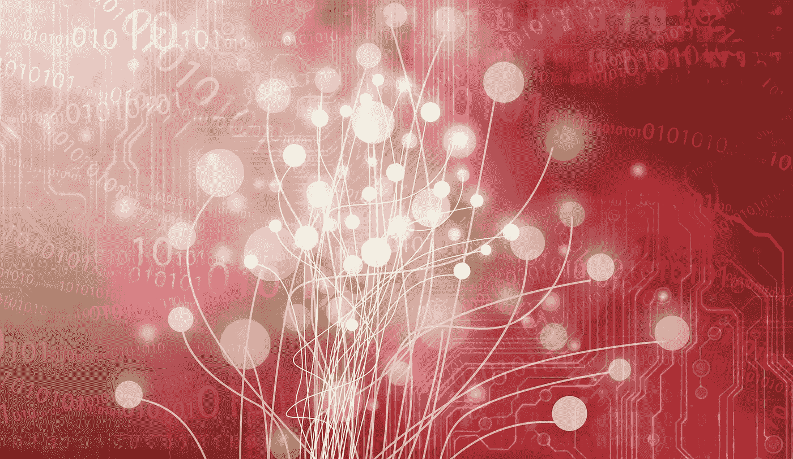

# 窃取这个想法，赚十亿美元:人工智能视频游戏加速卡

> 原文：<https://medium.com/hackernoon/steal-this-idea-and-make-a-billion-dollars-ai-video-game-accelerator-cards-cf5f09fd84e8>

AI 正在崛起。在某些方面，这总是不可避免的。但是问问任何一个在 20 世纪 90 年代遭遇人工智能研究的研究人员，他们可能不会同意。几十年来，人工智能尤其是神经网络被认为是研究人员的一潭死水。如果你想要一个没有前途的职业，那就进入神经网络。20 世纪 90 年代，神经网络背后的主要思想家之一 Geoffrey Hinton 几乎得不到资助。没有人来上他的课。他独自研究自己的想法。

现在很少有人在人工智能领域有丰富的经验，以至于像谷歌和脸书这样的大公司都找不到足够多的人或者招聘得不够快。顶尖人工智能研究人员赚的钱比职业运动员多。短缺将持续一段时间，因为人们没有研究这种东西。[这就把它留给了那些不想上大学的孩子，他们只需要用开源工具](http://www.forbes.com/sites/aarontilley/2016/03/08/george-hotz-comma-ai/#55521600493b)自己解决问题，然后收拾壁炉架。坦白地说，这可能是当今最好的选择。

杰弗里·辛顿和他的同事们一直知道算法背后的数学原理。他们只是没有硬件来实现它。这将需要几十年的时间和大规模云的兴起，才能使神经网络背后的巨大计算成为可能。

然而，即使这样还不够。一个不同行业的崛起才真正让它起飞:视频游戏。

图形处理能力的不断加速导致越来越多的并行处理器来处理实时绘制越来越多的真实感图形的持续计算。现在，计算机科学家正在利用这些图形处理器库让人工智能的巨型矩阵运算越来越快。

## 那么你所说的丹的想法在哪里呢？我想赚几十亿。

好的，给你。

15 年前，我向我的朋友[克里斯·迪克森](/@cdixon/)提出了一个革命性的概念。他后来成为硅谷的顶级天使投资人之一，但当时他刚刚开始投资，在一家名为 [Bessemer Venture Partners](https://www.bvp.com/) 的公司工作，并创办了他的第一家公司，我建立了 Linux servers to power，该公司最终被迈克菲收购，并成为[的网站顾问](https://www.siteadvisor.com/final/mac.html)。我那时玩了很多游戏，就像很多年轻的技术人员一样。他们有图形卡，甚至开始有物理卡，但他们似乎缺少操作的大脑:人工智能。电脑对手很笨，很容易被打败。他们不能像人一样思考。所以我说:

## 我们为什么不为电子游戏造一张 AI 卡呢？

我们可以加速路径寻找和任何其他计算，使敌人更聪明。他去做了一些研究。过了一会儿，他回来说:“我认为这是个好主意。就这么办吧。”

你知道发生了什么吗？

我退缩了。我不认为我足够大，足够聪明，或者足够坚强去实现它。简而言之，我是个懦夫。

我并不经常带着遗憾回顾人生，但这是我有机会永远改变我的生活和世界的时刻之一，但我失败了。当我想到这个行业现在会走多远时，我真的很难过。我们可能已经接近通用人工智能(GAI)。几乎可以肯定，十年前我们就会有 Siri、智能手机和 AlphaGo。

但话虽如此，我并不太后悔。事后看来，这是一个正确的决定。我真的不想那样做，否则我会有勇气和偏执狂般的专注让它发生。生活中很多事情都不会发生这种情况，我在那里也没有。没有这种不懈的专注，就不可能将这种激进的想法付诸实践。

所以你有它。我的重点不再是科技公司，而是写作。这才是我真正想做的。那是我的偏执狂。所以也许这不是个错误。也许这只是宇宙拯救了我。宇宙有办法将我们的“成功”和“错误”融合在一起，形成今天的我们。最后一切都解决了。

## 但这仍然是个好主意。还没有人做过。

## 所以我把这个想法给你，我忠实的读者。带着它跑吧。

坦白地说，我很惊讶没有其他人想到这一点。通常，我想到一些东西，几天后发现有人已经为它工作了多年，或者它已经存在。

也就是说，这个行业正开始朝着这个方向发展，所以要加快步伐。一些公司正在专注于构建人工智能硅胶，但主要是用于商业应用。Fathom 刚刚发布了一款 USB 神经计算棒，但即使它很酷，也不是真的用于游戏。 [Nvidia 刚刚为 AI](http://nvidianews.nvidia.com/news/tiny-nvidia-supercomputer-to-bring-artificial-intelligence-to-new-generation-of-autonomous-robots-and-drones) 设计了一张卡，建议价格为 299 美元(但你只能购买 1000 张或更多。)开源软件是一个很好的起点。如果你想建立一个 ASIC，在中国找一些设计师，看看你是否能加速那些开源工具。

## 他们都错过了大船:电子游戏。

视频游戏中的计算将使这种激增达到下一个水平。这些不同于为机器视觉或自动驾驶汽车提供动力所需的数学。

我们还有时间采纳这个想法并付诸实践，但是请相信我，已经有人在努力实现它了。

抢先一步。

那么我想从这个想法中得到什么呢？没什么。(如果你想在公司给我一个荣誉职位，并给我钱让我在你的饮水机旁喝水，我愿意。)但说真的，我别无所求，只求有一天说是我启发了你。

AI 游戏卡。这个想法是官方开源的。

现在去让我骄傲吧。

*简单介绍一下我:我是一名作家、工程师和连续创业者。在过去的二十年中，我涉及了从 Linux 到虚拟化和容器的广泛技术。你可以看看我的最新小说，* [***一部史诗般的中国科幻内战传奇***](http://amzn.to/2gAg249) *在这部小说中，中国摆脱了共产主义的枷锁，成为世界上第一个直接民主国家，运行着一个高度先进的、人工智能的去中心化应用平台，没有领导人。你也可以查看一下* [***蝉开源项目***](http://iamcicada.com/) *，该项目基于书中的想法，概述了如何立即将该技术变为现实，你也可以参与测试。*

> [黑客中午](http://bit.ly/Hackernoon)是黑客如何开始他们的下午。我们是 [@AMI](http://bit.ly/atAMIatAMI) 家庭的一员。我们现在[接受投稿](http://bit.ly/hackernoonsubmission)，并乐意[讨论广告&赞助](mailto:partners@amipublications.com)机会。
> 
> 如果你喜欢这个故事，我们推荐你阅读我们的[最新科技故事](http://bit.ly/hackernoonlatestt)和[趋势科技故事](https://hackernoon.com/trending)。直到下一次，不要把世界的现实想当然！

