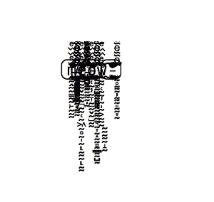

# 蒸汽聊天消息崩溃解释。

> 原文：<https://medium.com/hackernoon/steam-chat-message-crash-explained-3c7562abfaeb>

大约一天前，有人在/r/Steam 上发布了一条消息，这条消息在通过 Steam 的聊天工具发送时，会导致收件人的客户端崩溃。

该漏洞已被修补，所以现在可以安全地深入研究这个漏洞是如何工作的。

崩溃消息及其变体大量使用了 [unicode 组合字符](http://unicode.org/faq/char_combmark.html)，并且长度非常长。该消息在外观上与 [Zalgo 文本](http://stackoverflow.com/questions/6579844/how-does-zalgo-text-work)相似，它导致崩溃的能力很可能是在试图制作令人讨厌的东西时被意外发现的。



The variation of the crash message I analyzed.

为了弄清楚这个可怕的文本中包含了什么，我写了一个极其简单的脚本:

当提供崩溃文本时，该脚本的输出如下:

```
> python3 analyze.pyLength of message in bytes: 5135Number of characters in message: 2044LATIN SMALL LETTER MLATIN SMALL LETTER ELATIN SMALL LETTER OLATIN SMALL LETTER WNumber of latin characters: 4Number of combining characters: 2040
```

该消息由 2044 个 unicode 字符组成。然而，这些字符中有许多是多字节的组合标记，所以消息的总长度为 5135 字节。
这条信息有一个绝对疯狂的拉丁文对组合字符的比率。这条信息只有四个拉丁字母拼成“喵”这个词。然而，堆叠在这些字母之上的是一个巨大的 2040 个组合字符。这解释了为什么这串文本会使任何文本呈现器陷入困境。复制粘贴到 [Chrome](https://hackernoon.com/tagged/chrome) 、记事本或任何你可以输入文本的地方，这会产生明显的延迟，因为渲染器必须在如此小的空间内绘制如此多的组合符号。但是他们从来没有*崩溃过*。唯一一个因显示这条消息而完全崩溃的软件是 Steam。为什么？

最初，我假设崩溃是由于 Steam 消息客户端的 2048 个字符的限制。该消息占用 5k 字节，而仅使用 2k 个字符，因此它适合于单个 Steam 消息中。也许 Steam 只为每条聊天消息分配了 2KB？从 Steam Web 客户端(没有 2k 字符限制)向我的桌面客户端发送一些消息证明了这个理论是错误的。Steam 可以正确地接收超长的 Unicode 消息而不会崩溃。事实上,“喵”崩溃消息比许多无法使客户端崩溃的消息要短。

我被难住了，于是我给 reddit 上的 Valve 员工 Henry G .发了消息，他回复了一个关于这个 bug 的精彩解释。非常非常感谢他花时间写了这么好的回复。

# 阀门的响应

> 这实际上是一个奇怪而古老的 bug，并不特定于大小或长度。它可以追溯到一些我们已经忘记的非常古老的代码。
> 
> 回到 Windows 98 时代，Arial 字体不支持很多 Unicode 字符，但 Tahoma 字体(这是全新的)支持。回到大约 12 年前，在 Valve 工作的人在我们的低级字体渲染中添加了一点逻辑，将某些 Unicode 字符从 Arial 切换到 Tahoma，然后再切换回来。
> 
> 为了执行字体切换，他们让我们的“DrawText”例程递归。它会一直绘制文本，直到切换，然后用不同的字体名称再次调用剩余的字符。
> 
> 在这个漏洞利用消息中最终发生的事情(我不认为提出这个消息的人实际上发现了这一点)是，许多相邻的字符从 Arial 范围交替进入 Tahoma 范围，然后返回。因为每一次字体切换都是一次递归函数调用，所以我们最终进行了超过一千层的递归函数调用。最终程序耗尽了堆栈空间，不能再递归调用自己，并崩溃。
> 
> 这对我们来说是一个很大的惊喜，因为我们已经很多年没有查看字体渲染代码了，我们不知道其中有这个递归函数调用，有人只是为了修复 Windows 98 字体中的一个错误而添加的！
> 
> 当然，这完全是荒谬的。一旦我们发现了崩溃的递归代码，我们就删除它。微软在 Windows ME / Windows 2000 前后推出了更好的字体。自从我们停止支持 Windows 98 以来，已经有十多年没有任何理由做这种奇怪的拆分字体的事情了。
> 
> 自从 Steam 最初发布以来，这个聊天崩溃可能在任何时候发生。但是据我们所知，直到现在还没有人发现它！最近粘贴看起来很奇怪的 Unicode 文本的趋势恰好是偶然引发的。

最后，崩溃是由一个老式的堆栈溢出引起的！然而，我仍然很好奇为什么 Steam 桌面客户端将 PC 上的聊天消息长度限制为 2048 个字符，所以我也向 Henry 询问了这个问题。他回答如下:

> 我不认为我们有一个很好的字符限制的理由，除了我们的文本输入代码和 Win98 字体代码一样古老，并且是用一堆任意的限制编写的，因为这是原作者的做法。自从我在 Valve 工作(六年)以来，文本输入代码就一直存在，我希望今年我们最终扣动扳机，删除所有这些代码。有传言说，一个主要的客户端 UI 重写，如果真的发生了，它将发生在一个新的基于网络的框架，不使用旧的遗留代码…或者我希望如此。
> 
> IIRC，我们确实执行了 16kb 的服务器端字节限制，主要是为了避免单个用户耗尽我们所有的服务器内存。

最终，这个奇怪的崩溃是由被遗忘的遗留代码引起的。再次感谢 Henry G .解释了这个 bug 的内部工作原理。

[](http://bit.ly/HackernoonFB)[](https://goo.gl/k7XYbx)[](https://goo.gl/4ofytp)

> [黑客中午](http://bit.ly/Hackernoon)是黑客如何开始他们的下午。我们是 [@AMI](http://bit.ly/atAMIatAMI) 家庭的一员。我们现在[接受投稿](http://bit.ly/hackernoonsubmission)，并乐意[讨论广告&赞助](mailto:partners@amipublications.com)机会。
> 
> 如果你喜欢这个故事，我们推荐你阅读我们的[最新科技故事](http://bit.ly/hackernoonlatestt)和[趋势科技故事](https://hackernoon.com/trending)。直到下一次，不要把世界的现实想当然！

