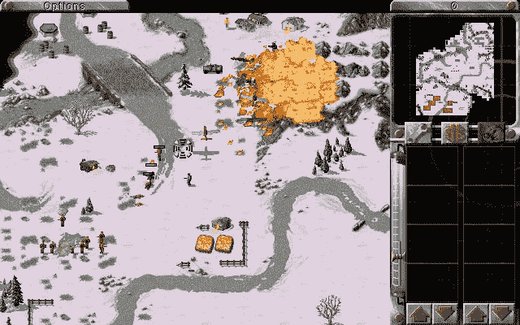

# 教编程时不要虐待(虚拟)动物

> 原文：<https://medium.com/hackernoon/stop-abusing-virtual-animals-when-teaching-programming-a64adc93525a>

你们中有多少人，在阅读关于[编程](https://hackernoon.com/tagged/programming)的教程时，遇到过这样的例子:

```
/* 
** Inheritance is useful when different classes share functionality. */
using System;class Animal
{
    protected string speakSound = "";

    public void Speak() {
        Console.WriteLine(speakSound);
    }
}

class Cat : Animal
{
    public Cat() {
        this.speakSound = "Meow";
    }
}

class Dog : Animal
{
    public Dog() {
        this.speakSound = "Woof";
    }
}

class ZooClass
{
    static void Main(string[] args) {
        Cat cat = new Cat();
        Dog dog = new Dog();

        cat.Speak(); // Prints Meow
        dog.Speak(); // Prints Woof
    }
}
```

有多少人读了这个例子后会想:

> “是的，我知道如何在实际应用中使用它”

这个例子解释了继承是如何工作的，但是没有提供任何线索说明你可以用它来解决什么样的问题，为什么它比解决问题的另一种方法更好。这就像把锤子解释为“一个有用的工具，它有一个木制部分和一个金属部分，用金属部分撞击某物会发出砰的一声”。


“Sweet, I can finally write my Zoo Sounds text adventure”

编程模式和技术是[工具](https://hackernoon.com/tagged/tools)，用来使实现复杂的行为或逻辑变得更容易，同时保持代码的可维护性和可构建性。大多数现实生活中的例子对于初学者来说可能太复杂了，但是我认为在 1000 行现实生活中的例子和“母牛哞哞叫”之间存在一个中间地带。

# **利用真实项目中的真实案例进行教学**

从一个真题开始。如果可能的话，在一个真实的项目中(省略任何与手头问题无关的细节)

[](https://github.com/OpenRA/OpenRA) [## OpenRA/OpenRA

### OpenRA -早期西木游戏如命令与征服:红色警戒的开源实时策略游戏引擎…

github.com](https://github.com/OpenRA/OpenRA) 

> “开源实时战略游戏引擎，用于早期的 Westwood 游戏，如用 C#编写的命令与征服:红色警报……”

在《命令与征服:红色警报》中，你扮演一个将军的角色，指挥一个交战派系的一部分。你的目标是收集资源，建立一个基地，并训练军队粉碎你的对手。



Pictured: Crushing

在这个游戏中，你可以建造一个叫做**间谍**的单位，它可以渗透到敌人的建筑中，并且根据被渗透的建筑，可以产生不同的效果。

一些例子包括(来自 [CNC Wiki](http://cnc.wikia.com/wiki/Spy_(Red_Alert_1)) ):

> **机场**显示建筑被选中时当前生产的单位
> 显示当前降落飞机上的弹药数量
> 
> **发电厂**显示敌方电力状态的五格垂直指示器
> 
> **矿石提炼厂**显示产能指标和目前持有的矿石数量

现在问题来了:**我应该如何实现渗透的不同效果？**

```
// Not like this
if (building.name == "Airfield") { airfieldInfiltration(); }
if (building.name == "Power Plant") { powerPlantInfiltration(); }
if (building.name == "Ore Refinery" { oreRefineryInfiltration(); }
```

大多数建筑不能被渗透，所以创建一个基础职业似乎不太合适，但是所有的建筑都有完全不同的动作，所以把所有的东西都归入一个职业似乎也不合适。

在读者理解了问题之后，你就提出了解决方案:**接口**

OpenRA 使用了一个名为**inotifyinverted**(此处声明的)的接口，用于实现间谍进入敌方建筑时的不同功能。该接口是为任何可以渗透的建筑物实现的，效果行为可以在每个不同的建筑物类中找到，而不是一个基类或一些巨大的 if-else 语句。(使用界面偷现金的例子可以在[这里](https://github.com/OpenRA/OpenRA/blob/a3aab6f051245890064472d83de78f33b814d414/OpenRA.Mods.Cnc/Traits/Infiltration/InfiltrateForCash.cs#L44)找到。请注意，这些行为被包装在它们自己的类中，因为这些建筑不是硬编码的，所以它并不严格遵循所提供的示例，但没有理由它不能)。

代码示例如下所示。它不是自包含的，不会编译，但是我认为强迫它是没有用的。真正的问题不存在于泡沫中。

```
public interface INotifyInfiltrated { 
    void Infiltrated(Player playerInfiltrating); 
}

class Airfield : INotifyInfiltrated
{
    public void Infiltrated(Player playerInfiltrating) {
        // Displays currently produced unit when 
        // the building is selected
        Unit producingUnit = this.GetCurrentlyProducingUnit()
        producingUnit.revealToPlayer(playerInfiltrating);

        // Displays amount of ammunition on 
        // currently landed aircraft
        Unit landedUnit = this.GetCurrentlyLandedUnit();
        landedUnit.revealStatsToPlayer(playerInfiltrating);
    }
}

class PowerPlant : INotifyInfiltrated
{
    public void Infiltrated(Player playerInfiltrating) {
        // Displays a five-box vertical indicator 
        // of enemy power status
        this.revealPowerStatusToPlayer(playerInfiltrating);
    }
}

class OreRefinery : INotifyInfiltrated
{
    public void Infiltrated(Player playerInfiltrating) {
        // Displays capacity indicator
        //and amount of presently held ore
        this.revealOreStatusToPlayer(playerInfiltrating);
    }
}
```

现在读者已经看到了一个如何使用接口解决现实生活中的编程问题的实例。每当他们遇到类似的问题，需要的行为“对某些人来说是相似的，但对所有人来说并不相似”时，他们就可以应用这个方法。

所以读完这篇文章后，也许下一次有人问起接口的时候，你就不用拖着可怜的虚拟猫狗汪汪叫来表明你的观点了。